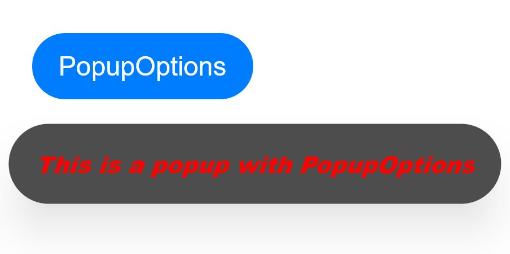
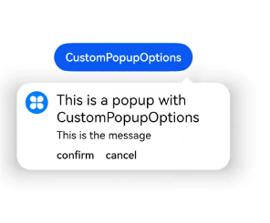
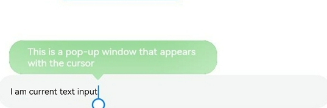

# Popup Control

You can bind a popup to a component, specifying its content, interaction logic, and visibility.

>  **NOTE**
>
> - This attribute is supported since API version 7. Updates will be marked with a superscript to indicate their earliest API version.
>  
> - The visibility of the popup is returned through the **onStateChange** event callback. There is no strong mapping between the visibility and the creation or destruction of the component.


## APIs


| Name       | Type                                    | Description                                      |
| --------- | ---------------------------------------- | ---------------------------------------- |
| bindPopup | show: boolean,<br>popup: [PopupOptions](#popupoptions) \| [CustomPopupOptions](#custompopupoptions8)<sup>8+</sup> | Binds a popup to the component.<br>**show**: whether to show the popup. The default value is **false**, indicating that the popup is hidden. As the popup can be displayed only after building of all pages is completed, **show** cannot be set to **true** during page building. Otherwise, the display position and shape of the popup will be incorrect.<br>**popup**: parameters of the popup.|

## PopupOptions

| Name                                 | Type                                                        | Mandatory| Description                                                        |
| ------------------------------------- | ------------------------------------------------------------ | ---- | ------------------------------------------------------------ |
| message                               | string                                                       | Yes  | Content of the popup message.                                              |
| placementOnTop<sup>(deprecated)</sup> | boolean                                                      | No  | Whether to display the popup above the component. The default value is **false**.<br>**NOTE**<br>This API is deprecated since API version 10. You are advised to use **placement** instead.|
| primaryButton                         | {<br>value: string,<br>action: () =&gt; void<br>} | No  | Primary button.<br>**value**: text of the primary button in the popup.<br>**action**: callback for clicking the primary button.|
| secondaryButton                       | {<br>value: string,<br>action: () =&gt; void<br>} | No  | Secondary button.<br>**value**: text of the secondary button in the popup.<br>**action**: callback for clicking the secondary button.|
| onStateChange                         | (event: { isVisible: boolean }) =&gt; void | No  | Callback for the popup status change event. The parameter **isVisible** indicates whether the popup is visible.   |
| arrowOffset<sup>9+</sup>              | [Length](ts-types.md#length)                                 | No  | Offset of the popup arrow relative to the popup. When the arrow is at the top or bottom of the popup: The value **0** indicates that the arrow is located on the leftmost, and any other value indicates the distance from the arrow to the leftmost; the arrow is centered by default. When the arrow is on the left or right side of the popup: The value indicates the distance from the arrow to the top; the arrow is centered by default. When the popup is displayed on either edge of the screen, it will automatically deviate leftward or rightward to stay within the safe area. When the value is 0, the arrow always points to the bound component.|
| showInSubWindow<sup>9+</sup>          | boolean                                                      | No  | Whether to show the popup in the subwindow. The default value is **false**.                       |
| mask<sup>10+</sup>                    | boolean \| [ResourceColor](ts-types.md#resourcecolor) | No  | Whether to apply a mask to the popup. The value **true** means to apply a transparent mask to the popup, **false** means not to apply a mask to the popup, and a color value means to apply a mask in the corresponding color to the popup.|
| messageOptions<sup>10+</sup>          | [PopupMessageOptions](#popupmessageoptions10)        | No  | Parameters of the popup message.                                      |
| targetSpace<sup>10+</sup>             | [Length](ts-types.md#length)                                 | No  | Space between the popup and the target.                                     |
| placement<sup>10+</sup>               | [Placement](ts-appendix-enums.md#placement8)                 | No  | Position of the popup relative to the target. The default value is **Placement.Bottom**.<br>If both **placementOnTop** and **placement** are set, the latter prevails.|
| offset<sup>10+</sup>                  | [Position](ts-types.md#position8)                            | No  | Offset of the popup relative to the display position specified by **placement**.<br>**NOTE**<br>This parameter cannot be set in percentage.|
| enableArrow<sup>10+</sup>             | boolean                                                      | No  | Whether to display the arrow.<br>Default value: **true**                         |
| popupColor<sup>11+</sup>              | [Color](ts-appendix-enums.md#color) \| string \| number \| [Resource](ts-types.md#resource) | No  | Color of the popup.<br>Default value: **'#4d4d4d'**                      |
| autoCancel<sup>11+</sup>              | boolean                                                      | No  | Whether to automatically close the popup when an operation is performed on the page.<br>Default value: **true**           |
| width<sup>11+</sup>                   | [Dimension](ts-types.md#dimension10)                         | No  | Width of the popup.                                                  |
| arrowPointPosition<sup>11+</sup>      | [ArrowPointPosition](ts-appendix-enums.md#arrowpointposition11) | No  | Position of the popup arrow relative to its parent component. Available positions are **Start**, **Center**, and **End**, in both vertical and horizontal directions. All these positions are within the parent component area.|

## PopupMessageOptions<sup>10+</sup>

| Name     | Type                                      | Mandatory| Description                  |
| --------- | ------------------------------------------ | ---- | ---------------------- |
| textColor | [ResourceColor](ts-types.md#resourcecolor) | No  | Text color of the popup message.|
| font      | [Font](ts-types.md#font)                   | No  | Font attributes of the popup message.|
## CustomPopupOptions<sup>8+</sup>

| Name                          | Type                                      | Mandatory  | Description                                      |
| ---------------------------- | ---------------------------------------- | ---- | ---------------------------------------- |
| builder                      | [CustomBuilder](ts-types.md#custombuilder8) | Yes   | Popup builder.<br>**NOTE**<br>The **popup** attribute is a universal attribute. A custom popup does not support display of another popup. The **position** attribute cannot be used for the first-layer container in the builder. If the **position** attribute is used, the popup will not be displayed. If a custom component is used in the builder, the **aboutToAppear** and **aboutToDisappear** lifecycle callbacks of the custom component are irrelevant to the visibility of the popup. As such, the lifecycle of the custom component cannot be used to determine whether the popup is displayed or not.                             |
| placement                    | [Placement](ts-appendix-enums.md#placement8) | No   | Preferred position of the popup. If the set position is insufficient for holding the popup, it will be automatically adjusted.<br>Default value: **Placement.Bottom**|
| popupColor                   | [ResourceColor](ts-types.md#resourcecolor) | No   | Color of the popup.<br>Default value: **'#4d4d4d'**|
| enableArrow                  | boolean                                  | No   | Whether to display an arrow.<br>Since API version 9, if the position set for the popup is not large enough, the arrow will not be displayed. For example, if **placement** is set to **Left**, but the popup height (80 vp) is less than the sum of the arrow width (32 vp) and diameter of popup rounded corner (48 vp), the arrow will not be displayed.<br>Default value: **true**|
| autoCancel                   | boolean                                  | No   | Whether to automatically close the popup when an operation is performed on the page.<br>Default value: **true**           |
| onStateChange                | (event: { isVisible: boolean }) =&gt; void | No   | Callback for the popup status change event. The parameter **isVisible** indicates whether the popup is visible.                |
| arrowOffset<sup>9+</sup>     | [Length](ts-types.md#length) | No   | Offset of the popup arrow relative to the popup. When the arrow is at the top or bottom of the popup: The value **0** indicates that the arrow is located on the leftmost, and any other value indicates the distance from the arrow to the leftmost; the arrow is centered by default. When the arrow is on the left or right side of the popup: The value indicates the distance from the arrow to the top; the arrow is centered by default. When the popup is displayed on either edge of the screen, it will automatically deviate leftward or rightward to stay within the safe area. When the value is 0, the arrow always points to the bound component.|
| showInSubWindow<sup>9+</sup> | boolean                                  | No   | Whether to show the popup in the subwindow. The default value is **false**.                   |
| maskColor<sup>(deprecated)</sup> | [ResourceColor](ts-types.md#resourcecolor)   | No  | Color of the popup mask.<br>**NOTE**<br>This parameter is deprecated since API version 10. You are advised to use **mask** instead.|
| mask<sup>10+</sup>           | boolean \| [ResourceColor](ts-types.md#resourcecolor) | No   | Whether to apply a mask to the popup. The value **true** means to apply a transparent mask to the popup, **false** means not to apply a mask to the popup, and a color value means to apply a mask in the corresponding color to the popup.|
| targetSpace<sup>10+</sup>    | [Length](ts-types.md#length)             | No   | Space between the popup and the target.                          |
| offset<sup>10+</sup>         | [Position](ts-types.md#position8)                            | No  | Offset of the popup relative to the display position specified by **placement**.<br>**NOTE**<br>This parameter cannot be set in percentage.|
| width<sup>11+</sup> | [Dimension](ts-types.md#dimension10) | No| Width of the popup.|
| arrowPointPosition<sup>11+</sup> | [ArrowPointPosition](ts-appendix-enums.md#arrowpointposition11) | No| Position of the popup arrow relative to its parent component. Available positions are **Start**, **Center**, and **End**, in both vertical and horizontal directions. All these positions are within the parent component area.|


## Example

### Example 1

```ts
// xxx.ets
@Entry
@Component
struct PopupExample {
  @State handlePopup: boolean = false
  @State customPopup: boolean = false

  // Popup builder
  @Builder popupBuilder() {
    Row({ space: 2 }) {
      Image($r("app.media.image")).width(24).height(24).margin({ left: -5 })
      Text('Custom Popup').fontSize(10)
    }.width(100).height(50).padding(5)
  }

  build() {
    Flex({ direction: FlexDirection.Column }) {
      // PopupOptions for setting the popup
      Button('PopupOptions')
        .onClick(() => {
          this.handlePopup = !this.handlePopup
        })
        .bindPopup(this.handlePopup, {
          message: 'This is a popup with PopupOptions',
          placementOnTop: true,
          showInSubWindow:false,
          primaryButton: {
            value: 'confirm',
            action: () => {
              this.handlePopup = !this.handlePopup
              console.info('confirm Button click')
            }
          },
          // Secondary button
          secondaryButton: {
            value: 'cancel',
            action: () => {
              this.handlePopup = !this.handlePopup
              console.info('cancel Button click')
            }
          },
          onStateChange: (e) => {
            console.info(JSON.stringify(e.isVisible))
            if (!e.isVisible) {
              this.handlePopup = false
            }
          }
        })
        .position({ x: 100, y: 50 })


      // CustomPopupOptions for setting the popup
      Button('CustomPopupOptions')
        .onClick(() => {
          this.customPopup = !this.customPopup
        })
        .bindPopup(this.customPopup, {
          builder: this.popupBuilder,
          placement: Placement.Top,
          mask: {color:'0x33000000'},
          popupColor: Color.Yellow,
          enableArrow: true,
          showInSubWindow: false,
          onStateChange: (e) => {
            if (!e.isVisible) {
              this.customPopup = false
            }
          }
        })
        .position({ x: 80, y: 200 })
    }.width('100%').padding({ top: 5 })
  }
}
```


### Example 2

```ts
// xxx.ets
@Entry
@Component
struct PopupExample {
  @State handlePopup: boolean = false

  build() {
    Column() {
      Button('PopupOptions')
        .onClick(() => {
          this.handlePopup = !this.handlePopup
        })
        .bindPopup(this.handlePopup, {
          message: 'This is a popup with PopupOptions',
          messageOptions: {
            textColor: Color.Red,
            font: {
              size: '14vp',
              style: FontStyle.Italic,
              weight: FontWeight.Bolder
            }
          },
          placement: Placement.Bottom,
          enableArrow: false,
          targetSpace: '15vp',
          onStateChange: (e) => {
            console.info(JSON.stringify(e.isVisible))
            if (!e.isVisible) {
              this.handlePopup = false
            }
          }
        })
    }.margin(20)
  }
}
```



### Example 3

```ts
// xxx.ets
@Entry
@Component
struct PopupExample {
  @State customPopup: boolean = false

  // Popup builder
  @Builder popupBuilder() {
    Row() {
      Text('Custom Popup Message').fontSize(10)
    }.height(50).padding(5)
  }

  build() {
    Column() {
      // CustomPopupOptions for setting the popup
      Button('CustomPopupOptions')
        .onClick(() => {
          this.customPopup = !this.customPopup
        })
        .bindPopup(this.customPopup, {
          builder: this.popupBuilder,
          targetSpace: '15vp',
          enableArrow: false,
          onStateChange: (e) => {
            if (!e.isVisible) {
              this.customPopup = false
            }
          }
        })
    }.margin(20)
  }
}
```


### Example 4

```ts
// xxx.ets
@Entry
@Component
struct PopupExample {
  @State handlePopup: boolean = false
    
  build() {
    Column() {
      Button('PopupOptions')
        .position({ x: 100, y: 50 })
        .onClick(() => {
          this.handlePopup = !this.handlePopup
        })
        .bindPopup(this.handlePopup, {
          width: 300,
          message: 'This is a popup with PopupOptions',
          arrowPointPosition: ArrowPointPosition.START,
          popupColor: Color.Red,
          autoCancel: true,
        })
    }
    .width('100%')
    .height('100%')
  }
}
```


### Example 5

```ts
// xxx.ets
import { Popup , PopupOptions,PopupTextOptions, PopupButtonOptions, PopupIconOptions } from '@ohos.arkui.advanced.Popup';

@Entry
@Component
struct PopupExample {
  @State customPopup: boolean = false

  @Builder
  popupBuilder() {
    // Define the custom advanced component through popup.
    Popup({
      // Set the icon through PopupIconOptions.
      icon: {
        image: $r('app.media.icon'),
        width:32,
        height:32,
        fillColor:Color.White,
        borderRadius: 16,
      } as PopupIconOptions,
      // Set the text through PopupTextOptions.
      title: {
        text: 'This is a popup with CustomPopupOptions',
        fontSize: 20,
        fontColor: Color.Black,
        fontWeight: FontWeight.Normal,

      } as PopupTextOptions,
      // Set the text through PopupTextOptions.
      message: {
        text: 'This is the message',
        fontSize: 15,
        fontColor: Color.Black,
        fontWeight: FontWeight.Normal,
      } as PopupTextOptions,
      showClose: false,
      onClose: () => {
        console.info('close Button click')
        this.customPopup = false
      },
      // Set the button through PopupButtonOptions.
      buttons: [{
        text: 'confirm',
        action: () => {
          console.info('confirm button click')
          this.customPopup = false
        },
        fontSize: 15,
        fontColor: Color.Black,

      },
        {
          text: 'cancel',
          action: () => {
            console.info('cancel button click')
            this.customPopup = false
          },
          fontSize: 15,
          fontColor: Color.Black,
        },] as [PopupButtonOptions?, PopupButtonOptions?],
    })
  }

  build() {
    Column() {
      Button('CustomPopupOptions')
        .onClick(() => {
          this.customPopup = !this.customPopup
        })
        .position({ x: 80, y: 200 })
        .bindPopup(this.customPopup, {
          builder: this.popupBuilder,
          width: 300,
          arrowPointPosition: ArrowPointPosition.END,
        })
    }
    .width('100%')
    .height('100%')
  }
}
```



### Example 6

```ts
// xxx.ets

@Entry
@Component
struct PopupExample {
  @State cursorPopup: boolean = false

  build() {
    Column() {
      TextInput({placeholder:'I am placeholder text',text:'I am current text input'})
        .position({ x: 0, y: 350 })
        .onFocus(() => {
          this.cursorPopup = !this.cursorPopup
        })
        .selectionMenuHidden(true)
        .bindPopup(this.cursorPopup, {
          width: 300,
          message: 'This is a pop-up window that appears with the cursor',
          arrowPointPosition: ArrowPointPosition.CENTER,
          popupColor: Color.Green,
          autoCancel: true,

        })
    }
    .width('100%')
    .height('100%')
  }
}
```


