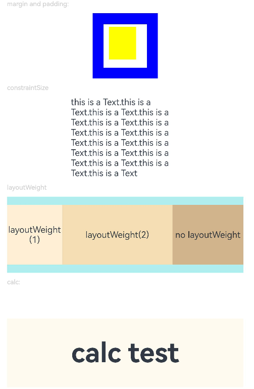

# Size

The size attributes set the width, height, and margin of a component.

>  **NOTE**
>
>  The APIs of this module are supported since API version 7. Updates will be marked with a superscript to indicate their earliest API version.


## Attributes


| Name            | Type                                    | Description                                      |
| -------------- | ---------------------------------------- | ---------------------------------------- |
| width          | [Length](ts-types.md#length)             | Width of the component. By default, the width required to fully hold the component content is used. If the width of the component is greater than that of the parent container, the range of the parent container is drawn.<br>Since API version 9, this API is supported in ArkTS widgets.<br>Since API version 10, this API supports the calc calculation feature.|
| height         | [Length](ts-types.md#length)             | Height of the component. By default, the height required to fully hold the component content is used. If the height of the component is greater than that of the parent container, the range of the parent container is drawn.<br>Since API version 9, this API is supported in ArkTS widgets.<br>Since API version 10, this API supports the calc calculation feature.|
| size           | {<br>width?: [Length](ts-types.md#length),<br>height?: [Length](ts-types.md#length)<br>} | Size of the component.<br>Since API version 9, this API is supported in ArkTS widgets.<br>Since API version 10, this API supports the calc calculation feature.|
| padding        | [Padding](ts-types.md#padding) \| [Length](ts-types.md#length) | Padding of the component.<br>When the parameter is of the **Length** type, the four paddings take effect.<br>Default value: **0**<br>When **padding** is set to a percentage, the width of the parent container is used as the basic value.<br>Since API version 9, this API is supported in ArkTS widgets.<br>Since API version 10, this API supports the calc calculation feature.|
| margin         | [Margin](ts-types.md#margin) \| [Length](ts-types.md#length) | Margin of the component.<br>When the parameter is of the **Length** type, the four margins take effect.<br>Default value: **0**<br>When **margin** is set to a percentage, the width of the parent container is used as the basic value.<br>Since API version 9, this API is supported in ArkTS widgets.<br>Since API version 10, this API supports the calc calculation feature.|
| constraintSize | {<br>minWidth?: [Length](ts-types.md#length),<br>maxWidth?: [Length](ts-types.md#length),<br>minHeight?: [Length](ts-types.md#length),<br>maxHeight?: [Length](ts-types.md#length)<br>} | Constraint size of the component, which is used to limit the size range during component layout. **constraintSize** takes precedence over **width** and **height**. Learn [how the value of this attribute affects the width and height](#impact-of-constraintsize-on-widthheight).<br>Default value:<br>{<br>minWidth: 0,<br>maxWidth: Infinity,<br>minHeight: 0,<br>maxHeight: Infinity<br>}<br>Since API version 9, this API is supported in ArkTS widgets.<br>Since API version 10, this API supports the calc calculation feature.|

## Impact of constraintSize on width/height

| Size Arrangement                                    | Result                |
| ---------------------------------------- | ------------------ |
| minWidth/minHeight < width/height< maxWidth/maxHeight | width/height       |
| minWidth/minHeight < maxWidth/maxHeight  < width/height | maxWidth/maxHeight |
| maxWidth/maxHeight < minWidth/minHeight  < width/height | minWidth/minHeight |
| maxWidth/maxHeight < width/height< minWidth/minHeight | minWidth/minHeight |
| width/height      < maxWidth/maxHeight  < minWidth/minHeight | minWidth/minHeight |
| width/height       < minWidth/minHeight  < maxWidth/maxHeight | minWidth/minHeight |
## Example

```ts
// xxx.ets
@Entry
@Component
struct SizeExample {
  build() {
    Column({ space: 10 }) {
      Text('margin and padding:').fontSize(12).fontColor(0xCCCCCC).width('90%')
      Row() {
        // Width: 80; height: 80; margin: 20 (blue area); padding: 10 (white area)
        Row() {
          Row().size({ width: '100%', height: '100%' }).backgroundColor(Color.Yellow)
        }
        .width(80)
        .height(80)
        .padding(10)
        .margin(20)
        .backgroundColor(Color.White)
      }.backgroundColor(Color.Blue)

      Text('constraintSize').fontSize(12).fontColor(0xCCCCCC).width('90%')
      Text('this is a Text.this is a Text.this is a Text.this is a Text.this is a Text.this is a Text.this is a Text.this is a Text.this is a Text.this is a Text.this is a Text.this is a Text.this is a Text.this is a Text.this is a Text')
        .width('90%')
        .constraintSize({ maxWidth: 200 })

      Text('layoutWeight').fontSize(12).fontColor(0xCCCCCC).width('90%')
      // When the container size is determined, the component occupies the space along the main axis based on the layout weight, and the component size setting is ignored.
      Row() {
        // Weight 1: The component occupies 1/3 of the remaining space along the main axis.
        Text('layoutWeight(1)')
          .size({ width: '30%', height: 110 }).backgroundColor(0xFFEFD5).textAlign(TextAlign.Center)
          .layoutWeight(1)
        // Weight 2: The component occupies 2/3 of the remaining space along the main axis.
        Text('layoutWeight(2)')
          .size({ width: '30%', height: 110 }).backgroundColor(0xF5DEB3).textAlign(TextAlign.Center)
          .layoutWeight(2)
        // If layoutWeight is not set, the component is rendered based on its own size setting.
        Text('no layoutWeight')
          .size({ width: '30%', height: 110 }).backgroundColor(0xD2B48C).textAlign(TextAlign.Center)
      }.size({ width: '90%', height: 140 }).backgroundColor(0xAFEEEE)
    }.width('100%').margin({ top: 5 })
  }
}
```


