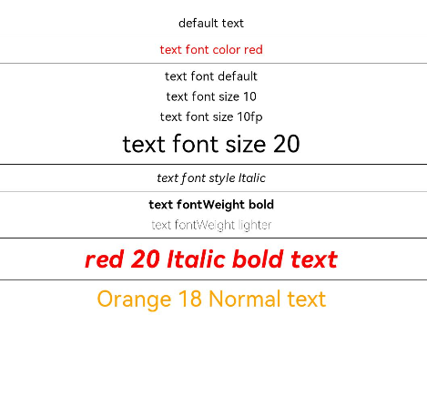

# Text Style

The text style attributes set the style for text in a component.

>  **NOTE**
>
> The APIs of this module are supported since API version 7. Updates will be marked with a superscript to indicate their earliest API version.


## Attributes


| Name        | Type                                     | Description                                   |
| -----------| ---------------------------------------- | ------------------------------------ |
| fontColor  | [ResourceColor](ts-types.md#resourcecolor)  | Font color.                                |
| fontSize   | [Length](ts-types.md#length)  | Font size. If the value is of the number type, the unit fp is used. The default font size is 10. This attribute cannot be set in percentage.   |
| fontStyle  | [FontStyle](ts-appendix-enums.md#fontstyle)  | Font style.<br>Default value: **FontStyle.Normal**        |
| fontWeight | number \| [FontWeight](ts-appendix-enums.md#fontweight) \| string  | Font weight. For the number type, the value ranges from 100 to 900, at an interval of 100. The default value is **400**. A larger value indicates a larger font weight. The string type supports only the string of the number type, for example, **400**, **"bold"**, **"bolder"**, **"lighter"**, **"regular"**, and **"medium"**, which correspond to the enumerated values in FontWeight.<br>Default value: **FontWeight.Normal** |
| fontFamily | string \| [Resource](ts-types.md#resource)  | Font family.<br>Default value: **'HarmonyOS Sans'**<br>Currently, only the default font is supported. |


## Example

```ts
// xxx.ets
@Entry
@Component
struct TextStyleExample {
  build() {
    Column({ space: 5 }) {
      Text('default text')
      Divider()
      
      Text('text font color red').fontColor(Color.Red)
      Divider()
      
      Text('text font default')
      Text('text font size 10').fontSize(10)
      Text('text font size 10fp').fontSize('10fp')
      Text('text font size 20').fontSize(20)
      Divider()
      
      Text('text font style Italic').fontStyle(FontStyle.Italic)
      Divider()
      
      Text('text fontWeight bold').fontWeight(700)
      Text('text fontWeight lighter').fontWeight(FontWeight.Lighter)
      Divider()
      
      Text('red 20 Italic bold text')
        .fontColor(Color.Red)
        .fontSize(20)
        .fontStyle(FontStyle.Italic)
        .fontWeight(FontWeight.Bold)
      Divider()
      
      Text('Orange 18 Normal text')
        .fontColor(Color.Orange)
        .fontSize(18)
        .fontStyle(FontStyle.Normal)
    }.width('100%')
  }
}
```


