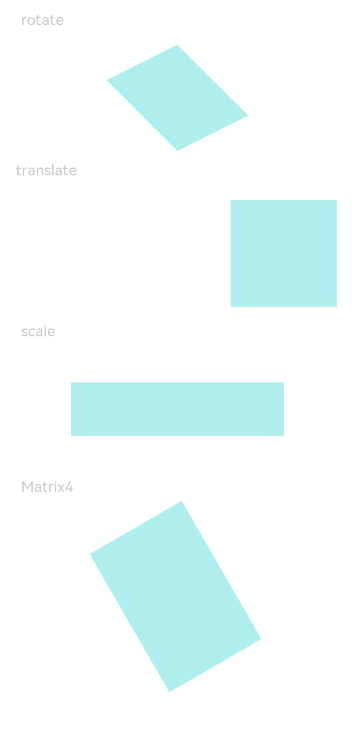

# Transformation

Transformation attributes allow you to rotate, translate, scale, or transform a component.

> **NOTE**
>
> The APIs of this module are supported since API version 7. Updates will be marked with a superscript to indicate their earliest API version.

## Attributes


| Name       | Type                                    | Description                                      |
| --------- | ---------------------------------------- | ---------------------------------------- |
| rotate    | {<br>x?: number,<br>y?: number,<br>z?: number,<br>angle: number \| string,<br>centerX?: number \| string,<br>centerY?: number \| string<br>} | How the component rotates in the coordinate system (as shown below) with the upper left corner of the component as the coordinate origin. (x, y, z) specifies a vector as the axis of rotation.<br>- **angle**: rotation angle. A positive angle indicates a clockwise rotation, and a negative angle indicates a counterclockwise rotation. The value can be of the string type, for example, **'90deg'**.<br>- **centerX** and **centerY** are used to set the center of rotation.<br>The axis and center of rotation are set based on the coordinate system, which remains where it is when the component is moved.<br>Default value:<br>{<br>x: 0,<br>y: 0,<br>z: 0,<br>centerX: '50%',<br>centerY: '50%'<br>}<br><br>Since API version 9, this API is supported in ArkTS widgets.|
| translate | {<br>x?: number \| string,<br>y?: number \| string,<br>z? : number \| string<br>} | How the component is translated in the coordinate system (as shown below) with the upper left corner of the component as the coordinate origin. Values of **x**, **y**, and **z** indicate the translation distance along the respective axis. A positive value indicates a forward movement towards the respective axis, and a negative value indicates a backward movement towards the respective axis. The translation distance can be a number or a string (for example, **'10px'** or **'10%'**).<br>Default value:<br>{<br>x: 0,<br>y: 0,<br>z: 0<br>}<br><br>Since API version 9, this API is supported in ArkTS widgets.|
| scale     | {<br>x?: number,<br>y?: number,<br>z?: number,<br>centerX?: number \| string,<br>centerY?: number \| string<br>} | Scale ratio along the x-, y-, and z-axis. The default value is **1**. **centerX** and **centerY** are used to set the scale center point.<br>Default value:<br>{<br>x: 1,<br>y: 1,<br>z: 1,<br>centerX:'50%',<br>centerY:'50%'<br>}<br>Since API version 9, this API is supported in ArkTS widgets.|
| transform | [Matrix4Transit](../apis/js-apis-matrix4.md) | Transformation matrix of the component.                            |

> **NOTE**
>
> If both the **rotate** and **scale** attributes are set for a component, the values of **centerX** and **centerY** conflict. In this case, the one that is set later in time prevails.

## Example

```ts
// xxx.ets
import matrix4 from '@ohos.matrix4'

@Entry
@Component
struct TransformExample {
  build() {
    Column() {
      Text('rotate').width('90%').fontColor(0xCCCCCC).padding(15).fontSize(14)
      Row()
        .rotate({
          x: 0,
          y: 0,
          z: 1,
          centerX: '50%',
          centerY: '50%',
          angle: 300
        }) // The component rotates around the center point of the rotation axis (0,0,1) clockwise by 300 degrees.
        .width(100).height(100).backgroundColor(0xAFEEEE)

      Text('translate').width('90%').fontColor(0xCCCCCC).padding(10).fontSize(14)
      Row()
        .translate({ x: 100, y: 10 }) // The component translates by 100 along the x-axis and by 10 along the y-axis.
        .width(100).height(100).backgroundColor(0xAFEEEE).margin({ bottom: 10 })

      Text('scale').width('90%').fontColor(0xCCCCCC).padding(15).fontSize(14)
      Row()
        .scale({ x: 2, y: 0.5}) // The height and width are doubled. The z-axis has no effect in 2D mode.
        .width(100).height(100).backgroundColor(0xAFEEEE)

      Text('Matrix4').width('90%').fontColor(0xCCCCCC).padding(15).fontSize(14)
      Row()
        .width(100).height(100).backgroundColor(0xAFEEEE)
        .transform(matrix4.identity().translate({ x: 50, y: 50 }).scale({ x: 1.5, y: 1 }).rotate({
          x: 0,
          y: 0,
          z: 1,
          angle: 60
        }))
    }.width('100%').margin({ top: 5 })
  }
}
```


