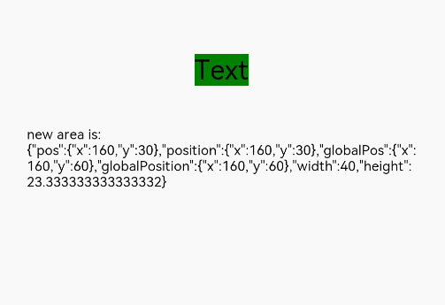

# Component Area Change Event

The area change event is triggered when the component's size, position, or any other attribute that may affect its display area changes.

>  **NOTE**
>
>  The APIs of this module are supported since API version 8. Updates will be marked with a superscript to indicate their earliest API version.


## Events

| Name                                      | Bubbling Supported| Description                                    |
| ---------------------------------------- | ---- | ---------------------------------------- |
| onAreaChange(event: (oldValue: [Area](ts-types.md#area8), newValue: [Area](ts-types.md#area8)) =&gt; void) | No   | Triggered when the component area changes in size or position due to layout updates. This event is not triggered for render attribute changes caused by re-rendering, such as changes of **translate** and **offset**.|


## Example

```ts
// xxx.ets
@Entry
@Component
struct AreaExample {
  @State value: string = 'Text'
  @State sizeValue: string = ''

  build() {
    Column() {
      Text(this.value)
        .backgroundColor(Color.Green).margin(30).fontSize(20)
        .onClick(() => {
          this.value = this.value + 'Text'
        })
        .onAreaChange((oldValue: Area, newValue: Area) => {
          console.info(`Ace: on area change, oldValue is ${JSON.stringify(oldValue)} value is ${JSON.stringify(newValue)}`)
          this.sizeValue = JSON.stringify(newValue)
        })
      Text('new area is: \n' + this.sizeValue).margin({ right: 30, left: 30 })
    }
    .width('100%').height('100%').margin({ top: 30 })
  }
}
```

