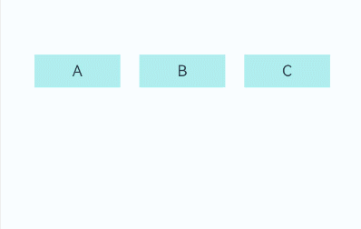
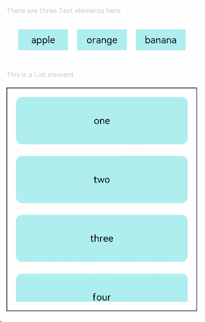

# Drag Event

A drag event is triggered when a component is dragged.

>  **NOTE**
>
>  The APIs of this module are supported since API version 8. Updates will be marked with a superscript to indicate their earliest API version.

## Attributes

In addition to the [universal attributes](ts-universal-attributes-size.md), the following attributes are supported.
| Name| Type| Description|
| -------- | -------- | -------- |
| allowDrop<sup>10+</sup> | Array\<UnifiedData> | Type of data that can be dropped to the component.<br>Default value: empty<br>|
| draggable<sup>10+</sup> | boolean | Whether the widget is draggable.<br>Default value: **false**<br>|
## Events

| Name                                                        | Bubbling Supported| Description                                                    |
| ------------------------------------------------------------ | -------- | ------------------------------------------------------------ |
| onDragStart(event: (event?: [DragEvent](#dragevent), extraParams?: string) =&gt;  [CustomBuilder](ts-types.md#custombuilder8) \| [DragItemInfo](#dragiteminfo)) | No      | Triggered when the component bound to the event is dragged for the first time.<br>- **event**: information about the drag event, including the coordinates of the item that is being dragged.<br>- **extraParams**: additional information about the drag event. For details, see **[extraParams](#extraparams)**.<br>Return value: object being dragged, which is used for prompts displayed when the object is dragged.<br>A drag event can be triggered by a 500 ms long press. If the duration of a long press gesture is set to less than or equal to 500 ms, the callback for the long press gesture takes precedence. Otherwise, the callback for the drag event takes precedence.|
| onDragEnter(event: (event?: [DragEvent](#dragevent), extraParams?: string) =&gt; void) | No      | Triggered when the dragged item enters a valid drop target.<br>- **event**: information about the drag event, including the coordinates of the item that is being dragged.<br>- **extraParams**: additional information about the drag event. For details, see **[extraParams](#extraparams)**.<br>This event is valid only when a listener for the **onDrop** event is enabled.|
| onDragMove(event: (event?: [DragEvent](#dragevent), extraParams?: string) =&gt; void) | No      | Triggered when the dragged item moves in a valid drop target.<br>- **event**: information about the drag event, including the coordinates of the item that is being dragged.<br>- **extraParams**: additional information about the drag event. For details, see **[extraParams](#extraparams)**.<br>This event is valid only when a listener for the **onDrop** event is enabled.|
| onDragLeave(event: (event?: [DragEvent](#dragevent), extraParams?: string) =&gt; void) | No      | Triggered when the dragged item leaves a valid drop target.<br>- **event**: information about the drag event, including the coordinates of the item that is being dragged.<br>- **extraParams**: additional information about the drag event. For details, see **[extraParams](#extraparams)**.<br>This event is valid only when a listener for the **onDrop** event is enabled.|
| onDrop(event: (event?: [DragEvent](#dragevent), extraParams?: string) =&gt; void) | No      | Triggered when the dragged item is dropped on a valid drop target.<br>- **event**: information about the drag event, including the coordinates of the item that is being dragged.<br>- **extraParams**: additional information about the drag event. For details, see **[extraParams](#extraparams)**.|
| onDragEnd(event: (event?: [DragEvent](#dragevent), extraParams?: string) =&gt; void)<sup>10+</sup> | No      | Triggered when the dragging of the component bound to the event ends.<br>- **event**: information about the drag event, including the coordinates of the item that is being dragged.<br>- **extraParams**: additional information about the drag event. For details, see **[extraParams](#extraparams)**.|

## DragItemInfo

| Name     | Type                                    | Mandatory  | Description                               |
| --------- | ---------------------------------------- | ---- | --------------------------------- |
| pixelMap  | [PixelMap](../apis/js-apis-image.md#pixelmap7) | No   | Image to be displayed during dragging.                    |
| builder   | [CustomBuilder](ts-types.md#custombuilder8) | No   | Custom component to display during dragging. If **pixelMap** is set, this attribute is ignored.|
| extraInfo | string                                   | No   | Extra information of the dragged item.                          |


## extraParams

  Provides additional information required for dragging an item.

  **extraParams** is a string converted from a JSON object. You can obtain the following attributes using the JSON object converted from **Json.parse**.

| Name         | Type  | Description                                      |
| ------------- | ------ | ---------------------------------------- |
| selectedIndex | number | Index of the dragged item in the parent container. The value of **selectedindex** starts from **0**.<br>This attribute is valid only in the drag event of the **\<ListItem>** component.|
| insertIndex   | number | Index of the element into which the dragged item is dropped in the **List** component. The value of **insertIndex** starts from **0**.<br>This attribute is valid only in the drag event of the **\<List>** component.|

## DragEvent

| Name    | Type | Description            |
| ------ | ------ | ---------------- |
| getX() | number | X-coordinate of the drag position relative to the upper left corner of the screen, in vp.|
| getY() | number | Y-coordinate of the drag position relative to the upper left corner of the screen, in vp.|
| useCustomDropAnimation<sup>10+</sup> | boolean | Whether to use the default drop animation when the dragging ends.|
| dragBehavior<sup>10+</sup> | [DragBehavior](#dragbehavior10) | Component tree behavior corresponding to the drga event.|
| setData(unifiedData: UnifiedData)<sup>10+</sup> | void | Sets drag-related data in the drag event.|
| getData()<sup>10+</sup> | UnifiedData | Obtains drag-related data from the drag event.|
| getSummary()<sup>10+</sup> | Summary | Obtains the summary of drag-related data from the drag event.|
| setResult(dragRect: [DragRet](#dragret10))<sup>10+</sup>| void | Sets the drag and drop result in the drag event.|
| getResult()<sup>10+</sup> | [DragRet](#dragret10)| Obtains the drag and drop result from the drag event.|
| getPrviewRect()<sup>10+</sup> | [Rectangle](ts-universal-attributes-touch-target.md#rectangle) | Obtains the rectangle where the preview image is located.|

## DragBehavior<sup>10+</sup>

| Name| Description|
| ------ | ------ |
| COPY | In the component tree, copy the component that initiates the dragging and copy the copy result to the position where the dragging ends.|
| MOVE | In the component tree, cut the component that initiates the dragging and move it to the position where the dragging ends.|

## DragRet<sup>10+</sup>

| Name| Description|
| ----- | ----------------- |
| DRAG_SUCCESS | The drag and drop operation succeeded.|
| DRAG_FAILED | The drag and drop operation failed.|
| DRAG_CANCELED | The drag and drop operation was canceled.|
| DROP_ENABLED | The component allows for a drop operation.|
| DROP_DISABLED | The component does not allow for a drop operation.|

## Example

### Example 1

```ts
@Observed
class ClassA {
  public name: string
  public bol: boolean

  constructor(name: string, bol: boolean) {
    this.name = name
    this.bol = bol
  }
}

@Extend(Text) function textStyle() {
  .width('25%')
  .height(35)
  .fontSize(16)
  .textAlign(TextAlign.Center)
  .backgroundColor(0xAFEEEE)
}

@Entry
@Component
struct DragExample {
  @State arr: ClassA[] = [new ClassA('A', true), new ClassA('B', true), new ClassA('C', true)]
  @State dragIndex: number = 0

  changeIndex(index1: number, index2: number) {// Exchange the array position.
    [this.arr[index1], this.arr[index2]] = [this.arr[index2], this.arr[index1]];
  }

  build() {
    Column() {
      Row({ space: 15 }) {
        List({ space: 20 }) {
          ForEach(this.arr, (item, index) => {
            ListItem() {
              Column() {
                Child({ a: this.arr[index] })
              }
              .onTouch((event: TouchEvent) => {
                if (event.type === TouchType.Down) {
                  this.dragIndex = index // Obtain the index of the current dragged child component.
                  console.info('onTouch' + this.dragIndex)
                }
              })
            }
          })
        }
        .listDirection(Axis.Horizontal)
        .onDrop((event: DragEvent, extraParams: string) => { // The component bound to this event can be used as the drop target. When the dragging stops within the component scope, the callback is triggered.
          let jsonString = JSON.parse(extraParams);
          this.changeIndex(this.dragIndex, jsonString.insertIndex)
        })
      }.padding({ top: 10, bottom: 10 }).margin(10)

    }.width('100%').height('100%').padding({ top: 20 }).margin({ top: 20 })
  }
}

@Component
struct Child {
  @ObjectLink a: ClassA

  @Builder pixelMapBuilder() {
    Column() {
      Text(this.a.name)
        .width('50%')
        .height(60)
        .fontSize(16)
        .borderRadius(10)
        .textAlign(TextAlign.Center)
        .backgroundColor(Color.Yellow)
    }
  }

  build() {
    Column() {
      Text(this.a.name)
        .textStyle()
        .visibility(this.a.bol ? Visibility.Visible : Visibility.None)
        .onDragStart(() => { // The callback is triggered when the component bound to this event is dragged for the first time.
          this.a.bol = false // Control the visibility.
          return this.pixelMapBuilder() // Set the image displayed during dragging.
        })
        .onTouch((event: TouchEvent) => {
          if (event.type === TouchType.Up) {
            this.a.bol = true
          }
        })
      Text('')
        .width('25%')
        .height(35)
        .fontSize(16)
        .textAlign(TextAlign.Center)
        .border({ width: 5, color: 'red' })
        .visibility(!this.a.bol ? Visibility.Visible : Visibility.None)
    }
  }
}
```



### Example 2

```ts
// xxx.ets
@Extend(Text) function textStyle () {
  .width('25%')
  .height(35)
  .fontSize(16)
  .textAlign(TextAlign.Center)
  .backgroundColor(0xAFEEEE)
}

@Entry
@Component
struct DragExample {
  @State numbers: string[] = ['one', 'two', 'three', 'four', 'five', 'six']
  @State text: string = ''
  @State bool: boolean = true
  @State eventType: string = ''
  @State appleVisible: Visibility = Visibility.Visible
  @State orangeVisible: Visibility = Visibility.Visible
  @State bananaVisible: Visibility = Visibility.Visible
  private dragList: string[] = ['apple', 'orange', 'banana']
  @State fruitVisible: Visibility[] = [Visibility.Visible, Visibility.Visible, Visibility.Visible]
  @State idx: number = 0

  // Customize the content displayed during dragging.
  @Builder pixelMapBuilder() {
    Column() {
      Text(this.text)
        .width('50%')
        .height(60)
        .fontSize(16)
        .borderRadius(10)
        .textAlign(TextAlign.Center)
        .backgroundColor(Color.Yellow)
    }
  }

  build() {
    Column() {
      Text('There are three Text elements here')
        .fontSize(12)
        .fontColor(0xCCCCCC)
        .width('90%')
        .textAlign(TextAlign.Start)
        .margin(5)
      Row({ space: 15 }) {
        ForEach(this.dragList, (item, index) => {
          Text(item)
            .textStyle()
            .visibility(this.fruitVisible[index])
            .onDragStart(() => {
              this.bool = true
              this.text = item
              this.fruitVisible[index] = Visibility.None
              return this.pixelMapBuilder
            })
            .onTouch((event: TouchEvent) => {
              if (event.type === TouchType.Down) {
                this.eventType = 'Down'
                this.idx = index
              }
              if (event.type === TouchType.Up) {
                this.eventType = 'Up'
                if (this.bool) {
                  this.fruitVisible[index] = Visibility.Visible
                }
              }
            })
        })
      }.padding({ top: 10, bottom: 10 }).margin(10)

      Text('This is a List element')
        .fontSize(12)
        .fontColor(0xCCCCCC)
        .width('90%')
        .textAlign(TextAlign.Start)
        .margin(15)
      List({ space: 20 }) {
        ForEach(this.numbers, (item) => {
          ListItem() {
            Text(item)
              .width('100%')
              .height(80)
              .fontSize(16)
              .borderRadius(10)
              .textAlign(TextAlign.Center)
              .backgroundColor(0xAFEEEE)
          }
        }, item => item)
      }
      .editMode(true)
      .height('50%')
      .width('90%')
      .border({ width: 1 })
      .padding(15)
      .divider({ strokeWidth: 2, color: 0xFFFFFF, startMargin: 20, endMargin: 20 })
      .onDragEnter((event: DragEvent, extraParams: string) => {
        console.log('List onDragEnter, ' + extraParams + 'X:' + event.getX() + 'Y:' + event.getY())
      })
      .onDragMove((event: DragEvent, extraParams: string) => {
        console.log('List onDragMove, ' + extraParams + 'X:' + event.getX() + 'Y:' + event.getY())
      })
      .onDragLeave((event: DragEvent, extraParams: string) => {
        console.log('List onDragLeave, ' + extraParams + 'X:' + event.getX() + 'Y:' + event.getY())
      })
      .onDrop((event: DragEvent, extraParams: string) => {
        let jsonString = JSON.parse(extraParams);
        if (this.bool) {
          // Insert an element using the splice method.
          this.numbers.splice(jsonString.insertIndex, 0, this.text)
          this.bool = false
        }
        this.fruitVisible[this.idx] = Visibility.None
      })
    }.width('100%').height('100%').padding({ top: 20 }).margin({ top: 20 })
  }
}
```


