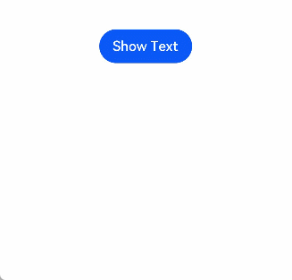

# Show/Hide Event

The show/hide event is triggered when a component is mounted or unmounted from the component tree. A component appears when mounted to the component tree and disappears when unmounted from the component tree.

> **NOTE**
>
> The APIs of this module are supported since API version 7. Updates will be marked with a superscript to indicate their earliest API version.


## Events

| Name                                            | Bubbling Supported| Description                                                    |
| ------------------------------------------------ | -------- | ------------------------------------------------------------ |
| onAppear(event: () =&gt; void)    | No      | Triggered when the component is displayed.<br>Since API version 9, this API is supported in ArkTS widgets.|
| onDisAppear(event: () =&gt; void) | No      | Triggered when the component is hidden.<br>Since API version 9, this API is supported in ArkTS widgets.|


## Example

```ts
// xxx.ets
import promptAction from '@ohos.promptAction'

@Entry
@Component
struct AppearExample {
  @State isShow: boolean = true
  @State changeAppear: string = 'Hide Text'
  private myText: string = 'Text for onAppear'

  build() {
    Column() {
      Button(this.changeAppear)
        .onClick(() => {
          this.isShow = !this.isShow
        }).margin(15)
      if (this.isShow) {
        Text(this.myText).fontSize(26).fontWeight(FontWeight.Bold)
          .onAppear(() => {
            this.changeAppear = 'Hide Text'
            promptAction.showToast({
              message: 'The text is shown',
              duration: 2000
            })
          })
          .onDisAppear(() => {
            this.changeAppear = 'Show Text'
            promptAction.showToast({
              message: 'The text is hidden',
              duration: 2000
            })
          })
      }
    }.padding(30).width('100%')
  }
}
```


