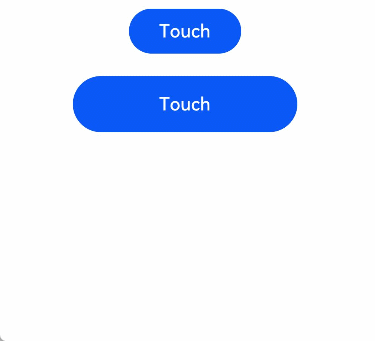

# Touch Event

A touch event is triggered when a finger is pressed, slides, or is lifted from a component.

> **NOTE**
>
> This event is supported since API version 7. Updates will be marked with a superscript to indicate their earliest API version.


## Events

| Name                                                        | Bubbling Supported| Description                                                    |
| ------------------------------------------------------------ | -------- | ------------------------------------------------------------ |
| onTouch(event: (event?: TouchEvent) =&gt; void) | Yes      | Invoked when a touch event is triggered. For details about **event**, see [TouchEvent](#touchevent).|


## TouchEvent

| Name               | Type                                      | Description          |
| ------------------- | ---------------------------------------- | ------------ |
| type                | [TouchType](ts-appendix-enums.md#touchtype)      | Type of the touch event.    |
| touches             | Array&lt;[TouchObject](#touchobject)&gt; | All finger information.     |
| changedTouches      | Array&lt;[TouchObject](#touchobject)&gt; | Finger information changed.|
| stopPropagation      | () => void | Stops the event from bubbling upwards or downwards.|
| timestamp<sup>8+</sup> | number | Timestamp of the event. It is interval between the time when the event is triggered and the time when the system starts, in nanoseconds.|
| target<sup>8+</sup> | [EventTarget](ts-universal-events-click.md#eventtarget8) | Display area of the element that triggers the gesture event.|
| source<sup>8+</sup> | [SourceType](ts-gesture-settings.md#sourcetype)| Event input device.|


## TouchObject

| Name   | Type                                       | Description                                 |
| ------- | ------------------------------------------- | ------------------------------------- |
| type    | [TouchType](ts-appendix-enums.md#touchtype) | Type of the touch event.                     |
| id      | number                                      | Unique identifier of a finger.                     |
| screenX | number                                      | X coordinate of the touch point relative to the upper left corner of the application window.  |
| screenY | number                                      | Y coordinate of the touch point relative to the upper left corner of the application window.  |
| x       | number                                      | X coordinate of the touch point relative to the upper left corner of the component being touched.|
| y       | number                                      | Y coordinate of the touch point relative to the upper left corner of the component being touched.|

## Example

```ts
// xxx.ets
@Entry
@Component
struct TouchExample {
  @State text: string = ''
  @State eventType: string = ''

  build() {
    Column() {
      Button('Touch').height(40).width(100)
        .onTouch((event: TouchEvent) => {
          if (event.type === TouchType.Down) {
            this.eventType = 'Down'
          }
          if (event.type === TouchType.Up) {
            this.eventType = 'Up'
          }
          if (event.type === TouchType.Move) {
            this.eventType = 'Move'
          }
          this.text = 'TouchType:' + this.eventType + '\nDistance between touch point and touch element:\nx: '
          + event.touches[0].x + '\n' + 'y: ' + event.touches[0].y + '\nComponent globalPos:('
          + event.target.area.globalPosition.x + ',' + event.target.area.globalPosition.y + ')\nwidth:'
          + event.target.area.width + '\nheight:' + event.target.area.height
        })
      Button('Touch').height(50).width(200).margin(20)
        .onTouch((event: TouchEvent) => {
          if (event.type === TouchType.Down) {
            this.eventType = 'Down'
          }
          if (event.type === TouchType.Up) {
            this.eventType = 'Up'
          }
          if (event.type === TouchType.Move) {
            this.eventType = 'Move'
          }
          this.text = 'TouchType:' + this.eventType + '\nDistance between touch point and touch element:\nx: '
          + event.touches[0].x + '\n' + 'y: ' + event.touches[0].y + '\nComponent globalPos:('
          + event.target.area.globalPosition.x + ',' + event.target.area.globalPosition.y + ')\nwidth:'
          + event.target.area.width + '\nheight:' + event.target.area.height
        })
      Text(this.text)
    }.width('100%').padding(30)
  }
}
```


