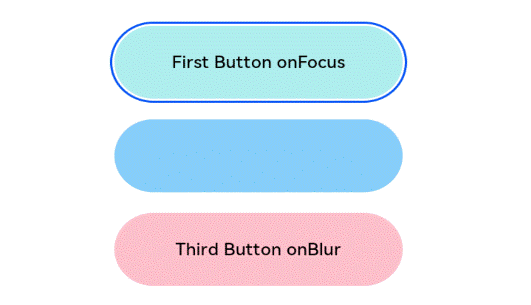

# Focus Event

A focus event is triggered when the page focus moves between components. It can be used to process related logic within the component.

>  **NOTE**
>
>  - The APIs of this module are supported since API version 8. Updates will be marked with a superscript to indicate their earliest API version.
>
>  - Currently, only the Tab button and arrow buttons on the external keyboard can be used to trigger the focus event.
>
>  - Components that have default interaction logic, such as **\<Button>** and **\<TextInput>**, are focusable by default. Other components, such as **\<Text>** and **\<Image>**, are not focusable by default. Only focusable components can trigger a focus event. To enable a component to be focusable, set its **focusable** attribute to **true**.


## Events

| Name                                  | Bubbling Supported| Description       |
| ---------------------------------------- | -------- | --------------- |
| onFocus(event: () =&gt; void) | No  | Triggered when the current component obtains focus.|
| onBlur(event:() =&gt; void)    | No       | Triggered when the current component loses focus.|


## Example

```ts
// xxx.ets
@Entry
@Component
struct FocusEventExample {
  @State oneButtonColor: string = '#FFC0CB'
  @State twoButtonColor: string = '#87CEFA'
  @State threeButtonColor: string = '#90EE90'

  build() {
    Column({ space: 20 }) {
      // You can use the up and down arrow keys on an external keyboard to move the focus between the three buttons. When a button gains focus, its color changes. When it loses focus, its color changes back.
      Button('First Button')
        .backgroundColor(this.oneButtonColor)
        .width(260)
        .height(70)
        .fontColor(Color.Black)
        .focusable(true)
        .onFocus(() => {
          this.oneButtonColor = '#FF0000'
        })
        .onBlur(() => {
          this.oneButtonColor = '#FFC0CB'
        })
      Button('Second Button')
        .backgroundColor(this.twoButtonColor)
        .width(260)
        .height(70)
        .fontColor(Color.Black)
        .focusable(true)
        .onFocus(() => {
          this.twoButtonColor = '#FF0000'
        })
        .onBlur(() => {
          this.twoButtonColor = '#87CEFA'
        })
      Button('Third Button')
        .backgroundColor(this.threeButtonColor)
        .width(260)
        .height(70)
        .fontColor(Color.Black)
        .focusable(true)
        .onFocus(() => {
          this.threeButtonColor = '#FF0000'
        })
        .onBlur(() => {
          this.threeButtonColor = '#90EE90'
        })
    }.width('100%').margin({ top: 20 })
  }
}
```

  
