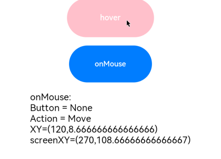
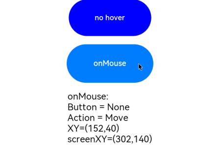

# Mouse Event

If an action triggers multiple events, the order of these events is fixed. By default, mouse events are transmitted transparently.

>  **NOTE**
>
>  The APIs of this module are supported since API version 8. Updates will be marked with a superscript to indicate their earliest API version.


## Events

| Name                                                        | Bubbling Supported| Description                                                        |
| ------------------------------------------------------------ | -------- | ------------------------------------------------------------ |
| onHover(event: (isHover?: boolean) =&gt; void) | No      | Triggered when the mouse cursor enters or leaves the component.<br>**isHover**: whether the mouse cursor hovers over the component. The value **true** means that the mouse cursor enters the component, and the value **false** means that the mouse cursor leaves the component.|
| onMouse(event: (event?: MouseEvent) =&gt; void) | Yes      | Triggered when the component is clicked by a mouse button or the mouse cursor moves on the component. The **event** parameter indicates the timestamp, mouse button, action, coordinates of the clicked point on the entire screen, and coordinates of the clicked point relative to the component when the event is triggered.|


## MouseEvent

| Name     | Type                           | Description                  |
| --------- | ------------------------------- | -------------------- |
| screenX   | number                          | X coordinate of the cursor position relative to the upper left corner of the application window.|
| screenY   | number                          | Y coordinate of the cursor position relative to the upper left corner of the application window.|
| x         | number                          | X coordinate of the cursor position relative to the upper left corner of the component being clicked.|
| y         | number                          | Y coordinate of the mouse position relative to the upper left corner of the component being clicked.|
| button    | [MouseButton](ts-appendix-enums.md#mousebutton) | Mouse button.               |
| action    | [MouseAction](ts-appendix-enums.md#mouseaction) | Mouse action.               |
| stopPropagation      | () => void | Stops the event from bubbling upwards or downwards.                        |
| timestamp<sup>8+</sup> | number | Timestamp of the event. It is interval between the time when the event is triggered and the time when the system starts, in nanoseconds.|
| target<sup>8+</sup> | [EventTarget](ts-universal-events-click.md#eventtarget8) | Display area of the component that triggers the event.|
| source<sup>8+</sup> | [SourceType](ts-gesture-settings.md#sourcetype)| Event input device.|

## Example

```ts
// xxx.ets
@Entry
@Component
struct MouseEventExample {
  @State hoverText: string = 'no hover';
  @State mouseText: string = '';
  @State action: string = '';
  @State mouseBtn: string = '';
  @State color: Color = Color.Blue;

  build() {
    Column({ space: 20 }) {
      Button(this.hoverText)
        .width(180).height(80)
        .backgroundColor(this.color)
        .onHover((isHover: boolean) => {
          // Use the onHover event to dynamically change the text content and background color of a button when the mouse pointer is hovered on it.
          if (isHover) {
            this.hoverText = 'hover';
            this.color = Color.Pink;
          } else {
            this.hoverText = 'no hover';
            this.color = Color.Blue;
          }
        })
      Button('onMouse')
        .width(180).height(80)
        .onMouse((event: MouseEvent) => {
          switch (event.button) {
            case MouseButton.None:
              this.mouseBtn = 'None';
              break;
            case MouseButton.Left:
              this.mouseBtn = 'Left';
              break;
            case MouseButton.Right:
              this.mouseBtn = 'Right';
              break;
            case MouseButton.Back:
              this.mouseBtn = 'Back';
              break;
            case MouseButton.Forward:
              this.mouseBtn = 'Forward';
              break;
            case MouseButton.Middle:
              this.mouseBtn = 'Middle';
              break;
          }
          switch (event.action) {
            case MouseAction.Hover:
              this.action = 'Hover';
              break;
            case MouseAction.Press:
              this.action = 'Press';
              break;
            case MouseAction.Move:
              this.action = 'Move';
              break;
            case MouseAction.Release:
              this.action = 'Release';
              break;
          }
          this.mouseText = 'onMouse:\nButton = ' + this.mouseBtn +
          '\nAction = ' + this.action + '\nXY=(' + event.x + ',' + event.y + ')' +
          '\nscreenXY=(' + event.screenX + ',' + event.screenY + ')';
        })
      Text(this.mouseText)
    }.padding({ top: 30 }).width('100%')
  }
}
```

 

The figure below shows how the button looks like when hovered on.

  

The figure below shows how the button looks like when clicked.


