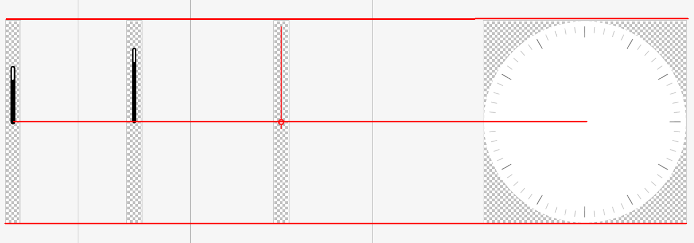

# clock


The **\<clock>** component provides a clock face.

> **NOTE**
>
> The APIs of this module are supported since API version 8. Updates will be marked with a superscript to indicate their earliest API version.

## Child Components

Not supported


## Attributes

In addition to the [universal attributes](js-service-widget-common-attributes.md), the following attributes are supported.

| Name         | Type         | Default Value | Mandatory  | Description                                      |
| ----------- | ----------- | ---- | ---- | ---------------------------------------- |
| clockconfig | ClockConfig | -    | Yes   | Image resources and styles used by this **\<clock>** component, including one set for the daytime (6:00 to 18:00) and one set for the nighttime (18:00 to 6:00 of the next day).<br>Each set of resources contains four images for the clock face, hour hand, minute hand, and second hand, respectively. Each set of styles is used for specifying number colors for the daytime and nighttime.<br>This attribute is mandatory for the daytime. If you do not set this attribute for the nighttime, the daytime images are reused at the nighttime.<br>Object members cannot be dynamically updated. However, You can dynamically update the object.<br>You are advised to use PNG images.<br>SVG images are not supported.|
| showdigit   | boolean     | true | No   | Whether to draw clock face numbers based on **clockconfig**.<br>If you set this attribute to **true**, ensure that **digitRadiusRatio** and **digitSizeRatio** parameters of **clockconfig** match the clock face.<br>The numbers generated by the **\<clock>** component support multiple number formats in different locales.|
| hourswest   | number      | -    | No   | Time offset of the clock to the Coordinated Universal Time (UTC). The local time zone is UTC minus **hourswest**.<br>The value range is [-12, 12]. For example, the value **-8** means UTC+8. If this parameter is not set, the current system time zone is used.|

  **Table 1** ClockConfig

| Name              | Type            | Default Value            | Mandatory  | Description                                      |
| ---------------- | -------------- | --------------- | ---- | ---------------------------------------- |
| face             | &lt;string&gt; | -               | Yes   | Path of clock face images used in the daytime.<br>The clock face resources must be square images that contain the clock scale, and the clock face area must be an inscribed circle of the image or a concentric circle of the inscribed circle. If the clock face area is a concentric circle of the inscribed circle, you need to change the **digitRadiusRatio** and **digitSizeRatio** values accordingly.|
| hourHand         | &lt;string&gt; | -               | Yes   | Path of hour hand images used in the daytime.<br>- The height of the hour hand images must be the same as that of the clock face images.<br>- You are advised to set the aspect ratio of the hour hand images to **0.062**.<br>- The rotation center of the hour hand must be the same as the center (diagonal intersection point) of the hour hand images.<br>- To specify the hour hand resources for the nighttime, set **hourHandNight**.|
| minuteHand       | &lt;string&gt; | -               | Yes   | Path of minute hand images used in the daytime.<br>- The height of the minute hand images must be the same as that of the clock face images.<br>- You are advised to set the aspect ratio of the minute hand images to **0.062**.<br>- The rotation center of the minute hand must be the same as the center (diagonal intersection point) of the minute hand images.<br>- To specify the minute hand resources for the nighttime, set **minuteHandNight**.|
| secondHand       | &lt;string&gt; | -               | Yes   | Path of second hand images used in the daytime.<br>- The height of the second hand images must be the same as that of the clock face images.<br>- You are advised to set the aspect ratio of the second hand images to **0.062**.<br>- The rotation center of the second hand must be the same as the center (diagonal intersection point) of the second hand images.<br>- To specify the second hand resources for the nighttime, set **secondHandNightSrc**.|
| digitColor       | &lt;color&gt;  | \#FF000000      | No   | Text color on the clock face during the daytime (6:00 to 18:00).                |
| digitColorNight  | &lt;color&gt;  | Same as that of **digitColor**| No   | Text color on the clock face during the nighttime (18:00 to 06:00 of the following day).<br>- If this attribute is not set, the value of **digitColor** is used as the value of **digitColorNight**.<br>In this case, you should ensure the text color of the nighttime clock face matches the color of the nighttime clock face images (stored in **faceNight**).|
| faceNight        | &lt;string&gt; | -               | No   | Path of clock face images used in the nighttime.<br>If this parameter is not set, the path of clock face images for the daytime is used as the value of this parameter.|
| hourHandNight    | &lt;string&gt; | -               | No   | Path of hour hand images used in the nighttime.<br>If this parameter is not set, the path of hour hand images for the daytime is used as the value of this parameter.|
| minuteHandNight  | &lt;string&gt; | -               | No   | Path of minute hand images used in the nighttime.<br>If this parameter is not set, the path of minute hand images for the daytime is used as the value of this parameter.|
| secondHandNight  | &lt;string&gt; | -               | No   | Path of second hand images used in the nighttime.<br>If this parameter is not set, the path of second hand images for the daytime is used as the value of this parameter.|
| digitRadiusRatio | number         | 0.7             | No   | Distance between the center of the clock face numbers and the center of the clock face circle/Half of the side length of the clock face image.<br>- The value range is (0, 1].<br>- This parameter is used to calculate the distance between the numbers on the clock face and the center of the clock face circle.<br>- This parameter ensures that the same set of clock face images have the same relative position in components of different sizes. You do not need to change the position for components of different sizes.<br>- If this parameter is set to **1**, the numbers may exceed the clock face area. In this case, you should change the **digitRadiusRatio** value based on the clock face size.|
| digitSizeRatio   | number         | 0.08            | No   | Font size of the watch face numbers/Side length of the watch face<br>- The value range is (0, 0.142].<br>- This parameter is used to calculate the font size of clock face numbers relative to the size of the clock face.<br>- This parameter ensures that the same set of clock face images have the same relative size in components of different sizes. You do not need to change the font size for components of different sizes.|




## Styles

In addition to the [universal styles](js-service-widget-common-styles.md), the following styles are supported.

| Name         | Type            | Default Value       | Mandatory  | Description                                      |
| ----------- | -------------- | ---------- | ---- | ---------------------------------------- |
| font-family | &lt;string&gt; | sans-serif | No   | Font family used for clock face numbers, in which fonts are separated by commas (,). Each font is set using a font name or font family name. The first font in the family or the font specified by a custom font style is used for the text.|

>  **NOTE**
>
>  The **\<clock>** component keeps the aspect ratio of the display area to **1**. The side length of the final square display area is **min(width, height)**. The square display area is centered in the component (**width** x **height**).


## Events

| Name  | Parameter                 | Description       |
| ---- | ------------------- | --------- |
| hour | {hour: number} | Triggered on the hour.|


## Example


```html
<!-- xxx.hml -->
<div class="container">
    <div class="row">
        <clock class="clk" style="font-family:Courier;" hourswest="-8" clockconfig="{{clockconfig}}">
        </clock>
        <clock class="clk" style="font-family:Courier;" hourswest="4" clockconfig="{{clockconfig}}">
        </clock>
    </div>
</div>
```


```css
/* xxx.css */ 
.container {
    flex-direction:column;
    align-items:center;
}
.clk {
    width:350px;
    height:350px;
}
.row {
    flex-direction:row;
    align-items:center;
    justify-content: space-around;
    border-radius: 40px;
    padding-top: 20px;
    padding-bottom: 20px;
    background-color: #4169E1;
}
```


```json
{
  "data": {
    "clockconfig": {
      "digitRadiusRatio": 0.7,
      "digitSizeRatio": 0.08,
      "face": "common/clock_widget.png",
      "hourHand": "common/clock_widget_hour.png",
      "minuteHand": "common/clock_widget_minute.png",
      "secondHand": "common/clock_widget_second.png",
      "faceNight": "common/black_clock_widget.png",
      "hourHandNight": "common/black_clock_widget_hour.png",
      "minuteHandNight": "common/black_clock_widget_minute.png",
      "digitColor": "#000000",
      "digitColorNight": "#FFFFFF"
    }
  }
}
```
**2 x 4 widget**


