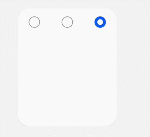

# input


The **\<input>** component provides a radio button to receive user input. 

> **NOTE**
>
> The APIs of this module are supported since API version 8. Updates will be marked with a superscript to indicate their earliest API version.

## Attributes

In addition to the [universal attributes](js-service-widget-common-attributes.md), the following attributes are supported.

| Name     | Type     | Default Value  | Mandatory  | Description                                      |
| ------- | ------- | ----- | ---- | ---------------------------------------- |
| type    | string  | radio | Yes   | Type of the **\<input>** component. Currently, only the radio button is supported.<br>- **radio**: a radio button that allows users to select one from multiple others with the same name.|
| checked | boolean | false | No   | Whether the component is checked or not.                               |
| name    | string  | -     | No   | Name of the **\<input>** component.                             |
| value   | string  | -     | No   | Value of the **<input>** component. When **type** is **radio**, this attribute is mandatory and the value must be unique for radio buttons with the same name.|


## Styles

The [universal styles](js-service-widget-common-styles.md) are supported.


## Events

| Name    | Parameter                | Description                                      |
| ------ | ------------------ | ---------------------------------------- |
| change | $event.checkedItem | Triggered when the **checked** status of a radio button changes. This event returns the value of the selected **\<input>** component.|
| click  | -                  | Triggered when the component is clicked.                              |


## Example


```html
<!-- xxx.hml -->
<div class="content">
  <input type="radio" checked='true' name="radioSample" value="radio1" onchange="onRadioChange"></input>
  <input type="radio" checked='false' name="radioSample" value="radio2" onchange="onRadioChange"></input>
  <input type="radio" checked='false' name="radioSample" value="radio3" onchange="onRadioChange"></input>
</div>
```


```css
/* xxx.css */
.content{
  width: 100%;
  height: 200px;
  justify-content: center;
  align-items: center;
}
```


```json
{
  "actions": {
    "onRadioChange":{
      "action": "message",
      "params": {
        "checkedRadio": "$event.checkedItem"
      }
    }
  }
}
```
**4 x 4 widget**


