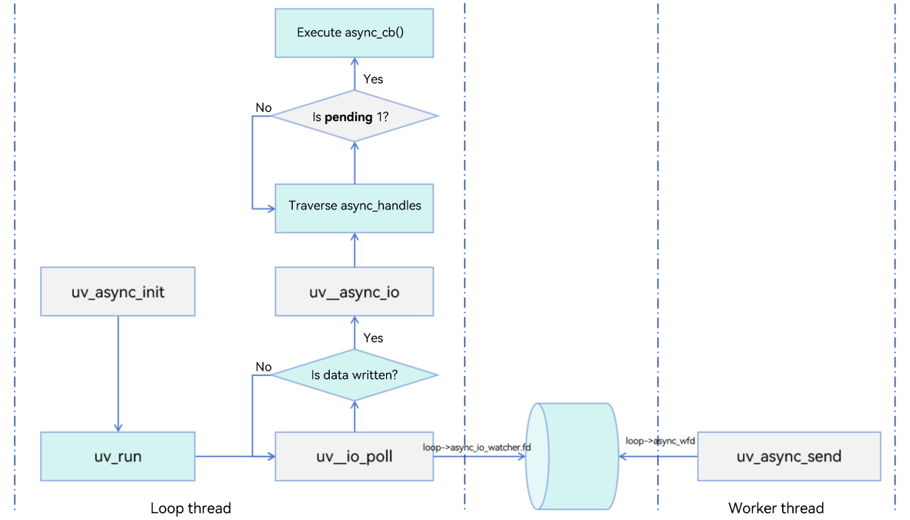
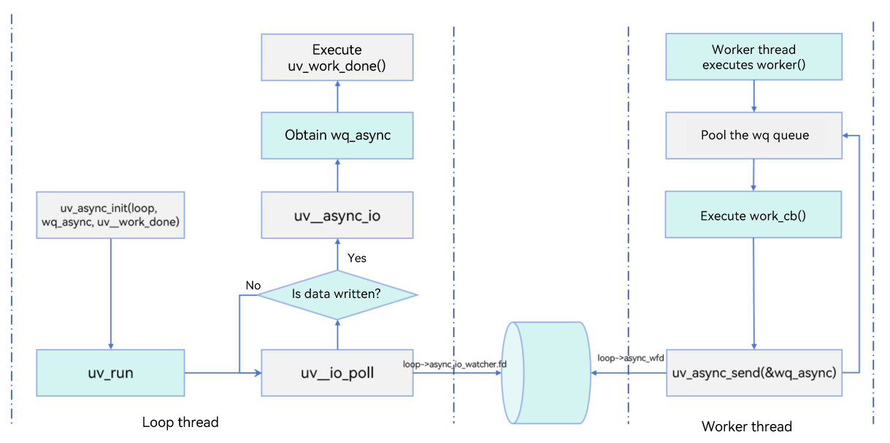
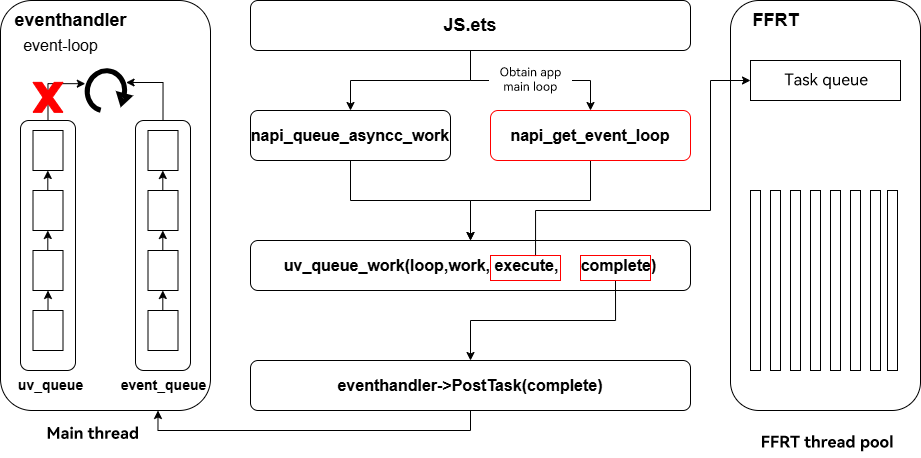

# libuv

## Introduction

[libuv](http://libuv.org/) is a cross-platform library that implements asynchronous I/O based on event loops. It applies to network programming and file system operations. It is one of the core libraries of Node.js and has been widely used by other software projects.

## Supported Capabilities

- Event-driven asynchronous I/O across platforms.

- Support for standard library interfaces.


## Available APIs

For details, see [API documentation](http://docs.libuv.org/en/v1.x/api.html).

## Background of Introducing libuv to OpenHarmony

OpenHarmony introduced Node-API of Node.js in its earlier versions to facilitate Node.js developers to extend their JavaScript APIs with OpenHarmony. It also introduced libuv of Node.js to implement event loops.

### Evolution Trend

To address the scheduling issues caused when the application main thread has an event loop that contains **uvloop**, we plan to normalize the event loops in the application model to allow only one task queue in the application main loop with task priorities controlled.

Avoid using the NDK of libuv to perform operations on the application main loop obtained by **napi_get_uv_event_loop** (deprecated in API version 12). This may cause various problems and large amount of workload to address compatibility issues.

If you want to implement interaction with the main thread cyclically, for example, inserting a task, use [APIs provided by Node-API](../../napi/napi-data-types-interfaces.md).

OpenHarmony will continue to provide capabilities of interacting with the main thread and extending JS APIs through Node-API for a long period of time, but shields the event loops used in the implementation layer. Although **napi_get_uv_event_loop** is deprecated in API version 12, the main functional APIs of Node-API will be maintained for a long time and provide the same native behavior of Node-API, so that the developers who are familiar with the node.js extension mechanism can easily expand their code to OpenHarmony.

If you are familiar with libuv and can handle memory management and multithreading problems, you can use libuv to develop your services on OpenHarmony. Unless otherwise required, you do not need to import the libuv library to your application project.

### Current Problems and Solutions

According to the existing mechanism, only one event loop can exist in a thread. To ensure proper running of the main event loop of the system application, the main event loop listens for the FD events in the JS environment and executes `uv_run` only when an FD event is reported. As a result, certain functions that depend on **uvloop** cannot take effect.

Common scenarios and solutions are as follows:

#### Scenario 1: The JS main thread throws an async task to a worker thread for execution, and executes the result returned by the JS code.

**Example (incorrect)**

Call **napi_get_uv_event_loop()** to obtain the system loop, and use libuv NDK APIs to implement related functions.

```cpp
#include "napi/native_api.h"
#include "uv.h"
#define LOG_DOMAIN 0X0202
#define LOG_TAG "MyTag"
#include <hilog/log.h>
#include <thread>
#include <sys/eventfd.h>
#include <unistd.h>

static void execute(uv_work_t *work) {
    OH_LOG_INFO(LOG_APP, "ohos in execute");
}

static void complete(uv_work_t *work, int status) {
    OH_LOG_INFO(LOG_APP, "ohos in complete"); 
    delete work;
}
static napi_value Add(napi_env env, napi_callback_info info)
{
    napi_value work_name;
    uv_loop_s *loop = nullptr;
    /* Obtain the uv_loop of the application JS main thread. */
    napi_get_uv_event_loop(env, &loop);
    uv_work_t *work = new uv_work_t;
    int ret = uv_queue_work(loop, work, execute, complete);
    if (ret != 0) {
        OH_LOG_INFO(LOG_APP, "delete work");
        delete work;
    }
    return 0;
}

EXTERN_C_START
static napi_value Init(napi_env env, napi_value exports){
    napi_property_descriptor desc[] = {{"add", nullptr, Add, nullptr, nullptr, nullptr, napi_default, nullptr}};
    napi_define_properties(env, exports, sizeof(desc) / sizeof(desc[0]), desc);
    return exports;
EXTERN_C_END
    
static napi_module demoModule = {
    .nm_version = 1,
    .nm_flags = 0,
    .nm_filename = nullptr,
    .nm_register_func = Init,
    .nm_modname = "entry",
    .nm_priv = ((void *)0),
    .reserved = {0},
};

extern "C" __attribute__((constructor)) void RegisterEntryModule(void){
    napi_module_register(&demoModule);
}
```

**Example (correct)**:

Use **napi_create_async_work** and **napi_queue_async_work** together.

```cpp
#include "napi/native_api.h"
#include "uv.h"
#define LOG_DOMAIN 0X0202
#define LOG_TAG "MyTag"
#include <hilog/log.h>
#include <thread>
#include <sys/eventfd.h>
#include <unistd.h>
uv_loop_t *loop;
napi_value jsCb;
int fd = -1;

static napi_value Add(napi_env env, napi_callback_info info)
{
    napi_value work_name;
    napi_async_work work;
    napi_create_string_utf8(env, "ohos", NAPI_AUTO_LENGTH, &work_name);
    /* The fourth parameter specifies the work task of the asynchronous thread, and the fifth parameter is the callback of the main thread. */
    napi_create_async_work(env, nullptr, work_name, [](napi_env env, void* data){
        OH_LOG_INFO(LOG_APP, "ohos in execute");
    }, [](napi_env env, napi_status status, void *data){
        /* The specific implementation is skipped. */
        OH_LOG_INFO(LOG_APP, "ohos in complete");
        napi_delete_async_work(env, (napi_async_work)data);
    }, nullptr, &work);
    /* Call napi_queue_async_work to trigger an async task. */
    napi_queue_async_work(env, work);
    return 0;
}

EXTERN_C_START
static napi_value Init(napi_env env, napi_value exports){
    napi_property_descriptor desc[] = {{"add", nullptr, Add, nullptr, nullptr, nullptr, napi_default, nullptr}};
    napi_define_properties(env, exports, sizeof(desc) / sizeof(desc[0]), desc);
    return exports;
EXTERN_C_END
    
static napi_module demoModule = {
    .nm_version = 1,
    .nm_flags = 0,
    .nm_filename = nullptr,
    .nm_register_func = Init,
    .nm_modname = "entry",
    .nm_priv = ((void *)0),
    .reserved = {0},
};

extern "C" __attribute__((constructor)) void RegisterEntryModule(void){
    napi_module_register(&demoModule);
}
```

#### Scenario 2: The API does not work when the native side throws an FD event to the main loop of the application.

The main loop of the application receives only FD events, and executes **uv_run** only after **backend_fd** in **uvloop** is triggered. That means **uv_run** will never be executed if no FD event is triggered when **uv** APIs are called in the main loop of the application. As a result, calling libuv APIs does not take effect.

**Example (incorrect)**

In the following example, calling **uv_poll_start** in OpenHarmony in the same way as in native libuv does not take effect.

```cpp
#include "napi/native_api.h"
#include "uv.h"
#define LOG_DOMAIN 0X0202
#define LOG_TAG "MyTag"
#include <hilog/log.h>
#include <thread>
#include <sys/eventfd.h>
#include <unistd.h>
uv_loop_t *loop;
napi_value jsCb;
int fd = -1;
void poll_handler(uv_poll_t* handle,int status, int events){
    OH_LOG_INFO(LOG_APP, "ohos poll print");
}
static napi_value TestClose(napi_env env, napi_callback_info info){
    std::thread::id this_id = std::this_thread::get_id();
    OH_LOG_INFO(LOG_APP, "ohos thread id : %{public}ld\n", this_id);
    size_t argc = 1;
    napi_value workBname;
    
    napi_create_string_utf8(env, "test", NAPI_AUTO_LENGTH, &workBname);
    
    napi_get_cb_info(env, info, &argc, &jsCb, nullptr, nullptr);
    // Obtain the event loop.
    napi_get_uv_event_loop(env, &loop);
    // Create an eventfd.
    fd = eventfd(0, 0);
    OH_LOG_INFO(LOG_APP, "fd is %{public}d\n",fd);
    uv_poll_t* poll_handle = new uv_poll_t;
    // Initialize a poll handle and associate it with eventfd.
    uv_poll_init(loop, poll_handle, fd);
    // Start to listen for the poll event.
    uv_poll_start(poll_handle, UV_READABLE, poll_handler);
    // Create a new thread and write data to eventfd.
    std::thread mythread([](){
        for (int i = 0; i < 8; i++){
            int value = 10;
            int ret = eventfd_write(fd, value);
            if (ret == -1){
                OH_LOG_INFO(LOG_APP, "write failed!\n");
                continue;
            }
        }
    });
    mythread.detach();
    return 0;
}
EXTERN_C_START
static napi_value Init(napi_env env, napi_value exports){
    napi_property_descriptor desc[] = {{"testClose", nullptr, TestClose, nullptr, nullptr, nullptr, napi_default, nullptr}};
    napi_define_properties(env, exports, sizeof(desc) / sizeof(desc[0]), desc);
    return exports;
}
EXTERN_C_END
    
static napi_module demoModule = {
    .nm_version = 1,
    .nm_flags = 0,
    .nm_filename = nullptr,
    .nm_register_func = Init,
    .nm_modname = "entry",
    .nm_priv = ((void *)0),
    .reserved = {0},
};

extern "C" __attribute__((constructor)) void RegisterEntryModule(void){
    napi_module_register(&demoModule);
}
```

The process is as follows:

1. Use **napi_get_uv_event_loop** to obtain **uvloop** of the application main thread.
2. Create an **eventfd** instance.
3. Initialize **uv_poll_t**, and start the handle for it to take effect. Trigger the callback **poll_handler** when the **eventfd** instance is readable.
4. Create a thread and write data to **eventfd**.

After the preceding code is executed, data cannot be properly printed for **poll_handler**. This is because the main thread of the application executes **uv_run** based on the FD rather than in UV_RUN_DEFAULT mode. Although **event_handler** listens for **backend_fd** in **uvloop**, the FD is not added to **backend_fd** through **epoll_ctl** when **uv_poll_start** is executed. The **epoll_ctl** function is executed only when **uv__io_poll** in **uv_run** is executed the next time. Therefore, if no **backend_fd** event is triggered in the application process, the libuv APIs may not work as expected.

**Workaround**

In the current system version, avoid using **napi_get_uv_event_loop** directly to obtain **uvloop** of the application main thread to develop service logic. If libuv must be used to implement service functions, after **uv_xxx_start** is called, use **uv_async_send** to trigger the main thread of the application to execute **uv_run**. In this way, **uv_xxx_start** can be properly executed.

Modify the code as follows:

```cpp
#include "napi/native_api.h"
#include "uv.h"
#define LOG_DOMAIN 0x0202
#define LOG_TAG "MyTag"
#include <hilog/log.h>
#include <thread>
#include <sys/eventfd.h>
#include <unistd.h>
uv_loop_t *loop;
napi_value jsCb;
int fd = -1;
void poll_handler(uv_poll_t* handle,int status, int events){
    OH_LOG_INFO(LOG_APP, "ohos poll print");
}
static napi_value TestClose(napi_env env, napi_callback_info info){
    std::thread::id this_id = std::this_thread::get_id();
    OH_LOG_INFO(LOG_APP, "ohos thread id : %{public}ld\n", this_id);
    size_t argc = 1;
    napi_value workBName;
    
    napi_create_string_utf8(env, "test", NAPI_AUTO_LENGTH, &workBName);
    
    napi_get_cb_info(env, info, &argc, &jsCb, nullptr, nullptr);

    napi_get_uv_event_loop(env, &loop);

    fd = eventfd(0, 0);
    OH_LOG_INFO(LOG_APP, "fd is %{public}d\n",fd);
    uv_poll_t* poll_handle = new uv_poll_t;
    uv_poll_init(loop, poll_handle, fd);
    uv_poll_start(poll_handle, UV_READABLE, poll_handler);

    // Trigger an FD event to enable the main thread to execute uv_run.
    uv_async_send(&loop->wq_async);
    
    std::thread mythread([](){
        for (int i = 0; i < 8; i++){
            int value = 10;
            int ret = eventfd_write(fd, value);
            if (ret == -1){
                OH_LOG_INFO(LOG_APP, "write failed!\n");
                continue;
            }
        }
    });
    mythread.detach();
    return 0;
}

EXTERN_C_START
static napi_value Init(napi_env env, napi_value exports){
    napi_property_descriptor desc[] = {{"testClose", nullptr, TestClose, nullptr, nullptr, nullptr, napi_default, nullptr}};
    napi_define_properties(env, exports, sizeof(desc) / sizeof(desc[0]), desc);
    return exports;
}
EXTERN_C_END
    
static napi_module demoModule = {
    .nm_version = 1,
    .nm_flags = 0,
    .nm_filename = nullptr,
    .nm_register_func = Init,
    .nm_modname = "entry",
    .nm_priv = ((void *)0),
    .reserved = {0},
};

extern "C" __attribute__((constructor)) void RegisterEntryModule(void){
    napi_module_register(&demoModule);
}
```

## Using libuv

All the APIs that depend on **uv_run** in the libuv NDK do not work as expected in the application main loop of the current system, and may cause freezing or loss of frames. You are advised not to directly use libuv NDK APIs in the JS main thread. You can use Node-API to implement async task execution and communication with the main thread using thread-safe functions.

### Mappings Between libuv APIs and Node-API APIs

Instead of using libuv APIs, you can use the equivalent Node-API provided by OpenHarmony, which includes async work APIs and thread-safe APIs.

#### Asynchronous Work APIs

libuv provides the **uv_queue_work** API to perform a time-consuming operation in an async thread and return the result to the main thread for processing through a callback.

You can use [napi_async_work](../../napi/use-napi-asynchronous-task.md) APIs of Node-API to implement async operations.

The related APIs are as follows:

```cpp
// Create a work object that executes logic asynchronously.
// env: pointer to the current execution environment.
// async_resource: (optional) resource object used to trace async operations.
// async_resource_name: (optional) name of the resource object. The value is a string.
// execute: callback invoked to perform an async operation in another thread.
// complete: callback to be invoked when the async operation is complete.
// data: pointer to the customized data to be passed to the execute and complete callbacks.
// result: pointer to the async work object created.
napi_status napi_create_async_work(napi_env env,
                                  napi_value async_resource,
                                  napi_value async_resource_name,
                                   napi_async_execute_callback execute,
                                 napi_async_complete_callback complete,
                                  void* data,
                                  napi_async_work* result);

// Add an async work object to the queue so that it can be scheduled for execution.
// env: pointer to the current execution environment.
// work: pointer to the async work object to add.
napi_status napi_queue_async_work(napi_env env, napi_async_work work);

// Delete an async work object.
// env: pointer to the current execution environment.
// work: pointer to the async work object to delete.
napi_status napi_delete_async_work(napi_env env, napi_async_work work);
```

#### Thread-safe APIs for Cross-Thread Sharing and Invocation

When you want to pass a callback to the application main thread, you can use the libuv **uv_async_t** handle, which is used for inter-thread communication, and the following functions:

- uv_async_init()
- uv_async_send()

The equivalent Node-API APIs are [napi_threadsafe_function](../../napi/use-napi-thread-safety.md) APIs.

 

```cpp
// Create a thread-safe function.
// env: pointer to the current execution environment.
// func: pointer to the JavaScript function to create.
// resource_name: pointer to the resource name.
// max_queue_size: maximum size of the queue.
// initial_thread_count: number of initial threads.
// callback: callback.
// result: pointer to the operation result. 
napi_status napi_create_threadsafe_function(napi_env env,
                                           napi_value func,
                                           const char* resource_name,
                                            size_t max_queue_size,
                                           size_t initial_thread_count,
                                           void* context,
                                           napi_threadsafe_function_call_js call_js_func,
                                           napi_threadsafe_function_finalize finalize,
                                           napi_threadsafe_function* result);

// Acquire a thread-safe function.
// function: pointer to the thread-safe function to acquire.
napi_status napi_acquire_threadsafe_function(napi_threadsafe_function function);

// Call a thread-safe function.
// function: pointer to the thread-safe function to call.
// data: pointer to the user data. 
napi_status napi_call_threadsafe_function(napi_threadsafe_function function, void* data);

// Release a thread-safe function.
// function: pointer to the thread-safe function to release.
napi_status napi_release_threadsafe_function(napi_threadsafe_function function);

```

If you need to use other libuv APIs to implement service functions, read on to discover basic libuv concepts and common APIs to be used in OpenHarmony, which are helpful to prevent application crashes when using libuv APIs. You can also learn about the APIs that can be used in the application main thread and those cannot.

### Available APIs

|  API Type   |  API   |
| ---- | ---- |
|  [Loop](#event-loops-in-libuv)  |  uv_loop_init    |
| [Loop](#event-loops-in-libuv) |   uv_loop_close   |
| [Loop](#event-loops-in-libuv) |  uv_default_loop    |
| [Loop](#event-loops-in-libuv) |   uv_run   |
| [Loop](#event-loops-in-libuv) |    uv_loop_alive  |
| [Loop](#event-loops-in-libuv) |  uv_stop    |
|   [Handle](#handles-and-requests-in-libuv)  |  uv_poll\_\* |
|   [Handle](#handles-and-requests-in-libuv)  |  uv_timer\_\* |
|   [Handle](#handles-and-requests-in-libuv)  |  uv_async\_\* |
|   [Handle](#handles-and-requests-in-libuv)  |   uv_signal\_\*   |
|   [Handle](#handles-and-requests-in-libuv)  |   uv_fs\_\*  |
|   [Request](#handles-and-requests-in-libuv)  |  uv_random    |
|   [Request](#handles-and-requests-in-libuv)  |  uv_getaddrinfo    |
|   [Request](#handles-and-requests-in-libuv)  |  uv_getnameinfo    |
|   [Request](#handles-and-requests-in-libuv)  |  uv_queue_work    |
|   [Inter-Thread communication](#inter-thread-communication)  |  uv_async_init    |
|   [Inter-Thread communication](#inter-thread-communication)  |  uv_async_send    |
|   [Thread pool](#thread-pool)  |  uv_queue_work    |

### Thread-Safe Functions

A large number of async works are involved in libuv. Improper use of libuv APIs may cause multithreading issues. The following lists the common thread-safe and non-thread-safe functions in libuv. If a non-thread-safe function is called in multithreading programming, you need to add a lock or ensure correct execution timing of the code. Otherwise, the application may crash.

Thread-safe functions include the following:

- **uv_async_init()**: initializes an async handle, which is used to wake up the main event loop thread from another thread and trigger a callback.
- **uv_async_send()**: sends a signal to an async handle. This API can be called in any thread.
- **uv_thread_create()**: creates a thread and executes the specified function. This API can be called in any thread.
- **uv_fs\_\*()**: performs file system operations (*\** indicates the specific function name.)
- **uv_poll\_\*()**: performs operations on polling events (*\** indicates the specific function name.)
- Lock-related APIs, such as **uv\_mutex\_lock()** and **uv\_mutex\_unlock()**.

> **NOTE**
>
> - Even if the function like **uv_xxx_init** is implemented in a thread-safe manner, avoid calling it by multiple threads at the same time. Otherwise, resource contention may occur. The best way is to call the function in an event loop thread.
> - The callback invoked after **uv_async_send()** is triggered asynchronously. If **uv_async_send()** is called multiple times, libuv ensures that at least one callback is executed. As a result, if **uv_async_send()** is called for the same handle for multiple times, the callback processing may be different from your expectations.


Non-thread-safe functions include the following:

- **uv\_os\_unsetenv()**: deletes an environment variable.
- **uv\_os\_setenv()**: sets an environment variable.
- **uv\_os\_getenv()**: obtains an environment variable.
- **uv\_os\_environ(**): retrieves all environment variables.
- **uv\_os\_tmpdir()**: obtains the temporary directory.
- **uv\_os\_homedir()**: obtains the home directory.

### Event Loops in libuv

As a core concept in libuv, an event loop manages all resources of the entire event loop and runs through the lifecycle of the entire event loop. Generally, the thread where **uv_run** is located is the main thread of the event loop.

#### Event Loop Running Modes

- **UV_RUN_DEFAULT**: runs the event loop until there are no active handles or requests. This is the default mode.
- **UV_RUN_ONCE**: polls for I/O once. If there is a callback in **pending_queue**, execute the callback and then skip **uv__io_poll**. In this mode, there is an event to occur in the loop by default.

- **UV_RUN_NOWAIT**: polls for I/O once but do not block if there are no pending callbacks. In this mode, **uv__io_poll** is executed once and **pending_queue** is not executed.

#### Common APIs

```cpp
int uv_loop_init(uv_loop_t* loop);
```

   Initializes a loop.

```cpp
int uv_loop_close(uv_loop_t* loop);
```

  Closes a loop. The operation is successful only after all handles and requests in the loop are closed. Otherwise, **UV_EBUSY** is returned.

```cpp
uv_loop_t* uv_default_loop(void);
```

  Creates a process-level loop. In OpenHarmony, libuv loops still exist in the application main loop and other JS worker threads. You are not advised to use this API to create loops and implement service functions. When the loop mechanism normalization is complete, you can use this API to create loops.

```cpp
int uv_run(uv_loop_t* loop, uv_run_mode mode);
```

  Runs an event loop. For details about the running mode, see [Event Loop Running Modes](#event-loop-running-modes).

```cpp
int uv_loop_alive(uv_loop_t loop);
```

  Checks whether a loop is active.

```cpp
void uv_stop(uv_loop_t* loop);
```

  Stops an event loop. The event loop stops only in the next iteration of the loop. If this API is called before an I/O operation, **uv__io_poll** will be skipped instead of being blocked.

> **Tips**
>
> Pay special attention to the use of **uv_stop**. Before **uv_stop** is called, ensure that the handles of all threads related to the loop are closed. 

The sample code is as follows:

```cpp
int stop_loop(uv_loop_t* loop)
{
    uv_stop(loop);
    auto const ensure_close = [](uv_handle_t* handle, void*) {
        if (uv_is_closing(handle)) {
            return;
        } else {
            uv_close(handle, nullptr);
        }
    };
    // Traverse all handles. Call ensure_close to close the active handle.
    uv_walk(loop, ensure_close, nullptr);

    // Continue to run uv_run until there is no active handle or request in the loop.
    while(true) {
        if (uv_run(loop, UV_RUN_DEFAULT) == 0) {
            break;
        }
    }

    // Check the loop status.
    if (uv_loop_alive(loop) != 0) {
        return -1;
    }
    return 0;
}
```

### Handles and Requests in libuv

A handle indicates a persistent object, which is usually mounted to the corresponding **handle_queue** in a loop. If a handle is active, **uv_run** will process the callback in the handle each time.

A request indicates a temporary request. A request triggers only one callback.

The commonly used handles and requests in OpenHarmony include the following:

```cpp
/* Handle types. */
typedef struct uv_handle_s uv_handle_t;
typedef struct uv_timer_s uv_timer_t;
typedef struct uv_async_s uv_async_t;
typedef struct uv_signal_s uv_signal_t;

/* Request types. */
typedef struct uv_req_s uv_req_t;
typedef struct uv_work_s uv_work_t;
typedef struct uv_fs_s uv_fs_t;
```

> **NOTE**
>
> In handles, **uv_xxx_t** inherits from **uv_handle_t**. In requests, **uv_work_t** inherits from **uv_req_t**.

It is critical to understand the handles in libuv and manage its lifecycle. Observe the following when using a handle:

1. Perform the handle initialization in the event loop thread.
2. If the handle needs to be initialized in a worker thread due to service requirements, use an atomic variable to check whether the initialization is complete before the handle is used.
3. For the handle that is no longer used, call **uv_close** to remove it from the loop.

Note that **uv_close** is used to close a handle asynchronously. Its prototype is as follows:

```cpp
void uv_close(uv_handle_t* handle, uv_close_cb close_cb)
```

  **handle**: pointer to the handle to close.

 **close_cb**: function used to process the handle. This function is used to perform operations such as memory management.

After **uv_close** is called, the handle to be closed is added to the **closing_handles** queue in the loop, and waits for the loop thread to run **uv__run_closing_handles**. Finally, the **close_cb** callback is executed in the next iteration of the loop. Therefore, operations such as memory release should be performed in **close_cb**. Improper use of the **close** API that is executed asynchronously may cause multithreading issues. You need to ensure correct timing of **uv_close** and ensure that all the handles are closed before **close_cb** is executed.  

> **Tips**
>
> The following rule of thumb in the official libuv documentation (http://libuv.org/) needs to be observed:
>
> If a handle of type **uv_foo_t** has a **uv_foo_start()** function, then it's active from the moment that function is called. Likewise, **uv_foo_stop()** deactivates the handle again.

For the libuv request that is dynamically requested, release it in the callback of the loop thread. The following uses **uv_work_t** as an example.

```cpp
uv_work_t* work = new uv_work_t;
uv_queue_work(loop, work, [](uv_work_t* req) {
    // Asynchronous operation
}, [](uv_work_t* req, int status) {
    // Callback
    delete req;
});
```

### Inter-Thread Communication

So far, you have learn about the basic concepts of libuv. Now let's dive into the inter-thread communication in libuv.

The inter-thread communication of libuv is implemented based on the **uv_async_t** handle. The related APIs are as follows:

```cpp
int uv_async_init(uv_loop_t* loop, uv_async_t* handle, uv_async_cb async_cb)
```

Initializes a handle.

- **loop**: pointer to the event loop.
- **handle**: pointer to the handle for inter-thread communication.
- **async_cb**: callback to be invoked.

  The API returns **0** if the operation is successful; returns an error code if the operation fails.

```cpp
int uv_async_send(uv_async_t* handle)
```

  Wakes up the event loop and calls the async handle's callback.

   **handle**: pointer to the handle for inter-thread communication.

  The API returns **0** if the operation is successful; returns an error code if the operation fails.

> **NOTE**
>
> **uv_async_t** remains active after **uv_async_init** is called till it is closed by **uv_close**.
> **uv_async_t** is executed in the sequence defined by **uv_async_init** instead of **uv_async_send**. Therefore, it is necessary to manage the timing according to the initialization sequence.




Example:

```cpp
#include <bits/stdc++.h>
#include "uv.h"

uv_loop_t* loop = nullptr;
uv_async_t* async = nullptr;
void async_handler(uv_async_t* handle)
{
    printf("ohos async print\n");
}

int main()
{
    loop = uv_default_loop();
    async = new uv_async_t;
    uv_async_init(loop, async, async_handler);
    std::thread subThread([]() {
        for (int i = 0; i < 10; i++) {
            usleep(100);
            printf("%dth: subThread triggered\n", i);
            uv_async_send(async);
        }
        // Call uv_close to close the async handle and release the memory in the main loop.
        uv_close((uv_handle_t*)async, [](uv_handle_t* handle) {
            printf("delete async\n");
            delete (uv_async_t*)handle;
        });
        uv_stop(loop);
    });
    subThread.detach();
    return uv_run(loop, UV_RUN_DEFAULT);
}
```

The sample code describes only a simple scenario. The procedure is as follows:

1. Initialize the async handle in the main thread.
2. Create a worker thread and trigger **uv_async_send** every 100 milliseconds. After **uv_async_send** is called 10 times, call **uv_close** to close the async handle.
3. Run the event loop on the main thread.

As indicated by the following information, each time **uv_async_send** is called, the main thread executes the callback.

```
0th:subThread triggered
ohos async print
1th:subThread triggered
ohos async print
2th:subThread triggered
ohos async print
3th:subThread triggered
ohos async print
4th:subThread triggered
ohos async print
5th:subThread triggered
ohos async print
6th:subThread triggered
ohos async print
7th:subThread triggered
ohos async print
8th:subThread triggered
ohos async print
9th:subThread triggered
delete async
```

### Thread Pool

The thread pool in libuv uses the member variable **wq_async** in **uv_loop_t** to control the communication between the main thread and worker threads. The core API is as follows:

```cpp
int uv_queue_work(uv_loop_t* loop,
                  uv_work_t* req,
                  uv_work_cb work_cb,
                  uv_after_work_cb after_work_cb)
```

Initializes a work request which will run the given **work_cb** in a thread from the thread pool.

**work_cb**: task submitted to the worker thread.

**after_work_cb**: callback to be executed by the loop thread.

> **NOTE**
>
> **after work_cb** is called after **work_cb** is complete. It is triggered by an FD event triggered by **uv_async_send(loop->wq_async)** and executed in the next iteration of the loop thread. The **uv_work_t** lifecycle ends only when **after_work_cb** is executed.

The following figure illustrates a simplified workflow of the libuv thread pool. The default pending flag of the handle is 1. The number of worker threads is an example only.



### Use of libuv in OpenHarmony

Currently, libuv threads are used in the main thread, JS Worker thread, TaskWorker thread in the Taskpool, and IPC thread of OpenHarmony. Except the main thread, which uses **eventhandler** as the main loop, other threads use the **UV_RUN_DEFAULT** mode in libuv as the event main loop of the calling thread to execute tasks. In the main thread, **eventhandler** triggers task execution by an FD event. **eventhandler** listens for **backend_fd** in **uv_loop**. Once an FD event is triggered in the loop, **eventhandler** calls **uv_run** to execute tasks in libuv.

As a result, all the uv APIs that are not triggered by an FD event in the main thread are not responded in a timely manner. The uv APIs on the JS worker threads work as expected.

In addition, in the application main thread, all async tasks are eventually executed through libuv. However, in the current system, [the libuv thread pool has been incorporated to the FFRT](https://gitee.com/openharmony/third_party_libuv/wikis/06-Wiki-%E6%8A%80%E6%9C%AF%E8%B5%84%E6%BA%90/%20libuv%E5%B7%A5%E4%BD%9C%E7%BA%BF%E7%A8%8B%E6%8E%A5%E5%85%A5FFRT%E6%96%B9%E6%A1%88%E5%88%86%E6%9E%90). Any async task thrown to the libuv thread will be scheduled by the FFRT thread. The callbacks of the application main thread are also inserted into the **eventhandler** queue by **PostTask()**. This means that after the async task in an FFRT thread is complete, the callback of the main thread is not triggered by **uv_async_send**. 

The following figure shows the process.



The following types of requests can be processed as expected in the application main loop:

- uv_random_t

  Function prototype:
  
  ```cpp
  /**
  * Add a work request to an event loop queue.
  * 
  * @param loop indicates the pointer to the event loop.
  * @param req indicates the pointer to the request.
  * @param buf indicates the buffer for storing the random number.
  * @param buflen indicates the length of the buffer.
  * @param flags indicates the options for generating the random number.
  * @param cb indicates the callback used to return the random number generated.
  *
  * @return Returns 0 if the operation is successful; returns an error code otherwise.
  */
  int uv_random(uv_loop_t* loop,
               uv_random_t* req,
               void* buf,
               size_t buflen,
               unsigned flags,
               uv_random_cb cb);
  ```
  
- uv_work_t

    Function prototype:

    ```cpp
    /**
    * Add a work request to an event loop queue.
    * 
    * work_cb will be called by a new thread in the next iteration of the event loop.
    * When work_cb is complete, after_work_cb will be called on the event loop thread.
    * 
    * @param loop indicates the pointer to the event loop.
    * @param req indicates the pointer to the work request.
    * @param work_cb indicates the callback to be executed on a new thread.
    * @param after_work_cb indicates the callback to be invoked on the event loop thread.
    *
    * @return Returns 0 if the operation is successful; returns -1 otherwise.
    */
    int uv_queue_work(uv_loop_t* loop,
                      uv_work_t* req,
                      uv_work_cb work_cb,
                      uv_after_work_cb after_work_cb);
    ```

- uv_fs_t

    All async APIs provided by the file class can work as expected in the application main thread. Common APIs include the following:

    ```cpp
    /**
    * Read a file asynchronously.
    *
    * @param loop indicates the pointer to the event loop.
    * @param req indicates the pointer to the file operation request.
    * @param file indicates the file descriptor.
    * @param bufs indicates an array of buffers for storing the data read.
    * @param nbufs indicates the number of buffers.
    * @param off indicates the offset in the file from which data is read.
    * @param cb indicates the callback to be invoked when the read operation is complete.
    * @return Returns 0 if the operation is successful; returns -1 otherwise.
    */
    int uv_fs_read(uv_loop_t* loop, uv_fs_t* req,
                  uv_file file, 
                  const uv_buf_t bufs[],
                  unsigned int nbufs,
                  int64_t off,
                  uv_fs_cb cb);
    
    /**
    * Open a file asynchronously.
    *
    * @param loop indicates the pointer to the event loop.
    * @param req indicates the pointer to the file operation request.
    *  * @param path indicates the pointer to the path of the file to open.
    * @param flags indicates the modes for opening the file.
    *  * @param mode indicates the permission on the file.
    * @param cb indicates the callback to be invoked when the file is opened.
    *
    * @return Returns 0 if the operation is successful; returns -1 otherwise.
    */
    int uv_fs_open(uv_loop_t* loop, 
                   uv_fs_t* req,
                   const char* path,
                   int flags,
                   int mode,
                   uv_fs_cb cb);
    
    /**
    * Sends data from a file to another asynchronously.
    *
    * @param loop indicates the pointer to the event loop.
    * @param req indicates the pointer to the file operation request.
    * @param out_fd indicates the file descriptor of the destination file.
    * @param in_fd indicates the file descriptor of the source file.
    * @param off indicates the offset in the source file from which data is sent.
    * @param len indicates the length of the data to be sent.
    * @param cb indicates the callback to be invoked when the data is sent.
    *
    * @return Returns 0 if the operation is successful; returns -1 otherwise.
    */
    int uv_fs_sendfile(uv_loop_t* loop,
                       uv_fs_t* req,
                       uv_file out_fd,
                       uv_file in_fd,
                       int64_t off,
                       size_t len,
                       uv_fs_cb cb);
    
    /**
    * Write data to a file asynchronously.
    *
    * @param loop indicates the pointer to the event loop.
    * @param req indicates the pointer to the file operation request.
    * @param file indicates the file descriptor.
    * * @param data indicates an array of buffers for storing the data to be written.
    * @param nbufs indicates the number of buffers.
    * @param off indicates the offset in the file from which data is written.
    * @param cb indicates the callback to be invoked when the write operation is complete.
    *
    * @return Returns 0 if the operation is successful; returns -1 otherwise.
    */
    int uv_fs_write(uv_loop_t* loop, 
                    uv_fs_t* req,
                    uv_file file,
                    const uv_buf_t bufs[],
                    unsigned int nbufs,
                    int64_t off,
                    uv_fs_cb cb);
    
    /**
    * Copy a file asynchronously.
    *
    * @param loop indicates the pointer to the event loop.
    * @param req indicates the pointer to the file operation request.
    * @param path indicates the pointer to the path of the file to copy.
    * @param new_path indicates the pointer to the destination path.
    * @param flags indicates the options for the copy operation.
    * @param cb indicates the callback to be invoked when the copy operation is complete.
    *
    * @return Returns 0 if the operation is successful; returns -1 otherwise.
    */
    int uv_fs_copyfile(uv_loop_t* loop,
                       uv_fs_t* req,
                       const char* path,
                       const char* new_path
                       int flags,
                       uv_fs_cb cb);
    ```

- uv_getaddrinfo_t

     Function prototype:

     ```cpp
     /**
     * Obtain address information asynchronously.
     *
     * @param loop indicates the pointer to the event loop.
     * @param req indicates the pointer to the request for obtaining address information.
     * @param cb indicates the callback to be invoked when the address information is obtained.
     * @param hostname indicates the pointer to the host name to resolve.
     * @param service indicates the pointer to the service name.
     * @param hints indicates the pointer to the address information with additional address type constraints.
     *
     * @return Returns 0 if the operation is successful; returns -1 otherwise.
     */
     int uv_getaddrinfo(uv_loop_t* loop,
                        uv_getaddrinfo_t* req,
                        uv_getaddrinfo_cb cb,
                        const char* hostname,
                        const char* service,
                        const struct addrinfo* hints);
     ```

- uv_getnameinfo_t

     Function prototype:

     ```cpp
     /**
     * Obtain name information asynchronously.
     *
     * @param loop indicates the pointer to the event loop.
     * @param req indicates the pointer to the request.
     * @param cb indicates the callback to be invoked when the name information is obtained.
     * @param addr indicates the pointer to the address information to resolve.
     * @param flags indicates the flags for controlling the behavior of the lookup.
     *
     * @return Returns 0 if the operation is successful; returns -1 otherwise.
     */
     int uv_getnameinfo(uv_loop_t* loop,
                        uv_getnameinfo_t* req,
                        uv_getnameinfo_cb getnameinfo_cb,
                        const struct sockaddr* addr,
                        int flags);
     ```

The following APIs do not work as expected in the application main thread:

- **Idle** handle
- **prepare** handle
- **check** handle
- signal-related functions
- Functions related to TCP and UDP

## Case Study

[Cause of Incorrect Triggering Time of the Timer Callback in the Main Thread of libuv](https://gitee.com/openharmony/third_party_libuv/wikis/06-Wiki-%E6%8A%80%E6%9C%AF%E8%B5%84%E6%BA%90/libuv%E4%B8%AD%E4%B8%BB%E7%BA%BF%E7%A8%8Btimer%E5%9B%9E%E8%B0%83%E4%BA%8B%E4%BB%B6%E8%A7%A6%E5%8F%91%E6%97%B6%E9%97%B4%E4%B8%8D%E6%AD%A3%E7%A1%AE%E5%8E%9F%E5%9B%A0)

[Incorporating libuv Worker Threads to the FFRT](https://gitee.com/openharmony/third_party_libuv/wikis/06-Wiki-%E6%8A%80%E6%9C%AF%E8%B5%84%E6%BA%90/%20libuv%E5%B7%A5%E4%BD%9C%E7%BA%BF%E7%A8%8B%E6%8E%A5%E5%85%A5FFRT%E6%96%B9%E6%A1%88%E5%88%86%E6%9E%90)

[FAQs for QoS-Aware libuv and Node-API Async API Improvements](https://gitee.com/openharmony/third_party_libuv/wikis/06-Wiki-%E6%8A%80%E6%9C%AF%E8%B5%84%E6%BA%90/QoS%E6%84%9F%E7%9F%A5%E7%9A%84libuv%E3%80%81napi%E5%BC%82%E6%AD%A5%E6%8E%A5%E5%8F%A3%E6%95%B4%E6%94%B9FAQ)
