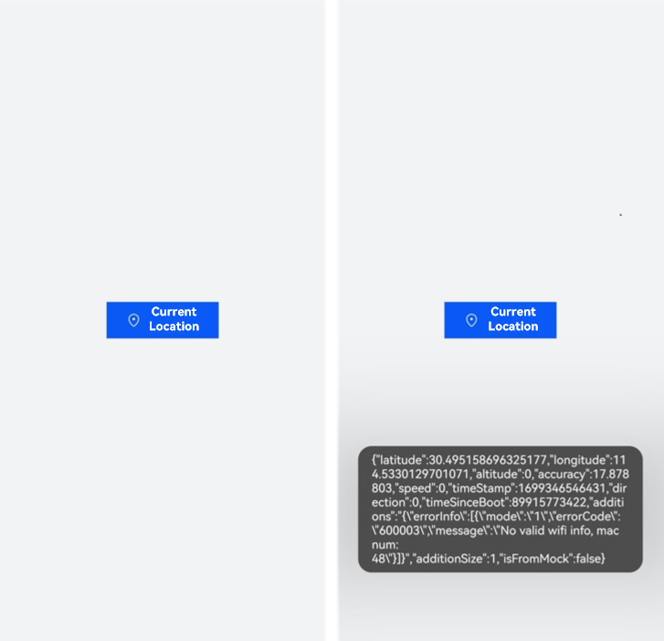

# Using LocationButton

The **LocationButton** component comes with an intuitive and easy-to-understand identifier to let the user clearly know that it is a button for obtaining location information. This meets the requirement that the authorization scenario should match the real user intent. The application can obtain temporary authorization to get location information and complete the service functionality only when the user taps this button after understanding the usage of this button.

Once the component integrated in an application is tapped, the application running in the foreground can obtain the precise location permission no matter whether the application has requested or been granted with this permission.

You can use the **LocationButton** component in applications that do not strongly depend on location (such as navigation and health applications) and applications that require location information only in certain foreground scenarios (such as locating city, clocking in/out, and sharing the location). If location information is required for a long period of time or in the background, you are advised to apply for the location permission for your application.

The following figure shows the effect of the **LocationButton** component.




## Constraints

- When a user clicks **LocationButton** in the application for the first time, a dialog box will be displayed to request user authorization. If the user clicks **Deny**, the dialog box will be closed and the application does not have the permission. When the user clicks **LocationButton** again, the user authorization dialog box will be displayed again. If the user clicks **Allow**, the dialog box will be closed and the application is granted the temporary location permission. After that, if the user clicks **LocationButton** again, no dialog box will be displayed.

- The temporary authorization of the precise location permission remains valid until the screen is turned off, the application is switched to the background, or the application exits. Then, the permission state transits to the state (authorized, unauthorized, or unrequested) that it was prior to the temporary authorization.

- During the authorization period, there is no limit on the number of API calls. 

- The **LocationButton** component must be visible and legible to users. You need to properly configure the component attributes such as the size and color to prevent authorization failures. If the authorization fails due to invalid component style, check the device error logs.


## How to Develop

If you need to share real-time location on a chat screen, the application only needs to access the location information for a short period of time in the foreground. In this case, you can use the **LocationButton** component, which eliminates the permission requesting process, complies with the principle of the least required permission, and elevates the user privacy experience.

The following example implements the following: After **Current Location** is tapped, the application obtains the precise location permission, and a dialog box is displayed to provide the specific location information. See the figure above.

1. Import the dependency service **geoLocationManager**.
   
   ```ts
   import { geoLocationManager } from '@kit.LocationKit';
   ```

2. Add the **LocationButton** component and obtain the current location information.
   
   **LocationButton** is a button-like component consisting of an icon, text, and background. Either the icon or text is mandatory, and the background is mandatory. The icon and text cannot be customized. You can only select from the existing options.

   When declaring the API for creating a security component, you can determine whether to pass in parameters. If parameters are passed in, the component is created based on the specified parameters. If no parameter is passed in, a component with default icon, text, and background is created.

   The following example uses default parameters. For details, see [LocationButton](../../reference/apis-arkui/arkui-ts/ts-security-components-locationbutton.md). In addition, all security components inherit the [Security Component Universal Attributes](../../reference/apis-arkui/arkui-ts/ts-securitycomponent-attributes.md), which can be used to customize styles.

   Use [geoLocationManager](../../reference/apis-location-kit/js-apis-geoLocationManager.md) in the **onClick()** callback of the **LocationButton** component to obtain the current location information.
   
   ```ts
   import { geoLocationManager } from '@kit.LocationKit';
   import { promptAction } from '@kit.ArkUI';
   import { BusinessError } from '@kit.BasicServicesKit';
   
   // Obtain the current location information.
   function getCurrentLocationInfo() {
     const requestInfo: geoLocationManager.LocationRequest = {
       'priority': geoLocationManager.LocationRequestPriority.FIRST_FIX,
       'scenario': geoLocationManager.LocationRequestScenario.UNSET,
       'timeInterval': 1,
       'distanceInterval': 0,
       'maxAccuracy': 0
     };
     try {
       geoLocationManager.getCurrentLocation(requestInfo)
         .then((location: geoLocationManager.Location) => {
           promptAction.showToast({ message: JSON.stringify(location) });
         })
         .catch((err: BusinessError) => {
           console.error(`Failed to get current location. Code is ${err.code}, message is ${err.message}`);
         });
     } catch (err) {
       console.error(`Failed to get current location. Code is ${err.code}, message is ${err.message}`);
     }
   }
   
   @Entry
   @Component
   struct Index {
     build() {
       Row() {
         Column({ space: 10 }) {
           LocationButton({
             icon: LocationIconStyle.LINES,
             text: LocationDescription.CURRENT_LOCATION,
             buttonType: ButtonType.Normal
           })
             .padding({top: 12, bottom: 12, left: 24, right: 24})
             .onClick((event: ClickEvent, result: LocationButtonOnClickResult) => {
               if (result === LocationButtonOnClickResult.SUCCESS) {
                 // Obtain temporary authorization to get the location information without requesting the location permission.
                 getCurrentLocationInfo();
               } else {
                 promptAction.showToast({message: 'Failed to obtain the location information.'})
               }
             })
         }
         .width('100%')
       }
       .height('100%')
       .backgroundColor(0xF1F3F5)
     }
   }
   ```
