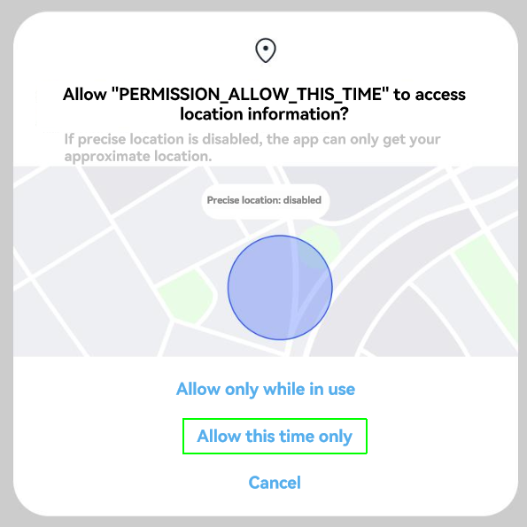
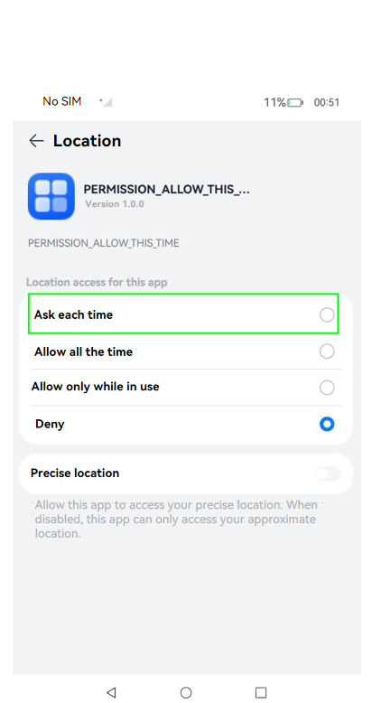
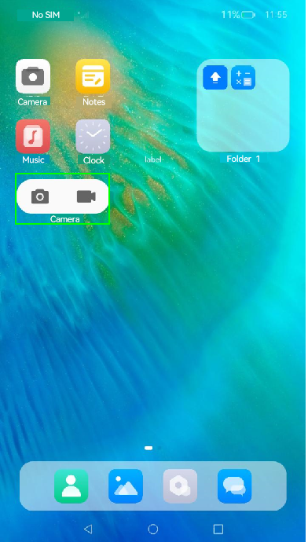

# Requesting One-Time User Authorization

To comply with the minimum authorization principle and protect user data against unauthorized access from applications and abuse, the **Allow this time only** option is added to the user authorization dialog box for certain sensitive permissions.

No additional configuration is required in application development. When **requestPermissionsFromUser()** is called to [request user authorization](request-user-authorization.md), the system displays a dialog box based on the [requested permissions](#supported-permissions).

The following figure shows an example of the user authorization dialog box.

The following figure shows the options in **Settings**.

Path: **Settings** > **Privacy** > **Permission manager** > **Apps** > *Target application* > **Location**

## Supported Permissions

Currently, the **Allow this time only** option is available only for the following permissions. When an application requests any of these permissions, the user authorization dialog box displayed contains the **Allow this time only** option, and permission settings dialog box contains the **Ask each time** option.

- <!--RP1-->[ohos.permission.READ_PASTEBOARD](permissions-for-system-apps.md#ohospermissionread_pasteboard)<!--RP1End-->
- [ohos.permission.APPROXIMATELY_LOCATION](./permissions-for-all.md#ohospermissionapproximately_location)
- [ohos.permission.LOCATION](./permissions-for-all.md#ohospermissionlocation)
- [ohos.permission.LOCATION_IN_BACKGROUND](./permissions-for-all.md#ohospermissionlocation_in_background)

## Constraints

- When the user selects **Allow this time only**, the permission is authorized to the application temporarily.

  - The authorized permission remains valid as long as the application is running in the foreground, the application widget is [visible on the home screen](../../form/arkts-ui-widget-lifecycle.md), or the application has a [continuous task](../../task-management/continuous-task.md#continuous-task) (currently, only the location task is supported) in the background.

     In other cases, the permission will be revoked after a 10-second timer has expired. If the application needs the permission again, you need to request the permission.

  - When an application with the temporary permission is switched to the background, a 10-second timer starts. During the 10 seconds, if the application widget is visible on the home screen or the application has a continuous task, the timer stops.
  
      When the application widget is invisible on the home screen or the continuous task is complete, the timer starts again. The temporary permission will be revoked when the timer has expired.

      As shown in the following figure, the camera widget is visible on the home screen.

      

- If the user selects **Ask each time** in the permission settings, the ohos.permission.LOCATION and ohos.permission.APPROXIMATELY_LOCATION permissions will be granted to the application temporarily. The permissions will be revoked in the same way as described above.
