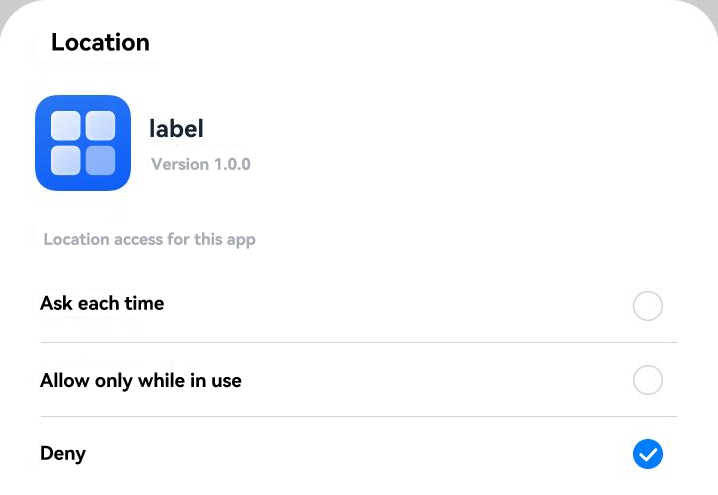

# Requesting User Authorization for the Second Time

If the user rejects to grant the permission when an application calls [requestPermissionsFromUser()](../../reference/apis-ability-kit/js-apis-abilityAccessCtrl.md#requestpermissionsfromuser9) to [request user authorization](request-user-authorization.md) in a dialog box, the application will no longer start the user authorization dialog box again by using **requestPermissionsFromUser()**. If the application still needs the permission, you can use either of the following methods:

- Allow the user to manually grant the permission using the system application **Settings** in the following path:
<!--RP1-->
**Privacy** > **Permission manager** > Permission type (such as **Location**) > *App*
<!--RP1End-->

- Start the permission settings dialog box by using [requestPermissionOnSetting()](../../reference/apis-ability-kit/js-apis-abilityAccessCtrl.md#requestpermissiononsetting12) and guide the user to grant the permission.

**Figure 1** Requesting user authorization for the second time

<!--RP2-->

<!--RP2End-->

The following code shows how to request the ohos.permission.APPROXIMATELY_LOCATION permission in this way.

```ts
import { abilityAccessCtrl, Context, common } from '@kit.AbilityKit';
import { BusinessError } from '@kit.BasicServicesKit';

let atManager: abilityAccessCtrl.AtManager = abilityAccessCtrl.createAtManager();
let context: Context = this.getUIContext().getHostContext() as common.UIAbilityContext;
atManager.requestPermissionOnSetting(context, ['ohos.permission.APPROXIMATELY_LOCATION']).then((data: Array<abilityAccessCtrl.GrantStatus>) => {
  console.info('data:' + JSON.stringify(data));
}).catch((err: BusinessError) => {
  console.error('data:' + JSON.stringify(err));
});
```
