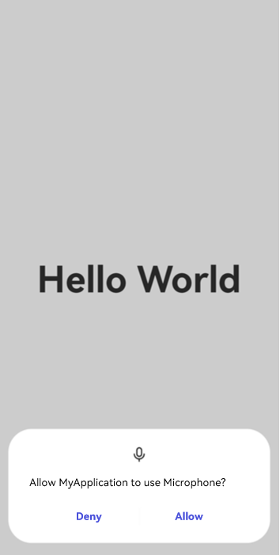

# Requesting User Authorization


Before an application accesses user privacy information or use a system capability, for example, to obtain location information, access the Calendar, or use the camera to take a photo or record a video, the application needs to request user authorization. The permissions that must be authorized by users are user_grant permissions.


The procedure for requesting user_grant permissions is as follows:


1. Declare the permissions required by your application in the configuration file. 

2. Associate each object that requires a user_grant permission with the related permission. This lets the user know what operations need user authorization.<br>
   For details about the preceding two steps, see [Declaring Permissions](declare-permissions.md).

3. Trigger user authorization via an API when the application in running needs to access the target object. The API first checks whether the user has granted the permission required. If no, a dialog box will be displayed to request authorization from the user.

4. Check the user authorization result, and allow the next step only after the user has granted the permission to the application.


This topic elaborates steps 3 and 4.


## Constraints

- A check for the required permission is mandatory each time before the operation that requires the permission is performed.
  
  To check whether the user has granted the permission to your application, use [checkAccessToken()](../../reference/apis/js-apis-abilityAccessCtrl.md#requestpermissionsfromuser9). This API returns [PERMISSION_GRANTED](../../reference/apis/js-apis-abilityAccessCtrl.md#grantstatus) or [PERMISSION_DENIED](../../reference/apis/js-apis-abilityAccessCtrl.md#grantstatus). For details, see the example given below.

- Each time before an API that requires a **user_grant** permission is called, use [requestPermissionsFromUser()](../../reference/apis/js-apis-abilityAccessCtrl.md#requestpermissionsfromuser9) to check whether the user has already granted the permission.

  After a permission is granted, the user may revoke the permission in **Settings**. Therefore, the previous authorization status cannot be persistent.

- For a user_grant permission, show a rationale to the user in a UI element, clearly explaining why your application needs the permission. Based on the rationale, the user then determines whether to grant the permission.


## How to Develop

The following example steps you through on how to request the permission for using the microphone.

**Figure** Requesting user authorization



1. Declare the ohos.permission.MICROPHONE permission in the configuration file. For details, see [Declaring Permissions](declare-permissions.md).

2. Check whether the user has granted the permission.
   
   Use [checkAccessToken()](../../reference/apis/js-apis-abilityAccessCtrl.md#checkaccesstoken9) to check whether the user has already granted the permission that your application requires. If yes, the application can use the microphone. Otherwise, user authorization is required.

   ```ts
   import bundleManager from '@ohos.bundle.bundleManager';
   import abilityAccessCtrl, { Permissions } from '@ohos.abilityAccessCtrl';
   import { BusinessError } from '@ohos.base';
   
   const permissions: Array<Permissions> = ['ohos.permission.MICROPHONE'];
   
   async function checkAccessToken(permission: Permissions): Promise<abilityAccessCtrl.GrantStatus> {
     let atManager: abilityAccessCtrl.AtManager = abilityAccessCtrl.createAtManager();
     let grantStatus: abilityAccessCtrl.GrantStatus = abilityAccessCtrl.GrantStatus.PERMISSION_DENIED;
   
     // Obtain the token ID of the application.
     let tokenId: number = 0;
     try {
       let bundleInfo: bundleManager.BundleInfo = await bundleManager.getBundleInfoForSelf(bundleManager.BundleFlag.GET_BUNDLE_INFO_WITH_APPLICATION);
       let appInfo: bundleManager.ApplicationInfo = bundleInfo.appInfo;
       tokenId = appInfo.accessTokenId;
     } catch (error) {
       const err: BusinessError = error as BusinessError;
       console.error(`Failed to get bundle info for self. Code is ${err.code}, message is ${err.message}`);
     }
   
     // Check whether the user has granted the permission.
     try {
       grantStatus = await atManager.checkAccessToken(tokenId, permission);
     } catch (error) {
       const err: BusinessError = error as BusinessError;
       console.error(`Failed to check access token. Code is ${err.code}, message is ${err.message}`);
     }
   
     return grantStatus;
   }
   
   async function checkPermissions(): Promise<void> {
     let grantStatus: abilityAccessCtrl.GrantStatus = await checkAccessToken(permissions[0]);
   
     if (grantStatus === abilityAccessCtrl.GrantStatus.PERMISSION_GRANTED) {
       // If the user has granted the permission, the application can use the microphone.
     } else {
       // Request the permission for using the microphone.
     }
   }
   ```

3. Request user authorization when your application needs to access the microphone.
   
   Use [requestPermissionsFromUser()](../../reference/apis/js-apis-abilityAccessCtrl.md#requestpermissionsfromuser9) to request user authorization. You can specify a list of permissions, such as the permission to access the location, Calendar, camera, or microphone, in the **Array<Permissions>** parameter of this API. The user can grant or deny the permissions.

   You can have [requestPermissionsFromUser()](../../reference/apis/js-apis-abilityAccessCtrl.md#requestpermissionsfromuser9) called in **onWindowStageCreate()** of the UIAbility to dynamically request user authorization, or request user authorization on the UI based on service requirements.

   - Sample code for requesting user authorization using UIAbility
     
      ```ts
      import UIAbility from '@ohos.app.ability.UIAbility';
      import window from '@ohos.window';
      import abilityAccessCtrl, { Permissions } from '@ohos.abilityAccessCtrl';
      import common from '@ohos.app.ability.common';
      import { BusinessError } from '@ohos.base';
      
      const permissions: Array<Permissions> = ['ohos.permission.MICROPHONE'];
      
      function reqPermissionsFromUser(permissions: Array<Permissions>, context: common.UIAbilityContext): void {
        let atManager: abilityAccessCtrl.AtManager = abilityAccessCtrl.createAtManager();
        // Determine whether to display a user authorization dialog box based on the return value of requestPermissionsFromUser.
        atManager.requestPermissionsFromUser(context, permissions).then((data) => {
          let grantStatus: Array<number> = data.authResults;
          let length: number = grantStatus.length;
          for (let i = 0; i < length; i++) {
            if (grantStatus[i] === 0) {
              // If the user grants the permission, the application can use the microphone.
            } else {
              // If the user denies the permission, display a message indicating that user authorization is required, and direct the user to set the permission in the Settings page.
              return;
            }
          }
          // The authorization is successful.
        }).catch((err: BusinessError) => {
          console.error(`Failed to request permissions from user. Code is ${err.code}, message is ${err.message}`);
        })
      }
      
      export default class EntryAbility extends UIAbility {
        onWindowStageCreate(windowStage: window.WindowStage): void {
          reqPermissionsFromUser(permissions, this.context);
          // ...
        }
      
        // ...
      }
      ```

   - Sample code for requesting user authorization on the UI

      ```ts
      import abilityAccessCtrl, { Permissions } from '@ohos.abilityAccessCtrl';
      import common from '@ohos.app.ability.common';
      import { BusinessError } from '@ohos.base';
      
      const permissions: Array<Permissions> = ['ohos.permission.MICROPHONE'];
      
      function reqPermissionsFromUser(permissions: Array<Permissions>, context: common.UIAbilityContext): void {
        let atManager: abilityAccessCtrl.AtManager = abilityAccessCtrl.createAtManager();
        // Determine whether to display a user authorization dialog box based on the return value of requestPermissionsFromUser.
        atManager.requestPermissionsFromUser(context, permissions).then((data) => {
          let grantStatus: Array<number> = data.authResults;
          let length: number = grantStatus.length;
          for (let i = 0; i < length; i++) {
            if (grantStatus[i] === 0) {
              // If the user grants the permission, the application can use the microphone.
            } else {
              // If the user denies the permission, display a message indicating that user authorization is required, and direct the user to set the permission in the Settings page.
              return;
            }
          }
          // The authorization is successful.
        }).catch((err: BusinessError) => {
          console.error(`Failed to request permissions from user. Code is ${err.code}, message is ${err.message}`);
        })
      }
      
      @Entry
      @Component
      struct Index {
        aboutToAppear() {
          const context: common.UIAbilityContext = getContext(this) as common.UIAbilityContext;
          reqPermissionsFromUser(permissions, context);
        }
      
        build() {
          // ...
        }
      }
      ```

4. Perform subsequent operations based on the authorization result.
   
   After [requestPermissionsFromUser()](../../reference/apis/js-apis-abilityAccessCtrl.md#requestpermissionsfromuser9) is called, the application waits for the user authorization result. If the user has granted the permission, the application can use the microphone. Otherwise, display a message indicating that user authorization is required, and direct the user to set the permission in the **Settings** page.

   ```ts
   import Want from '@ohos.app.ability.Want';
   import common from '@ohos.app.ability.common';
   import { BusinessError } from '@ohos.base';
   
   function openPermissionsInSystemSettings(context: common.UIAbilityContext): void {
     let wantInfo: Want = {
       action: 'action.settings.app.info',
       parameters: {
         settingsParamBundleName: 'com.example.myapplication' // Open the Details page of the application.
       }
     }
     context.startAbility(wantInfo).then(() => {
       // ...
     }).catch((err: BusinessError) => {
       // ...
     })
   }
   ```
