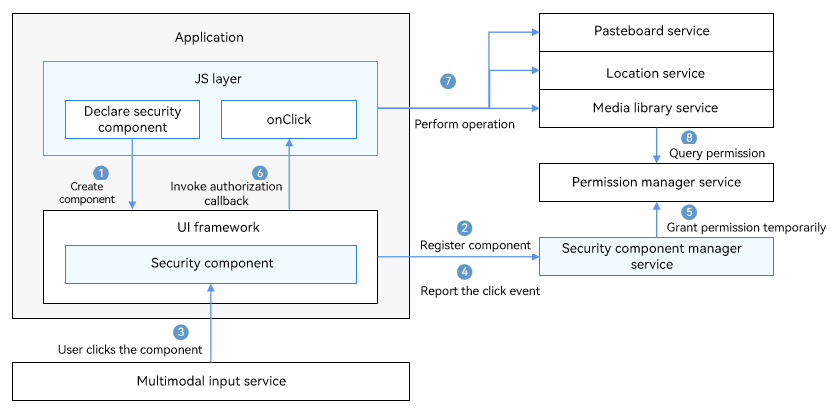

# Security Component Overview

Security components are a set of ArkUI components provided with certain permissions by the system. You can integrate the security components to your application UI. When the **SaveButton** component is used for the first time, a dialog box will be displayed, asking for user authorization. If the user grants the permission, no dialog box is required for subsequent use. When the **PasteButton** component is tapped, user authorization is automatically granted without any dialog box. The security components can be used as special buttons that help implement authorization upon a user tap.

Compared with dynamic permission requesting, security components allow scenario-based authorization and simplify development and user operations. The security components stand out with the following features:

- Minimizes the authorization by allowing the user to control when to grant the permission.

- Allows the authorization scenario to match the user's real intent.

- Reduces pop-up windows.

- Simplifies operations as you do not need to request permissions from AppGallery.

Security components collect only personal data necessary for implementing service functions and help develop transparent, optional, and controllable privacy compliance applications.

## Security Components

Currently, the following security components are available:

- [PasteButton](pastebutton.md)
  
  The **PasteButton** component comes with the pasteboard read privilege. After the component integrated into your application is tapped, no authorization dialog box will be displayed when your application reads data from the pasteboard.

  You can use this component for applications that need to read data from the pasteboard.

- [SaveButton](savebutton.md)
  
  The **SaveButton** component comes with the privilege for writing data to the media library. When it is tapped, the application can access the **mediaLibrary** APIs within 10 seconds.

  You can use the **SaveButton** component when your application needs to save image or videos to the media library. This component allows for simpler operations than Pickers, which have to start a system application and have the user select a directory for saving the image or video.

## Working Mechanism

The security component solution consists of the following:

- UI component: implements the style of fixed text and icons for users to identify and provides rich customization capabilities.

- Component manager service: provides the component registration management capability, temporary authorization mechanism, and authorization validity period management to ensure that security components cannot be registered or used when the screen is locked or the application runs in the background.

- Security hardening: provides <!--Del-->basic capabilities currently, and the system integrators need to implement <!--DelEnd-->security safeguarding capabilities, such as address randomization, challenge value check, callback UI framework component information review, caller address check, component anti-overwriting, and real click event verification, to prevent abuse of authorization mechanisms via obfuscation, hiding, tampering, and spoofing and protect user privacy.

The following figure illustrates the working mechanism.

1. After a security component is declared in .ets files, the JS engine parses the .ets files and creates the security component in the ArkUI framework.

2. The security component registers with the security component manager service, which checks the validity of the component information.

3. When a user taps the security component, a click event is distributed to the security component.

4. The security component reports the click event to the security component manager service.

5. The security component manager service calls the permission manager service to perform temporary authorization based on the component type.

6. After the authorization is successful, the security component calls **OnClick()** to notify the application layer of the authorization success.

7. The application calls the corresponding privileged operation, for example, reading pasteboard information and creating a file in the media library.
   The permission usage and authorization validity vary with the security component type. For details, see [Security Components](#security-components).

8. The corresponding service calls the permission manager service or security component manager service to obtain the authorization result and return the authentication result.

## Constraints

Due to the automatic authorization feature, many restrictions are imposed on security components to prevent user privacy from being obtained by malicious applications. The security components must be clearly visible on the application UI and can be clearly identified by users to prevent authorization failures.

If the authorization fails due to invalid component style, check the device error logs with the keyword "SecurityComponentCheckFail".

> **NOTE**
>
> Pay attention to logs of all levels related to the keyword.

Possible causes include but are not limited to the following:

- The font or icon size is too small.

- The overall size of the security component is too large.

- The color transparency of the font, icon, and background buttons is too high.

- The font or icon color is too close to the background button color.

- The security component cannot be displayed completely in a screen or window.

- The security component is blocked by another component or window.

- The parent component of the security component has attributes that may cause improper display of the security component, such as deformation and blurring.
