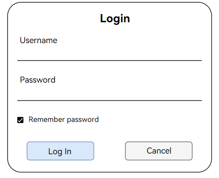
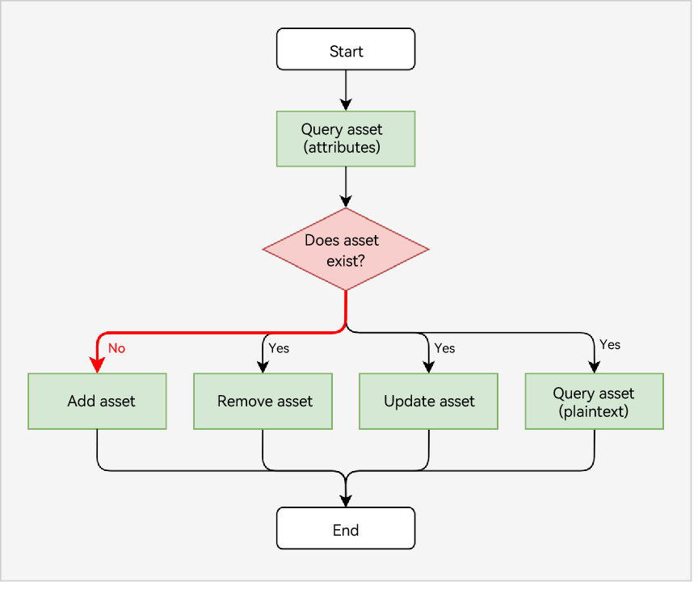

# Protecting Asset Data

> **NOTE**
>
> The asset data mentioned in this topic refers to sensitive data less than 1024 bytes in size, including passwords, app tokens, and other critical data (such as bank card numbers).

## When to Use

Asset store service (ASSET) is used in the logins of the users who select **Remember password** on the login page. The application/browser stores the user passwords in an asset store, which ensures the password security.

When a user opens the login page again, the application/browser obtains the user password from the asset store and automatically fills the password in the **Password** text box. The user only needs to tap the **Log In** button to complete the login.

## Development Process

The following figure illustrates the development process for the passwords (assets) protected.

1. The service queries an asset and determines whether the asset exists in the asset store based on the query result.

   For details about the development procedure, see [Querying Assets (ArkTS)](asset-js-query.md)/[Querying Assets (C/C++)](asset-native-query.md). For details about the sample code, see [Querying Attributes of an Asset (ArkTS)](asset-js-query.md#querying-attributes-of-an-asset)/[Querying Attributes of an Asset (C/C++)](asset-native-query.md#querying-attributes-of-an-asset).
2. If the asset does not exist, add an asset. For details, see [Adding an Asset (ArkTS)](asset-js-add.md)/[Adding an Asset (C/C++)](asset-native-add.md).
   
3. If the asset exists, the service can perform any of the following operations based on service requirements:
    * Remove the asset. For details, see [Removing Assets (ArkTS)](asset-js-remove.md)/[Removing Assets (C/C++)](asset-native-remove.md).
    * Update the asset. For details, see [Updating an Asset (ArkTS)](asset-js-update.md)/[Updating an Asset (C/C++)](asset-native-update.md).
    * Query the plaintext of the asset. For details, see [Querying Assets (ArkTS)](asset-js-query.md)/[Querying Assets (C/C++)](asset-native-query.md). For details about the sample code, see [Querying the Plaintext of an Asset (ArkTS)](asset-js-query.md#querying-the-plaintext-of-an-asset)/[Querying the Plaintext of an Asset (C/C++)](asset-native-query.md#querying-the-plaintext-of-an-asset).

