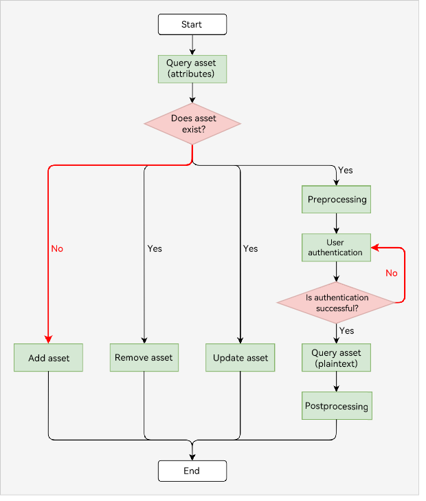

# Protecting Asset Data with User Authentication

> **NOTE**
>
> The asset data mentioned in this topic refers to sensitive data, including passwords, app tokens, and other critical data (such as bank card numbers).

## When to Use

Asset store service (ASSET) can be used in the scenario, in which users need to view their bank card numbers using a financial/banking application. To ensure security, you can store bank card numbers in an asset store and enforce a user identity authentication before the back card number is accessed.

When a user wants to view the bank card number, the application requests an identity authentication (for example, the user needs to enter a lock screen password or pass certain biometric authentication). When the identity authentication is successful, the application obtains the bank card number from ASSET and presents it to the user.

## Development Process

The following figure illustrates the development process.

> **NOTE**
>
> UserIAM provides only ArkTS APIs. Therefore, only ArkTS APIs can be used.

 

1. The service queries an asset and determines whether the asset exists in the asset store based on the query result.

   For details about the development procedure, see [Querying Assets](asset-js-query.md). For details about the sample code, see [Querying Attributes of an Asset](asset-js-query.md#querying-attributes-of-an-asset).
2. If the asset does not exist:
    * Add an asset. For details, see [Adding an Asset](asset-js-add.md).
3. If the asset exists, the service can perform any of the following operations based on service requirements:
    * Remove the asset. For details, see [Removing Assets](asset-js-remove.md).
    * Update the asset. For details, see [Updating an Asset](asset-js-update.md).
    * Query the plaintext of the asset. The query process involves preprocessing, user authentication, plaintext query, and postprocessing. For details, see [Querying an Asset with User Authentication](asset-js-query-auth.md).
