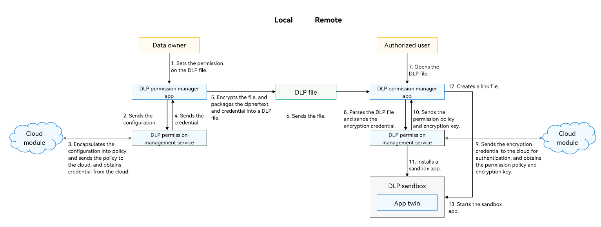

# About This Kit

<!--Kit: Data Protection Kit-->
<!--Subsystem: Security-->
<!--Owner: @winnieHuYu-->
<!--Designer: @QRF-->
<!--Tester: @nacyli-->
<!--Adviser: @zengyawen-->
<!-- md-trans-meta sourceCommit=ea89afb9ae1513bcb89f85eac0b35098803eb4b4 translatedAt=2026-08-11T01:56:44.928Z pushedAt=2026-08-11T02:39:32.051Z -->

Data Loss Prevention (DLP) is a system-level data leak prevention solution provided by the system. It offers capabilities such as file permission management, encrypted storage, and authorized access. Data owners can configure permissions for confidential files based on account authentication, with options including read-only, edit, and owner permissions. The confidential files are then stored in ciphertext. On devices that support the DLP mechanism, authentication and authorization can be performed through device-cloud synergy, allowing users to obtain the ability to access and modify the data.

DLP is a system solution. You can implement complete DLP capabilities with little or no adaptation.

The DLP solution consists of the following components:

- DLP permission management service

  Implements functionalities, such as creating a sandbox application and exchanging credentials.

- DLP permission manager application

  Implements functionalities of setting and verifying permissions and rejecting access requests locally. It implements the controlled share that can be perceived by users.

- Cloud module (implemented by developers)

  Sends DLP certificates to the cloud for account-based authentication, certificate generation, and decryption of DLP files.

## Working Principles

**Generating a DLP File**

1. The file owner adds the accounts that can access the confidential file and sets the permissions for the file through the DLP permission manager application.

2. The DLP permission manager application sends the user permission configuration to the DLP permission management service, which encapsulates the configuration into policy information.

3. The DLP permission management service sends the policy information to the cloud module. The cloud module sends the policy information for device-cloud synergy authentication, checks the policy, and generates and issues the credential.

4. The cloud module sends the credential to the DLP permission management service through the DLP permission manager application.

5. The DLP permission manager application encrypts the file and packages the credential and ciphertext into a DLP file.

**Sending a DLP File**

6. The DLP files can be sent to target users in any way. The ciphertext ensures file confidentiality.

**Opening a DLP File**

7. The authorized user opens the DLP file on the remote device (for example, using the file manager).

8. The DLP permission manager application parses the DLP file, obtains the encrypted credential, and sends it to the DLP permission management service.

9. The DLP permission management service sends the encrypted credential to the cloud module. The cloud module sends the credential to the cloud for identity authentication, credential verification, and policy parsing, and obtains the authorization policy and encryption key.

10. The cloud module sends the permission policy and encryption key to the DLP permission manager application through the DLP permission management service.

11. The DLP permission manager application calls the DLP permission management service to install a DLP sandbox clone of the application, and restricts the sandbox permissions based on the authorization policy, including but not limited to network, printing, and clipboard, to prevent data leakage.

12. The DLP permission manager application uses a link mechanism to map the plaintext and ciphertext. Based on the open-source Filesystem in Userspace (FUSE), the link mechanism creates a virtual link file (which is mapped to the DLP file) and shares the link file to the application. The application can access and edit the plaintext file, and the operations are synchronized to the DLP file in real time.

13. When the DLP permission manager application is ready, it starts the sandbox application and transfers the file descriptor to the link file. The sandbox application starts, and the application process opens the link file.

<!--RP1--><!--RP1End-->