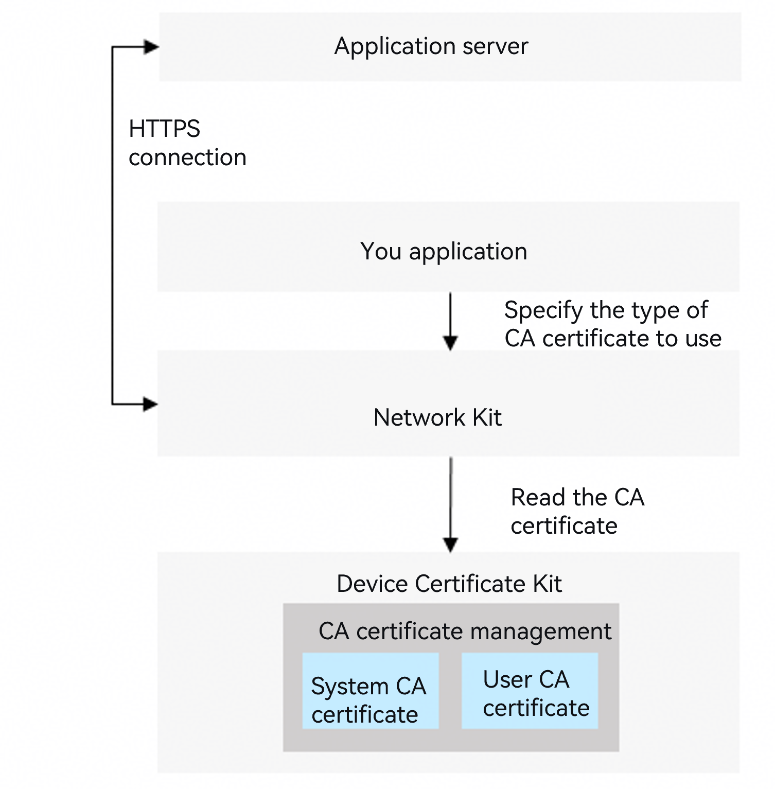
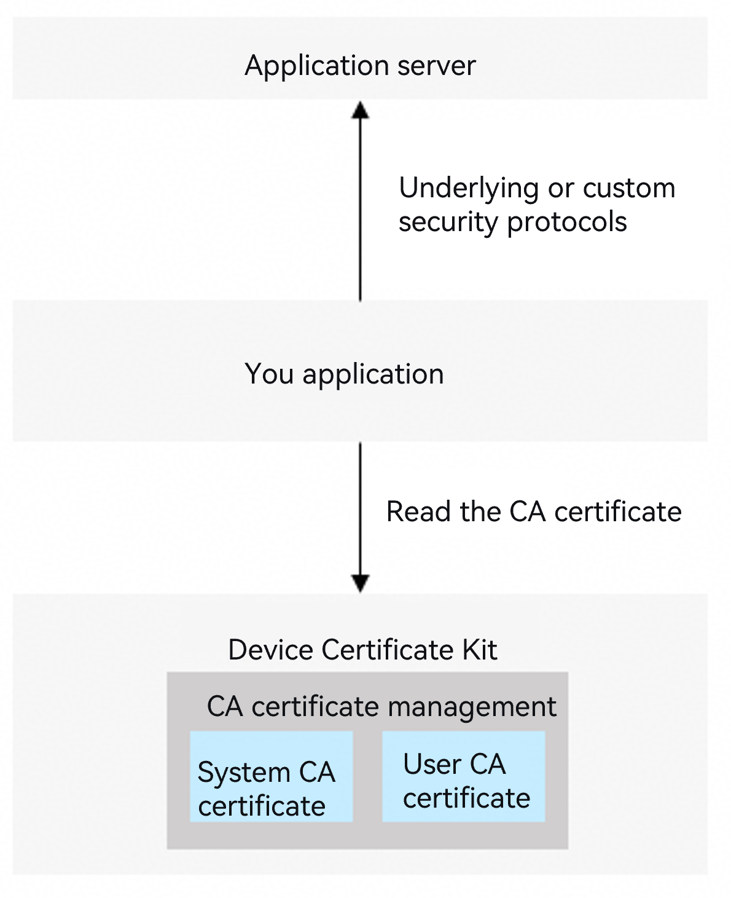

# CA Certificate Development

<!--Kit: Device Certificate Kit-->
<!--Subsystem: Security-->
<!--Owner: @chaceli-->
<!--Designer: @chande-->
<!--Tester: @zhangzhi1995-->
<!--Adviser: @zengyawen-->
<!-- md-trans-meta sourceCommit=307fcce12fe1b7eb2518beac6f019e5a4c47ab46 translatedAt=2026-08-11T01:58:28.014Z pushedAt=2026-08-11T07:54:04.877Z -->

When verifying the certificate credentials of other entities (devices or servers), your app needs to use CA certificates. For example, your app uses a pre-installed CA certificate to perform trusted verification on the HTTPS certificate chain of an app server. The certificate trust configuration varies depending on the communication implementation. The following describes two typical scenarios:

Scenario 1: HTTPS connection through the network communication service.

Your app can refer to [Network Kit Certificate Verification Configuration](../../network/http-request.md#configuring-certificate-verification) and use the system CA certificates and user CA certificates provided by Device Certificate Kit to verify the HTTPS certificate chain.



Scenario 2: Communication using a low-level or custom security protocol.

If your app needs to communicate with the app server using a low-level or custom security protocol, it may need to read system CA certificates and user CA certificates from Device Certificate Kit to verify the server's certificate chain.



The CA certificate management capabilities of Device Certificate Kit include the following:

- System CA certificate management: CA certificates pre-installed by the operating system, including those using SM algorithms and international algorithms (RSA and ECC).<!--RP1--><!--RP1End-->

  System CA certificates include commonly used commercial CA certificates in the industry, covering the certificate chain verification requirements of most internet applications and websites.

  Device users and apps can only read system CA certificates and cannot install or update them.

- User CA certificate management: CA certificates that belong to the device user, managed by the user or an MDM app. User CA certificates need to be installed only when the CA certificate that issued the app server certificate is not included in the system CA certificates. For example, certificates used by an enterprise's internal servers are issued by a self-built enterprise CA.

  User CA certificates are divided into two scopes:

  1. Current user-level CA certificates: Isolated between device users. Only the current logged-in user of the device can access and manage them. Device users can manage them through the system Settings app, and apps can call APIs to bring up the certificate manager dialog (supported only on PC/2-in-1 devices) to guide users in installing or uninstalling current user CA certificates.

  2. All user-level CA certificates: Readable by all users of the device. Currently, they can only be installed and managed by an MDM app on enterprise devices.

  | Scope of User CA Certificate | Scope Description | Certificate Management Method | Operations Allowed for Device User | Operations Allowed for the Application | Typical Scenario |
  |-----|-------------------|-------|-------------------------------|----|---|
  | Current User  |    Isolated between users   |   Managed by user    |Install/Uninstall/View| Read, bring up the install/uninstall dialog | Access an enterprise's internal server on a BYOD device. |
  | All Users  |    Shared by all users   |   Managed by MDM app |View| Read |Access an enterprise's internal server on an enterprise device. |

> **NOTE**
>
> This development guide applies to the SDK of API version 18 or later.
>
> Using and trusting current user-level CA certificates allows device users to perform man-in-the-middle attacks on your app's communication messages through network proxy tools, which may pose security risks to your app.<!--RP2--><!--RP2End-->

## Basic Concepts

- Commercial CA certificate: A commercial CA certificate issued and operated by a formal third-party commercial digital Certificate Authority (CA), with public authority and credibility.

- Self-built CA certificate: A CA certificate issued by a private digital Certificate Authority (CA) built and deployed by an enterprise or organization, typically used for enterprise/organization intranet services, test environments, and similar scenarios.

- MDM (Mobile Device Management) app: Also known as an enterprise device management app, it refers to an app integrated with MDM capabilities that can centrally manage, monitor, and protect mobile devices (such as smartphones, tablets, and laptops) within an enterprise. It allows IT administrators to remotely configure devices, enforce security policies, deploy applications, and ensure the security of enterprise data. For details, see [MDM Kit](../../mdm/mdm-kit-intro.md).

- Enterprise device: A device managed and controlled by an enterprise MDM app. Such devices are typically purchased by the enterprise and issued to employees for daily work.

- BYOD (Bring Your Own Device): Refers to the practice where some enterprises allow employees to bring their own tablets or smartphones to the workplace and use these devices to access the office environment. For example, scenarios where enterprise employees work in the office or external visitors bring devices to access factories, laboratories, and other facilities.

## How to Develop

1. Request and declare permissions.

   MDM apps calling the CA certificate installation and uninstallation APIs need to request the permission: ohos.permission.ACCESS_ENTERPRISE_USER_TRUSTED_CERT

   Calling other APIs requires the permission: ohos.permission.ACCESS_CERT_MANAGER

   For details about how to declare permissions, see [Declaring Permissions](../AccessToken/declare-permissions.md).

2. Import the required module.

   ```ts
   import { certificateManager, certificateManagerDialog } from '@kit.DeviceCertificateKit';
   import { util } from '@kit.ArkTS';
   import { common } from '@kit.AbilityKit';
   import { UIContext } from '@kit.ArkUI';
   ```

3. Install and uninstall user CA certificates.

   - Scenario 1: Install a user CA certificate on a BYOD device.

     An app can call the openInstallCertificateDialog API to bring up the dialog for installing a user CA certificate (with the certType parameter set to CA_CERT). The installation page requires authentication of the device user's identity. This API supports only installing current user-level CA certificates.

     > **NOTE**
     >
     > Installing and trusting a user CA certificate may allow an attacker who possesses the CA certificate to obtain sensitive information transmitted by the device user when visiting websites or using apps.
     >
     > The API for bringing up the user CA certificate installation dialog is currently supported only on PC/2in1 devices.

   - Scenario 2: An MDM app installs and uninstalls user CA certificates on an enterprise device.

     An MDM app can call the installUserTrustedCertificateSync API to install a user CA certificate. The API requires specifying the CA certificate file to be installed and returns the identifier (certUri) of the installed CA certificate.

     An MDM app can call the uninstallUserTrustedCertificateSync API to uninstall an installed user CA certificate by passing the installed CA certificate identifier certUri.

4. Read system CA certificates and user CA certificates.

   The Certificate Manager provides shared directories for apps to read system CA certificate and user CA certificate files. Your app can first obtain the storage directory of the corresponding CA certificates through the getCertificateStorePath API, and then read the CA certificate files (in PEM format) from the directory.

   System CA certificates are stored in two directories based on international and SM algorithm types. You can obtain the certificate storage directory for a specified algorithm through the property.certAlg parameter of the getCertificateStorePath API.

   User CA certificates are stored in different directories based on the current user level and all users level. You can obtain the certificate storage directory for a specified level through the property.certScope parameter of the getCertificateStorePath API.

## Code Example

<!-- @[certificate_management_user_ca](https://gitcode.com/openharmony/applications_app_samples/blob/master/code/DocsSample/Security/DeviceCertificateKit/CertificateManagement/entry/src/main/ets/samples/CertManagerUserCASample.ets)  -->

``` TypeScript
import { certificateManager, certificateManagerDialog } from '@kit.DeviceCertificateKit';
import { util } from '@kit.ArkTS';
import { common } from '@kit.AbilityKit';
import { UIContext } from '@kit.ArkUI';

async function userCASample(): Promise<void> {
  /* The installed user CA certificate data must be assigned by the service. */
  let userCAData: Uint8Array = new util.TextEncoder().encodeInto('-----BEGIN CERTIFICATE-----\n' +
    'MIIDSTCCAjECFFRZKkiBuiZ+zqfjJOg05yeTePM9MA0GCSqGSIb3DQEBCwUAMGEx\n' +
    'CzAJBgNVBAYTAmNuMQ0wCwYDVQQIDARvaG9zMQswCQYDVQQHDAJjbTEhMB8GA1UE\n' +
    'CgwYSW50ZXJuZXQgV2lkZ2l0cyBQdHkgTHRkMRMwEQYDVQQDDApUZXN0Um9vdENB\n' +
    'MB4XDTI1MTAxNTA3MzE0MloXDTI2MTAxNTA3MzE0MlowYTELMAkGA1UEBhMCY24x\n' +
    'DTALBgNVBAgMBG9ob3MxCzAJBgNVBAcMAmNtMSEwHwYDVQQKDBhJbnRlcm5ldCBX\n' +
    'aWRnaXRzIFB0eSBMdGQxEzARBgNVBAMMClRlc3RSb290Q0EwggEiMA0GCSqGSIb3\n' +
    'DQEBAQUAA4IBDwAwggEKAoIBAQC5p4eoQJyTBvn01M8SwEi8dguTIPGmD3a8SGIj\n' +
    'KXaB6ltv742H5EBjgk+zC8+Gis0ehEqwk3pVnnmByeYvrERxsUqDt69/FndlfTxI\n' +
    'C2/2MxWVk97g/6TpJ5Lt2mTrH+rSOgUDyU27aPn12ZnDF1mLsT+U+CBmfj4+J4tW\n' +
    'yzdFNj7kcKMQQok+L1dtFlDNMNpMA1UqADzoC3XgFl49CpDtoFId9DVsgUPkPfX1\n' +
    '89cCunomgJe1b17FzxfNu2yhbl5cnUEjeHGbmBgBIB7uG8tjGstnDPx7fl3Xrj+Q\n' +
    'fRrwCpVKD9RxoyUBFbHttixxY5bHFUdvHRB251sxD+JfxxxLAgMBAAEwDQYJKoZI\n' +
    'hvcNAQELBQADggEBAEGbNqcMU7C/lrIytI/OTtzYbkWDsfnRSPxlCUoZ2Xh3S83A\n' +
    'SNQ9Ze5tDwWdW9Hlde9May6hzvuQSYeMLLnyM8WGResXCs7UbnSQe7fGfUu+xDGb\n' +
    'h4tamnRFtZydxCCgDT9lIdHeutlPwOuxlR4HXpeowGeGJX0iFrdo6D0iXAY34hic\n' +
    'yLQzuBqE/1s3PLA83Fi4EOOOV7P/ahmOLtBFlHbySHV68i9PNeNr9SDykH9/RgI9\n' +
    '5G8ZTZj8oSmbTGGtfNuVXybMyJMRlz6BkxG++kYcg7STRBqHGX7RrWHiupguNreO\n' +
    '4sJBdSpWBq172ZEyOvTqC4xX9lLYqwwBQ++TFoo=\n' +
    '-----END CERTIFICATE-----');

  let certUri: string = '';

  /* Scenario 1: Install a user CA certificate on a BYOD device. */
  try {
    certUri = await installUserCACertDialog(userCAData);
  } catch (error) {
    console.error(`Failed to install user CA certificate.`);
  }
  /* Obtain the CA certificate. */
  getUserCaCertSample();
  /* Scenario 1: Uninstall a user CA certificate on a BYOD device. */
  uninstallUserCACertDialog(certUri);

  /* Scenario 2: An MDM app installs a user CA certificate on an enterprise device. */
  certUri = installUserCACertEnterprise(userCAData);
  /* Obtain the CA certificate. */
  getUserCaCertSample();
  /* Scenario 2: An MDM app uninstalls a user CA certificate on an enterprise device. */
  uninstallUserCACertEnterprise(certUri);
}

async function installUserCACertDialog(userCAData: Uint8Array): Promise<string> {
  return new Promise<string>((resolve, reject) => {
    /* Scenario 1: Install a user CA certificate on a BYOD device. */
    try {
      /* context is the app context information, which is obtained by the caller. It is provided here for reference only. */
      let context: common.Context = new UIContext().getHostContext() as common.Context;
      /* Install the user CA certificate. */
      certificateManagerDialog.openInstallCertificateDialog(
        context,
        certificateManagerDialog.CertificateType.CA_CERT,
        certificateManagerDialog.CertificateScope.CURRENT_USER,
        userCAData
      ).then((keyUri: string) => {
        console.info(`Installing user CA certificate successful, keyUri: ${keyUri}`);
        resolve(keyUri);
      }).catch((error: BusinessError) => {
        console.error(`Failed to install user CA certificate. Code: ${error.code}, message: ${error.message}`);
        reject(error);
      });
    } catch (error) {
      console.error(`Failed to install user CA certificate. Code: ${error.code}, message: ${error.message}`);
      reject(error);
    }
  })
}

function installUserCACertEnterprise(userCAData: Uint8Array): string {
  /* Scenario 2: An MDM app installs a user CA certificate on an enterprise device. */
  try {
    /* Install the user CA certificate for the current user. */
    let result = certificateManager.installUserTrustedCertificateSync(
      userCAData,
      certificateManager.CertScope.CURRENT_USER
    );
    let certUri = result.uri ?? '';
    console.info(`Sync install user CA certificate successful, certUri is ${certUri}`);
    return certUri
  } catch (err) {
    console.error(`Failed to sync install user CA certificate. Code: ${err.code}, message: ${err.message}`);
  }
  return '';
}

async function uninstallUserCACertDialog(certUri: string): Promise<void> {
  try {
    /* Scenario 1: Uninstall a user CA certificate on a BYOD device. */
    /* context is the app context information, which is obtained by the caller. It is provided here for reference only. */
    let context: common.Context = new UIContext().getHostContext() as common.Context;
    certificateManagerDialog.openUninstallCertificateDialog(
      context,
      certificateManagerDialog.CertificateType.CA_CERT,
      certUri
    ).then(() => {
      console.info(`Uninstall user ca certificate successful.`);
    }).catch((error: BusinessError) => {
      console.error(`Failed to uninstall user ca certificate. Code: ${error.code}, message: ${error.message}`);
    });
  } catch (err) {
    console.error(`Failed to uninstall user ca certificate. Code: ${err.code}, message: ${err.message}`);
  }
}

function getUserCaCertSample(): void {
  try {
    /* Obtain the storage location of the system CA. */
    let property1: certificateManager.CertStoreProperty = {
      certType: certificateManager.CertType.CA_CERT_SYSTEM,
    }
    /* You can read the CA certificate from the systemCAPath directory. */
    let systemCAPath = certificateManager.getCertificateStorePath(property1);
    console.info(`Success to get system ca path: ${systemCAPath}`);
   
    /* Obtain the storage location of the user CA for the current user. */
    let property2: certificateManager.CertStoreProperty = {
      certType: certificateManager.CertType.CA_CERT_USER,
      certScope: certificateManager.CertScope.CURRENT_USER,
    }
    /* You can read the CA certificate from the userCACurrentPath directory. */
    let userCACurrentPath = certificateManager.getCertificateStorePath(property2);
    console.info(`Success to get current user's user ca path: ${userCACurrentPath}`);
   
    /* Obtain the public storage location of the user CA on the device. */
    let property3: certificateManager.CertStoreProperty = {
      certType: certificateManager.CertType.CA_CERT_USER,
      certScope: certificateManager.CertScope.GLOBAL_USER,
    }
    /* You can read the CA certificate from the globalCACurrentPath directory. */
    let globalCACurrentPath = certificateManager.getCertificateStorePath(property3);
    console.info(`Success to get global user's user ca path: ${globalCACurrentPath}`);
  } catch (error) {
    console.error(`Failed to get store path. Code: ${error.code}, message: ${error.message}`);
  }
}
   
async function uninstallUserCACertEnterprise(certUri: string): Promise<void> {
  try {
    /* Scenario 2: An MDM app uninstalls a user CA certificate on an enterprise device. */
    certificateManager.uninstallUserTrustedCertificateSync(certUri);
    console.info(`Uninstall user ca certificate successful.`);
  } catch (err) {
    console.error(`Failed to uninstall user ca certificate. Code: ${err.code}, message: ${err.message}`);
  }
}
```