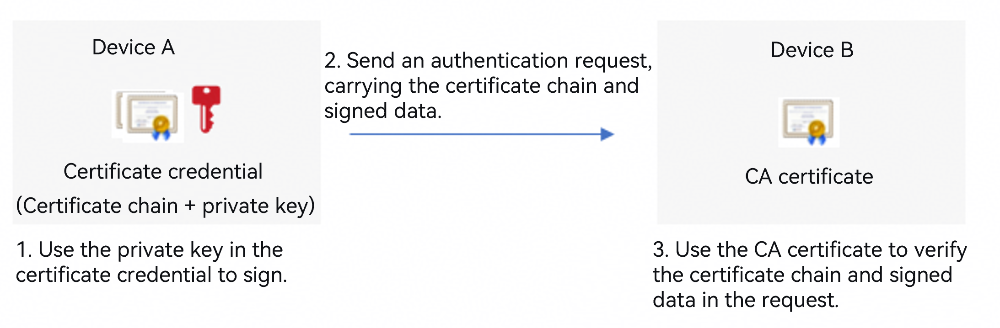
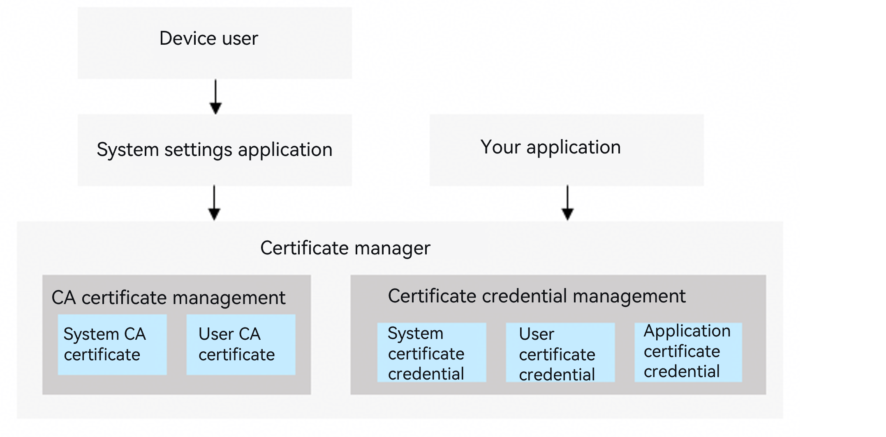

# Certificate Manager Overview

<!--Kit: Device Certificate Kit-->
<!--Subsystem: Security-->
<!--Owner: @chaceli-->
<!--Designer: @chande-->
<!--Tester: @zhangzhi1995-->
<!--Adviser: @zengyawen-->
<!-- md-trans-meta sourceCommit=1985ec3e5b58133a2cd1dfe00a69bfda6f9ebf20 translatedAt=2026-08-11T01:58:29.571Z pushedAt=2026-08-11T07:51:38.430Z -->

A device user may have certificate credentials that need to be stored securely for identity authentication and verification by other entities (devices, servers, or individuals). For example, an enterprise internal website issues certificate credentials to employees for identity authentication when they log in to the internal website.

The Certificate Manager APIs provide certificate credential management capabilities for users and your app. These capabilities enable encryption and secure storage of private data (the private key of the certificate) within certificate credentials.

In addition to storing certificate credentials, the Certificate Manager can also store CA certificates for verifying the certificate credentials of other entities (devices, servers, or individuals). For example, your app can use a pre-installed CA certificate to perform trust verification on the HTTPS certificate chain of an app server.

## Functional Architecture

The Certificate Manager provides management capabilities for the following certificate types:

- CA certificate:

  1. System CA certificate: A CA certificate pre-installed by the operating system.<!--RP1--><!--RP1End-->

  2. User CA certificate: A CA certificate that belongs to the device user, typically installed and managed by the device user. An application can bring up the certificate manager dialog via API, guiding the user to install or uninstall user CA certificates.

- Certificate credentials:

  1. System certificate credential: used for device identity authentication by a server when a system service (such as WLAN or VPN) connects to the server. It is typically installed and managed by the device user. An app can launch a dialog of the Certificate Manager through APIs to guide the user in installing system certificate credentials.

  2. User certificate credential: a certificate credential that belongs to the device user, installed and managed by the device user. An app can launch a dialog of the Certificate Manager through APIs to guide the user in installing user certificate credentials. Before using a user certificate credential, the app must call the Certificate Manager APIs to obtain user authorization.

  3. Application certificate credential: a certificate credential that belongs to an app, installed and managed by the app through the Certificate Manager APIs. The device user cannot view or manage application certificate credentials.

> **NOTE**
>
> The device user can go to the **Certificates &amp; Credentials** page in the Settings app to view and manage CA certificates and certificate credentials.

| Certificate Type | Certificate Ownership | Certificate Management Method | Actions Available to Device User | Actions Available to App | Typical Scenario |
|-----|-------------------|-------------------------------|--------|----|----------------|
| System CA certificate | Operating system | Pre-installed by the operating system | View | Read | Verify the certificate chain of a public website server. |
| User CA certificate | Device user | Managed by the user | Install/Uninstall/View | Read, launch the install/uninstall dialog | Verify the certificate chain of an enterprise internal server. |
| System certificate credential | Operating system | Managed by the user | Install/Uninstall/View | Launch the install dialog | Perform access authentication when the device connects to an enterprise internal WLAN/VPN service. |
| User certificate credential | Device user | Managed by the user | Install/Uninstall/Revoke authorization/View | Launch the install/authorization dialog Read and sign | Log in to an enterprise internal server through mutual HTTPS. |
| Application certificate credential | App | Managed by the app | NA | Read/Install/Uninstall/Sign | The app server authenticates the app identity. |

## Constraints

The Certificate Manager currently supports only certificates of the RSA, ECC, and SM2 algorithm types.

## Development

The Certificate Manager provides development guidance for the following functionalities. Refer to them during development.

- [CA Certificate Development](certManager-ca-certs-guidelines.md)

- [Application Certificate Credential Development](certManager-private-credential-guidelines.md)

- [User Certificate Credential Development](certManager-user-credential-guidelines.md)

- [System Certificate Credential Development](certManager-system-credential-guidelines.md)