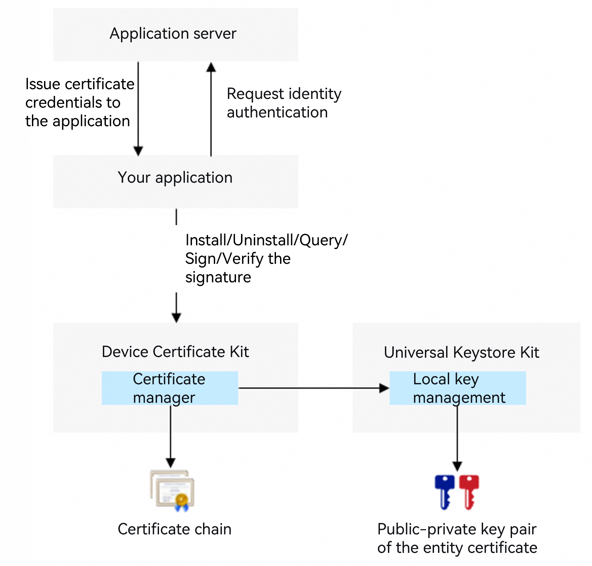

# Application Certificate Development

<!--Kit: Device Certificate Kit-->
<!--Subsystem: Security-->
<!--Owner: @chaceli-->
<!--Designer: @chande-->
<!--Tester: @zhangzhi1995-->
<!--Adviser: @zengyawen-->
<!-- md-trans-meta sourceCommit=9af33b6145f31b5067bdb178a2bf63f4a540b98f translatedAt=2026-08-11T01:58:31.323Z pushedAt=2026-08-11T07:52:31.127Z -->

If your app server needs to issue a certificate credential for your app and authenticate your app through the certificate credential when it accesses the server interface, you can use this feature to install and use the application certificate credential.

The application certificate credential feature provides secure storage and management of app-level certificate credentials (including the certificate chain and private key), and supports access isolation between apps.

You can read the certificate chain of an installed application certificate credential and use the corresponding private key for signing, but cannot read the private key data (to protect its security). The public-private key pair of the application certificate credential is stored in [Universal Keystore Kit](../UniversalKeystoreKit/huks-overview.md).



> **NOTE**
>
> API version 11 or later must be used for this development guide.
>
> To share access to the same certificate credential across different apps, use the [user certificate credential](./certManager-user-credential-guidelines.md) feature.

## Constraints

The installation, signing, and signature verification operations of application certificate credentials depend on the [key management service](../UniversalKeystoreKit/huks-overview.md) (HUKS).

## How to Develop

1. Request and declare permissions.

   Required permission: **ohos.permission.ACCESS_CERT_MANAGER**

   For details about how to declare permissions, see [Declaring Permissions](../AccessToken/declare-permissions.md).

2. Import the required modules.

   ```ts
   import { certificateManager } from '@kit.DeviceCertificateKit';
   import { BusinessError } from '@kit.BasicServicesKit';
   import { util } from '@kit.ArkTS';
   ```

3. Install an application certificate credential.

After receiving the certificate credential issued by the app server, your app typically packages it as a keystore file. You can call the **installPrivateCertificate** API to install the certificate credential into the certificate manager. The API returns a **KeyUri** for subsequent certificate credential query and signing operations.

The **installPrivateCertificate** API also requires a certificate credential alias to distinguish between different application certificate credentials. If your app installs an application certificate credential again with the same alias, the certificate manager will overwrite and update the installed application certificate credential data.

   > **NOTE**
   >
   > The application certificate credential feature currently supports only certificates and private keys of the RSA, ECC, and SM2 algorithm types.
   >
   > The **installPrivateCertificate** API currently supports only keystore files in P12 format.

4. Use an application certificate credential.

   When your app needs to use an application certificate credential for app identity authentication, you can provide authentication-related data through the following steps:

   - Read the certificate chain of the application certificate credential.

     Call the **getPrivateCertificate** API, passing in the **KeyUri** returned by the installation API, to obtain the certificate chain (a certificate file in PEM format) from the **CMResult.credential.credentialData** field in the response.

   - Use the private key of the application certificate credential to sign data.

     1. Call the **init** API to initialize a signing session, passing in the **KeyUri** returned by the installation API and the signing algorithm parameters (such as the padding mode and digest algorithm). The API returns a handle for the signing session.

     2. Call the **update** API, passing in the signing session handle and the data to be signed. If the data volume is large, you can call the **update** API multiple times, passing in partial data each time.

     3. Call the **finish** API to end the signing session and obtain the signature data.

   > **NOTE**
   >
   > For details about the parameter combinations supported by signing and signature verification operations, see the descriptions of RSA, ECC, and SM2 in [Signing/Signature Verification Overview and Algorithm Specifications](../UniversalKeystoreKit/huks-signing-signature-verification-overview.md) declared by HUKS.

5. Uninstall an installed application certificate credential.

When your app no longer needs to use an application certificate credential, you can call the **uninstallPrivateCertificate** API to uninstall it. For example, if your application certificate credential is bound to a logged-in user, uninstall the corresponding application certificate credential when the user logs out.

## Code Example

<!-- @[certificate_management_development_guidance](https://gitcode.com/openharmony/applications_app_samples/blob/master/code/DocsSample/Security/DeviceCertificateKit/CertificateManagement/entry/src/main/ets/samples/CertManagerPrivateCredSample.ets) -->

``` TypeScript
import { certificateManager } from '@kit.DeviceCertificateKit';
import { BusinessError } from '@kit.BasicServicesKit';
import { util } from '@kit.ArkTS';
   
async function privateCredSample() {
  /* The credential data to be installed must be assigned by the app. The data in this example is not actual credential data. */
  let keystoreBase64Str = 'MIIMJgIBAzCCC+AGCSqGSIb3DQEHAaCCC9EEggvNMIILyTCCBW4GCSqGSIb3DQEH' +
    // ...
    'G615kxCjeS6uixCHuij3pgQUhHiChcSeohRPrVkVPSPmYr9tjAYCAgQA';
  /* Convert the credential data to Uint8Array. The credential data is in DER format. */
  let keystore: Uint8Array = new util.Base64Helper().decodeSync(keystoreBase64Str);
   
  /* The password for installing the credential must be assigned by the app. */
  let keystorePwd: string = 'huawei';
  let appKeyUri: string = '';
  try {
    /* Install the application certificate credential. */
    const res: certificateManager.CMResult = await certificateManager.installPrivateCertificate(keystore, keystorePwd, 'testPriCredential');
    appKeyUri = (res.uri != undefined) ? res.uri : '';
    console.info(`InstallPrivateCertificate success appKeyUri: ${appKeyUri}`);
  } catch (err) {
    let e: BusinessError = err as BusinessError;
    console.error(`Failed to install private certificate. Code: ${e.code}, message: ${e.message}`);
  }
   
  try {
    /* Obtain the application certificate credential. */
    let res: certificateManager.CMResult = await certificateManager.getPrivateCertificate(appKeyUri);
    if (res === undefined || res.credential == undefined) {
      console.error('The result of getting private certificate is undefined.');
    } else {
      let credential = res.credential;
      console.info('Succeeded in getting private certificate.');
    }
  } catch (err) {
    console.error(`Failed to get private certificate. Code: ${err.code}, message: ${err.message}`);
  }
   
  try {
    /* srcData is the data to be signed or verified. The app assigns it as needed. */
    let srcData: Uint8Array = new Uint8Array([
      0x86, 0xf7, 0x0d, 0x01, 0x07, 0x01,
    ]);
   
    /* Construct the property parameters for signing. */
    const signSpec: certificateManager.CMSignatureSpec = {
      purpose: certificateManager.CmKeyPurpose.CM_KEY_PURPOSE_SIGN,
      padding: certificateManager.CmKeyPadding.CM_PADDING_PSS,
      digest: certificateManager.CmKeyDigest.CM_DIGEST_SHA256
    };
   
    /* Sign. */
    const signHandle: certificateManager.CMHandle = await certificateManager.init(appKeyUri, signSpec);
    await certificateManager.update(signHandle.handle, srcData);
    const signResult: certificateManager.CMResult = await certificateManager.finish(signHandle.handle);
   
    /* Construct the property parameters for signature verification. */
    const verifySpec: certificateManager.CMSignatureSpec = {
      purpose: certificateManager.CmKeyPurpose.CM_KEY_PURPOSE_VERIFY,
      padding: certificateManager.CmKeyPadding.CM_PADDING_PSS,
      digest: certificateManager.CmKeyDigest.CM_DIGEST_SHA256
    };
   
    /* Verify the signature. */
    const verifyHandle: certificateManager.CMHandle = await certificateManager.init(appKeyUri, verifySpec);
    await certificateManager.update(verifyHandle.handle, srcData);
    const verifyResult = await certificateManager.finish(verifyHandle.handle, signResult.outData);
    console.info('Succeeded in signing and verifying.');
  } catch (err) {
    let e: BusinessError = err as BusinessError;
    console.error(`Failed to sign or verify. Code: ${e.code}, message: ${e.message}`);
  }
   
  try {
    /* Delete the application certificate credential. */
    await certificateManager.uninstallPrivateCertificate(appKeyUri);
  } catch (err) {
    let e: BusinessError = err as BusinessError;
    console.error(`Failed to uninstall private certificate. Code: ${e.code}, message: ${e.message}`);
  }
}
```