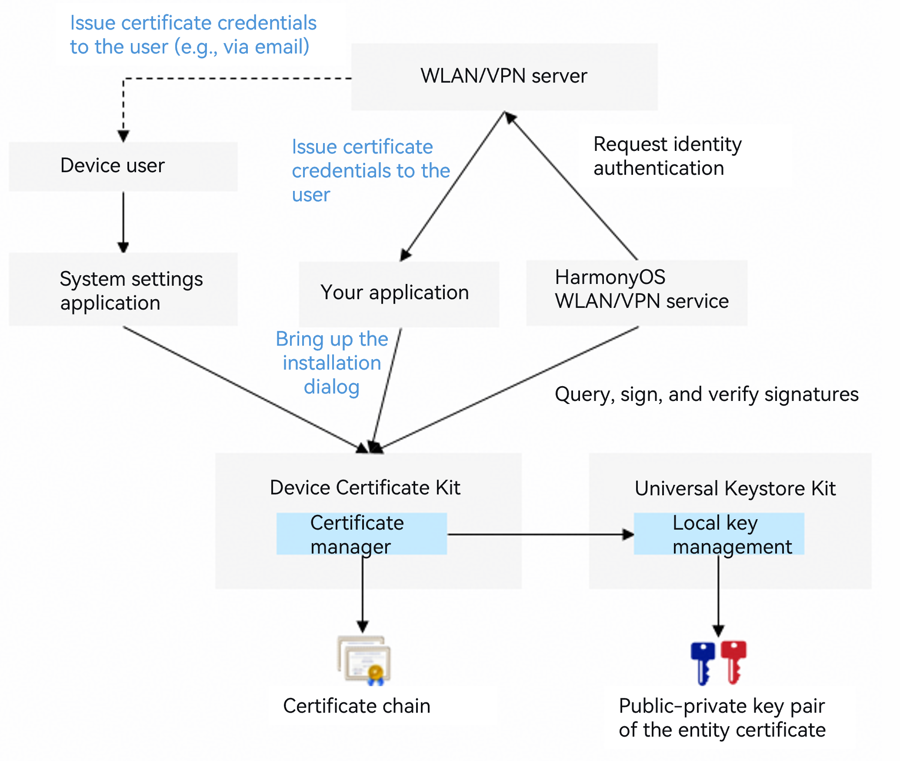

# System Certificate Credential Development

<!--Kit: Device Certificate Kit-->
<!--Subsystem: Security-->
<!--Owner: @chaceli-->
<!--Designer: @chande-->
<!--Tester: @zhangzhi1995-->
<!--Adviser: @zengyawen-->
<!-- md-trans-meta sourceCommit=9af33b6145f31b5067bdb178a2bf63f4a540b98f translatedAt=2026-08-11T01:57:55.594Z pushedAt=2026-08-11T07:53:16.427Z -->

A system certificate credential is used for device identity authentication when a system service (such as WLAN or VPN) connects to a server. The system certificate credential feature provides system-level secure storage and signing capabilities for certificate credentials (including certificate chains and private keys). The public-private key pair of a system certificate credential is stored in [Universal Keystore Kit](../UniversalKeystoreKit/huks-overview.md).



A system certificate credential can be installed and managed by the device user, or installed by an app that calls an API to bring up the certificate manager dialog and guide the user through the installation.

> **NOTE**
>
> This development guide applies to SDK version 23 or later.
>
> A system certificate credential can only be read and used by system services.
>
> After a system certificate credential is installed, the user must configure it in the system Settings app before system services such as WLAN and VPN can use it.

## Constraints

The installation, signing, and signature verification of system certificate credentials depend on the [Key Management Service](../UniversalKeystoreKit/huks-overview.md) (HUKS) capabilities.

## How to Develop

1. Apply for and declare the permissions.

   Permission required: ohos.permission.ACCESS_CERT_MANAGER

   For details about declaring permissions, see [Declaring Permissions](../AccessToken/declare-permissions.md).

2. Import the related modules.

   ```ts
   import { certificateManagerDialog } from '@kit.DeviceCertificateKit';
   import { BusinessError } from '@kit.BasicServicesKit';
   import { common } from '@kit.AbilityKit';
   import { UIContext } from '@kit.ArkUI';
   import { util } from '@kit.ArkTS';
   ```

3. Install the system certificate credential.

   Call the `openInstallCertificateDialog` API to bring up the system certificate credential installation dialog (with the `certType` parameter set to `CREDENTIAL_SYSTEM`). On the installation page, you need to enter the correct keystore file password.

   > **NOTE**
   >
   > The system certificate credential feature currently supports only certificates and private keys of RSA, ECC, and SM2 algorithm types.
   >
   > The `openInstallCertificateDialog` API currently supports only P12-format keystore files.

## Code Example

<!-- @[certificate_management_system_cred_guidance](https://gitcode.com/openharmony/applications_app_samples/blob/master/code/DocsSample/Security/DeviceCertificateKit/CertificateManagement/entry/src/main/ets/samples/CertManagerSystemCredSample.ets) -->

``` TypeScript
import { certificateManagerDialog } from '@kit.DeviceCertificateKit';
import { BusinessError } from '@kit.BasicServicesKit';
import { common } from '@kit.AbilityKit';
import { UIContext } from '@kit.ArkUI';
import { util } from '@kit.ArkTS';

function systemCredSample(): void {
  /* context is the context information of the application. The caller obtains it on their own. This is only an example.*/
  let context: common.Context = new UIContext().getHostContext() as common.Context;

  /* The credential data to be installed must be assigned by the service. The data in this example is not real credential data.*/
  let keystoreBase64Str = 'MIIMJgIBAzCCC+AGCSqGSIb3DQEHAaCCC9EEggvNMIILyTCCBW4GCSqGSIb3DQEH' +
    // ...
    'G615kxCjeS6uixCHuij3pgQUhHiChcSeohRPrVkVPSPmYr9tjAYCAgQA';
  /* Convert the credential data to Uint8Array. The credential data is in DER format.*/
  let keystore: Uint8Array = new util.Base64Helper().decodeSync(keystoreBase64Str);

  try {
    /* Install the system certificate credential.*/
    certificateManagerDialog.openInstallCertificateDialog(
      context,
      certificateManagerDialog.CertificateType.CREDENTIAL_SYSTEM,
      certificateManagerDialog.CertificateScope.CURRENT_USER,
      keystore
    ).then((keyUri: string) => {
      console.info(`Install system credential success, keyUri: ${keyUri}`);
    }).catch((error: BusinessError) => {
      console.error(`Failed to install system credential. Code: ${error.code}, message: ${error.message}`);
    });
  } catch (error) {
    console.error(`Failed to install system credential. Code: ${error.code}, message: ${error.message}`);
  }
  return;
}
```