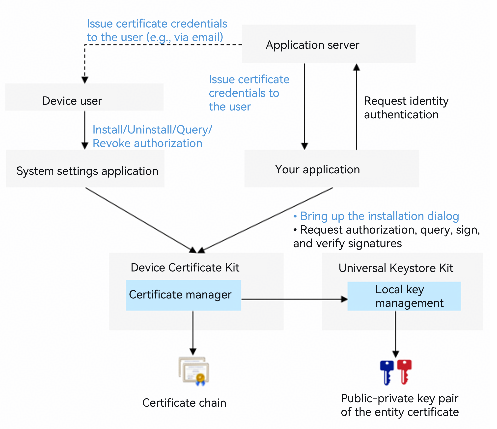

# User Certificate Credential Development Guide

<!--Kit: Device Certificate Kit-->
<!--Subsystem: Security-->
<!--Owner: @chaceli-->
<!--Designer: @chande-->
<!--Tester: @zhangzhi1995-->
<!--Adviser: @zengyawen-->
<!-- md-trans-meta sourceCommit=9af33b6145f31b5067bdb178a2bf63f4a540b98f translatedAt=2026-08-11T01:58:55.775Z pushedAt=2026-08-11T07:53:32.611Z -->

When your app accesses an app server that requires user authentication using the device user's certificate credentials, you can use this feature to install and use user certificate credentials. For example, your app can log in to an enterprise internal app server through mutual TLS.

The user certificate credential feature provides secure storage, authorization management, and signature capabilities for user-level certificate credentials (including the certificate chain and private key). The public-private key pair of a user certificate credential is stored in [Universal Keystore Kit](../UniversalKeystoreKit/huks-overview.md).



User certificate credentials belong to the device user. They can be installed and managed by the device user through the system Settings app. Apps can also invoke the certificate manager dialog box through APIs to guide the user through the installation process.

Before using a user certificate credential, an app must call the Certificate Manager service API to obtain user authorization.

After obtaining user authorization, the app can read the certificate chain of the corresponding user certificate credential and use the corresponding private key for signing, but cannot read the private key data (to protect the security of the private key data).

> **NOTE**
>
> This development guide requires an SDK of API version 23 or later.
>
> After user authorization, a user certificate credential can be accessed and used by other apps. If you do not want the certificate credential installed by your app to be accessed by other apps, use the [app certificate credential](./certManager-private-credential-guidelines.md) feature.

## Constraints

The installation, signing, and signature verification of user certificate credentials depend on the [Key Management Service](../UniversalKeystoreKit/huks-overview.md) (HUKS) capabilities.

## How to Develop

1. Apply for and declare permissions.

   Required permission: ohos.permission.ACCESS_CERT_MANAGER

   For details about declaring permissions, see [Declaring Permissions](../AccessToken/declare-permissions.md)

2. Import the required modules.

   ```ts
   import { certificateManager } from '@kit.DeviceCertificateKit';
   import { certificateManagerDialog } from '@kit.DeviceCertificateKit';
   import { BusinessError } from '@kit.BasicServicesKit';
   import { common } from '@kit.AbilityKit';
   import { UIContext } from '@kit.ArkUI';
   import { JSON, util } from '@kit.ArkTS';
   ```

3. Install the user certificate credential.

   Call the **openInstallCertificateDialog** API to bring up the user certificate credential installation dialog (with the **certType** parameter set to **CREDENTIAL_USER**). On the installation page, the user needs to enter the correct keystore file password.

   > **NOTE**
   >
   > The user certificate credential feature currently supports only certificates and private keys of RSA, ECC, and SM2 algorithm types.
   >
   > The openInstallCertificateDialog API currently supports only P12-format keystore files.

4. Request user authorization to use a user certificate credential.

   Before your app uses a user certificate credential for the first time, call the openAuthorizeDialog API to obtain user authorization. This API brings up the user certificate credential authorization dialog, which displays a list of user certificate credentials installed on the device. The user can then select a credential and confirm the authorization.

   After authorization is successful, the openAuthorizeDialog API returns the identifier (KeyUri) of the authorized user certificate credential. Your app can use this KeyUri to access the authorized user certificate credential.

   > **NOTE**
   >
   > Your app only needs to request user authorization once. However, the user can revoke the authorization in the system Settings app. Therefore, before using a user certificate credential, you can call the isAuthorizedApp API to check whether the authorization for the specified user certificate credential is still valid.

5. Use the user certificate credential.

After obtaining user authorization, your app can read the certificate chain of the authorized user certificate credential and use the corresponding private key for signing.

- Read the certificate chain of the user certificate credential.

Call the `getPublicCertificate` API, passing in the `KeyUri` returned by the `openAuthorizeDialog` API, and obtain the certificate chain (a certificate file in PEM format) from the `CMResult.credential.credentialData` field in the response.

- Use the private key of the user certificate credential to sign data.

  1. Call the **init** API to initialize a signing session. Pass in the **KeyUri** returned by the installation API and the signature algorithm parameters (such as the padding mode and digest algorithm), and obtain the handle of the signing session.

  2. Call the **update** API, passing in the handle of the signing session and the data to be signed. If the data to be signed is large, you can call the **update** API multiple times, passing in a portion of the data each time.

  3. Call the **finish** API to end the signing session and obtain the signature data.

  > **NOTE**
  >
  > For details about the parameter combinations supported by signing and signature verification operations, see the descriptions of RSA, ECC, and SM2 in [Signing and Signature Verification Overview and Algorithm Specifications](../UniversalKeystoreKit/huks-signing-signature-verification-overview.md) declared by HUKS.

## Code Example

<!-- @[certificate_management_user_cred_guidance](https://gitcode.com/openharmony/applications_app_samples/blob/master/code/DocsSample/Security/DeviceCertificateKit/CertificateManagement/entry/src/main/ets/samples/CertManagerUserCredSample.ets) -->

``` TypeScript
import { certificateManager } from '@kit.DeviceCertificateKit';
import { certificateManagerDialog } from '@kit.DeviceCertificateKit';
import { BusinessError } from '@kit.BasicServicesKit';
import { common } from '@kit.AbilityKit';
import { UIContext } from '@kit.ArkUI';
import { JSON, util } from '@kit.ArkTS';

function userCredSample(): void {
  /* context is the application context information. The caller obtains it on their own. This is only an example. */
  let context: common.Context = new UIContext().getHostContext() as common.Context;

  /* The credential data to be installed must be assigned by the service. The data in this example is not actual credential data. */
  let keystoreBase64Str = 'MIIMJgIBAzCCC+AGCSqGSIb3DQEHAaCCC9EEggvNMIILyTCCBW4GCSqGSIb3DQEH' +
    // ...
    'G615kxCjeS6uixCHuij3pgQUhHiChcSeohRPrVkVPSPmYr9tjAYCAgQA';
  /* Convert the credential data to Uint8Array. The credential data is in DER format. */
  let keystore: Uint8Array = new util.Base64Helper().decodeSync(keystoreBase64Str);

  try {
    /* Install the user certificate credential. */
    certificateManagerDialog.openInstallCertificateDialog(
      context,
      certificateManagerDialog.CertificateType.CREDENTIAL_USER,
      certificateManagerDialog.CertificateScope.CURRENT_USER,
      keystore
    ).then((keyUri: string) => {
      console.info(`Installing user credential successful, keyUri: ${keyUri}`);
      /* Request user authorization to use the user certificate credential. */
      requestUserCredAuth();
    }).catch((error: BusinessError) => {
      console.error(`Failed to install user credential. Code: ${error.code}, message: ${error.message}`);
    });
  } catch (error) {
    console.error(`Failed to install user credential. Code: ${error.code}, message: ${error.message}`);
  }
  return;
}

function requestUserCredAuth() {
  /* context is the application context, which is obtained by the caller. This is only an example. */
  let context: common.Context = new UIContext().getHostContext() as common.Context;
  try {
    certificateManagerDialog.openAuthorizeDialog(context, {
      certTypes: [certificateManagerDialog.CertificateType.CREDENTIAL_USER]
    }).then((authUri: certificateManagerDialog.CertReference) => {
      console.info(`Auth user credential successful. AuthUri: ${authUri.keyUri}`);
      /* Read the user certificate credential. */
      getUserCredInfo(authUri.keyUri);
      /* Use the user certificate credential for signature and verification. */
      signAndVerify(authUri.keyUri);
    }).catch((error: BusinessError) => {
      console.error(`Failed to auth user credential. Code: ${error.code}, message: ${error.message}`);
    });
  } catch (error) {
    console.error(`Failed to auth user credential. Code: ${error.code}, message: ${error.message}`);
  }
}

function getUserCredInfo(keyUri: string): void {
  try {
    certificateManager.getPublicCertificate(keyUri)
      .then((result: certificateManager.CMResult) => {
        console.info(`Get user credential info successful. Info: ${JSON.stringify(result.credential)}`);
      }).catch((error: BusinessError) => {
        console.error(`Failed to get user credential info. Code: ${error.code}, message: ${error.message}`);
      });
  } catch (error) {
    console.error(`Failed to get user credential info. Code: ${error.code}, message: ${error.message}`);
  }
}

async function signAndVerify(keyUri: string): Promise<void> {
  try {
    /* srcData is the data to be signed or verified, which is assigned by the service. */
    let srcData: Uint8Array = new Uint8Array([
      0x86, 0xf7, 0x0d, 0x01, 0x07, 0x01,
    ]);

    /*Construct the attribute parameters for signing.*/
    const signSpec: certificateManager.CMSignatureSpec = {
      purpose: certificateManager.CmKeyPurpose.CM_KEY_PURPOSE_SIGN,
      padding: certificateManager.CmKeyPadding.CM_PADDING_PSS,
      digest: certificateManager.CmKeyDigest.CM_DIGEST_SHA256
    };

    /*Sign.*/
    const signHandle: certificateManager.CMHandle = await certificateManager.init(keyUri, signSpec);
    await certificateManager.update(signHandle.handle, srcData);
    const signResult: certificateManager.CMResult = await certificateManager.finish(signHandle.handle);

    /*Construct the attribute parameters for signature verification.*/
    const verifySpec: certificateManager.CMSignatureSpec = {
      purpose: certificateManager.CmKeyPurpose.CM_KEY_PURPOSE_VERIFY,
      padding: certificateManager.CmKeyPadding.CM_PADDING_PSS,
      digest: certificateManager.CmKeyDigest.CM_DIGEST_SHA256
    };

    /*Verify the signature.*/
    const verifyHandle: certificateManager.CMHandle = await certificateManager.init(keyUri, verifySpec);
    await certificateManager.update(verifyHandle.handle, srcData);
    const verifyResult = await certificateManager.finish(verifyHandle.handle, signResult.outData);
    console.info('Succeeded in signing and verifying.');
  } catch (err) {
    let e: BusinessError = err as BusinessError;
    console.error(`Failed to sign or verify. Code: ${e.code}, message: ${e.message}`);
  }
}
```