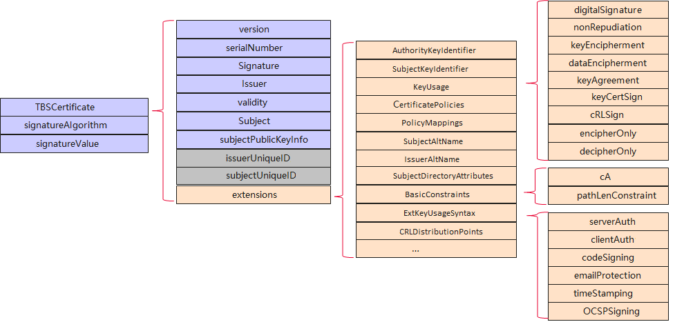
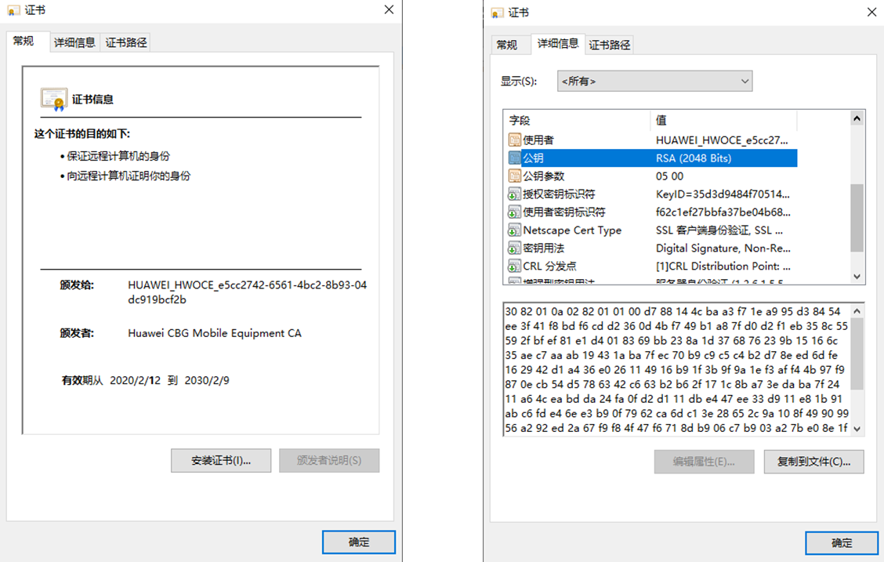
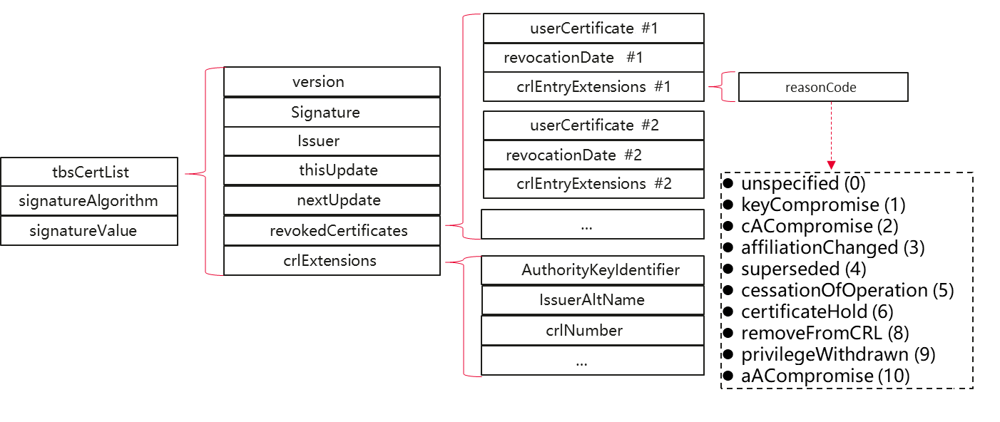

# Certificate Framework Overview

<!--Kit: Device Certificate Kit-->
<!--Subsystem: Security-->
<!--Owner: @zxz--3-->
<!--Designer: @lanming-->
<!--Tester: @PAFT-->
<!--Adviser: @zengyawen-->

The certificate framework shields the differences between third-party certificate algorithm libraries. It provides the capabilities of parsing and validating a certificate, certificate extensions, and a certificate revocation list (CRL), and validating a certificate chain.

You can use the APIs provided by the certificate framework to easily complete your development.

> **NOTE**
> The certificate framework provides the capabilities of processing certificates and CRL data, but does not provide the capabilities of generating or issuing certificates or CRLs. Certificates and CRLs are issued by a certificate authority (CA) rather than a single application.

## Basic Concepts

The certificate framework provides APIs for parsing, serializing, signing an X.509 certificate, verifying the signature of an X.509 certificate, and operating X.509 CRLs and the certificate chain validator.

Before you get started, familiarity with the basic certificate concepts is helpful, which include but are not limited to the following:

- Digital certificate - X.509 (also referred to as "X509" in this document) - Certificate chain - To Be Signed (TBS) - CRL

## Certificate Specifications

The following describes certificate specifications.

### Certificate Chain Validation

The certificate chain validator does not verify the certificate validity period because the device system time is always untrusted. To check the validity of a certificate, use [checkValidityWithDate()](../../reference/apis-device-certificate-kit/js-apis-cert.md#checkvaliditywithdate) of **X509Cert**.

### Certificate Format

Currently, only the certificates in DER and PEM formats are supported.

### X.509 Certificate Structure 

Certificate example:

### X.509 CRL Structure

CRL example:

## Constraints

The certificate framework depends on the basic algorithm capabilities of the Crypto Architecture Kit, which does not support multi-thread concurrent operations. For details, see [Constraints](../CryptoArchitectureKit/crypto-architecture-kit-intro.md#constraints).

## Development

You can use the certificate framework to implement the following functionalities. Before you start, be sure to familiarize yourself with [Certificate Specifications](#certificate-specifications).

- [Certificate Development](create-parse-verify-cert-object.md)
- [Certificate Extension Development](create-parse-verify-certextension-object.md)
- [CRL Development](create-parse-verify-crl-object.md)
- [Certificate Chain Validator Development](create-verify-cerchainvalidator-object.md)
- [Certificate and CRL Collection Development](create-get-cert-crl-object.md)
- [Certificate Chain Development](create-verify-certchain-object.md)
- [Creating a TrustAnchor Object Array from a p12 File](create-trustanchor-from-p12.md)

The following table lists the classes provided by the certificate framework. Based on the classes, you can learn the related APIs.

| Name| Class| Description|
| -------- | -------- | -------- |
| X.509 certificate| [X509Cert](../../reference/apis-device-certificate-kit/js-apis-cert.md#x509cert) | Parses and serializes X.509 certificates, verifies X.509 certificate signatures, and queries certificate information.|
| Certificate extension| [CertExtension](../../reference/apis-device-certificate-kit/js-apis-cert.md#certextension10) | Obtains the extended fields in the X.509 certificate, such as whether the CA is used and the CRL distribution point.|
| X.509 CRL| [X509CRL](../../reference/apis-device-certificate-kit/js-apis-cert.md#x509crl11) | Provides features such as X.509 certificate revocation list parsing, serialization, and information query.|
| Certificate chain validator| [CertChainValidator](../../reference/apis-device-certificate-kit/js-apis-cert.md#certchainvalidator) | Verifies the certificate chain (excluding the certificate validity period) and queries the certificate chain algorithm name.|
| Certificate and CRL collection| [CertCRLCollection](../../reference/apis-device-certificate-kit/js-apis-cert.md#certcrlcollection11) | Queries certificates and certificate revocation lists (CRLs).|
| X.509 certificate chain| [X509CertChain](../../reference/apis-device-certificate-kit/js-apis-cert.md#x509certchain11) | Verifies the certificate chain and obtains the certificate list.|
