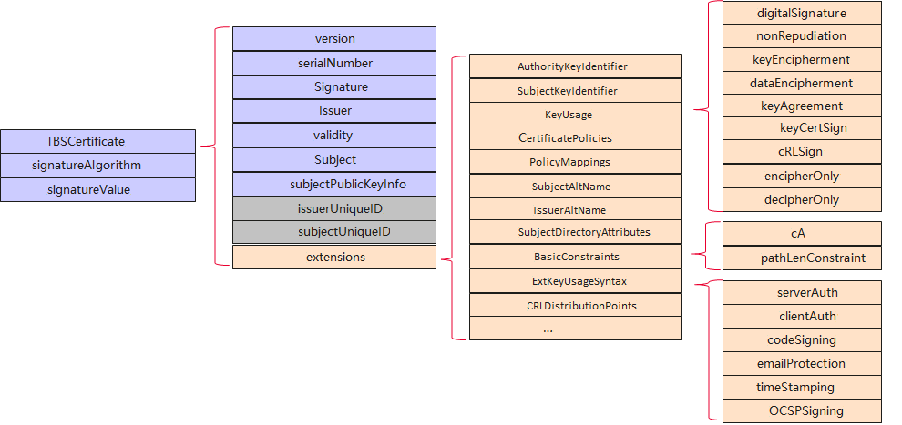
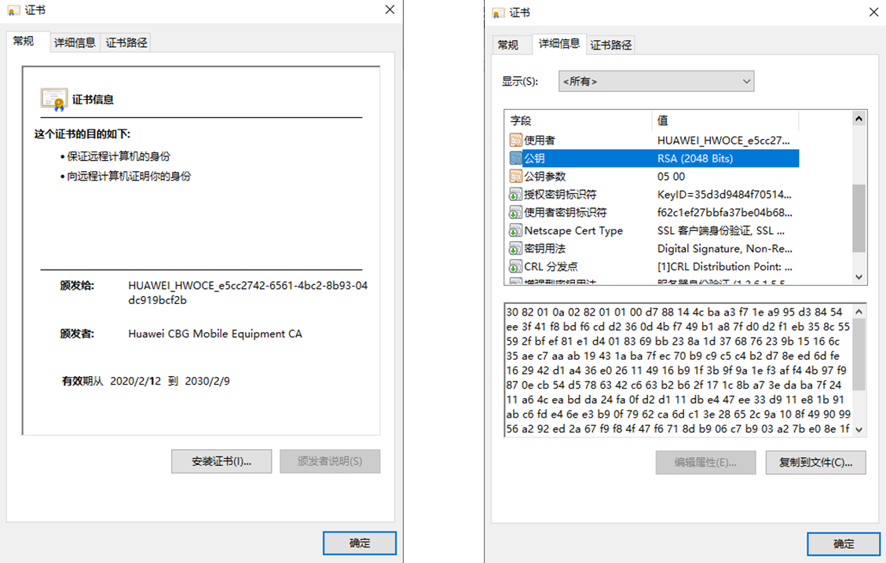
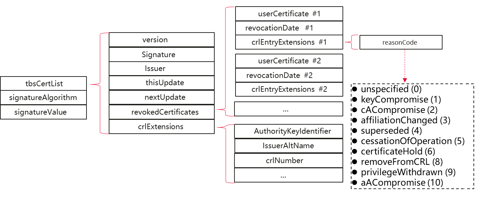
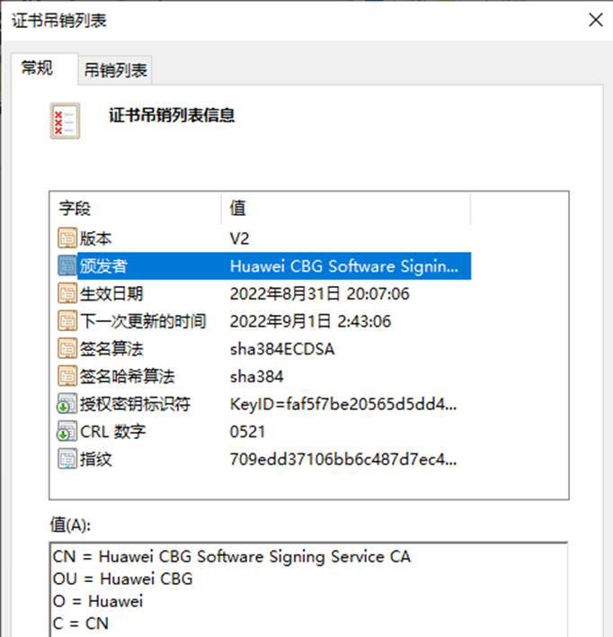

# Certificate Framework Overview

<!--Kit: Device Certificate Kit-->
<!--Subsystem: Security-->
<!--Owner: @zxz--3-->
<!--Designer: @lanming-->
<!--Tester: @PAFT-->
<!--Adviser: @zengyawen-->
<!-- md-trans-meta sourceCommit=c3c3aa3aaad4832d462b5cbd97f74e458e42b92c translatedAt=2026-08-11T01:58:02.480Z pushedAt=2026-08-11T02:53:35.210Z -->

The certificate framework shields the differences between third-party certificate algorithm libraries. It provides the capabilities of parsing and validating a certificate, certificate extensions, and a certificate revocation list (CRL), and validating a certificate chain.

You can use the APIs provided by the certificate framework to achieve rapid development.

> **NOTE**
> The certificate framework provides the capabilities of processing certificates and CRL data, but does not provide the capabilities of generating or issuing certificates or CRLs. Certificates and CRLs are issued by a certificate authority (CA) rather than a single application.

## Basic Concepts

Device Certificate Kit provides capabilities related to X.509 certificate parsing, serialization, X.509 certificate signature verification, X.509 Certificate Revocation List (CRL) handling, and certificate chain validation.

Before you get started, familiarity with the basic certificate concepts is helpful, which include but are not limited to the following:

Digital certificates, the X.509 digital certificate standard, certificate chains, TBS (To Be Signed, the data structure within an X.509 certificate that is signed, typically containing fields such as the version number, serial number, signature algorithm identifier, issuer, validity period, subject, subject public key information, and extensions), and CRL (Certificate Revocation List).

## Certificate Specifications

The following describes certificate specifications.

### Certificate Chain Validation

Because the device-side system time is not trusted, certificate chain validation does not include checking the certificate validity period. If you need to check the time validity of a certificate, use the [checkValidityWithDate()](../../reference/apis-device-certificate-kit/js-apis-cert.md#checkvaliditywithdate) method of the X.509 certificate.

### Certificate Format

Currently, only the certificates in DER and PEM formats are supported.

### X.509 Certificate Structure

Certificate example:

### X.509 CRL Structure

CRL example:

## Constraints

The certificate framework depends on the basic algorithm capabilities of the Crypto Architecture Kit, which does not support multi-thread concurrent operations. For details, see [Constraints](../CryptoArchitectureKit/crypto-architecture-kit-intro.md#constraints).

## Development

You can use the certificate framework to implement the following functionalities. Before you start, be sure to familiarize yourself with [Certificate Specifications](#certificate-specifications).

- [Certificate Development](create-parse-verify-cert-object.md)

- [Certificate Extension Development](create-parse-verify-certextension-object.md)

- [CRL Development](create-parse-verify-crl-object.md)

- [Certificate Chain Validator Development](create-verify-cerchainvalidator-object.md)

- [Certificate and CRL Collection Development](create-get-cert-crl-object.md)

- [Certificate Chain Development](create-verify-certchain-object.md)

- [Constructing a TrustAnchor Array from a PKCS #12 File for Certificate Chain Validation](create-trustanchor-from-p12.md)

- [Using the Prebuilt CA Certificate to Validate a Certificate Chain](verify-certchain-by-systemca.md)

- [Certificate Signing with CMS](create-cms-sign-object.md)

- [Certificate Encapsulation with CMS](create-cms-enveloped-object.md)

- [Certificate Signature Verification with CMS](create-cms-verify-object.md)

- [Certificate Decapsulation with CMS](create-cms-decapsulation-object.md)

- [Creating and Parsing a PKCS #12 Certificate](create-parse-pkcs12.md)

- [Online Validation of Certificate Revocation Status of a Certificate Chain](create-verify-cerchainvalidator-revocation-object.md)

- [Downloading the Missing Intermediate CA Certificate During Certificate Chain Validation](allow-download-Intermediate-Cert.md)

- [Building and Validating a Certificate Chain](build-and-verify-cert-chain.md)

The following table lists the classes provided by the certificate framework. Based on the classes, you can learn the related APIs.

| Name| Class| Description|
| -------- | -------- | -------- |
| X.509 Certificate | [X509Cert](../../reference/apis-device-certificate-kit/js-apis-cert.md#x509cert) | Provides capabilities such as X.509 certificate parsing, serialization, signature verification, and certificate information query. |
| Certificate Extension | [CertExtension](../../reference/apis-device-certificate-kit/js-apis-cert.md#certextension10) | Provides access to extension fields in X.509 certificates, such as whether it is a CA, CRL distribution points, and other fields. |
| X.509 Certificate Revocation List | [X509CRL](../../reference/apis-device-certificate-kit/js-apis-cert.md#x509crl11) | Provides capabilities such as X.509 CRL parsing, serialization, and information query. |
| Certificate chain validator| [CertChainValidator](../../reference/apis-device-certificate-kit/js-apis-cert.md#certchainvalidator) | Verifies the certificate chain (excluding the certificate validity period) and queries the certificate chain algorithm name.|
| Certificate and CRL collection| [CertCRLCollection](../../reference/apis-device-certificate-kit/js-apis-cert.md#certcrlcollection11) | Queries certificates and certificate revocation lists (CRLs).|
| X.509 Certificate Chain | [X509CertChain](../../reference/apis-device-certificate-kit/js-apis-cert.md#x509certchain11) | Provides certificate chain validation and certificate list retrieval capabilities. |