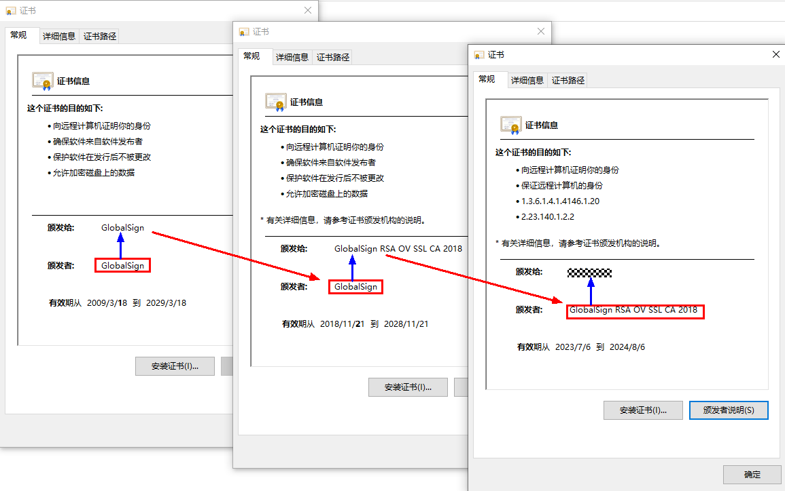

# Certificate Chain Validator Development


A certificate chain is an ordered list of certificates, in which each certificate is signed by the entity identified by the next certificate in the chain.


As shown in the following figure, the certificate chain consists three certificates. The root certificate is self-signed by GlobalSign, which signed the intermediary certificate held by GlobalSign RSA OV SSL CA 2018. GlobalSign RSA OV SSL CA 2018 (the holder of the intermediate certificate) signed the end certificate.





You can refer to the following example to construct a certificate chain from multiple certificates.


## How to Develop

1. Import the [certFramework](../../reference/apis-device-certificate-kit/js-apis-cert.md) module.
   ```ts
   import { cert } from '@kit.DeviceCertificateKit';
   ```

2. Use [cert.createCertChainValidator](../../reference/apis-device-certificate-kit/js-apis-cert.md#certcreatecertchainvalidator) to create a certificate chain validator (**CertChainValidator**) object.

3. Create a [CertChainData](../../reference/apis-device-certificate-kit/js-apis-cert.md#certchaindata) object.
   
   The certificate framework provides a **CertChainValidator** object to validate certificate chains. However, the **CertChainData** object to be validated must comply with the following struct definition.

   | Name| Type| Readable| Writable| Description| 
   | -------- | -------- | -------- | -------- | -------- |
   | data | Uint8Array | Yes| Yes| Certificate data, which is in the length (2 bytes)-data format. For example, **08ABCDEFGH07ABCDEFG**. The first two bytes (**08**) indicate the length of the first certificate, which is eight bytes, and the following eight bytes indicate the certificate data. The next two bytes (**07**) indicate the length of another certificate, which is seven bytes, and the seven bytes followed indicate the certificate data.| 
   | count | number | Yes| Yes| Number of certificates.| 
   | encodingFormat | [EncodingFormat](../../reference/apis-device-certificate-kit/js-apis-cert.md#encodingformat) | Yes| Yes| Certificate encoding format.| 

4. Use [CertChainValidator.validate](../../reference/apis-device-certificate-kit/js-apis-cert.md#validate) to validate the certificate chain data.

```ts
import { cert } from '@kit.DeviceCertificateKit';
import { util } from '@kit.ArkTS';

// CA data, which is only an example.
let caCertData = '-----BEGIN CERTIFICATE-----\n' +
  '...\n' +
  '...\n' +
  '...\n' +
  '-----END CERTIFICATE-----\n';

// Level-2 CA certificate data, which is only an example.
let secondCaCertData = '-----BEGIN CERTIFICATE-----\n' +
  '...\n' +
  '...\n' +
  '...\n' +
  '-----END CERTIFICATE-----\n';

// Certificate chain validator. In this example, it validates a two-level certificate chain.
function certChainValidatorSample(): void {
  let textEncoder = new util.TextEncoder();
  // Certificate chain validator algorithm. Currently, only PKIX is supported.
  let algorithm = 'PKIX';

  // Create a CertChainValidator object.
  let validator = cert.createCertChainValidator(algorithm);

  // CA certificate data.
  let uint8ArrayOfCaCertData = textEncoder.encodeInto(caCertData);

  // Length of the CA certificate data.
  let uint8ArrayOfCaCertDataLen = new Uint8Array(new Uint16Array([uint8ArrayOfCaCertData.byteLength]).buffer);

  // Data of the level-2 CA certificate.
  let uint8ArrayOf2ndCaCertData =  textEncoder.encodeInto(secondCaCertData);

  // Length of the level-2 CA certificate data.
  let uint8ArrayOf2ndCaCertDataLen = new Uint8Array(new Uint16Array([uint8ArrayOf2ndCaCertData.byteLength]).buffer);

  // Binary data of the certificate chain in L-V format: Length of the level-2 CA certificate data + Level-2 CA certificate data + Length of the CA certificate data + CA certificate data
  let encodingData = new Uint8Array(uint8ArrayOf2ndCaCertDataLen.length + uint8ArrayOf2ndCaCertData.length +
  uint8ArrayOfCaCertDataLen.length + uint8ArrayOfCaCertData.length);
  for (let i = 0; i < uint8ArrayOf2ndCaCertDataLen.length; i++) {
    encodingData[i] = uint8ArrayOf2ndCaCertDataLen[i];
  }
  for (let i = 0; i < uint8ArrayOf2ndCaCertData.length; i++) {
    encodingData[uint8ArrayOf2ndCaCertDataLen.length + i] = uint8ArrayOf2ndCaCertData[i];
  }
  for (let i = 0; i < uint8ArrayOfCaCertDataLen.length; i++) {
    encodingData[uint8ArrayOf2ndCaCertDataLen.length + uint8ArrayOf2ndCaCertData.length + i] = uint8ArrayOfCaCertDataLen[i];
  }
  for (let i = 0; i < uint8ArrayOfCaCertData.length; i++) {
    encodingData[uint8ArrayOf2ndCaCertDataLen.length + uint8ArrayOf2ndCaCertData.length +
    uint8ArrayOfCaCertDataLen.length + i] = uint8ArrayOfCaCertData[i];
  }

  let certChainData: cert.CertChainData = {
    // Uint8Array in L-V format (certificate data length-certificate data).
    data: encodingData,
    // Number of certificates. In this example, there are two certificates in the certification chain.
    count: 2,
    // Certificate format. Only PEM and DER are supported. In this example, the certificate is in PEM format.
    encodingFormat: cert.EncodingFormat.FORMAT_PEM
  };

  // Validate the certificate chain.
  validator.validate(certChainData, (err, data) => {
    if (err != null) {
      // Throw an error as required.
      console.error(`validate failed, errCode: ${err.code}, errMsg: ${err.message}`);
    } else {
      // Validation successful.
      console.log('validate success');
    }
  });
}
```
