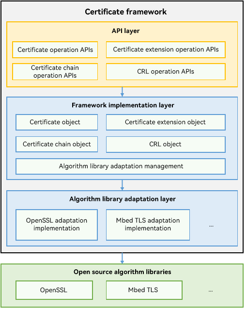

# Introduction to Device Certificate Kit

<!--Kit: Device Certificate Kit-->
<!--Subsystem: Security-->
<!--Owner: @zxz--3-->
<!--Designer: @lanming-->
<!--Tester: @PAFT-->
<!--Adviser: @zengyawen-->

Device Certificate Kit provides the [certificate framework](#certificate-framework) and [certificate management](#certificate-management) capabilities for developers.

## Certificate Framework

The certificate framework provides APIs for parsing and validating digital certificates.

You can use the APIs to parse and validate a certificate, certificate extensions, and a certificate revocation list (CRL), and validate a certificate chain.

The certificate framework module shields the differences between third-party algorithm libraries to make development a more enjoyable experience.

**Scenarios**

The application parses the received certificate or the certificate entered by the user, obtains the basic fields or extension fields of the certificate for display or verification, and uses the CA certificate chain and CRL to verify the certificate validity.

### Working Principles

The system provides the certificate framework, which shields the differences between third-party algorithm libraries. You only need to use the APIs provided by the certificate framework to implement operations on certificates.

### Related Kits

During the use of certificate framework functionalities, public keys need to be generated and obtained, which depends on [Crypto Architecture Kit](../CryptoArchitectureKit/crypto-architecture-kit-intro.md).

## Certificate Management

The **certManager** module provides system-level certificate management capabilities to ensure certificate security during transmission and storage and prevent unauthorized certificate access and use.

The following capabilities are provided:

1. Install, obtain, use, and delete application certificates.
2. Install, obtain, and uninstall user CA certificates.
3. Manage CA certificates on the certificate management page via the provided APIs.

You can use this module to manage and securely use certificates throughout their lifecycle (installation, storage, use, and destruction).

**Scenarios**

1. Application certificates: In the scenario of two-way network authentication, the service first installs the application certificates, uses them to sign the service data, then sends the signature together with the certificates to the peer, and finally deletes the certificates.
2. User CA certificates: In the scenario of network connection, the service installs the user CA certificates, uses them to verify the peer identity, and deletes them when the certificates expire or are revoked.
3. Certificate management dialog box: The service calls the provided dialog box API to directly start the certificate management UI, where you can view, install, and delete certificates and credentials.

### Related Kits

During the use of the certificate management functionalities, certificates need to be installed and used, which depends on [Universal Keystore Kit](../UniversalKeystoreKit/huks-overview.md).

## Constraints

Device Certificate Kit does not provide the capabilities of generating or issuing certificates and CRLs. Such capabilities are implemented by a certificate authority (CA) rather than a single application.
