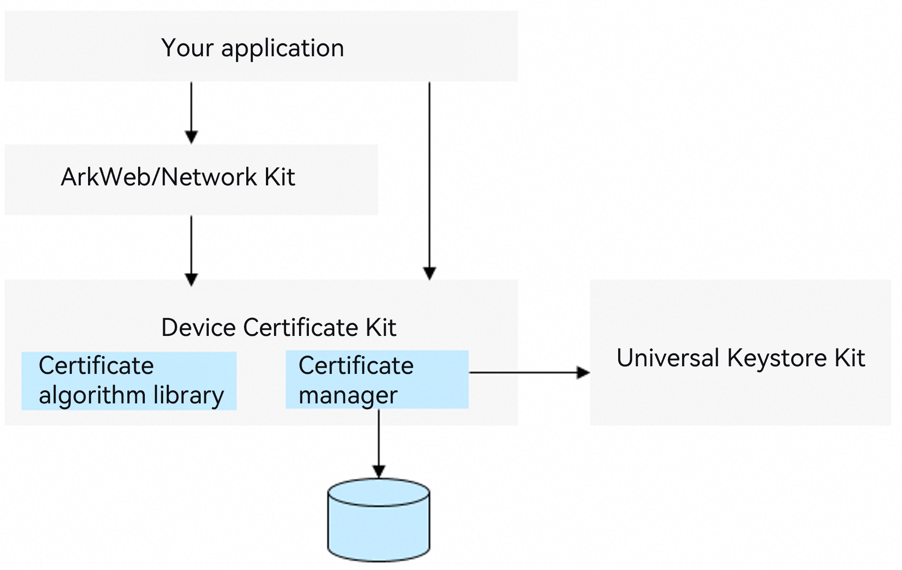

# About This Kit

<!--Kit: Device Certificate Kit-->
<!--Subsystem: Security-->
<!--Owner: @zxz--3-->
<!--Designer: @lanming-->
<!--Tester: @PAFT-->
<!--Adviser: @zengyawen-->
<!-- md-trans-meta sourceCommit=2f7da3fb5163a0f8b92171986b8396e3248a8f19 translatedAt=2026-08-11T02:02:13.526Z pushedAt=2026-08-11T07:55:56.112Z -->

Device Certificate Kit is used to manage and validate digital certificates for apps. Overall, Device Certificate Kit provides the following two features:

1. [Certificate algorithm library](./certificate-framework-overview.md): parses digital certificate files, reads certificate attributes, and validates certificate chains.

2. [Certificate management service](./certManager-overview.md): stores and manages digital certificates and private keys, including import, export, query, and signing.

The main purposes and target scenarios of digital certificates:

1. Trusted identity authentication: verifies the authenticity of entity identities (individuals, devices, servers, and organizations) to prevent impersonation and man-in-the-middle attacks.

2. Data transmission encryption: negotiates session keys based on certificates and asymmetric key systems to achieve end-to-end encryption on communication links (such as HTTPS).

3. Data integrity verification: signs data using the private key of a digital certificate to ensure that data is not tampered with during transmission or storage.

4. Permission and access control: uses digital certificates for identity-based access instead of account passwords to implement fine-grained permission control.

Typical scenarios for processing digital certificates using Device Certificate Kit in app development:

1. HTTPS network connections: validates the certificate chain of HTTPS servers, especially for custom certificate chain validation in apps.

2. Mutual HTTPS authentication: the HTTPS server authenticates clients requesting connections based on certificates.

## Overall Architecture

Network communication services such as [ArkWeb](../../web/web-component-overview.md) and [Network Kit](../../network/net-mgmt-overview.md) provide certificate chain validation, mutual HTTPS authentication, and other functions based on Device Certificate Kit.

The certificate management service depends on the key storage and management capabilities of [Universal Keystore Kit](../UniversalKeystoreKit/huks-overview.md) when installing and using digital certificate credentials.

> **NOTE**
>
> It is recommended that you use higher-level APIs to process certificates first. For example, when performing HTTPS network communication and validating the server certificate chain, use the certificate chain validation and SSL Pinning capabilities of Network Kit first.
>
> Use Device Certificate Kit directly only when your app requires custom certificate chain validation logic (such as validating certificate subjects or certificate extension fields) or needs to access lower-level security protocol functions.

## Constraints

Device Certificate Kit does not provide the capabilities of generating or issuing certificates and CRLs. Such capabilities are implemented by a certificate authority (CA) rather than a single application.

<!--RP1--><!--RP1End-->