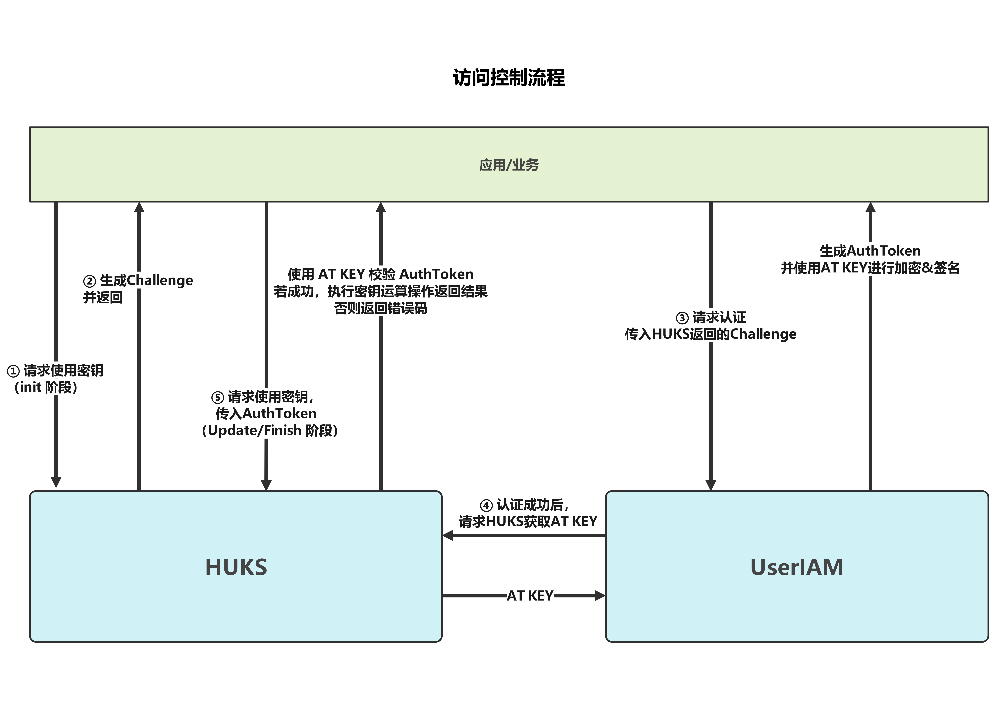

# HUKS Access Control Overview

HUKS provides comprehensive access control capabilities to ensure authorized access to the keys in HUKS.

- Services can access only their own keys, that is, the keys generated or imported through HUKS.

- For a service key with a higher security level or a service key used to protect sensitive data, user identity authentication is required before the key is accessed. The service key can be used only after the authentication (PIN or biometric authentication) is successful.

- The usage of keys is strictly restricted. For example, the AES keys can be used only for encryption and decryption, and the RSA keys can be used only for signing and signature verification.

## Application Scenarios and Development Process

The access control via user identity authentication involves multiple phases, which are described as below.

### User Identity Authentication

During the key generation or import process, user identity authentication can be enforced to ensure secure key access. A subset of credentials (such as lock screen password, fingerprint, and face) can be specified for the user identity authentication. For details, see [User Identity Authentication and Authorized Access Type Specifications](#user-identity-authentication-and-authorized-access-type-specifications).

After a key is generated or imported, unauthorized key access can be prevented even if the application process is attacked. The key access control via user authentication applies to security-sensitive scenarios, such as password-free login, password-free payment, and automatic password filling.

### Authorized Access Type

In addition to user identity authentication, HUKS provides the following modes to control key validity:

- **HUKS_AUTH_ACCESS_INVALID_CLEAR_PASSWORD**: invalidates the key when the lock screen password is cleared. 
  After a key is generated or imported, the key becomes invalid permanently once the lock screen password is cleared. The key will not be invalidated if the lock screen password is modified.

   Prerequisites: A lock screen password has been set.

  Application scenarios: user-related data protection or access based on the lock screen password.

- **HUKS_AUTH_ACCESS_INVALID_NEW_BIO_ENROLL**: invalidates the key when a new biometric feature is enrolled 
  The key, generated or imported, becomes invalid permanently once a new biometric feature is enrolled. The key will not be invalidated if the biometric feature is deleted.

  In this mode, the key cannot be accessed if a new biometric feature of the same type is enrolled. The key can be accessed via other identity authentication modes (other biometric features and lock screen password). In addition, the key will be invalid permanently if the lock screen password is cleared.

  Prerequisites: At least one biometric feature (such as fingerprint) has been enrolled.

  Application scenarios: password-free login or payment.

- **HUKS_AUTH_ACCESS_ALWAYS_VALID**: keeps the key always valid 
  In this mode, the key is permanently valid until it is deleted by the user.

  The key is accessible as long as the user identification is successful, and will be not affected if the user clears or changes the lock screen password or biometrics.

  When this mode is specified for a key in generation, the key is bound with a foreground user ID. Only the foreground user ID is verified.

### Challenge Verification

HUKS also provides the verification of the challenge value to ensure the validity of the user authentication result (non-replay).

Before user identity authentication, the challenge obtained from HUKS is passed to the user authentication method. The challenge of the authentication token is then verified during key operations.

### Refined Key Access Control

HUKS provides refined access control, which includes the following modes:

- AuthToken-based access control

  

  The preceding figure illustrates the user identity authentication and access control process.

  The AT KEY (symmetric key) is derived from the secure root key of the device each time a HUKS TA is started. The interaction between UserIAM and HUKS is in a TEE.

- One-time authentication for multiple authorization requests

  HUKS allows the authorization of multiple keys to be completed through one authentication.

  This feature applies to phone clone, in which all the data can be exported if the lock screen password is successfully verified once.

  The challenge generated by HUKS each time is of 8 bytes, and the challenge passed to UserIAM can be extended to 32 bytes. This allows one-time authorization of the access requests for a maximum of four keys. The service calls HUKS to generate an 8-byte challenge for each key, combines multiple challenges into one challenge, and sends the challenge to UserIAM for authentication.

- Timestamp-based access control

  HUKS supports timestamp-based challenge-free access control for performance-critical scenarios. A timeout period is set when a key is generated. When a service needs to access the key, the service directly requests UserIAM to initiate authentication and sends **AuthToken** containing the timestamp to HUKS. After verifying **AuthToken**, HUKS checks whether the difference between the current time and the timestamp is greater than the specified timeout period. If not, the service can access the key.

## User Identity Authentication and Authorized Access Type Specifications

For simplicity, in the following table we refer to:

- **HUKS_USER_AUTH_TYPE_PIN** (PIN authentication) as PIN
- **HUKS_USER_AUTH_TYPE_FACE** (facical authentication) as FACE
- **HUKS_USER_AUTH_TYPE_FINGERPRINT** (fingerprint authentication) as FINGERPRINT

- **HUKS_AUTH_ACCESS_INVALID_CLEAR_PASSWORD** (invalidates the key when the lock screen password is cleared) as INVALID_CLEAR_PASSWORD
- **HUKS_AUTH_ACCESS_INVALID_NEW_BIO_ENROLL** (invalidates the key when a new biometric feature is enrolled) as INVALID_NEW_BIO_ENROLL
- **HUKS_AUTH_ACCESS_ALWAYS_VALID** (keeps the key always valid) as ALWAYS_VALID

| User Identity Authentication                     | Authorized Access Type    | Description                                                 |
| -------------------------------| -------------- | -------------------------------------   |
| PIN                            | INVALID_CLEAR_PASSWORD | Only the PIN authentication is supported.  After the lock screen password is cleared, the key becomes invalid permanently. |
| FACE                           | INVALID_CLEAR_PASSWORD | Only the facial authentication is supported.  After the lock screen password is cleared, the key becomes invalid permanently. |
| FINGERPRINT                    | INVALID_CLEAR_PASSWORD | Only the fingerprint authentication is supported.  After the lock screen password is cleared, the key becomes invalid permanently. |
| PIN  \|  FACE                  | INVALID_CLEAR_PASSWORD | The PIN or facial authentication is supported.  After the lock screen password is cleared, the key becomes invalid permanently. |
| PIN  \|  FINGERPRINT           | INVALID_CLEAR_PASSWORD | The PIN or fingerprint authentication is supported.  After the lock screen password is cleared, the key becomes invalid permanently. |
| PIN  \|  FACE  \|  FINGERPRINT | INVALID_CLEAR_PASSWORD | The PIN, facial, or fingerprint authentication is supported.  After the lock screen password is cleared, the key becomes invalid permanently. |
| FACE                           | INVALID_NEW_BIO_ENROLL | Only the facial authentication is supported.  After a new face is enrolled, the key becomes invalid permanently. |
| FINGERPRINT                    | INVALID_NEW_BIO_ENROLL | Only the fingerprint authentication is supported.  After a new fingerprint is enrolled, the key becomes invalid permanently. |
| PIN  \|  FACE                  | INVALID_NEW_BIO_ENROLL | The PIN or facial authentication is supported.  After a new face is enrolled, the key can be accessed via PIN authentication but not via facial authentication.  After the lock screen password is cleared, the key becomes invalid permanently. |
| PIN  \|  FINGERPRINT           | INVALID_NEW_BIO_ENROLL | The PIN or fingerprint authentication is supported.  After a new fingerprint is enrolled, the key can be accessed via PIN authentication but not via fingerprint authentication.  After the lock screen password is cleared, the key becomes invalid permanently. |
| FACE  \|  FINGERPRINT          | INVALID_NEW_BIO_ENROLL | The facial or fingerprint authentication is supported.  After a new biometric feature is enrolled, the user cannot use that biometric credential for user identity authentication. Other credentials can still be used for accessing the key. |
| PIN  \|  FACE  \|  FINGERPRINT | INVALID_NEW_BIO_ENROLL | The PIN, facial, or fingerprint authentication is supported.  After a new biometric feature is enrolled, the user cannot use that biometric credential for user identity authentication. Other credentials can still be used for accessing the key.  After the lock screen password is cleared, the key becomes invalid permanently. |
| PIN                            | ALWAYS_VALID           | Only the PIN authentication is supported.  The key is permanently valid. |
| FACE                           | ALWAYS_VALID           | Only the facial authentication is supported.  The key is permanently valid. |
| FINGERPRINT                    | ALWAYS_VALID           | Only the fingerprint authentication is supported.  The key is permanently valid. |
| PIN  \|  FACE                  | ALWAYS_VALID           | The PIN or facial authentication is supported.  The key is permanently valid. |
| PIN  \|  FINGERPRINT           | ALWAYS_VALID           | The PIN or fingerprint authentication is supported.  The key is permanently valid. |
| FACE  \|  FINGERPRINT          | ALWAYS_VALID           | The facial or fingerprint authentication is supported.  The key is permanently valid. |
| PIN  \|  FACE  \|  FINGERPRINT | ALWAYS_VALID           | The PIN, facial, or fingerprint authentication is supported.  The key is permanently valid. |
