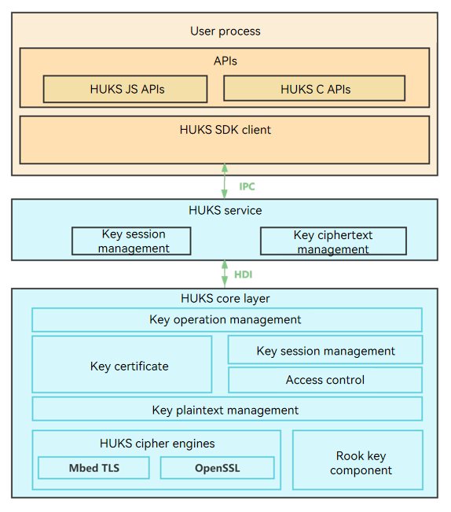

# Introduction to Universal Keystore Kit

<!--Kit: Universal Keystore Kit-->
<!--Subsystem: Security-->
<!--Owner: @wutiantian-gitee-->
<!--Designer: @HighLowWorld-->
<!--Tester: @wxy1234564846-->
<!--Adviser: @zengyawen-->

Universal Keystore Kit (referred to as HUKS) provides applications and services with unified secure key operations, including key management (key generation/destruction, key import, key attestation, key agreement, and key derivation) and key use (encryption/decryption, signing/signature verification, and access control).

The keys managed by HUKS can be imported by a service or an application or generated by invoking HUKS APIs. HUKS also provides the key access control, which ensures secure and authorized access to the keys in HUKS.

## HUKS Architecture

The HUKS module consists of the following:

- SDK: provides key management APIs. You can use ArkTS or C APIs based on your services.

- HUKS service layer: implements key session management and storage management.

- HUKS core layer: implements core functionalities, including cryptographic operations, encryption and decryption, and key access control.
  > **NOTE**
  > The HUKS core layer must run in a secure environment, such as the [TEE](huks-concepts.md) or secure chipset of a system or device. The secure environment depends on the hardware. The implementation in the open source repository is simulated, and subject to adaptation by OEM vendors.

## Core Functionalities

HUKS provides the following key management functionalities throughout their lifecycle.

### Key Generation

| Functionality| Description|
| -------- | -------- |
| **[Key generation](huks-key-generation-overview.md)**| Generates a key randomly. During the lifecycle of the key, the plaintext of the key can be accessed only in the secure environment and cannot be exposed out of the secure environment.|
| **[Key import](huks-key-import-overview.md)**| Imports an externally generated key to HUKS for management.|

### Key Use

| Functionality| Description|
| -------- | -------- |
| [Encryption/Decryption](huks-encryption-decryption-overview.md)| Encrypts plaintext into ciphertext using a key, or decrypts ciphertext into plaintext using a key.|
| **[Signing/Signature Verification](huks-signing-signature-verification-overview.md)**| Generates a digital signature, which confirms the data authenticity (the message came from the stated sender).|
| **[Key agreement](huks-key-agreement-overview.md)**| Allows two or more parties to jointly establish a shared key in a non-secure environment.|
| **[Key derivation](huks-key-derivation-overview.md)**| Derives one or more secrete keys from a key.|
| **[Access control](huks-identity-authentication-overview.md)**| Prevents unauthorized access to the keys in HUKS.|

### Key Deletion

| Functionality| Description|
| -------- | -------- |
| **[Key deletion](huks-delete-key-arkts.md)**| Securely deletes key data from HUKS.|

### Key Attestation

| Functionality| Description|
| -------- | -------- |
| **[Key attestation](huks-key-attestation-overview.md)**| Issues a certificate for the public key in an asymmetric key pair stored in HUKS to prove the validity of the key (the key is generated in a secure environment).|

## Related Kits

[Key access control based on user identity authentication](huks-identity-authentication-overview.md) depends on [User Authentication Kit](../UserAuthenticationKit/user-authentication-overview.md).
