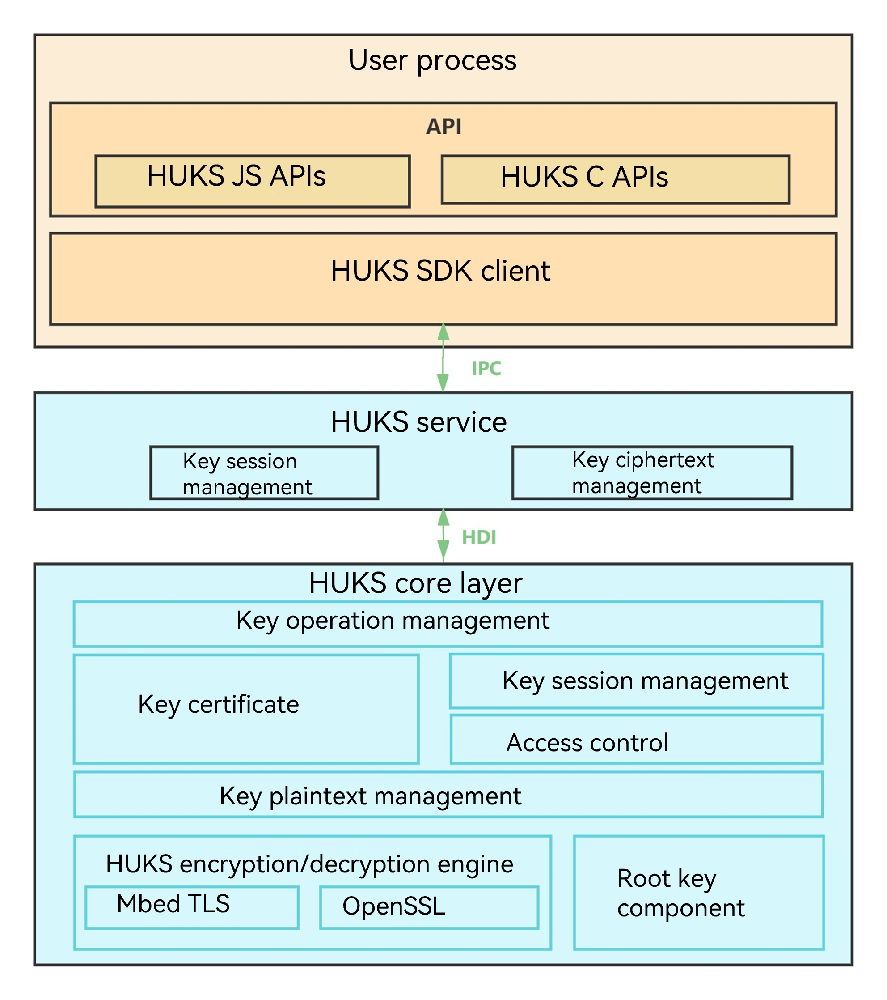

# About This Kit

<!--Kit: Universal Keystore Kit-->
<!--Subsystem: Security-->
<!--Owner: @wutiantian-gitee-->
<!--Designer: @HighLowWorld-->
<!--Tester: @wxy1234564846-->
<!--Adviser: @zengyawen-->
<!-- md-trans-meta sourceCommit=d3532cdb382de60022a0814eb4efa4eadebea1d6 translatedAt=2026-08-13T08:25:09.683Z pushedAt=2026-08-13T10:20:24.720Z -->

Universal Keystore Kit (referred to as HUKS) provides applications and services with unified secure key operations, including key management (key generation/destruction, key import, key attestation, key agreement, and key derivation) and key use (encryption/decryption, signing/signature verification, and access control).

Keys managed by HUKS can be imported by services/apps or generated by calling HUKS APIs. In addition, HUKS provides key access control to ensure that keys stored in HUKS are accessed legally and correctly.

## HUKS Architecture

The HUKS module consists of the following:

- SDK: provides key management APIs. You can use ArkTS or C APIs based on your services.

- HUKS service layer: implements key session management and storage management.

- HUKS core layer: implements core functionalities, including cryptographic operations, encryption and decryption, and key access control.

  > **NOTE**
  >
  > For systems and devices that have a secure environment (for example, [TEE](huks-concepts.md#tee)), the HUKS core layer must run within the secure environment. <!--Del-->The secure environment depends on the hardware. The implementation in the open source repository is simulated, and subject to adaptation by OEM vendors.<!--DelEnd-->

## Core Functionalities

HUKS provides the following key management functionalities throughout their lifecycle.

### Key Generation

| Functionality| Description|
| -------- | -------- |
| **[Key generation](huks-key-generation-overview.md)**| Generates a key randomly. During the lifecycle of the key, the plaintext of the key can be accessed only in the secure environment and cannot be exposed out of the secure environment.|
| **[Key import](huks-key-import-overview.md)**| Imports an externally generated key to HUKS for management.|

### Key Use

| Function | Description |
| -------- | -------- |
| **[Encryption/Decryption](huks-encryption-decryption-overview.md)** | Uses a key to encrypt data into ciphertext that attackers cannot understand, or uses a key to decrypt data into plaintext available to services. |
| **[Signing/Signature Verification](huks-signing-signature-verification-overview.md)** | Used to authenticate the authenticity of message content and the identity of the message sender. |
| **[Key Agreement](huks-key-agreement-overview.md)** | Two or more entities establish a session key through negotiation. |
| **[Key Encapsulation](huks-kem-overview.md)** | Securely establishes a shared key between two parties through asymmetric keys, supporting post-quantum cryptographic algorithms. |
| **[Key Derivation](huks-key-derivation-overview.md)** | Derives one or more new keys from an existing key. |
| **[Access Control](huks-identity-authentication-overview.md)** | Ensures that keys stored in HUKS are not accessed without authorization. |

### Key Deletion

| Functionality| Description|
| -------- | -------- |
| **[Key deletion](huks-delete-key-arkts.md)**| Securely deletes key data from HUKS.|

### Key Attestation

| Functionality| Description|
| -------- | -------- |
| **[Key attestation](huks-key-attestation-overview.md)**| Issues a certificate for the public key in an asymmetric key pair stored in HUKS to prove the validity of the key (the key is generated in a secure environment).|

<!--RP1--><!--RP1End-->

## Related Kits

[Key access control based on user identity authentication](huks-identity-authentication-overview.md) depends on [User Authentication Kit](../UserAuthenticationKit/user-authentication-overview.md).