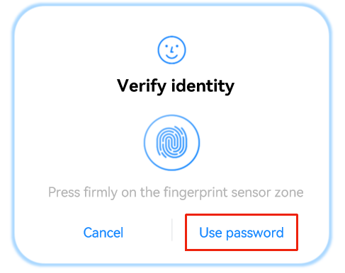

# Applying Custom Authentication

<!--Kit: User Authentication Kit-->
<!--Subsystem: UserIAM-->
<!--Owner: @WALL_EYE-->
<!--Designer: @lichangting518-->
<!--Tester: @jane_lz-->
<!--Adviser: @zengyawen-->
<!-- md-trans-meta sourceCommit=ebfce68b85e3c1c39c3a7543955bdd1d3b7ea7c7 translatedAt=2026-08-14T06:45:07.775Z pushedAt=2026-08-14T07:59:38.467Z -->

If the biometric authentication fails and the user taps the navigation button for a custom authentication, the unified user authentication framework will terminate the system authentication process and instruct the caller to launch the custom authentication page.

For example, if the facial or fingerprint authentication provided by the system fails in a payment process, the user can switch to the password authentication defined by the device vendor.

Since payment password authentication is not a system authentication capability, the application must provide explicit navigation button information, for example, **Use Payment Password**, when initiating authentication. This ensures that a **Use Payment Password** button is displayed on the authentication page.

When the user taps this button, the application that initiates the custom authentication request will receive a special authentication result returned by the user authentication framework, indicating that the system authentication process is ended and prompting the application to launch its custom authentication page. As a result, the payment password authentication page customized by the service is displayed.

<!--RP1-->



<!--RP1End-->

As shown in the following figure, the selected area is the **WidgetParam.navigationButtonText** field. You can configure this field to guide users to switch from biometric authentication to the service password authentication customized by the application.

> **NOTE**
> The lock screen password authentication and custom authentication are mutually exclusive.

| Authentication Type| Switch to Custom Authentication<br>(√ indicates supported, x indicates not supported)|
| -------- | -------- |
| Lock screen password authentication | x |
| Facial authentication| √ |
| Fingerprint authentication| √ |
| Facial + fingerprint authentication<sup>18+</sup>| √ |
| Face + lock screen password authentication | x |
| Fingerprint + lock screen password authentication | x |
| Face + fingerprint + lock screen password authentication | x |

## Development Example

For details about how to initiate the authentication request in the transition to a custom authentication, see [initiating authentication](start-authentication.md). Ensure that the **widgetParam** parameter passed in must contain **navigationButtonText**.

This example only shows how to configure the UI and select the custom authentication UI. You need to add the code for launching the custom authentication page at the commented line in the example.

<!-- @[custom_authentication](https://gitcode.com/openharmony/applications_app_samples/blob/master/code/DocsSample/UserAuthentication/entry/src/main/ets/pages/Index.ets) -->

``` TypeScript
handleCustomAuthResult(userAuthInstance: userAuth.UserAuthInstance, exampleNumber: number) {
  // ...
    userAuthInstance.on('result', {
      onResult: (result: userAuth.UserAuthResult) => {
        // ...
          Logger.info('userAuthInstance callback');
          // ...
          if (result.result == userAuth.UserAuthResultCode.CANCELED_FROM_WIDGET ||
            result.result == userAuth.UserAuthResultCode.NOT_ENROLLED) {
            // You need to implement the process of launching the custom authentication page.
            // ...
          }
          // ...
      }
    });
    // Start authentication.
    userAuthInstance.start();
    Logger.info('auth start successfully.');
    // ...
}

/*
 * apply-custom-authentication.md
 * This example shows how to configure the page and switch to the custom authorizer page. You need to implement the pages to be started and the corresponding pages.
 * */
applyingCustomAuthentication() {
  try {
    const randData = getRandData();
    if (!randData) {
      return;
    }
    const authParam: userAuth.AuthParam = {
      challenge: randData,
      authType: [userAuth.UserAuthType.FACE],
      authTrustLevel: userAuth.AuthTrustLevel.ATL3,
    };
    // Configure custom authentication and set the text on the navigation button.
    const widgetParam: userAuth.WidgetParam = {
      title: resourceToString($r('app.string.title')),
      navigationButtonText: resourceToString($r('app.string.navigationButtonText'))
    };
    // Obtain an authentication object.
    const userAuthInstance = userAuth.getUserAuthInstance(authParam, widgetParam);
    Logger.info('get userAuth instance successfully.');
    // Subscribe to the authentication result.
    this.handleCustomAuthResult(userAuthInstance, ResultIndex.CUSTOMIZE);
  } catch (error) {
    const err: BusinessError = error as BusinessError;
    Logger.error(`auth failed, code is ${err?.code}, message is ${err?.message}`);
  }
}
```

## Sample Code

  - [Switching to Custom Authentication](https://gitcode.com/openharmony/applications_app_samples/tree/master/code/DocsSample/UserAuthentication)