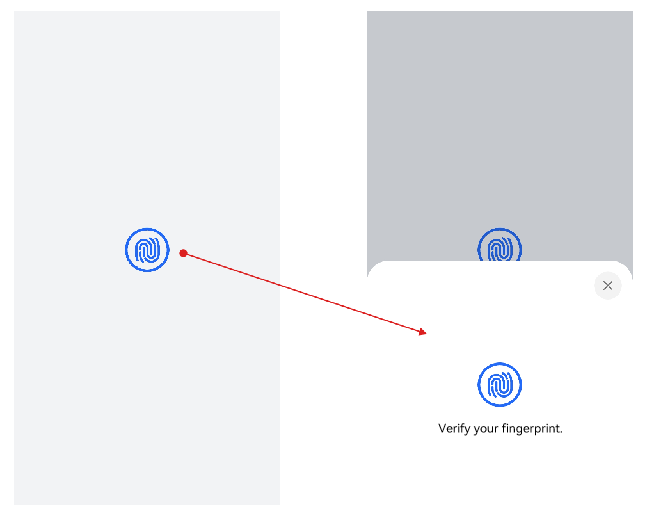

# Using userAuthIcon

**userAuthIcon** provides user identity authentication icons used on the application UI. With **userAuthIcon**, you can:

1. Easily integrate the facial authentication and fingerprint authentication icons into your applications.
2. Customize the color and size of the icons. The icon style cannot be changed.
3. Start the pop-up facial or fingerprint authentication component once the icon is tapped.

**userAuthIcon** supports the following types of authentication:

- Facial authentication
- Fingerprint authentication
- Facial + lock screen password authentication
- Fingerprint + lock screen password authentication
- Facial + fingerprint + lock screen password authentication

The following figure shows the use of **userAuthIcon** for fingerprint authentication. When a user taps the fingerprint authentication icon (shown in the left part of the figure) integrated into the application, the system starts the user authentication component (shown in the right part of the figure) to complete identity authentication. The embedded icons eliminate the need for initiating user identity authentication requests by using APIs, making the identity authentication process simpler.

## Example

For details, see [@ohos.userIAM.userAuthIcon](../../reference/apis-user-authentication-kit/ohos-useriam-userauthicon.md).
