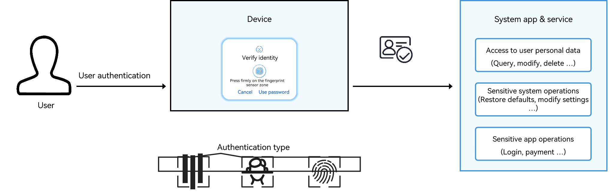
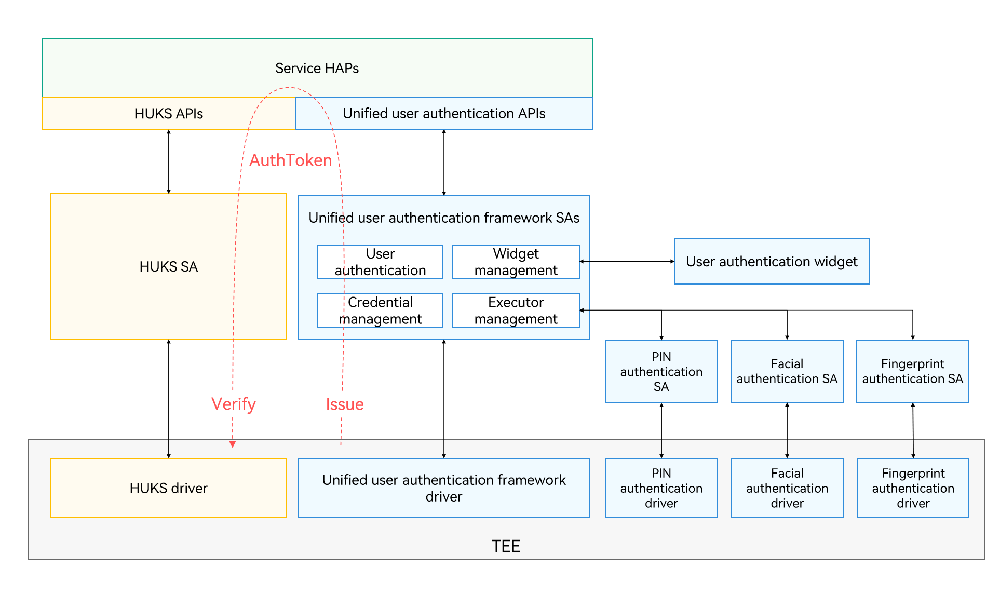

# Introduction to User Authentication Kit

User Authentication Kit provides the user authentication capabilities based on the lock screen password, facial characteristics, and fingerprint registered with a device.

User Authentication Kit provides system-level identity authentication and a system-level user authentication widget, which provides unified user authentication across devices with diversified authentication modes (facial, fingerprint, and PIN authentication).

Before accessing personal data or performing sensitive operations upon a user request, the application or system service invokes the user authentication widget to authenticate the user identity. The data can be accessed or the sensitive operation can be performed only when the authentication is successful.

User identity authentication can be used in authentication scenarios, such as in-app login and payment.

## Features

- Unified authentication interface

    Unified APIs are provided to perform user authentication based on the lock screen password, facial characteristics, and fingerprint.

    The same set of APIs provides a combination of facial, fingerprint, and lock screen password authentication modes.

    The same set of APIs provides a combination of facial authentication, fingerprint authentication, and custom authentication.

- Awareness of different authentication trust levels

    The expected authentication trust level can be specified to prevent the use of the lower-security authentication capability (such as the 2D facial authentication) in user authentication scenarios with higher risks (such as payment).

- Support for custom authentication modes

    The authentication page with a navigation button is provided for the user to switch to a page for custom authentication.

- Reuse of the authentication result of any application within a short period of time

    The successful result of the previous authentication can be reused within the specified period of time (max. 5 minutes). The following reuse modes are supported: 

    - Reuse of the lock screen authentication result or identity authentication result of any application within the specified time period.
    - Reuse of the authentication result within the specified time period no matter whether the type of the current authentication matches that of the previous one.
    - Reuse of the authentication result within the specified time period only when the type of the current authentication matches that of the previous one.

- System-level user authentication UX

    The caller can customize the title of the authentication page and the text on the navigation button.

    The user authentication widget automatically adjusts the display mode based on the device screen status.

- Awareness of the change in credential status

    The status of the credentials enrolled by a user can be directly queried or obtained from the authentication and saved. To check whether a user credential is changed, the caller can query the current credential status or obtain the credential status from the current authentication, and compare the credential status obtained with the credential status saved.

## Working Mechanism

The following figure shows the architecture of the unified user authentication framework.

The unified user authentication framework consists of the following:

1. Unified user authentication APIs: provide unified APIs for implementing user authentication capabilities. The APIs shield the differences between authentication modes to simplify your app experience.

2. Unified user authentication framework: consists of authentication SAs and drivers. The framework schedules various identity authentication capabilities and the user authentication widget to complete user authentication requests initiated by services through the unified user authentication APIs.

3. User authentication widget: provides the interaction interfaces for different authentication modes to ensure consistent user authentication experience regardless of the authentication mode.

4. Authentication capabilities: provides capabilities of PIN (password) authentication, facial authentication, and fingerprint authentication for the unified user authentication framework to schedule.

If the user authentication is successful, the unified user authentication framework issues an AuthToken in the trusted execution environment (TEE) of the device.

User authentication can also be used to control the access to the keys in the universal keystore. For the keys that can be accessed only with user authentication, the application needs to provide a key invocation request with the obtained AuthToken to the [universal keystore service](../UniversalKeystoreKit/huks-overview.md). After verifying the validity and validity of the AuthToken in the TEE, the universal keystore service responds to the service request and performs the related key operation.

### AuthToken Struct

Plaintext

| Name| Content| Type| Description|
| -------- | -------- | -------- | -------- |
| version | Token version| uint32_t | Currently, the token version is 2.0.|
| challenge | Random challenge for authentication| uint8_t[32] | One-off random challenge generated by the service that needs to verify the authentication result.|
| time | Authentication timestamp| uint64_t | Timestamp when the authentication is successful.|
| authTrustLevel | Authentication trust level| uint32_t | See [Principles for Classifying Biometric Authentication Trust Levels](#principles-for-classifying-biometric-authentication-trust-levels).|
| authType | Authentication type| uint32_t | Authentication type, which can be facial authentication, fingerprint authentication, or PIN authentication (lock screen password authentication).|
| authMode | Operation type| uint32_t | Identification/authentication.|
| securityLevel | Security level of the token issuing environment| uint32_t | Security level of the environment where the token is issued.|

Ciphertext

| Name| Content| Type| Description|
| -------- | -------- | -------- | -------- |
| userId | User ID| int32_t | ID allocated by the system to a user when the user is created.|
| secureUid | Secure user ID| uint64_t | ID randomly allocated to a user when the user registers the system password. The ID will be deleted when the password is deleted. It remains unchanged when the password is changed.|
| enrolledId | Credential enrollment ID| uint64_t | ID generated each time a credential of this type is enrolled. The ID remains unchanged if the credential is deleted. |
| credentialId | Credential ID| uint64_t | ID of a credential (such as the face or fingerprint) enrolled by the user.|

Tag

| Name| Content| Type| Description|
| -------- | -------- | -------- | -------- |
| tag | Tag of the ciphertext| uint8_t[16] | Tag generated after the ciphertext is encrypted using AES-GCM.|
| iv | Initialization vector (IV) used to encrypt the ciphertext.| uint8_t[12] | Random IV used for AES-GCM encryption.|
| sign | Signature of the AuthToken| uint8_t[32] | Signature used to protect the integrity of the AuthToken.|

### Principles for Classifying Biometric Authentication Trust Levels

The authentication trust level evaluates the security of the user identity authentication capability of the system, which depends on the authentication capability level (ACL) and authentication security level (ASL) of the authentication system.

The system uses the following metrics to measure the biometric authentication capability level:

- False Rejection Rate (FRR): percentage of the times that a user is incorrectly rejected by a system.

- False Acceptance Rate (FAR): percentage of times that an imposter is incorrectly accepted by a system.

- Spoof Acceptance Rate (SAR): percentage of times that a non-lived, previously recorded sample is accepted by a system.

The lower the FAR, the higher the FRR, which increases the authentication security but also raises the likelihood of the authorized users being rejected by mistake, reducing convenience.
Conversely, the higher FAR, the lower the FRR, which decreases the authentication security but increases convenience.

| AuthTrustLevel| Metrics|
| -------- | -------- |
| ATL4 | When FRR = 10%, FAR ≤ 0.001%, SAR ≤ 3%|
| ATL3 | When FRR = 10%, FAR ≤ 0.002%, SAR ≤ 7%|
| ATL2 | When FRR = 10%, FAR ≤ 0.002%, 7% < SAR ≤ 20%|
| ATL1 | When FRR = 10%, FAR ≤ 1%, 7% < SAR ≤ 20%|

Generally, the biometric authentication system comprises five execution units: source data collection, biometric feature extraction, biometric feature storage, biometric feature comparison, and authentication result issuance. The following Executor Security Levels (ESLs) are defined for the execution units.

| ESL| Definition|
| -------- | -------- |
| ESL3 | Operations are performed in a secure hardware-back trusted environment, such as a secure coprocessor or a secure element (SE).|
| ESL2 | Operations are performed in a trusted execution environment (TEE) based on hardware RoT isolation, such as a TEE and an SGX.|
| ESL1 | Operations are performed in an execution environment with access control, such as Linux.|
| ESL0 | Operations are performed in an execution environment without access control, such as a single-process lightweight system.|

The ASL of the entire authentication system is equal to the lowest ESL among the five execution units of biometric authentication. For example, there is a facial authentication system where the feature storage and comparison are performed in aTEE (ESL=2), but the feature extraction algorithm runs in a common system environment (ESL=1), the ASL of the face authentication system is 1.

The following table lists the mappings between AuthTrustLevels and ACLs & ASLs.

| AuthTrustLevel| Mapping Rule| Description| Application Scenario|
| -------- | ------------ | -------- | -------- |
| ATL4 | ACL ≥ 3, ASL ≥ 2| Capable of accurately identifying individual users with strong liveness detection capabilities, such as specially enhanced secure fingerprint and 3D facial authentication.| Small-amount payment|
| ATL3 | ACL ≥ 3, ASL ≥ 1 ACL ≥ 2, ASL ≥ 2| Capable of precisely identifying individual users with moderate liveness detection capabilities, such as specially enhanced secure fingerprint and 2D facial authentication.| Device unlocking, application login, and account login|
| ATL2 | ACL ≥ 2, ASL ≥ 1 ACL ≥ 1, ASL ≥ 2| Capable of precisely identifying individual users with regular liveness detection capabilities, such as 2D facial authentication using a common camera to collect images.| Maintaining the unlocked state of a device|
| ATL1 | ACL = 1, ASL = 1| Capable of identifying individual users with limited liveness detection capabilities, such as voiceprint authentication.| Service risk control, targeted recommendations, and personalized services|

## Constraints

When a third-party application needs to use the local authentication capability of the system, the built-in user authentication widget must be used.
