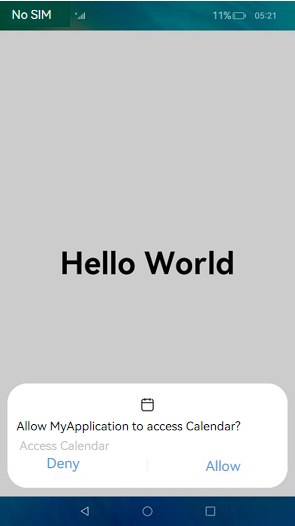

# Applying for Permissions

## When to Use

Application permissions are used to prevent unauthorized access to sensitive data or critical functions. The [Ability Privilege Level (APL)](accesstoken-overview.md#application-apls) of an application can be **normal** (default), **system_basic**, or **system_core**. The [permission types](accesstoken-overview.md#permission-types) include **system_grant** and **user_grant**. For details about the permissions for applications, see the [Application Permission List](permission-list.md).

This document describes the following operations:

- [Declaring Permissions in the Configuration File](#declaring-permissions-in-the-configuration-file)
- [Declaring the ACL](#declaring-the-acl)
- [Requesting User Authorization](#requesting-user-authorization)
- [Pre-authorizing user_grant Permissions](#pre-authorizing-user_grant-permissions)

## Declaring Permissions in the Configuration File

The permissions required by an application must be declared one by one in the configuration file of the project. Otherwise, the application cannot obtain the permissions.

> **NOTE**
>
> If an application of the **normal** APL requires a permission of the **system_basic** or **system_core** level, you must also declare the permission in the [ACL](#declaring-the-acl).

The following table describes the fields in the configuration file.

| Field     | Mandatory| Description                                                        |
| --------- | -------- | ------------------------------------------------------------ |
| name      | Yes      | Name of the permission.                                                  |
| reason    | No      | Reason for requesting the permission.<br>This parameter is mandatory when a user_grant permission is required.|
| usedScene | No      | Application scenario of the permission.<br>This parameter is mandatory when a user_grant permission is required.|
| abilities | No      | Abilities that require the permission. The value is an array.<br>**Applicable model**: stage|
| ability   | No      | Abilities that require the permission. The value is an array.<br>**Applicable model**: FA|
| when      | No      | Time when the permission is required. <br>Value:<br>- **inuse**: The permission is required only when the application is in use.<br>- **always**: The permission is required no matter whether the application is in use.|

### Stage Model

If your application is developed based on the stage model, declare the required permissions in [**module.json5**](../quick-start/module-configuration-file.md).

```json
{
  "module" : {
    // ...
    "requestPermissions":[
      {
        "name" : "ohos.permission.PERMISSION1",
        "reason": "$string:reason",
        "usedScene": {
          "abilities": [
            "FormAbility"
          ],
          "when":"inuse"
        }
      },
      {
        "name" : "ohos.permission.PERMISSION2",
        "reason": "$string:reason",
        "usedScene": {
          "abilities": [
            "FormAbility"
          ],
          "when":"always"
        }
      }
    ]
  }
}
```

### FA Model

If your application is developed based on the FA model, declare the required permissions in **config.json**.

```json
{
  "module" : {
    // ...
    "reqPermissions":[
      {
        "name" : "ohos.permission.PERMISSION1",
        "reason": "$string:reason",
        "usedScene": {
          "ability": [
            "FormAbility"
          ],
          "when":"inuse"
        }
      },
      {
        "name" : "ohos.permission.PERMISSION2",
        "reason": "$string:reason",
        "usedScene": {
          "ability": [
            "FormAbility"
          ],
          "when":"always"
        }
      }
    ]
  }
}
```

## Declaring the ACL

If an application of the **normal** APL requires permissions of the **system_basic** or **system_core** level, you must also declare the required permissions in the ACL.

For example, if an application needs to access audio clips of a user and capture screenshots, it requires the **ohos.permission.WRITE_AUDIO** permission (of the **system_basic** level) and the **ohos.permission.CAPTURE_SCREEN** permission (of the **system_core** level). In this case, you need to add the required permissions to the **acls** field in the [HarmonyAppProvision configuration file](app-provision-structure.md).

```json
{
	// ...
	"acls":{
		"allowed-acls":[
			"ohos.permission.WRITE_AUDIO",
      "ohos.permission.CAPTURE_SCREEN"
		]
	}
}
```

## Requesting User Authorization

User authorization is required when an application needs to access user privacy information (such as Location or Calendar information) or using system abilities (such as the camera ability to take photos or record videos). In this case, the application requires a **user_grant** permission. Before the application accesses the data or using the system ability, a verification is performed to check whether the user has granted the permission to the application. If the user has not granted the permission, a dialog box will be displayed to request user authorization. The following figure shows an example.

**Figure 1** Requesting user authorization  


> **NOTE**
>
> Each time before an API protected by a **user_grant** permission is called, **[requestPermissionsFromUser()](../reference/apis/js-apis-abilityAccessCtrl.md#requestpermissionsfromuser9)** will be called to request user authorization. After the permission is granted, the user may revoke the authorization in **Settings**. Therefore, the previous authorization status cannot be persistent.

### Stage Model

Example: Apply for the permission for an application to access the Calendar.

1. Declare the **ohos.permission.READ_CALENDAR** permission in the configuration file. For details, see [Declaring Permissions in the Configuration File](#declaring-permissions-in-the-configuration-file).

2. Check whether the user has granted the permission.

   Use [checkAccessToken()](../reference/apis/js-apis-abilityAccessCtrl.md#checkaccesstoken9) to check whether the user has granted the permission. If yes, the application can access the Calendar. Otherwise, user authorization is required.

   ```ts
   import bundleManager from '@ohos.bundle.bundleManager';
   import abilityAccessCtrl, { Permissions } from '@ohos.abilityAccessCtrl';
   
   async function checkAccessToken(permission: Permissions): Promise<abilityAccessCtrl.GrantStatus> {
     let atManager = abilityAccessCtrl.createAtManager();
     let grantStatus: abilityAccessCtrl.GrantStatus;
   
     // Obtain the access token ID of the application.
     let tokenId: number;
     try {
       let bundleInfo: bundleManager.BundleInfo = await bundleManager.getBundleInfoForSelf(bundleManager.BundleFlag.GET_BUNDLE_INFO_WITH_APPLICATION);
       let appInfo: bundleManager.ApplicationInfo = bundleInfo.appInfo;
       tokenId = appInfo.accessTokenId;
     } catch (err) {
       console.error(`Failed to get bundle info for self. Code is ${err.code}, message is ${err.message}`);
     }
   
     // Check whether the user has granted the permission.
     try {
       grantStatus = await atManager.checkAccessToken(tokenId, permission);
     } catch (err) {
       console.error(`Failed to check access token. Code is ${err.code}, message is ${err.message}`);
     }
   
     return grantStatus;
   }
   
   async function checkPermissions(): Promise<void> {
     const permissions: Array<Permissions> = ['ohos.permission.READ_CALENDAR'];
     let grantStatus: abilityAccessCtrl.GrantStatus = await checkAccessToken(permissions[0]);
   
     if (grantStatus === abilityAccessCtrl.GrantStatus.PERMISSION_GRANTED) {
       // If the user has granted the permission, the application can access the Calendar.
     } else {
       // Apply for the permission to access the Calendar.
     }
   }
   ```

3. Request user authorization dynamically.

   Use [requestPermissionsFromUser()](../reference/apis/js-apis-abilityAccessCtrl.md#requestpermissionsfromuser9) to apply for permissions from the user when the application is running. A list of permissions, such as the permissions to access the Location, Calendar, camera, and microphone, can be passed in. The user can grant or deny the permissions.

   You can have [**requestPermissionsFromUser()**](../reference/apis/js-apis-abilityAccessCtrl.md#requestpermissionsfromuser9) called in **onWindowStageCreate()** of the UIAbility to dynamically request user authorization, or request user authorization on the UI based on service requirements.

   Sample code for requesting user authorization using UIAbility:

   ```typescript
   import UIAbility from '@ohos.app.ability.UIAbility';
   import window from '@ohos.window';
   import abilityAccessCtrl, { Permissions } from '@ohos.abilityAccessCtrl';
   
   const permissions: Array<Permissions> = ['ohos.permission.READ_CALENDAR'];
   
   export default class EntryAbility extends UIAbility {
     // ...
   
     onWindowStageCreate(windowStage: window.WindowStage) {
       // Main window is created. Set the main page for this ability.
       let context = this.context;
       let atManager = abilityAccessCtrl.createAtManager();
       // The return value of requestPermissionsFromUser determines whether to display a dialog box to request user authorization.
   
       atManager.requestPermissionsFromUser(context, permissions).then((data) => {
         let grantStatus: Array<number> = data.authResults;
         let length: number = grantStatus.length;
         for (let i = 0; i < length; i++) {
           if (grantStatus[i] === 0) {
             // If the user has granted the permission, the application can access the Calendar.
           } else {
             // If the user has not granted the permission, display a message indicating that user authorization is required, and direct the user to the Settings page to set the permission.
             return;
           }
         }
         // The authorization is successful.
       }).catch((err) => {
         console.error(`Failed to request permissions from user. Code is ${err.code}, message is ${err.message}`);
         })
       // ...
     }
   }
   ```

   Sample code for requesting user authorization on the UI:
   ```typescript
   import abilityAccessCtrl, { Permissions } from '@ohos.abilityAccessCtrl';
   import common from '@ohos.app.ability.common';
   
   const permissions: Array<Permissions> = ['ohos.permission.READ_CALENDAR'];
   
   @Entry
   @Component
   struct Index {
     reqPermissionsFromUser(permissions: Array<Permissions>): void {
       let context = getContext(this) as common.UIAbilityContext;
       let atManager = abilityAccessCtrl.createAtManager();
       // The return value of requestPermissionsFromUser determines whether to display a dialog box to request user authorization.
       atManager.requestPermissionsFromUser(context, permissions).then((data) => {
         let grantStatus: Array<number> = data.authResults;
         let length: number = grantStatus.length;
         for (let i = 0; i < length; i++) {
           if (grantStatus[i] === 0) {
             // If the user has granted the permission, the application can access the Calendar.
           } else {
             // If the user has not granted the permission, display a message indicating that user authorization is required, and direct the user to the Settings page to set the permission.
             return;
           }
         }
         // The authorization is successful.
       }).catch((err) => {
         console.error(`Failed to request permissions from user. Code is ${err.code}, message is ${err.message}`);
       })
     }
   
     // Page display.
     build() {
       // ...
     }
   }
   ```

4. Perform subsequent operations based on the authorization result.

   After [requestPermissionsFromUser()](../reference/apis/js-apis-abilityAccessCtrl.md#requestpermissionsfromuser9) is called, the application waits for the user authorization result. If the user has granted the permission, the application can access the Calendar. If the user has not granted the permission, a message will be displayed indicating that user authorization is required, and the user is directed to **Settings** to set the permission.

   ```ts
   function openPermissionsInSystemSettings(): void {
     let context = getContext(this) as common.UIAbilityContext;
     let wantInfo = {
       action: 'action.settings.app.info',
       parameters: {
         settingsParamBundleName: 'com.example.myapplication' // Open the Details page of the application.
       }
     }
     context.startAbility(wantInfo).then(() => {
       // ...
     }).catch((err) => {
       // ...
     })
   }
   ```

### FA Model

Call [requestPermissionsFromUser()](../reference/apis/js-apis-inner-app-context.md#contextrequestpermissionsfromuser7) to request user authorization.

```js
import featureAbility from '@ohos.ability.featureAbility';

reqPermissions() {
    let context = featureAbility.getContext();
    let array:Array<string> = ["ohos.permission.PERMISSION2"];
    // The return value of requestPermissionsFromUser determines whether to display a dialog box to request user authorization.
    context.requestPermissionsFromUser(array, 1).then(function(data) {
        console.log("data:" + JSON.stringify(data));
        console.log("data permissions:" + JSON.stringify(data.permissions));
        console.log("data result:" + JSON.stringify(data.authResults));
    }, (err) => {
        console.error('Failed to start ability', err.code);
    });
}
```
## Pre-authorizing user_grant Permissions
By default, the **user_grant** permissions must be dynamically authorized by the user through a dialog box. However, some pre-installed applications may require **user_grant** permissions, for example, the system camera application requires the **ohos.permission.MICROPHONE** permission. In this case, you can pre-authorize **user_grant** permissions for pre-installed applications in the [**install_list_permission.json**](https://gitee.com/openharmony/vendor_hihope/blob/master/rk3568/preinstall-config/install_list_permissions.json) file. The **install_list_permissions.json** file is in the **/system/etc/app/** directory on a device, and is loaded when the device starts. When the application is installed, the **user_grant** permissions in the file are granted.

The **install_list_permissions.json** file contains the following fields:

- **bundleName**: bundle name of the application.
- **app_signature**: fingerprint information of the application. For details, see **Configuration in install_list_capability.json** in the [Application Privilege Configuration Guide](../../device-dev/subsystems/subsys-app-privilege-config-guide.md).
- **permissions**: The **name** field specifies the name of the **user_grant** permission to pre-authorize. The **userCancellable** field specifies whether the user can revoke the pre-authorization. The value **true** means the user can revoke the pre-authorization; the value **false** means the opposite.

> **NOTE**
> 
> The **install_list_permissions.json** file is available only for preinstalled applications.

```json
[
  // ...
  {
    "bundleName": "com.example.myapplication", // Bundle Name.
    "app_signature": ["****"], // Fingerprint information.
    "permissions":[
      {
        "name": "ohos.permission.PERMISSION_X", // Permission to pre-authorize.
        "userCancellable": false // The user cannot revoke the authorization.
      },
      {
        "name": "ohos.permission.PERMISSION_X", // Permission to pre-authorize.
        "userCancellable": true // The user can revoke the authorization.
      }
    ]
  }
]
```
