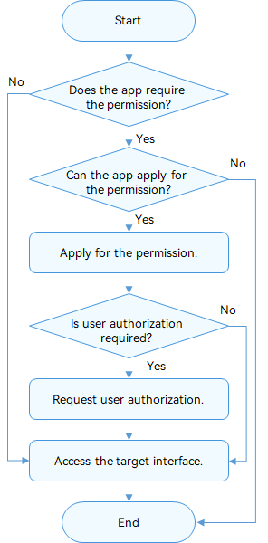
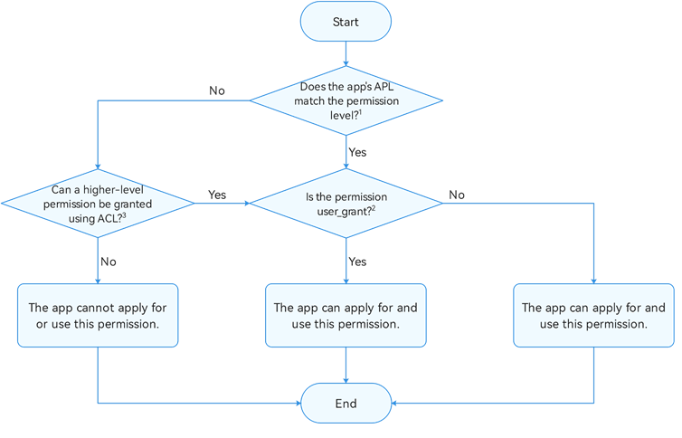
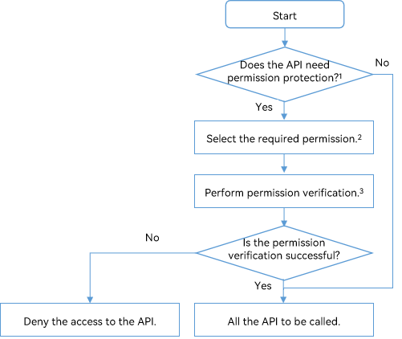

# Access Control (Permission) Overview

OpenHarmony AccessTokenManager (ATM) implements unified app permission management based on access tokens.

By default, apps can access limited system resources. However, in some cases, an app needs to access excess data (including personal data) and functions of the system or another app to implement extended functions. The system or apps must also explicitly share their data or functions through APIs. OpenHarmony uses app permissions to perform access control and prevent improper or malicious use of these data or functions.

App permissions are used to protect the following objects:

- Data: personal data (such as photos, contacts, calendar, and location), device data (such as device ID, camera, and microphone), and app data.
- Functions: device functions (such as making calls, sending SMS messages, and connecting to the Internet) and app functions (such as displaying windows and creating shortcuts).

Without the required permissions, an app cannot access or perform operations on the target object. Permissions must be clearly defined for apps. With well-defined app permissions, the system can standardize the behavior of apps and protect user privacy. Before an app accesses the target object, the target object verifies the app's permissions and denies the access if the app does not have required permissions.

Currently, ATM verifies app permissions based on the token identity (token ID). A token ID identifies an app. ATM manages app permissions based on the app's token ID.

## Basic Principles for Permission Management

Observe the following principles for permission management:

- Provide clear description about the app functions and scenarios for each permission required by the app so that users can clearly know why and when these permissions are required. Do not induce or mislead users' authorization. The permissions on an app must comply with the description provided in the app.
- Use the principle of least authority for user permissions. Allow only necessary permissions for service functions.
- When an app is started for the first time, avoid frequently displaying dialog boxes to request multiple permissions. Allow the app to apply for the permission only when it needs to use the corresponding service function.
- If a user rejects to grant a permission, the user can still use functions irrelevant to this permission and can register and access the app.
- Provide no more message if a user rejects the authorization required by a function. Provide onscreen instructions to direct the user to grant the permission in **Settings** if the user triggers this function again or needs to use this function.

- All the permissions granted to apps must come from the [App Permission List](permission-list.md). Custom permissions are not allowed for apps currently.

## Permission Workflows

### Permission Application and Use

Determine the permissions required by an app, and declare the required permissions in the app installation package.

Determine whether the required permissions need user authorization. If yes, display a dialog box dynamically to request user authorization.

After the user grants the permissions, the app can access the data or perform the operation.

The figure below illustrates the process.



1. Refer to the figure below to determine whether an app can apply for a permission.



1. See [Permission Levels](#permission-levels) for details about the mapping between the application Ability Privilege Level (APL) and permission level.

2. The permission authorization modes include user_grant (permission granted by the user) and system_grant (permission granted by the system). For details, see [Permission Types](#permission-types).

3. A low-APL app can have a high-level permission by using the Access Control List (ACL). For details, see [ACL](#acl).

### Permission Verification
To protect sensitive data and eliminate security threads on core abilities, you can use the permissions in the [App Permission List](permission-list.md) to protect the related API from unauthorized calling. Each time before the API is called, a permission verification is performed to check whether the caller has the required permission. The API can be called only after the permission verification is successful.

The figure below shows the permission verification process.



1: An app permission can be used to control the access to an API that has sensitive data involved or security threats on the core abilities.

2: Select the permission from the [App Permission List](permission-list.md). For example, if contact information is involved in an API provided by an app, you can use the contact-related permissions to protect the API.

3: Use **verifyAccessToken()** to check whether the caller has the required permission. For details, see [Permission Verification Guide](permission-verify-guidelines.md).

## Permission Levels

ATM defines different permission levels based on the sensitivity of the data involved or the security threat of the ability to protect user privacy.

### App APLs

The APL defines the priority of the app permission requested. Apps of different APLs can apply for permissions of different levels.

The table below describes the APLs.

| APL         | Description                                  |
| ---------------- | -------------------------------------- |
| system_core | The apps of this level provide core abilities of the operating system (OS). |
| system_basic| The apps of this level provide basic system services.    |
| Normal      | The apps of this level are normal apps.                            |

The default APL of apps is **normal**.

To set an app's APL to **system_basic** or **system_core**, declare the APL in the **apl** field of **bundle-info** in the app's profile when developing the app's installation package.

Then, use the [hapsigner](hapsigntool-overview.md) tool to generate a certificate or use DevEco Studio to [have your app automatically signed](https://developer.harmonyos.com/en/docs/documentation/doc-guides/ohos-auto-configuring-signature-information-0000001271659465#section161281722111).

> **CAUTION**<br>The method of changing the app's APL in its profile applies only to the app or service in debug mode. For a commercial app, apply for a release certificate and profile in the corresponding app market.

The following is an example.

This example shows only the modification of the **apl** field. Set other fields based on your requirements. For details about the fields in the profile, see [HarmonyAppProvision Configuration File](../quick-start/app-provision-structure.md).

```json
{
	"bundle-info" : {
		"developer-id": "OpenHarmony",
		"development-certificate": "Base64 string",
		"distribution-certificate": "Base64 string",
		"bundle-name": "com.OpenHarmony.app.test",
		"apl": "system_basic",
        "app-feature": "hos_normal_app"
	},
}
```

### Levels of Permissions

The permissions open to apps vary with the permission level. The permission levels include the following in ascending order of seniority.

- **normal**

    The normal permission allows access to common system resources beyond the default rules. Access to these system resources (including data and functions) has minor risks on user privacy and other apps.

    The permissions of this level are available only to apps of the normal or higher APL.

- **system_basic**

    The system_basic permission allows access to resources related to basic OS services. The basic services are basic functions provided or preconfigured by the system, such as system settings and identity authentication. Access to these resources may have considerable risks to user privacy and other apps.

    The permissions of this level are available only to apps of the system_basic or system_core APL.

- **system_core**

    The system_core permission allows access to core resources of the OS. These resources are underlying core services of the system. If these resources are corrupted, the OS cannot run properly.
    
    The system_core permissions are not open to third-party apps currently.

## Permission Types

Permissions can be classified into the following types based on the authorization mode:

- **system_grant**

   The app permissions are authorized by the system. This type of apps cannot access user or device sensitive information. The allowed operations have minor impact on the system or other apps.

    For a system_grant app, the system automatically grants the required permissions to the app when the app is installed. The system_grant permission list must be presented to users on the details page of the app in the app store.

- **user_grant**

    The app permissions must be authorized by users. This type of apps may access user or device sensitive information. The allowed operations may have a critical impact on the system or other apps.

    This type of permissions must be declared in the app installation package and authorized by users dynamically during the running of the app. The app has the permission only after user authorization.

    For example, in the [App Permission List](permission-list.md), the permissions for microphones and cameras are user_grant. The list provides reasons for using the permissions.

    The user_grant permission list must also be presented on the details page of the app in the app store.

### Authorization Processes

As described in [Permission Workflows](permission-workflows), you need to first apply for the required permissions for the app.

- Applying for permissions

   You need to [declare the required permissions](accesstoken-guidelines.md#declaring-permissions) in the configuration file.

- Authorizing permissions

   - The system_grant permission will be pre-granted when the app is installed.
   - For a user_grant permission, you need to trigger user authorization through a dialog box during the running of the app. For details, see [Requesting User Authorization](#requesting-user-authorization).

### Requesting User Authorization

The procedure is as follows:

1. In the configuration file, declare the permissions required by the app. For details, see [Access Control Development](accesstoken-guidelines.md).

2. Associate the target objects in the app with the related permissions. This allows the users to know the operations that need user authorization.

3. Use an API to dynamically trigger a dialog box requesting user authorization when the target object is accessed. The API first checks whether the user has granted the required permissions to the app. If yes, the app can access the data or perform the operation. Otherwise, a dialog box will be displayed to request user authorization.

4. Check the user authorization result. Allow the subsequent operation only after the user has granted the permissions to the app.

**Precautions**

- Check the app's permission each time before the operation requiring the permission is performed.
- To check whether a user has granted specific permissions to an app, use the [verifyAccessToken](../reference/apis/js-apis-abilityAccessCtrl.md) method. This method returns [PERMISSION_GRANTED](../reference/apis/js-apis-abilityAccessCtrl.md) or [PERMISSION_DENIED](../reference/apis/js-apis-abilityAccessCtrl.md). For details about the sample code, see [Access Control Development](accesstoken-guidelines.md).
- Users must be able to understand and control the authorization of user_grant permissions. During the running process, the app requiring user authorization must proactively call an API to dynamically request the authorization. Then, the system displays a dialog box asking the user to grant the permission. The user will determine whether to grant the permission based on the running context of the app.
- The permission authorized is not permanent, because the user may revoke the authorization at any time. Therefore, even if the user has granted the requested permission to the app, the app must check for the permission before calling the API controlled by this permission.

## ACL

As described above, permission levels and app APLs are in one-to-one correspondence. In principle, **an app with a lower APL cannot apply for higher permissions by default**.

The ACL makes low-APL apps have high-level permissions.

**Example**

The APL of app A is **normal**. App A needs to have permission B (system_basic level) and permission C (normal level).

In this case, you can use the ACL to grant permission B to app A.

For details, see [Using the ACL](#using-the-acl).
For details about whether a permission can be enabled through the ACL, see the [App Permission List](permission-list.md).

### Using the ACL

If the permission required by an app has higher level than the app's APL, you can use the ACL to grant the permission required.

In addition to the preceding [authorization processes](#authorization-processes), you must declare the ACL.

That is, you need to declare the required permissions in the app's configuration file, and [declare the ACL](accesstoken-guidelines.md#declaring-the-acl) in the app's profile. The subsequent steps of authorization are the same.

**NOTICE**

When developing an app installation package, you must declare the ACL in the **acls** field in the app's profile. Then, use the [hapsigner](hapsigntool-overview.md) tool to generate a certificate.

> **CAUTION**<br>The method of changing the app's APL in its profile applies only to the app or service in debug mode. For a commercial app, apply for a release certificate and profile in the corresponding app market.

```json
{
    "acls": {
        "allowed-acls": [
            "ohos.permission.PERMISSION"
        ]
    },
}
```

For details about the fields in the profile, see [HarmonyAppProvision Configuration File](../quick-start/app-provision-structure.md).
