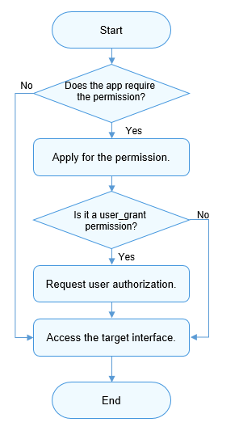

# Access Control Overview

## Introduction
AccessTokenManager (ATM) implements unified app permission management based on access tokens on OpenHarmony.

By default, apps can access limited system resources. However, in some cases, an app needs to access excess data (including personal data) and functions of the system or another app to implement extended functions. The system or apps must also share their data or functions through interfaces in an explicit manner. OpenHarmony uses app permissions to perform access control and prevent improper or malicious use of these data or functions.

App permissions are used to protect the following objects:

- Data: personal data (such as photos, contacts, calendar, and location), device data (such as device ID, camera, and microphone), and app data.
- Functions: device functions (such as making calls, sending SMS messages, and connecting to the Internet) and app functions (such as displaying windows and creating shortcuts).

Without the required permissions, an app cannot access or perform operations on the target object. Permissions must be clearly defined for apps. With well-defined app permissions, the system can standardize the behavior of apps and protect user privacy. Before an app accesses the target object, the target object verifies the app's permissions and denies the access if the app does not have required permissions.

Currently, ATM performs app permission verification based on the token identity (Token ID). A token ID identifies an app. The ATM manages app permissions based on the app's token ID.

## How to Develop

Determine the permissions required for an app to access data or perform an operation. Declare the required permissions in the app installation package.

Determine whether the required permissions need to be authorized by users. If yes, provide a dialog box dynamically to request user authorization.

After the user grants permissions to the app, the app can access the data or perform the operation.

The figure below shows the process.

## When to Use

### Scenarios

The following describes two common scenarios.

- **Video playback apps**

    Video playback apps need to use multimedia functions and read and write media files stored on storage devices. Therefore, the apps must have at least the following permissions:

    * ohos.permission.READ_MEDIA (allowing the apps to read external media files)

    * ohos.permission.WRITE_MEDIA (allowing the apps to read and write external media files)

- **Photography apps**

    Photography apps need to use the camera function. Before accessing the camera service, the apps must have the following permission:

    ohos.permission.CAMERA (allowing the apps to use the camera to take photos and record videos)

### Basic Principles

Observe the following principles for permission management:

- Provide clear description about the app functions and scenarios for each permission required by the app so that users can clearly know why and when these permissions are required. Do not induce or mislead users' authorization. The permissions on an app must comply with the description provided in the app.
- Use the principle of least authority for user permissions. Allow only necessary permissions for service functions.
- When an app is started for the first time, avoid frequently displaying dialog boxes to request permissions. Allow the app to apply for permissions only when it needs to use the corresponding service functions.
- If a user rejects to authorize a permission, the user can still use functions irrelevant to this permission and can register and access the app.
- Provide no more message if a user rejects the authorization required by a function. Provide onscreen instructions to direct the user to grant the permission in **Settings** if the user triggers this function again or needs to use this function.

- All the permissions granted to apps must come from the Permission List. Custom permissions are not allowed for apps currently.

## Permission Levels

To protect user privacy, ATM defines different permission levels based on the sensitivity of the data involved or the security threat of the ability.

### App APL

The ability privilege level (APL) defines the priority of the app permission requested. Apps of different APLs can apply for permissions of different levels.

The table below describes the APLs.

| APL         | Description                                  |
| ---------------- | -------------------------------------- |
| system_core | The apps of this level provide core abilities of the operating system.|
| system_basic| The apps of this level provide basic system services.    |
| Normal      | The apps of this level are normal apps.                            |

By default, apps are of the normal APL.

For the app of the system_basic or system_core APL, declare the app APL level in the **apl** field in the app's profile, and use the profile signing tool to generate a certificate when developing the app installation package. For details about the signing process, see [Hapsigner Guide](hapsigntool-guidelines.md).

### Permission Levels

The permissions open to apps vary with the permission level. The permission levels include the following in ascending order of seniority.

- **normal**

    The normal permission allows access to common system resources beyond the default rules. Access to these system resources (including data and functions) has minor risks on user privacy and other apps.

    The permissions of this level are available only to apps of the normal or higher APL.

- **system_basic**

    The system_basic permission allows access to resources related to basic operating system services. The basic services are basic functions provided or preconfigured by the system, such as system setting and identity authentication. Access to these resources may have considerable risks to user privacy and other apps.

    The permissions of this level are available only to the apps of the system_basic APL.

- **system_core**

    The system_core permission allows access to core resources of the operating system. These resources are the underlying core services of the system. If these resources are corrupted, the OS cannot run properly.
    
    The permissions of this type are not open to any app currently.

### ACL

As described above, permission levels and app APLs are in one-to-one correspondence. In principle, **an app with a lower APL cannot apply for higher permissions by default**.

The Access Control List (ACL) makes low-level apps have high-level permissions.

**Example**

The APL of app A is normal. App A needs to have permission B (system_basic level) and permission C (normal level).

In this case, you can use the ACL to grant permission B to app A.

For details, see [Using the ACL](#using-the-acl).
For details about whether the ACL is enabled for a permission, see [Permission List](permission-list.md).

### Using the ACL

If the permission required by an app has higher level than the app's APL, you can use the ACL to grant the permissions required.

In addition to the preceding [authorization processes](#authorization-processes), you must declare the ACL.

In other words, in addition to declaring the required permissions in the **config.json** file, you must declare the high-level permissions in the app's [profile](accesstoken-guidelines.md#declaring-the-acl). The subsequent steps of authorization are the same.

**NOTE**

Declare the target ACL in the **acl** field of the app's profile in the app installation package, and generate a certificate using the profile signing tool. For details about the signing process, see [Hapsigner Guide](hapsigntool-guidelines.md).

## Permission Authorization Modes

Permissions can be classified into the following types based on the authorization mode:

- **system_grant**

   The app permissions are authorized by the system. This type of apps cannot access user or device sensitive information. The allowed operations have minor impact on the system or other apps.

    For a system_grant app, the system automatically grants the required permissions to the app when the app is installed. The system_grant permission list must be presented to users on the details page of the app in the app store.

- **user_grant**

    The app permissions must be authorized by users. This type of apps may access user or device sensitive information. The allowed operations may have a critical impact on the system or other apps.

    This type of permissions must be declared in the app installation package and authorized by users dynamically during the running of the app. The app has the permission only after user authorization.

    For example, in the [Permission List](permission-list.md), the permissions for the microphone and camera are user_grant. The list provides reasons for using the permissions.

    The user_grant permission list must also be presented on the details page of the app in the app store.

### Authorization Processes

The process for an app obtaining the required permissions varies depending on the permission authorization mode.

- For a system_grant permission, you need to [declare the permission](accesstoken-guidelines.md) in the **config.json** file. The permission will be pre-granted when the app is installed.

- For a user_grant permission, you need to [declare the permission](accesstoken-guidelines.md) in the **config.json** file, and a dialog box needs to be displayed to request user authorization during the running of the app.

### Permission Authorization Process (user_grant)

The procedure is as follows:

1. In the **config.json** file, declare the permissions required by the app. For details, see [Access Control Development](accesstoken-guidelines.md).

2. Associate the object that requires the permissions in the app with the target permissions. In this way, the user knows the operations to be granted with the specified permissions.

3. Check whether the user has granted the required permissions to the app when the app is running. If yes, the app can access the data or perform the operation. If the user has not granted the permissions to the app, display a dialog box requesting the user authorization when the app attempts to access the data.

4. Check the user authorization result. Allow the next step only after the user has granted the permissions to the app.

**Precautions**

- Check the app's permission each time before the operation requiring the permission is performed.

- To check whether a user has granted specific permissions to your app, use the [verifyAccessToken](../reference/apis/js-apis-abilityAccessCtrl.md) method. This method returns [PERMISSION_GRANTED](../reference/apis/js-apis-abilityAccessCtrl.md) or [PERMISSION_DENIED](../reference/apis/js-apis-abilityAccessCtrl.md). For details about the sample code, see [Access Control Development](accesstoken-guidelines.md).
- Users must be able to understand and control the authorization of user_grant permissions. During the running process, the app requiring user authorization must proactively call the API to dynamically request the authorization. Then, the system displays a dialog box asking the user to grant the requested permission. The user will determine whether to grant the permission based on the running context of the app.
- The permission authorized is not permanent, because the user may revoke the authorization at any time. Therefore, even if the user has granted the requested permission to the app, the app must check for the permission before calling the API controlled by this permission.
