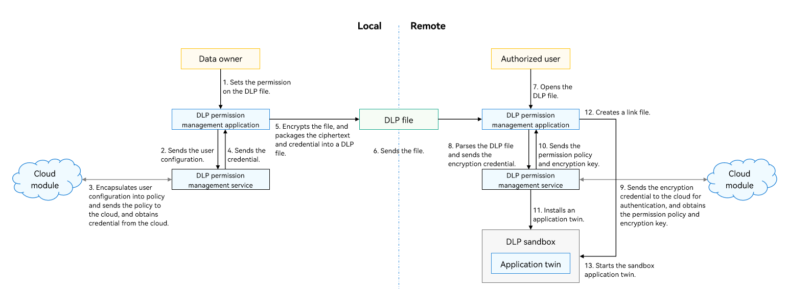

# DLP Overview

Data loss prevention (DLP) is a system solution provided by OpenHarmony to prevent data disclosure. It provides capabilities for cross-device file access management, encrypted storage, and access authorization. The data owner can grant the permission (read only, edit, or full control) on a confidential file based on account authentication. The confidential file is encrypted and stored in ciphertext. Only the user who has passed the device-cloud authentication using a DLP-capable device can access or modify the file.

DLP is a system solution. You can have complete DLP protection with little or no adaptation.

The DLP solution consists of the following components:

- DLP permission management component
  
  Implements functions such as creating a sandbox application and managing credentials.

- DLP management application component
  
  Implements functions of setting and verifying permissions and rejecting access requests locally. It implements the controlled share that can be perceived by users.

- Cloud module (implemented by developers)
  
  Sends DLP certificates to the cloud for account-based authentication, generates certificates, and decrypts the DLP files.

## Working Principles

**Generating a DLP File**

1. The file owner sets permissions for the confidential file through the DLP permission management application, and adds the accounts that can access the file and authorized user information.
2. The DLP permission management application sends the user configuration to the DLP permission management service, which encapsulates the configuration into policy information.
3. The DLP permission management service sends the policy information to the cloud module. The cloud module sends the policy information for device-cloud synergy authentication, checks the policy, and generates and issues the credential.
4. The cloud module sends the credential to the DLP permission management service through the DLP permission management application.
5. The DLP permission management application encrypts the file and packages the credential and ciphertext into a DLP file.

**Transferring a DLP File**

6. The DLP files can be sent to target users in any way. The ciphertext ensures the file confidentiality.

**Opening a DLP File**

7. The authorized user opens the DLP file on the remote device (for example, using the file manager).
8. The DLP permission management application parses the DLP file, obtains the encrypted credential, and sends it to the DLP permission management service.
9. The DLP permission management service sends the encrypted credential to the cloud module. The cloud module sends the credential to the cloud for identity authentication, credential verification, and policy parsing, and obtains the authorization policy and encryption key.
10. The cloud module sends the permission policy and encryption key to the DLP permission management application through the DLP permission management service.
11. The DLP permission management application invokes the DLP permission management service to install the DLP sandbox twin for the application and perform access control based on the authorization.
12. The DLP permission management application uses a link mechanism to map the plaintext and ciphertext. Based on the open-source Filesystem in Userspace (FUSE), the link mechanism creates a virtual link file (which is mapped to the DLP file) and shares the link file to the application. The application can access and edit the plaintext file, and the operations are synchronized to the DLP file in real time.
13. When the DLP permission management application is ready, it starts the application in the sandbox and transfers the link file descriptor. The sandbox application starts, and the application process opens the link file.
