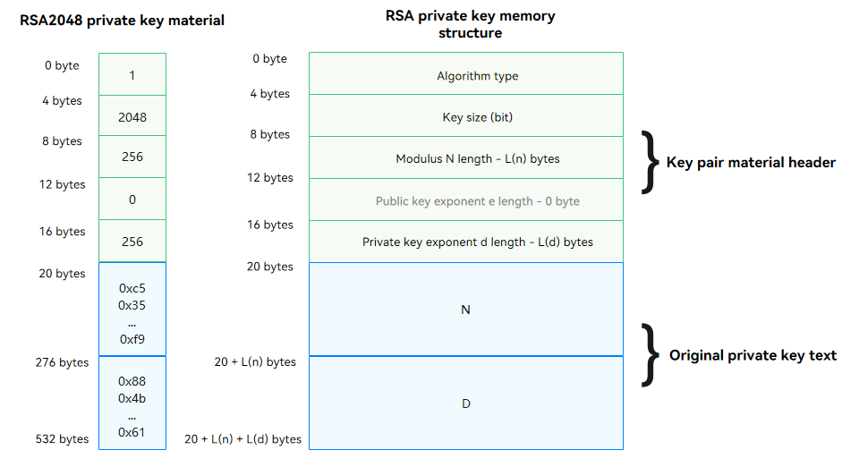

# HUKS Cipher Algorithm Specifications

## Supported Algorithm Types and Parameter Combinations

### Key Import/Generation

| Algorithm&nbsp;&nbsp;&nbsp;&nbsp;&nbsp;&nbsp;&nbsp;&nbsp;&nbsp;&nbsp;&nbsp;&nbsp;&nbsp;&nbsp;&nbsp;&nbsp;&nbsp;&nbsp;    | API Level| Supported Key Length (Bit)    |
| -------------- | :---------------: | ------------------ |
| AES    |        8+         | 128, 192, 256|
| RSA    |        8+         | 512, 768, 1024, 2048, 3072, 4096|
| HMAC   |        8+         | 8 to 1024 (inclusive)<br/>The value must be an integer multiple of 8. |
| ECC    |        8+         | 224, 256, 384, 521|
| Ed25519 |        8+         | 256    |
| X25519  |        8+         | 256    |
| DSA    |        8+         | 8 to 1024 (inclusive)<br/>The value must be an integer multiple of 8. |
| DH    |        8+         | 2048, 3072, 4096               |
| SM2    |        9+         | 256                |
| SM3    |        9+         | 256                |
| SM4    |        9+         | 128                |

### Encryption and Decryption

| Algorithm&nbsp;&nbsp;&nbsp;&nbsp;&nbsp;&nbsp;&nbsp;&nbsp;&nbsp;&nbsp;&nbsp;&nbsp;&nbsp;&nbsp;&nbsp;&nbsp;&nbsp;&nbsp; | API Level| Remarks                                                        |
| ----------------------- | :----: | ---------------- |
| AES/CBC/NoPadding<br>AES/ECB/NoPadding<br>AES/CTR/NoPadding<br>AES/GCM/NoPadding<br>AES/CBC/PKCS7<br>AES/ECB/PKCS7 | 8+                | The initialization vector (IV) is mandatory in CBC, ECB, or CTR mode.<br>The **Nonce**, **AAD**, and **AEAD** parameters are mandatory in GCM mode. |
| RSA/ECB/NoPadding<br>RSA/ECB/PKCS1_V1_5<br>RSA/ECB/OAEP             | 8+                |    |
| SM4/CTR/NoPadding<br>SM4/ECB/NoPadding<br>SM4/CBC/NoPadding<br>SM4/ECB/PKCS7<br>SM4/CBC/PKCS7 | 9+                |   |


### Signing and Signature Verification


| Algorithm     | API Level| Remarks    |
| --------- | :----------: | ----------------- |
| RSA/MD5/PKCS1_V1_5<br>RSA/SHA1/PKCS1_V1_5<br>RSA/SHA224/PKCS1_V1_5<br>RSA/SHA256/PKCS1_V1_5<br>RSA/SHA384/PKCS1_V1_5<br>RSA/SHA512/PKCS1_V1_5<br>RSA/SHA1/PSS<br>RSA/SHA224/PSS<br>RSA/SHA256/PSS<br>RSA/SHA384/PSS | 8+                | |
| RSA/NoDigest/PKCS1_V1_5 | 9+                | |
| DSA/SHA1<br>DSA/SHA224<br>DSA/SHA256<br>DSA/SHA384<br>DSA/SHA512     |  8+                | |
| DSA/NoDigest     |  9+                | |
| ECC/SHA1<br>ECC/SHA224<br>ECC/SHA256<br>ECC/SHA384<br>ECC/SHA512      | 8+                | |
| ECC/NoDigest     |  9+                | |
| ED25519/SHA1<br>ED25519/SHA224<br>ED25519/SHA256<br>ED25519/SHA384<br>ED25519/SHA512 |8+                | |
| ED25519/NoDigest     |  9+                | |
| SM2/SM3<br>SM2/NoDigest |9+                | |

### Key Agreement

| Algorithm&nbsp;&nbsp;&nbsp;&nbsp;&nbsp;&nbsp;&nbsp;&nbsp;&nbsp;&nbsp;&nbsp;&nbsp;&nbsp;&nbsp;&nbsp;&nbsp;&nbsp;&nbsp;   | API Level| Remarks    |
| ------ | :-----------: | ------------------------------ |
| ECDH    | 8+   |  The key must be of the ECC type. |
| DH        | 8+  |             |
| X25519  | 8+  |             |

### Key Derivation

| Algorithm&nbsp;&nbsp;&nbsp;&nbsp;&nbsp;&nbsp;&nbsp;&nbsp;&nbsp;&nbsp;&nbsp;&nbsp;&nbsp;&nbsp;&nbsp;&nbsp;&nbsp;&nbsp; |API Level        | Derived Key and Length (Bit)       | Remarks                 |
| ------------------------- | :-----------: | :----------: | ----------------- |
| HKDF/SHA256<br>HKDF/SHA384<br>HKDF/SHA512   | 8+ | Algorithm: AES, HMAC, and SM4<br>Length: 256, 384, 512 | The derived key can be stored in the HUKS or directly returned in plaintext.|
| PBKDF2/SHA256<br>PBKDF2/SHA384<br>PBKDF2/SHA512    | 8+ | Algorithm: AES, HMAC, and SM4<br>Length: 256, 384, 512 | The derived key can be stored in the HUKS or directly returned in plaintext.|

### Key Attestation

| Algorithm&nbsp;&nbsp;&nbsp;&nbsp;&nbsp;&nbsp;&nbsp;&nbsp;&nbsp;&nbsp;&nbsp;&nbsp;&nbsp;&nbsp;&nbsp;&nbsp;&nbsp;&nbsp; |API Level| Remarks                                           |
| ------------------ | :-----: | ------------------------------------------------------------ |
| RSA | 9+ | Only the keys using the PSS padding are supported. |
| ECC                | 9+ |   |
| X25519             | 9+ |   |

## Key Material Formats
HUKS defines a set of formats for the material of key pairs, public keys, and private keys of different cipher algorithms.

### Key Pair Material
Key pair material = Key pair material header + Original key pair material

The following uses the RSA key as an example. The application needs to apply for a Uint8Array and assign the variables to the corresponding positions based on the memory structure of the RSA key pair material.

**Figure 1** Memory structure of the SRSA key material


```ts
let rsa2048KeyPairMaterial = new Uint8Array([
    0x01, 0x00, 0x00, 0x00, // Key algorithm: huks.HuksKeyAlg.HUKS_ALG_RSA = 1
    0x00, 0x08, 0x00, 0x00, // Key size: 2048 bits
    0x00, 0x01, 0x00, 0x00, // Length of modulus n: 256 bytes
    0x03, 0x00, 0x00, 0x00, // Length of the public key exponent e: 3 bytes
    0x00, 0x01, 0x00, 0x00, // Length of the private key exponent d: 256 bytes
    // Modulus n
    0xc5, 0x35, 0x62, 0x48, 0xc4, 0x92, 0x87, 0x73, 0x0d, 0x42, 0x96, 0xfc, 0x7b, 0x11, 0x05, 0x06,
    0x0f, 0x8d, 0x66, 0xc1, 0x0e, 0xad, 0x37, 0x44, 0x92, 0x95, 0x2f, 0x6a, 0x55, 0xba, 0xec, 0x1d,
    0x54, 0x62, 0x0a, 0x4b, 0xd3, 0xc7, 0x05, 0xe4, 0x07, 0x40, 0xd9, 0xb7, 0xc2, 0x12, 0xcb, 0x9a,
    0x90, 0xad, 0xe3, 0x24, 0xe8, 0x5e, 0xa6, 0xf8, 0xd0, 0x6e, 0xbc, 0xd1, 0x69, 0x7f, 0x6b, 0xe4,
    0x2b, 0x4e, 0x1a, 0x65, 0xbb, 0x73, 0x88, 0x6b, 0x7c, 0xaf, 0x7e, 0xd0, 0x47, 0x26, 0xeb, 0xa5,
    0xbe, 0xd6, 0xe8, 0xee, 0x9c, 0xa5, 0x66, 0xa5, 0xc9, 0xd3, 0x25, 0x13, 0xc4, 0x0e, 0x6c, 0xab,
    0x50, 0xb6, 0x50, 0xc9, 0xce, 0x8f, 0x0a, 0x0b, 0xc6, 0x28, 0x69, 0xe9, 0x83, 0x69, 0xde, 0x42,
    0x56, 0x79, 0x7f, 0xde, 0x86, 0x24, 0xca, 0xfc, 0xaa, 0xc0, 0xf3, 0xf3, 0x7f, 0x92, 0x8e, 0x8a,
    0x12, 0x52, 0xfe, 0x50, 0xb1, 0x5e, 0x8c, 0x01, 0xce, 0xfc, 0x7e, 0xf2, 0x4f, 0x5f, 0x03, 0xfe,
    0xa7, 0xcd, 0xa1, 0xfc, 0x94, 0x52, 0x00, 0x8b, 0x9b, 0x7f, 0x09, 0xab, 0xa8, 0xa4, 0xf5, 0xb4,
    0xa5, 0xaa, 0xfc, 0x72, 0xeb, 0x17, 0x40, 0xa9, 0xee, 0xbe, 0x8f, 0xc2, 0xd1, 0x80, 0xc2, 0x0d,
    0x44, 0xa9, 0x59, 0x44, 0x59, 0x81, 0x3b, 0x5d, 0x4a, 0xde, 0xfb, 0xae, 0x24, 0xfc, 0xa3, 0xd9,
    0xbc, 0x57, 0x55, 0xc2, 0x26, 0xbc, 0x19, 0xa7, 0x9a, 0xc5, 0x59, 0xa3, 0xee, 0x5a, 0xef, 0x41,
    0x80, 0x7d, 0xf8, 0x5e, 0xc1, 0x1d, 0x32, 0x38, 0x41, 0x5b, 0xb6, 0x92, 0xb8, 0xb7, 0x03, 0x0d,
    0x3e, 0x59, 0x0f, 0x1c, 0xb3, 0xe1, 0x2a, 0x95, 0x1a, 0x3b, 0x50, 0x4f, 0xc4, 0x1d, 0xcf, 0x73,
    0x7c, 0x14, 0xca, 0xe3, 0x0b, 0xa7, 0xc7, 0x1a, 0x41, 0x4a, 0xee, 0xbe, 0x1f, 0x43, 0xdd, 0xf9,
    // Public key exponent e
    0x01, 0x00, 0x01,
    // Private key exponent d
    0x88, 0x4b, 0x82, 0xe7, 0xe3, 0xe3, 0x99, 0x75, 0x6c, 0x9e, 0xaf, 0x17, 0x44, 0x3e, 0xd9, 0x07,
    0xfd, 0x4b, 0xae, 0xce, 0x92, 0xc4, 0x28, 0x44, 0x5e, 0x42, 0x79, 0x08, 0xb6, 0xc3, 0x7f, 0x58,
    0x2d, 0xef, 0xac, 0x4a, 0x07, 0xcd, 0xaf, 0x46, 0x8f, 0xb4, 0xc4, 0x43, 0xf9, 0xff, 0x5f, 0x74,
    0x2d, 0xb5, 0xe0, 0x1c, 0xab, 0xf4, 0x6e, 0xd5, 0xdb, 0xc8, 0x0c, 0xfb, 0x76, 0x3c, 0x38, 0x66,
    0xf3, 0x7f, 0x01, 0x43, 0x7a, 0x30, 0x39, 0x02, 0x80, 0xa4, 0x11, 0xb3, 0x04, 0xd9, 0xe3, 0x57,
    0x23, 0xf4, 0x07, 0xfc, 0x91, 0x8a, 0xc6, 0xcc, 0xa2, 0x16, 0x29, 0xb3, 0xe5, 0x76, 0x4a, 0xa8,
    0x84, 0x19, 0xdc, 0xef, 0xfc, 0xb0, 0x63, 0x33, 0x0b, 0xfa, 0xf6, 0x68, 0x0b, 0x08, 0xea, 0x31,
    0x52, 0xee, 0x99, 0xef, 0x43, 0x2a, 0xbe, 0x97, 0xad, 0xb3, 0xb9, 0x66, 0x7a, 0xae, 0xe1, 0x8f,
    0x57, 0x86, 0xe5, 0xfe, 0x14, 0x3c, 0x81, 0xd0, 0x64, 0xf8, 0x86, 0x1a, 0x0b, 0x40, 0x58, 0xc9,
    0x33, 0x49, 0xb8, 0x99, 0xc6, 0x2e, 0x94, 0x70, 0xee, 0x09, 0x88, 0xe1, 0x5c, 0x4e, 0x6c, 0x22,
    0x72, 0xa7, 0x2a, 0x21, 0xdd, 0xd7, 0x1d, 0xfc, 0x63, 0x15, 0x0b, 0xde, 0x06, 0x9c, 0xf3, 0x28,
    0xf3, 0xac, 0x4a, 0xa8, 0xb5, 0x50, 0xca, 0x9b, 0xcc, 0x0a, 0x04, 0xfe, 0x3f, 0x98, 0x68, 0x81,
    0xac, 0x24, 0x53, 0xea, 0x1f, 0x1c, 0x6e, 0x5e, 0xca, 0xe8, 0x31, 0x0d, 0x08, 0x12, 0xf3, 0x26,
    0xf8, 0x5e, 0xeb, 0x10, 0x27, 0xae, 0xaa, 0xc3, 0xad, 0x6c, 0xc1, 0x89, 0xdb, 0x7d, 0x5a, 0x12,
    0x55, 0xad, 0x11, 0x19, 0xa1, 0xa9, 0x8f, 0x0b, 0x6d, 0x78, 0x8d, 0x1c, 0xdf, 0xe5, 0x63, 0x82,
    0x0b, 0x7d, 0x23, 0x04, 0xb4, 0x75, 0x8c, 0xed, 0x77, 0xfc, 0x1a, 0x85, 0x29, 0x11, 0xe0, 0x61,
    ]);
```

The key algorithm is a value of [HuksKeyAlg](../reference/apis/js-apis-huks.md#hukskeyalg).

- **RSA Key Pair Material Format**
    | Key Algorithm| Key Size| Modulus n Length L<sub>n</sub>| Public Key Exponent e Length L<sub>e</sub> | Private Key Exponent d Length L<sub>d</sub>| n | e | d |
    | :----: |:----:|:----:|:----:|:----:|:----:|:----:|:----:|
    |4 bytes|4 bytes|4 bytes|4 bytes|4 bytes|L<sub>n</sub> bytes|L<sub>e</sub> bytes|L<sub>d</sub> bytes|


- **ECC Key Pair Material Format**
    | Key Algorithm| Key Size| Coordinate x Length L<sub>x</sub>| Coordinate y Length L<sub>y</sub>| Coordinate z Length L<sub>z</sub>| x | y | z |
    | :----: |:----:|:----:|:----:|:----:|:----:|:----:|:----:|
    |4 bytes|4 bytes|4 bytes|4 bytes|4 bytes|L<sub>x</sub> bytes|L<sub>y</sub> bytes|L<sub>z</sub> bytes|


- **DSA Key Pair Material Format**
    | Key Algorithm| Key Size| Private Key x Length L<sub>x</sub>| Public Key y Length L<sub>y</sub>| Prime p Length L<sub>p</sub>| Prime Factor q Length L<sub>q</sub>| g length L<sub>g</sub>| x | y | p | q | g |
    | :----: |:----:|:----:|:----:|:----:|:----:|:----:|:----:|:----:|:----:|:----:|:----:|
    |4 bytes|4 bytes|4 bytes|4 bytes|4 bytes|4 bytes|4 bytes|L<sub>x</sub> bytes|L<sub>y</sub> bytes|L<sub>p</sub> bytes|L<sub>q</sub> bytes|L<sub>g</sub> bytes|


- **DH Key Pair Material Format**
    | Key Algorithm| Key Size| Public Key pk Length L<sub>pk</sub>| Private Key sk Length L<sub>sk</sub>| Reserved Field| pk | sk |
    |:----:|:----:|:----:|:----:|:----:|:----:|:----:|
    |4 bytes|4 bytes|4 bytes|4 bytes|4 bytes|L<sub>pk</sub> bytes|L<sub>sk</sub> bytes|


- **Curve25519 Key Pair Material Format**
    | Key Algorithm| Key Size| Public Key pk Length L<sub>pk</sub>| Private Key sk Length L<sub>sk</sub>| Reserved Field| pk | sk |
    |:----:|:----:|:----:|:----:|:----:|:----:|:----:|
    |4 bytes|4 bytes|4 bytes|4 bytes|4 bytes|L<sub>pk</sub> bytes|L<sub>sk</sub> bytes|


### Public Key Material

When a public key is exported or imported, the key material is encapsulated in the DER format defined in X.509.

The following is ECC public key in EDR format:
```ts
let eccP256PubKey = new Uint8Array([
  0x30, 0x59, 0x30, 0x13, 0x06, 0x07, 0x2a, 0x86, 0x48, 0xce, 0x3d, 0x02, 0x01, 0x06, 0x08, 0x2a,
  0x86, 0x48, 0xce, 0x3d, 0x03, 0x01, 0x07, 0x03, 0x42, 0x00, 0x04, 0xc0, 0xfe, 0x1c, 0x67, 0xde,
  0x86, 0x0e, 0xfb, 0xaf, 0xb5, 0x85, 0x52, 0xb4, 0x0e, 0x1f, 0x6c, 0x6c, 0xaa, 0xc5, 0xd9, 0xd2,
  0x4d, 0xb0, 0x8a, 0x72, 0x24, 0xa1, 0x99, 0xaf, 0xfc, 0x3e, 0x55, 0x5a, 0xac, 0x99, 0x3d, 0xe8,
  0x34, 0x72, 0xb9, 0x47, 0x9c, 0xa6, 0xd8, 0xfb, 0x00, 0xa0, 0x1f, 0x9f, 0x7a, 0x41, 0xe5, 0x44,
  0x3e, 0xb2, 0x76, 0x08, 0xa2, 0xbd, 0xe9, 0x41, 0xd5, 0x2b, 0x9e]);
```

### Private Key Material

The private key material is in the same format as the key pair material. When the private key material is encapsulated, the public key length in the header of the key pair material is set to 0 and original key pair material and the private key material are combined.

Private key material = Header of the key pair material + Original private key material

The following uses the RSA private key material as an example:



```ts
let rsa2048PrivateKeyMaterial = new Uint8Array([
    0x01, 0x00, 0x00, 0x00, // Key algorithm: huks.HuksKeyAlg.HUKS_ALG_RSA = 1
    0x00, 0x08, 0x00, 0x00, // Key size: 2048 bits
    0x00, 0x01, 0x00, 0x00, // Length of modulus n: 256 byptes
    0x00, 0x00, 0x00, 0x00, // Length of the public key exponent e: 0
    0x00, 0x01, 0x00, 0x00, // Length of the private key exponent d: 256 bytes
    // Modulus n
    0xc5, 0x35, 0x62, 0x48, 0xc4, 0x92, 0x87, 0x73, 0x0d, 0x42, 0x96, 0xfc, 0x7b, 0x11, 0x05, 0x06,
    0x0f, 0x8d, 0x66, 0xc1, 0x0e, 0xad, 0x37, 0x44, 0x92, 0x95, 0x2f, 0x6a, 0x55, 0xba, 0xec, 0x1d,
    0x54, 0x62, 0x0a, 0x4b, 0xd3, 0xc7, 0x05, 0xe4, 0x07, 0x40, 0xd9, 0xb7, 0xc2, 0x12, 0xcb, 0x9a,
    0x90, 0xad, 0xe3, 0x24, 0xe8, 0x5e, 0xa6, 0xf8, 0xd0, 0x6e, 0xbc, 0xd1, 0x69, 0x7f, 0x6b, 0xe4,
    0x2b, 0x4e, 0x1a, 0x65, 0xbb, 0x73, 0x88, 0x6b, 0x7c, 0xaf, 0x7e, 0xd0, 0x47, 0x26, 0xeb, 0xa5,
    0xbe, 0xd6, 0xe8, 0xee, 0x9c, 0xa5, 0x66, 0xa5, 0xc9, 0xd3, 0x25, 0x13, 0xc4, 0x0e, 0x6c, 0xab,
    0x50, 0xb6, 0x50, 0xc9, 0xce, 0x8f, 0x0a, 0x0b, 0xc6, 0x28, 0x69, 0xe9, 0x83, 0x69, 0xde, 0x42,
    0x56, 0x79, 0x7f, 0xde, 0x86, 0x24, 0xca, 0xfc, 0xaa, 0xc0, 0xf3, 0xf3, 0x7f, 0x92, 0x8e, 0x8a,
    0x12, 0x52, 0xfe, 0x50, 0xb1, 0x5e, 0x8c, 0x01, 0xce, 0xfc, 0x7e, 0xf2, 0x4f, 0x5f, 0x03, 0xfe,
    0xa7, 0xcd, 0xa1, 0xfc, 0x94, 0x52, 0x00, 0x8b, 0x9b, 0x7f, 0x09, 0xab, 0xa8, 0xa4, 0xf5, 0xb4,
    0xa5, 0xaa, 0xfc, 0x72, 0xeb, 0x17, 0x40, 0xa9, 0xee, 0xbe, 0x8f, 0xc2, 0xd1, 0x80, 0xc2, 0x0d,
    0x44, 0xa9, 0x59, 0x44, 0x59, 0x81, 0x3b, 0x5d, 0x4a, 0xde, 0xfb, 0xae, 0x24, 0xfc, 0xa3, 0xd9,
    0xbc, 0x57, 0x55, 0xc2, 0x26, 0xbc, 0x19, 0xa7, 0x9a, 0xc5, 0x59, 0xa3, 0xee, 0x5a, 0xef, 0x41,
    0x80, 0x7d, 0xf8, 0x5e, 0xc1, 0x1d, 0x32, 0x38, 0x41, 0x5b, 0xb6, 0x92, 0xb8, 0xb7, 0x03, 0x0d,
    0x3e, 0x59, 0x0f, 0x1c, 0xb3, 0xe1, 0x2a, 0x95, 0x1a, 0x3b, 0x50, 0x4f, 0xc4, 0x1d, 0xcf, 0x73,
    0x7c, 0x14, 0xca, 0xe3, 0x0b, 0xa7, 0xc7, 0x1a, 0x41, 0x4a, 0xee, 0xbe, 0x1f, 0x43, 0xdd, 0xf9,
    // Private key exponent d
    0x88, 0x4b, 0x82, 0xe7, 0xe3, 0xe3, 0x99, 0x75, 0x6c, 0x9e, 0xaf, 0x17, 0x44, 0x3e, 0xd9, 0x07,
    0xfd, 0x4b, 0xae, 0xce, 0x92, 0xc4, 0x28, 0x44, 0x5e, 0x42, 0x79, 0x08, 0xb6, 0xc3, 0x7f, 0x58,
    0x2d, 0xef, 0xac, 0x4a, 0x07, 0xcd, 0xaf, 0x46, 0x8f, 0xb4, 0xc4, 0x43, 0xf9, 0xff, 0x5f, 0x74,
    0x2d, 0xb5, 0xe0, 0x1c, 0xab, 0xf4, 0x6e, 0xd5, 0xdb, 0xc8, 0x0c, 0xfb, 0x76, 0x3c, 0x38, 0x66,
    0xf3, 0x7f, 0x01, 0x43, 0x7a, 0x30, 0x39, 0x02, 0x80, 0xa4, 0x11, 0xb3, 0x04, 0xd9, 0xe3, 0x57,
    0x23, 0xf4, 0x07, 0xfc, 0x91, 0x8a, 0xc6, 0xcc, 0xa2, 0x16, 0x29, 0xb3, 0xe5, 0x76, 0x4a, 0xa8,
    0x84, 0x19, 0xdc, 0xef, 0xfc, 0xb0, 0x63, 0x33, 0x0b, 0xfa, 0xf6, 0x68, 0x0b, 0x08, 0xea, 0x31,
    0x52, 0xee, 0x99, 0xef, 0x43, 0x2a, 0xbe, 0x97, 0xad, 0xb3, 0xb9, 0x66, 0x7a, 0xae, 0xe1, 0x8f,
    0x57, 0x86, 0xe5, 0xfe, 0x14, 0x3c, 0x81, 0xd0, 0x64, 0xf8, 0x86, 0x1a, 0x0b, 0x40, 0x58, 0xc9,
    0x33, 0x49, 0xb8, 0x99, 0xc6, 0x2e, 0x94, 0x70, 0xee, 0x09, 0x88, 0xe1, 0x5c, 0x4e, 0x6c, 0x22,
    0x72, 0xa7, 0x2a, 0x21, 0xdd, 0xd7, 0x1d, 0xfc, 0x63, 0x15, 0x0b, 0xde, 0x06, 0x9c, 0xf3, 0x28,
    0xf3, 0xac, 0x4a, 0xa8, 0xb5, 0x50, 0xca, 0x9b, 0xcc, 0x0a, 0x04, 0xfe, 0x3f, 0x98, 0x68, 0x81,
    0xac, 0x24, 0x53, 0xea, 0x1f, 0x1c, 0x6e, 0x5e, 0xca, 0xe8, 0x31, 0x0d, 0x08, 0x12, 0xf3, 0x26,
    0xf8, 0x5e, 0xeb, 0x10, 0x27, 0xae, 0xaa, 0xc3, 0xad, 0x6c, 0xc1, 0x89, 0xdb, 0x7d, 0x5a, 0x12,
    0x55, 0xad, 0x11, 0x19, 0xa1, 0xa9, 0x8f, 0x0b, 0x6d, 0x78, 0x8d, 0x1c, 0xdf, 0xe5, 0x63, 0x82,
    0x0b, 0x7d, 0x23, 0x04, 0xb4, 0x75, 0x8c, 0xed, 0x77, 0xfc, 0x1a, 0x85, 0x29, 0x11, 0xe0, 0x61,
    ]);
```
