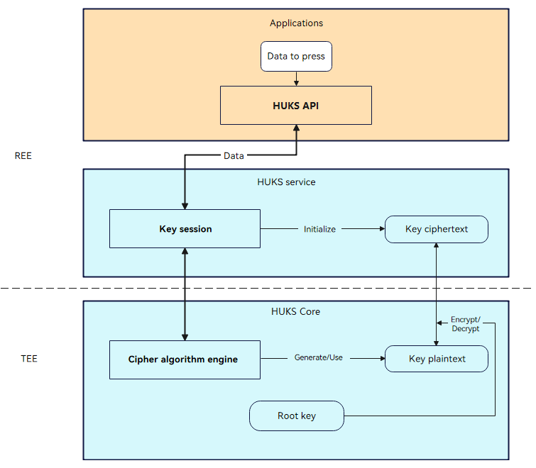

# HUKS Overview

## Introduction

OpenHarmony Universal KeyStore (HUKS) provides lifecycle key management capabilities, including key generation, storage, use, and destruction, and provides attestation for the keys stored in the HUKS.
The HUKS provides secure, lifecycle management of keys based on system security capabilities for services. With the HUKS, services do not need to implement key management.

The HUKS provides the following functions:

- [Key Generation](huks-guidelines.md#key-generation)
- [Key Import](huks-guidelines.md#key-import)
- [Common Key Operations](huks-guidelines.md#common-key-operations)
- [Key Access Control](huks-guidelines.md#key-access-control)
- [Key Attestation](huks-guidelines.md#key-attestation)
- [Supported Algorithm Types and Parameter Combinations](huks-appendix.md#supported-algorithm-types-and-parameter-combinations)
- [Key Material Formats](huks-appendix.md#key-material-formats)

## Basic Concepts

Before using the HUKS for development, you are advised to understand the following basic concepts:

- HUKS Core
  
  HUKS Core is a core component that implements functions, including cryptographic calculation of keys, encryption and decryption of plaintext keys, and key access control. Generally, it runs in a secure environment such as a Trusted Execution Environment (TEE) or a secure chipset of the device to ensure that the keys in plaintext are always in the HUKS Core.

- Key session

  A key session holds the key information, including the key operation data, key properties, and access control attributes, when a key is used. You need to pass in a key alias to create a session for the key. The HUKS generates a globally unique handle for each session. A general key operation involves creating a session, passing in data and parameters, and finishing the session (or aborting the session).

## Working Principles

The security design of the HUKS includes the following:
- Keys in a secure environment in lifecycle

  In the lifecycle of a key, the plaintext will never be exposed outside the HUKS Core. For the devices with a Trusted Execution Environment (TEE) or secure chipset, the HUKS Core runs in the TEE or secure chipset. This prevents the key plaintext from being disclosed even if the Rich Execution Environment (REE) is cracked.
- Encrypted keys for storage

  The service keys are encrypted based on the device root key. Some keys can be protected by passwords if the devices support this feature.
- Strict access control over keys

  Only authorized services can access keys. For security-sensitive services, user identity authentication can be enabled for key access.
- Key attestation

  The HUKS provides attestation for hardware-backed key storage. It proves that the key has not been tampered with, is stored in the hardware-backed HUKS Core, and has correct key properties.

A key session is the basis for key operations in the HUKS. It initializes key information and caches the service data. Cryptographic operations on data and encryption and decryption are performed in the HUKS Core for security purposes.

**Figure 1** HUKS working mechanism

## Constraints

  - Alias-based access
    
    The key material stored in the HUKS can be accessed by alias only. The key alias must be unique for an application. Otherwise, the key with the same alias will be replaced. The length of the key alias cannot exceed 64 bytes.
    
  - Data segment size
  
    All data is transmitted to the HUKS through the IPC channel. Due to the limitation of the IPC buffer size, data greater than 100 KB must be sliced before transmission, and the data segment cannot exceed 100 KB.
    
  - Mandatory parameters

    The cipher algorithm, key size, and purpose must be specified when a key is generated or imported. Other parameters (such as the working mode, padding mode, and hash algorithm) are optional. When a key is used, all parameters related to the cipher algorithm must be specified.
    
  - Key material format
  
    When a key (key pair, public key, or private key) is imported or exported, the key material must be in the format required by the HUKS. For details, see [Key Material Formats](huks-appendix.md#key-material-format).
