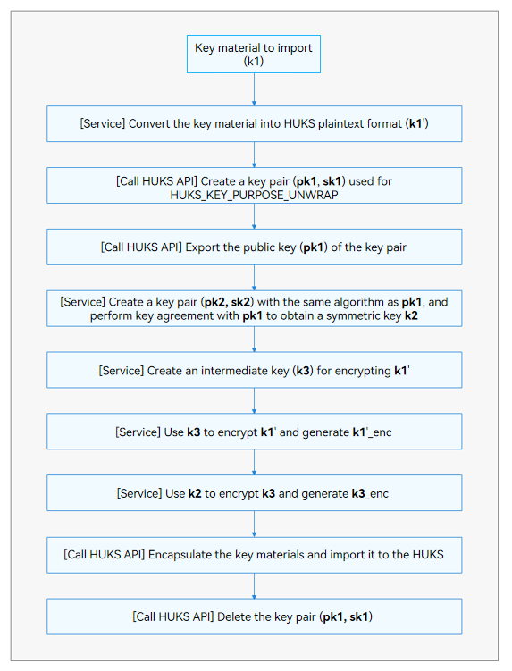

# HUKS Development (Native)

## When to Use

The OpenHarmony Universal KeyStore (HUKS) provides full lifecycle management capability for keys. The keys managed by the HUKS can be imported by an application or generated by calling the HUKS APIs. For a key generated by the HUKS, the plaintext will never be exposed outside throughout the lifecycle. No one can obtain the key in plaintext. Even the service itself can call APIs provided by the HUKS to perform operations on the key and obtain the operation result, but cannot access the key.

With the Native APIs provided by the HUKS, you can:

* [Generate a key](#key-generation).
* [Import a key](#key-import).
* [Encrypt and decrypt data using a key](#encryption-and-decryption).
* [Sign data and verify a signature](#signing-and-signature-verification).
* [Generate a shared secret via key agreement](#key-agreement).
* [Derive a key](#key-derivation).
* [Attest a key](#key-attestation).

## Available APIs

### APIs for Key Use

  | API| Description| 
| -------- | -------- |
| [OH_Huks_GetSdkVersion](../reference/native-apis/_huks_key_api.md#oh_huks_getsdkversion) (struct [OH_Huks_Blob](../reference/native-apis/_o_h___huks___blob.md) \*sdkVersion) | Obtains the current HUKS SDK version. | 
| [OH_Huks_GenerateKeyItem](../reference/native-apis/_huks_key_api.md#oh_huks_generatekeyitem) (const struct [OH_Huks_Blob](../reference/native-apis/_o_h___huks___blob.md) \*keyAlias, const struct [OH_Huks_ParamSet](../reference/native-apis/_o_h___huks___param_set.md) \*paramSetIn, struct [OH_Huks_ParamSet](../reference/native-apis/_o_h___huks___param_set.md) \*paramSetOut) | Generates a key. | 
| [OH_Huks_ImportKeyItem](../reference/native-apis/_huks_key_api.md#oh_huks_importkeyitem) (const struct [OH_Huks_Blob](../reference/native-apis/_o_h___huks___blob.md) \*keyAlias, const struct [OH_Huks_ParamSet](../reference/native-apis/_o_h___huks___param_set.md) \*paramSet, const struct [OH_Huks_Blob](../reference/native-apis/_o_h___huks___blob.md) \*key) | Imports a key in plaintext. | 
| [OH_Huks_ImportWrappedKeyItem](../reference/native-apis/_huks_key_api.md#oh_huks_importwrappedkeyitem) (const struct [OH_Huks_Blob](../reference/native-apis/_o_h___huks___blob.md) \*keyAlias, const struct [OH_Huks_Blob](../reference/native-apis/_o_h___huks___blob.md) \*wrappingKeyAlias, const struct [OH_Huks_ParamSet](../reference/native-apis/_o_h___huks___param_set.md) \*paramSet, const struct [OH_Huks_Blob](../reference/native-apis/_o_h___huks___blob.md) \*wrappedKeyData) | Imports a wrapped (encrypted) key. | 
| [OH_Huks_ExportPublicKeyItem](../reference/native-apis/_huks_key_api.md#oh_huks_exportpublickeyitem) (const struct [OH_Huks_Blob](../reference/native-apis/_o_h___huks___blob.md) \*keyAlias, const struct [OH_Huks_ParamSet](../reference/native-apis/_o_h___huks___param_set.md) \*paramSet, struct [OH_Huks_Blob](../reference/native-apis/_o_h___huks___blob.md) \*key) | Exports a public key. | 
| [OH_Huks_DeleteKeyItem](../reference/native-apis/_huks_key_api.md#oh_huks_deletekeyitem) (const struct [OH_Huks_Blob](../reference/native-apis/_o_h___huks___blob.md) \*keyAlias, const struct [OH_Huks_ParamSet](../reference/native-apis/_o_h___huks___param_set.md) \*paramSet) | Deletes a key. | 
| [OH_Huks_GetKeyItemParamSet](../reference/native-apis/_huks_key_api.md#oh_huks_getkeyitemparamset) (const struct [OH_Huks_Blob](../reference/native-apis/_o_h___huks___blob.md) \*keyAlias, const struct [OH_Huks_ParamSet](../reference/native-apis/_o_h___huks___param_set.md) \*paramSetIn, struct [OH_Huks_ParamSet](../reference/native-apis/_o_h___huks___param_set.md) \*paramSetOut) | Obtains the parameter set of a key. | 
| [OH_Huks_IsKeyItemExist](../reference/native-apis/_huks_key_api.md#oh_huks_iskeyitemexist) (const struct [OH_Huks_Blob](../reference/native-apis/_o_h___huks___blob.md) \*keyAlias, const struct [OH_Huks_ParamSet](../reference/native-apis/_o_h___huks___param_set.md) \*paramSet) | Checks whether a key exists. | 
| [OH_Huks_AttestKeyItem](../reference/native-apis/_huks_key_api.md#oh_huks_attestkeyitem) (const struct [OH_Huks_Blob](../reference/native-apis/_o_h___huks___blob.md) \*keyAlias, const struct [OH_Huks_ParamSet](../reference/native-apis/_o_h___huks___param_set.md) \*paramSet, struct [OH_Huks_CertChain](../reference/native-apis/_o_h___huks___cert_chain.md) \*certChain) | Obtains the key certificate chain. | 
| [OH_Huks_InitSession](../reference/native-apis/_huks_key_api.md#oh_huks_initsession) (const struct [OH_Huks_Blob](../reference/native-apis/_o_h___huks___blob.md) \*keyAlias, const struct [OH_Huks_ParamSet](../reference/native-apis/_o_h___huks___param_set.md) \*paramSet, struct [OH_Huks_Blob](../reference/native-apis/_o_h___huks___blob.md) \*handle, struct [OH_Huks_Blob](../reference/native-apis/_o_h___huks___blob.md) \*token) | Initializes the key session to obtain a handle (mandatory) and a challenge value (optional). | 
| [OH_Huks_UpdateSession](../reference/native-apis/_huks_key_api.md#oh_huks_updatesession) (const struct [OH_Huks_Blob](../reference/native-apis/_o_h___huks___blob.md) \*handle, const struct [OH_Huks_ParamSet](../reference/native-apis/_o_h___huks___param_set.md) \*paramSet, const struct [OH_Huks_Blob](../reference/native-apis/_o_h___huks___blob.md) \*inData, struct [OH_Huks_Blob](../reference/native-apis/_o_h___huks___blob.md) \*outData) | Adds data by segment for the key operation, performs the related key operation, and outputs the processed data. | 
| [OH_Huks_FinishSession](../reference/native-apis/_huks_key_api.md#oh_huks_finishsession) (const struct [OH_Huks_Blob](../reference/native-apis/_o_h___huks___blob.md) \*handle, const struct [OH_Huks_ParamSet](../reference/native-apis/_o_h___huks___param_set.md) \*paramSet, const struct [OH_Huks_Blob](../reference/native-apis/_o_h___huks___blob.md) \*inData, struct [OH_Huks_Blob](../reference/native-apis/_o_h___huks___blob.md) \*outData) | Finishes the key session. | 
| [OH_Huks_AbortSession](../reference/native-apis/_huks_key_api.md#oh_huks_abortsession) (const struct [OH_Huks_Blob](../reference/native-apis/_o_h___huks___blob.md) \*handle, const struct [OH_Huks_ParamSet](../reference/native-apis/_o_h___huks___param_set.md) \*paramSet) | Aborts a key session. | 

### APIs for Key Parameters

  | API| Description| 
| -------- | -------- |
| [OH_Huks_InitParamSet](../reference/native-apis/_huks_param_set_api.md#oh_huks_initparamset) (struct [OH_Huks_ParamSet](../reference/native-apis/_o_h___huks___param_set.md) \*\*paramSet) | Initializes a parameter set. | 
| [OH_Huks_AddParams](../reference/native-apis/_huks_param_set_api.md#oh_huks_addparams) (struct [OH_Huks_ParamSet](../reference/native-apis/_o_h___huks___param_set.md) \*paramSet, const struct [OH_Huks_Param](../reference/native-apis/_o_h___huks___param.md) \*params, uint32_t paramCnt) | Adds parameters to a parameter set. | 
| [OH_Huks_BuildParamSet](../reference/native-apis/_huks_param_set_api.md#oh_huks_buildparamset) (struct [OH_Huks_ParamSet](../reference/native-apis/_o_h___huks___param_set.md) \*\*paramSet) | Builds a formal parameter set. | 
| [OH_Huks_FreeParamSet](../reference/native-apis/_huks_param_set_api.md#oh_huks_freeparamset) (struct [OH_Huks_ParamSet](../reference/native-apis/_o_h___huks___param_set.md) \*\*paramSet) | Destroys a parameter set. | 
| [OH_Huks_CopyParamSet](../reference/native-apis/_huks_param_set_api.md#oh_huks_copyparamset) (const struct [OH_Huks_ParamSet](../reference/native-apis/_o_h___huks___param_set.md) \*fromParamSet, uint32_t fromParamSetSize, struct [OH_Huks_ParamSet](../reference/native-apis/_o_h___huks___param_set.md) \*\*paramSet) | Copies a parameter set (deep copy). | 
| [OH_Huks_GetParam](../reference/native-apis/_huks_param_set_api.md#oh_huks_getparam) (const struct [OH_Huks_ParamSet](../reference/native-apis/_o_h___huks___param_set.md) \*paramSet, uint32_t tag, struct [OH_Huks_Param](../reference/native-apis/_o_h___huks___param.md) \*\*param) | Obtains parameters from a parameter set. | 
| [OH_Huks_FreshParamSet](../reference/native-apis/_huks_param_set_api.md#oh_huks_freshparamset) (struct [OH_Huks_ParamSet](../reference/native-apis/_o_h___huks___param_set.md) \*paramSet, bool isCopy) | Refreshes data of the **Blob** type in a parameter set. | 
| [OH_Huks_IsParamSetTagValid](../reference/native-apis/_huks_param_set_api.md#oh_huks_isparamsettagvalid) (const struct [OH_Huks_ParamSet](../reference/native-apis/_o_h___huks___param_set.md) \*paramSet) | Checks whether the parameters in a parameter set are valid. | 
| [OH_Huks_IsParamSetValid](../reference/native-apis/_huks_param_set_api.md#oh_huks_isparamsetvalid) (const struct [OH_Huks_ParamSet](../reference/native-apis/_o_h___huks___param_set.md) \*paramSet, uint32_t size) | Checks whether a parameter set is of the valid size. | 
| [OH_Huks_CheckParamMatch](../reference/native-apis/_huks_param_set_api.md#oh_huks_checkparammatch) (const struct [OH_Huks_Param](../reference/native-apis/_o_h___huks___param.md) \*baseParam, const struct [OH_Huks_Param](../reference/native-apis/_o_h___huks___param.md) \*param) | Compares whether two parameters are the same. | 

## How to Develop

### Key Generation
The HUKS provides the capability of randomly generating keys for services. For a key generated by the HUKS, the plaintext will never be exposed outside throughout the lifecycle. No one can obtain the key in plaintext. Even the service itself can call APIs provided by the HUKS to perform operations on the key and obtain the operation result, but cannot access the key.

**How to Develop**

Use [OH_Huks_GenerateKeyItem](../reference/native-apis/_huks_key_api.md#oh_huks_generatekeyitem) to generate a key. You need to pass in **keyAlias** and **paramSetIn**.

1. Set the key alias.
2. Initialize the key parameter set. Use [OH_Huks_InitParamSet](../reference/native-apis/_huks_param_set_api.md#oh_huks_initparamset), [OH_Huks_AddParams](../reference/native-apis/_huks_param_set_api.md#oh_huks_addparams), and [OH_Huks_BuildParamSet](../reference/native-apis/_huks_param_set_api.md#oh_huks_buildparamset) to construct **paramSet**, which must contain the [OH_Huks_KeyAlg](../reference/native-apis/_huks_type_api.md#oh_huks_keyalg), [OH_Huks_KeySize](../reference/native-apis/_huks_type_api.md#oh_huks_keysize), and [OH_Huks_KeyPurpose](../reference/native-apis/_huks_type_api.md#oh_huks_keypurpose).
3. Pass in the key alias and key parameter set to generate a key.

> **NOTE**
> 
> The key alias cannot exceed 64 bytes.

**C++ Code Example**

```C++
#include "huks/native_huks_api.h"
#include "huks/native_huks_param.h"
#include <string.h>
OH_Huks_Result InitParamSet(
    struct OH_Huks_ParamSet **paramSet,
    const struct OH_Huks_Param *params,
    uint32_t paramCount)
{
    OH_Huks_Result ret = OH_Huks_InitParamSet(paramSet);
    if (ret.errorCode != OH_HUKS_SUCCESS) {
        return ret;
    }

    ret = OH_Huks_AddParams(*paramSet, params, paramCount);
    if (ret.errorCode != OH_HUKS_SUCCESS) {
        OH_Huks_FreeParamSet(paramSet);
        return ret;
    }

    ret = OH_Huks_BuildParamSet(paramSet);
    if (ret.errorCode != OH_HUKS_SUCCESS) {
        OH_Huks_FreeParamSet(paramSet);
        return ret;
    }

    return ret;
}

struct OH_Huks_Param g_testGenerateKeyParam[] = {
    {
        .tag = OH_HUKS_TAG_ALGORITHM,
        .uint32Param = OH_HUKS_ALG_ECC
    }, {
        .tag = OH_HUKS_TAG_PURPOSE,
        .uint32Param = OH_HUKS_KEY_PURPOSE_AGREE
    }, {
        .tag = OH_HUKS_TAG_KEY_SIZE,
        .uint32Param = OH_HUKS_ECC_KEY_SIZE_256
    }, {
        .tag = OH_HUKS_TAG_DIGEST,
        .uint32Param = OH_HUKS_DIGEST_NONE
    }
};

static napi_value GenerateKey(napi_env env, napi_callback_info info)
{
    const char *alias = "test_generate";
    struct OH_Huks_Blob aliasBlob = { .size = (uint32_t)strlen(alias), .data = (uint8_t *)alias };
    struct OH_Huks_ParamSet *testGenerateKeyParamSet = nullptr;
    struct OH_Huks_Result ohResult;
    do {
        ohResult = InitParamSet(&testGenerateKeyParamSet, g_testGenerateKeyParam,
        sizeof(g_testGenerateKeyParam) / sizeof(OH_Huks_Param));
        if (ohResult.errorCode != OH_HUKS_SUCCESS) {
            break;
        }
        ohResult = OH_Huks_GenerateKeyItem(&aliasBlob, testGenerateKeyParamSet, nullptr);
    } while (0);
    OH_Huks_FreeParamSet(&testGenerateKeyParamSet);
    napi_value ret;
    napi_create_int32(env, ohResult.errorCode, &ret);
    return ret;
}
```


### Key Import

A key generated outside the HUKS (for example, generated through key agreement or by a server) can be imported to the HUKS for management. The HUKS supports import of keys in plaintext. However, if a key is imported in plaintext, the key is exposed in the Rich Execution Environment (REE) memory. This type of import applies to lightweight devices or security-insensitive services. For security-sensitive services, use the secure import feature provided by the HUKS. Secure import allows the keys generated for services to be transferred to the HUKS through an end-to-end encrypted transmission channel.

Once a key is imported to the HUKS, its plaintext will not be exposed outside the HUKS throughout the lifecycle of the key.

#### Importing a Key in Plaintext

Use [OH_Huks_ImportKeyItem](../reference/native-apis/_huks_key_api.md#oh_huks_importkeyitem) to import a key in plaintext. You need to pass in the key alias and **paramSetIn**, which must contain the key material and key property set.

1. Set the key alias.
2. Encapsulate the key material and key property set. The key material must comply with the HUKS key material formats (huks-appendix.md#key-material-formats) and assign a value to the key field. In addition, use [OH_Huks_InitParamSet](../reference/native-apis/_huks_param_set_api.md#oh_huks_initparamset), [OH_Huks_AddParams](../reference/native-apis/_huks_param_set_api.md#oh_huks_addparams), and [OH_Huks_BuildParamSet](../reference/native-apis/_huks_param_set_api.md#oh_huks_buildparamset) to construct **paramSet**, which must contain [OH_Huks_KeyAlg](../reference/native-apis/_huks_type_api.md#oh_huks_keyalg), [OH_Huks_KeySize](../reference/native-apis/_huks_type_api.md#oh_huks_keysize), and [OH_Huks_KeyPurpose](../reference/native-apis/_huks_type_api.md#oh_huks_keypurpose).
3. Import the key.

**C++ Code Example**

```C++
#include "huks/native_huks_api.h"
#include "huks/native_huks_param.h"
#include <string.h>
OH_Huks_Result InitParamSet(
    struct OH_Huks_ParamSet **paramSet,
    const struct OH_Huks_Param *params,
    uint32_t paramCount)
{
    OH_Huks_Result ret = OH_Huks_InitParamSet(paramSet);
    if (ret.errorCode != OH_HUKS_SUCCESS) {
        return ret;
    }

    ret = OH_Huks_AddParams(*paramSet, params, paramCount);
    if (ret.errorCode != OH_HUKS_SUCCESS) {
        OH_Huks_FreeParamSet(paramSet);
        return ret;
    }

    ret = OH_Huks_BuildParamSet(paramSet);
    if (ret.errorCode != OH_HUKS_SUCCESS) {
        OH_Huks_FreeParamSet(paramSet);
        return ret;
    }

    return ret;
}

static napi_value ImportKey(napi_env env, napi_callback_info info)
{
    (void)GenerateKey(env, info);
    const char *alias = "test_generate";
    struct OH_Huks_Blob aliasBlob = { .size = (uint32_t)strlen(alias), .data = (uint8_t *)alias };
    uint8_t pubKey[OH_HUKS_ECC_KEY_SIZE_256] = {0};
    struct OH_Huks_Blob publicKey = { OH_HUKS_ECC_KEY_SIZE_256, pubKey };
    struct OH_Huks_ParamSet *testImportKeyParamSet = nullptr;
    struct OH_Huks_Result ohResult;
    do {
        ohResult = InitParamSet(&testImportKeyParamSet, g_testGenerateKeyParam,
            sizeof(g_testGenerateKeyParam) / sizeof(OH_Huks_Param));
        if (ohResult.errorCode != OH_HUKS_SUCCESS) {
            break;
        }
        ohResult = OH_Huks_ExportPublicKeyItem(&aliasBlob, testImportKeyParamSet, &publicKey);
        if (ohResult.errorCode != OH_HUKS_SUCCESS) {
            break;
        }
        /* 4. Import Key */
        char newKey[] = "test_import";
        struct OH_Huks_Blob newKeyAlias = { .size = (uint32_t)strlen(newKey), .data = (uint8_t *)newKey };
        ohResult = OH_Huks_ImportKeyItem(&newKeyAlias, testImportKeyParamSet, &publicKey);
    } while (0);
    OH_Huks_FreeParamSet(&testImportKeyParamSet);
    napi_value ret;
    napi_create_int32(env, ohResult.errorCode, &ret);
    return ret;
}
```

#### Importing a Wrapped Key

Compared with import of a key in plaintext, the import of a wrapped key involves more complex key material and operations. The following figure illustrates the basic development process.

**Figure 2** Development process for importing a wrapped key



**Available APIs**

During the development process, you need to use the APIs for key generation, export, import, and deletion in sequence.

>**NOTE**<br>The public key plaintext material returned by **exportKeyItem()** is encapsulated in X.509 format, and the key material to be imported by **importWrappedKeyItem()** must be encapsulated in **Length<sub>Data</sub>-Data** format. Specifically, the application needs to encapsulate the wrapped key material in sequence according to the sequence in the following table.

**Table 2** Format of the wrapped key material

| **Content**| Public Key Length (L<sub>pk2</sub>)| Public Key (pk2)| k2 AAD Length (L<sub>AAD2</sub>)| k2 AAD (AAD2)|  k2 Nonce Length (L<sub>Nonce2</sub>)| k2 Nonce (Nonce2)|
| :--: |:----:|:----: |:----: | :----:  | :----:|:----:|
|Length| 4 bytes|L<sub>pk2</sub> bytes| 4 bytes| L<sub>AAD2</sub> bytes| 4 bytes| L<sub>Nonce2</sub> bytes|
| **Content**| k2 AEAD Length (L<sub>AEAD2</sub>)| k2 AEAD (AEAD2)| k3 Ciphertext Length (L<sub>k3_enc</sub>)| k3 Ciphertext (k3_enc)|  k3 AAD Length (L<sub>AAD3</sub>)| k3 AAD (AAD3)|
|Length| 4 bytes|L<sub>AEAD2</sub> bytes| 4 bytes| L<sub>k3_enc</sub> bytes| 4 bytes| L<sub>AAD3</sub> bytes|
| Content| k3 Nonce Length (L<sub>Nonce3</sub>)| k3 Nonce (Nonce3)| k3 AEAD Length (L<sub>AEAD3</sub>)| k3 AEAD (AEAD3)|  Length of **k1'_size** (L<sub>k1'_size</sub>)| Key Plaintext Material Length (k1'_size)|
|Length| 4 bytes|L<sub>Nonce3</sub> bytes| 4 bytes| L<sub>AEAD3</sub> bytes| 4 bytes| L<sub>k1'_size</sub> bytes|
|Content|k1' Ciphertext Length L<sub>k1'_enc</sub>| k1' ciphertext k1'_enc| | | | |
|Length| 4 bytes|L<sub>k1'_enc</sub> bytes| | | | |

**How to Develop**

The following example provides the development involving HUKS APIs (using the ECDH key agreement suite). The operations performed by the service are not included. In the following example, a key is imported from device A to device B. 

1. Convert the key to be imported from device A into the key material in HUKS format **To_Import_Key**.
2. Generate an asymmetric key pair **Caller_Key** for device A.
3. Generate an asymmetric key pair **Wrapping_Key**, with key purpose of **unwrap**, for device B.
4. Generate a symmetric key **Caller_Kek** for device A.
5. Export the public key material from the asymmetric key pairs of devices A and B.
6. Use the private key of **Caller_Key** (device A) and the public key of **Wrapping_Key** (device B) to perform key agreement, and obtain an **Agree_Key**.
7. Use the **Caller_Kek** to encrypt the **To_Import_Key** of device A and generate **To_Import_Key_Enc**.
8. Use **Agree_Key** to encrypt the **Caller_Kek** of device A and generate **Caller_Kek_Enc**.
9. Send the public key of **Caller_Key**, **Caller_Kek_Enc**, and **To_Import_Key_Enc** from device A to device B.
10. Encapsulate and encrypt the key materials to be imported to device B.
11. Import the encrypted key material to device B.
12. Delete the keys, which are used for encrypting the key to import, from devices A and B.

**C++ Code Example**

```C++
#include "napi/native_api.h"
#include "huks/native_huks_api.h"
#include "huks/native_huks_param.h"
#include <algorithm>

OH_Huks_Result InitParamSet(
    struct OH_Huks_ParamSet **paramSet,
    const struct OH_Huks_Param *params,
    uint32_t paramCount)
{
    OH_Huks_Result ret = OH_Huks_InitParamSet(paramSet);
    if (ret.errorCode != OH_HUKS_SUCCESS) {
        return ret;
    }

    ret = OH_Huks_AddParams(*paramSet, params, paramCount);
    if (ret.errorCode != OH_HUKS_SUCCESS) {
        OH_Huks_FreeParamSet(paramSet);
        return ret;
    }

    ret = OH_Huks_BuildParamSet(paramSet);
    if (ret.errorCode != OH_HUKS_SUCCESS) {
        OH_Huks_FreeParamSet(paramSet);
        return ret;
    }

    return ret;
}

/**
 * Securely import a key from device A to the HUKS of device B.
 * wrappingKey is a key pair of device B.
 * callerKey is a key pair of device A.
 * callerAgreeKey is generated through key agreement based on the private key of the key pair of device A and the public key of device B .
 */
struct HksImportWrappedKeyTestParams {
    // server key, for real
    struct OH_Huks_Blob *wrappingKeyAlias;
    struct OH_Huks_ParamSet *genWrappingKeyParamSet;
    uint32_t publicKeySize;
    
    struct OH_Huks_Blob *callerKeyAlias;
    struct OH_Huks_ParamSet *genCallerKeyParamSet;
    
    struct OH_Huks_Blob *callerKekAlias;
    struct OH_Huks_Blob *callerKek;
    struct OH_Huks_ParamSet *importCallerKekParamSet;
    
    struct OH_Huks_Blob *callerAgreeKeyAlias;
    struct OH_Huks_ParamSet *agreeParamSet;
    
    struct OH_Huks_ParamSet *importWrappedKeyParamSet;
    struct OH_Huks_Blob *importedKeyAlias;
    struct OH_Huks_Blob *importedPlainKey;
    uint32_t keyMaterialLen;
};

static const uint32_t WRAPPED_KEY_IV_SIZE = 16;
static uint8_t WRAPPED_KEY_IV[IV_SIZE] = "bababababababab";  // This is a test value. For real use, the IV should be different each time. 

static const uint32_t AAD_SIZE = 16;
static uint8_t AAD[AAD_SIZE] = "abababababababa";  // This is a test value. For real use, the AAD should be different each time. 

static const uint32_t NONCE_SIZE = 12;
static uint8_t NONCE[NONCE_SIZE] = "hahahahahah";  // This is a test value. For real use, the nonce should be different each time.

static const uint32_t AEAD_TAG_SIZE = 16;

static const uint32_t X25519_256_SIZE = 256;
static struct OH_Huks_Blob g_wrappingKeyAliasAes256 = {
    .size = (uint32_t)strlen("test_wrappingKey_x25519_aes256"),
    .data = (uint8_t *)"test_wrappingKey_x25519_aes256"};

static struct OH_Huks_Blob g_callerKeyAliasAes256 = {
    .size = (uint32_t)strlen("test_caller_key_x25519_aes256"),
    .data = (uint8_t *)"test_caller_key_x25519_aes256"};

static struct OH_Huks_Blob g_callerKekAliasAes256 = {
    .size = (uint32_t)strlen("test_caller_kek_x25519_aes256"),
    .data = (uint8_t *)"test_caller_kek_x25519_aes256"};

static struct OH_Huks_Blob g_callerAes256Kek = {
    .size = (uint32_t)strlen("This is kek to encrypt plain key"),
    .data = (uint8_t *)"This is kek to encrypt plain key"};

static struct OH_Huks_Blob g_callerAgreeKeyAliasAes256 = {
    .size = (uint32_t)strlen("test_caller_agree_key_x25519_aes256"),
    .data = (uint8_t *)"test_caller_agree_key_x25519_aes256"};

static struct OH_Huks_Blob g_importedKeyAliasAes256 = {
    .size = (uint32_t)strlen("test_import_key_x25519_aes256"),
    .data = (uint8_t *)"test_import_key_x25519_aes256"};

static struct OH_Huks_Blob g_importedAes256PlainKey = {
    .size = (uint32_t)strlen("This is plain key to be imported"),
    .data = (uint8_t *)"This is plain key to be imported"};

static struct OH_Huks_Param g_importWrappedAes256Params[] = {
    {.tag = OH_HUKS_TAG_ALGORITHM, .uint32Param = OH_HUKS_ALG_AES},
    {.tag = OH_HUKS_TAG_PURPOSE, .uint32Param = OH_HUKS_KEY_PURPOSE_ENCRYPT | OH_HUKS_KEY_PURPOSE_DECRYPT},
    {.tag = OH_HUKS_TAG_KEY_SIZE, .uint32Param = OH_HUKS_AES_KEY_SIZE_256},
    {.tag = OH_HUKS_TAG_PADDING, .uint32Param = OH_HUKS_PADDING_NONE},
    {.tag = OH_HUKS_TAG_BLOCK_MODE, .uint32Param = OH_HUKS_MODE_GCM},
    {.tag = OH_HUKS_TAG_DIGEST, .uint32Param = OH_HUKS_DIGEST_NONE},
    {.tag = OH_HUKS_TAG_UNWRAP_ALGORITHM_SUITE, .uint32Param = OH_HUKS_UNWRAP_SUITE_X25519_AES_256_GCM_NOPADDING},
    {.tag = OH_HUKS_TAG_ASSOCIATED_DATA, .blob = {.size = AAD_SIZE, .data = (uint8_t *)AAD}}, // this is a test value, for real use the aad should be info associated with caller
    {.tag = OH_HUKS_TAG_NONCE, .blob = {.size = NONCE_SIZE, .data = (uint8_t *)NONCE}}}; // this is a test value, for real use the nonce should be different every time

static const uint32_t g_x25519PubKeySize = 32;

static struct OH_Huks_Param g_genWrappingKeyParams[] = {
    {.tag = OH_HUKS_TAG_ALGORITHM, .uint32Param = OH_HUKS_ALG_X25519},
    {.tag = OH_HUKS_TAG_PURPOSE, .uint32Param = OH_HUKS_KEY_PURPOSE_UNWRAP},
    {.tag = OH_HUKS_TAG_KEY_SIZE, .uint32Param = OH_HUKS_CURVE25519_KEY_SIZE_256}};

static struct OH_Huks_Param g_genCallerX25519Params[] = {
    {.tag = OH_HUKS_TAG_ALGORITHM, .uint32Param = OH_HUKS_ALG_X25519},
    {.tag = OH_HUKS_TAG_PURPOSE, .uint32Param = OH_HUKS_KEY_PURPOSE_AGREE},
    {.tag = OH_HUKS_TAG_KEY_SIZE, .uint32Param = OH_HUKS_CURVE25519_KEY_SIZE_256}};

static struct OH_Huks_Param g_importParamsCallerKek[] = {
    {.tag = OH_HUKS_TAG_ALGORITHM, .uint32Param = OH_HUKS_ALG_AES},
    {.tag = OH_HUKS_TAG_PURPOSE, .uint32Param = OH_HUKS_KEY_PURPOSE_ENCRYPT},
    {.tag = OH_HUKS_TAG_KEY_SIZE, .uint32Param = OH_HUKS_AES_KEY_SIZE_256},
    {.tag = OH_HUKS_TAG_PADDING, .uint32Param = OH_HUKS_PADDING_NONE},
    {.tag = OH_HUKS_TAG_BLOCK_MODE, .uint32Param = OH_HUKS_MODE_GCM},
    {.tag = OH_HUKS_TAG_DIGEST, .uint32Param = OH_HUKS_DIGEST_NONE},
    {.tag = OH_HUKS_TAG_IV, .blob = {.size = WRAPPED_KEY_IV_SIZE, .data = (uint8_t *)WRAPPED_KEY_IV }}};  // this is a test value, for real use the iv should be different every time 

static struct OH_Huks_Param g_callerAgreeParams[] = {
    {.tag = OH_HUKS_TAG_ALGORITHM, .uint32Param = OH_HUKS_ALG_X25519},
    {.tag = OH_HUKS_TAG_PURPOSE, .uint32Param = OH_HUKS_KEY_PURPOSE_AGREE},
    {.tag = OH_HUKS_TAG_KEY_SIZE, .uint32Param = OH_HUKS_CURVE25519_KEY_SIZE_256}
};

static struct OH_Huks_Param g_aesKekEncryptParams[] = {
    {.tag = OH_HUKS_TAG_ALGORITHM, .uint32Param = OH_HUKS_ALG_AES},
    {.tag = OH_HUKS_TAG_PURPOSE, .uint32Param = OH_HUKS_KEY_PURPOSE_ENCRYPT},
    {.tag = OH_HUKS_TAG_KEY_SIZE, .uint32Param = OH_HUKS_AES_KEY_SIZE_256},
    {.tag = OH_HUKS_TAG_PADDING, .uint32Param = OH_HUKS_PADDING_NONE},
    {.tag = OH_HUKS_TAG_BLOCK_MODE, .uint32Param = OH_HUKS_MODE_GCM},
    {.tag = OH_HUKS_TAG_DIGEST, .uint32Param = OH_HUKS_DIGEST_NONE},
    {.tag = OH_HUKS_TAG_ASSOCIATED_DATA, .blob = {.size = AAD_SIZE, .data = (uint8_t *)AAD}}, // this is a test value, for real use the aad should be info associated with caller
    {.tag = OH_HUKS_TAG_NONCE, .blob = {.size = NONCE_SIZE, .data = (uint8_t *)NONCE}}}; // this is a test value, for real use the nonce should be different every time

static struct OH_Huks_Param g_importAgreeKeyParams[] = {
    {.tag = OH_HUKS_TAG_ALGORITHM, .uint32Param = OH_HUKS_ALG_AES},
    {.tag = OH_HUKS_TAG_PURPOSE, .uint32Param = OH_HUKS_KEY_PURPOSE_ENCRYPT},
    {.tag = OH_HUKS_TAG_KEY_SIZE, .uint32Param = OH_HUKS_AES_KEY_SIZE_256},
    {.tag = OH_HUKS_TAG_PADDING, .uint32Param = OH_HUKS_PADDING_NONE},
    {.tag = OH_HUKS_TAG_BLOCK_MODE, .uint32Param = OH_HUKS_MODE_GCM},
    {.tag = OH_HUKS_TAG_DIGEST, .uint32Param = OH_HUKS_DIGEST_NONE},
    {.tag = OH_HUKS_TAG_IV, .blob = {.size = IV_SIZE, .data = (uint8_t *)IV}}};  // this is a test value, for real use the iv should be different every time 

OH_Huks_Result HuksAgreeKey(const struct OH_Huks_ParamSet *paramSet, const struct OH_Huks_Blob *keyAlias,
                            const struct OH_Huks_Blob *peerPublicKey, struct OH_Huks_Blob *agreedKey)
{
    uint8_t temp[10] = {0};
    struct OH_Huks_Blob inData = {
        sizeof(temp),
        temp};

    uint8_t handleU[sizeof(uint64_t)] = {0};
    struct OH_Huks_Blob handle = {sizeof(uint64_t), handleU};
    OH_Huks_Result ret = OH_Huks_InitSession(keyAlias, paramSet, &handle, nullptr);
    if (ret.errorCode != (int32_t)OH_HUKS_SUCCESS) {
        return ret;
    }

    uint8_t outDataU[1024] = {0};
    struct OH_Huks_Blob outDataUpdate = {1024, outDataU};
    ret = OH_Huks_UpdateSession(&handle, paramSet, peerPublicKey, &outDataUpdate);
    if (ret.errorCode != (int32_t)OH_HUKS_SUCCESS) {
        return ret;
    }

    ret = OH_Huks_FinishSession(&handle, paramSet, &inData, agreedKey);
    if (ret.errorCode != (int32_t)OH_HUKS_SUCCESS) {
        return ret;
    }
    return ret;
}

static const uint32_t TIMES = 4;
static const uint32_t MAX_UPDATE_SIZE = 64;
static const uint32_t MAX_OUTDATA_SIZE = MAX_UPDATE_SIZE * TIMES;

#define HUKS_FREE_BLOB(blob) do { \
    if ((blob).data != nullptr) { \
        free((blob).data); \
        (blob).data = nullptr; \
    } \
    (blob).size = 0; \
} while (0)

#define OH_HUKS_KEY_BYTES(keySize) (((keySize) + 7) / 8)

static OH_Huks_Result HksEncryptLoopUpdate(const struct OH_Huks_Blob *handle, const struct OH_Huks_ParamSet *paramSet,
                                           const struct OH_Huks_Blob *inData, struct OH_Huks_Blob *outData)
{
    struct OH_Huks_Result ret;
    ret.errorCode = OH_HUKS_SUCCESS;

    struct OH_Huks_Blob inDataSeg = *inData;
    uint8_t *lastPtr = inData->data + inData->size - 1;
    struct OH_Huks_Blob outDataSeg = {MAX_OUTDATA_SIZE, NULL};
    uint8_t *cur = outData->data;
    outData->size = 0;

    inDataSeg.size = MAX_UPDATE_SIZE;
    bool isFinished = false;

    while (inDataSeg.data <= lastPtr) {
        if (inDataSeg.data + MAX_UPDATE_SIZE <= lastPtr)
        {
            outDataSeg.size = MAX_OUTDATA_SIZE;
        }
        else
        {
            isFinished = true;
            inDataSeg.size = lastPtr - inDataSeg.data + 1;
            break;
        }
        if (MallocAndCheckBlobData(&outDataSeg, outDataSeg.size).errorCode != (int32_t)OH_HUKS_SUCCESS)
        {
            ret.errorCode = OH_HUKS_ERR_CODE_INTERNAL_ERROR;
            return ret;
        }
        ret = OH_Huks_UpdateSession(handle, paramSet, &inDataSeg, &outDataSeg);
        if (ret.errorCode != (int32_t)OH_HUKS_SUCCESS) {
            free(outDataSeg.data);
            return ret;
        }
        std::copy(outDataSeg.data, outDataSeg.data + outDataSeg.size, cur);
        cur += outDataSeg.size;
        outData->size += outDataSeg.size;
        free(outDataSeg.data);
        if ((isFinished == false) && (inDataSeg.data + MAX_UPDATE_SIZE > lastPtr)) {
            ret.errorCode = OH_HUKS_ERR_CODE_INTERNAL_ERROR;
            return ret;
        }
        inDataSeg.data += MAX_UPDATE_SIZE;
    }

    struct OH_Huks_Blob outDataFinish = {inDataSeg.size * TIMES, NULL};
    if (MallocAndCheckBlobData(&outDataFinish, outDataFinish.size).errorCode != (int32_t)OH_HUKS_SUCCESS) {
        ret.errorCode = OH_HUKS_ERR_CODE_INTERNAL_ERROR;
        return ret;
    }

    ret = OH_Huks_FinishSession(handle, paramSet, &inDataSeg, &outDataFinish);
    if (ret.errorCode != OH_HUKS_SUCCESS) {
        free(outDataFinish.data);
        return ret;
    }
    std::copy(outDataFinish.data, outDataFinish.data + outDataFinish.size, cur);
    outData->size += outDataFinish.size;
    free(outDataFinish.data);

    return ret;
}

OH_Huks_Result HuksEncrypt(const struct OH_Huks_Blob *key, const struct OH_Huks_ParamSet *paramSet,
                           const struct OH_Huks_Blob *plainText, struct OH_Huks_Blob *cipherText)
{
    uint8_t handle[sizeof(uint64_t)] = {0};
    struct OH_Huks_Blob handleBlob = {sizeof(uint64_t), handle};
    OH_Huks_Result ret = OH_Huks_InitSession(key, paramSet, &handleBlob, nullptr);
    if (ret.errorCode != OH_HUKS_SUCCESS) {
        return ret;
    }

    ret = HksEncryptLoopUpdate(&handleBlob, paramSet, plainText, cipherText);
    return ret;
}

static OH_Huks_Result BuildWrappedKeyData(struct OH_Huks_Blob **blobArray, uint32_t size, struct OH_Huks_Blob *outData)
{
    uint32_t totalLength = size * sizeof(uint32_t);
    struct OH_Huks_Result ret;
    ret.errorCode = OH_HUKS_SUCCESS;

    /* counter size */
    for (uint32_t i = 0; i < size; ++i) {
        totalLength += blobArray[i]->size;
    }

    struct OH_Huks_Blob outBlob = {0, nullptr};
    outBlob.size = totalLength;
    ret = MallocAndCheckBlobData(&outBlob, outBlob.size);
    if (ret.errorCode != OH_HUKS_SUCCESS) {
        return ret;
    }

    uint32_t offset = 0;

    /* copy data */
    for (uint32_t i = 0; i < size; ++i) {
        if (totalLength - offset >= sizeof(blobArray[i]->size)) {
            std::copy(reinterpret_cast<uint8_t *>(&blobArray[i]->size), reinterpret_cast<uint8_t *>(&blobArray[i]->size) + sizeof(blobArray[i]->size), outBlob.data + offset);
        } else {
            ret.errorCode = OH_HUKS_ERR_CODE_INTERNAL_ERROR;
            return ret;
        }
        
        offset += sizeof(blobArray[i]->size);

        if (totalLength - offset >= blobArray[i]->size) {
            std::copy(blobArray[i]->data, blobArray[i]->data + blobArray[i]->size, outBlob.data + offset);
        } else {
            ret.errorCode = OH_HUKS_ERR_CODE_INTERNAL_ERROR;
            return ret;
        }

        offset += blobArray[i]->size;
    }

    outData->size = outBlob.size;
    outData->data = outBlob.data;
    return ret;
}

static OH_Huks_Result CheckParamsValid(const struct HksImportWrappedKeyTestParams *params)
{
    struct OH_Huks_Result ret;
    ret.errorCode = OH_HUKS_SUCCESS;
    if (params == nullptr) {
        ret.errorCode = OH_HUKS_ERR_CODE_ILLEGAL_ARGUMENT;
        return ret;
    }

    if (params->wrappingKeyAlias == nullptr || params->genWrappingKeyParamSet == nullptr ||
        params->callerKeyAlias == nullptr ||
        params->genCallerKeyParamSet == nullptr || params->callerKekAlias == nullptr ||
        params->callerKek == nullptr || params->importCallerKekParamSet == nullptr ||
        params->callerAgreeKeyAlias == nullptr || params->agreeParamSet == nullptr ||
        params->importWrappedKeyParamSet == nullptr || params->importedKeyAlias == nullptr ||
        params->importedPlainKey == nullptr) {
        ret.errorCode = OH_HUKS_ERR_CODE_ILLEGAL_ARGUMENT;
        return ret;
    }
    return ret;
}

static OH_Huks_Result GenerateAndExportHuksPublicKey(const struct HksImportWrappedKeyTestParams *params,
                                           struct OH_Huks_Blob *huksPublicKey)
{
    OH_Huks_Result ret = OH_Huks_GenerateKeyItem(params->wrappingKeyAlias, params->genWrappingKeyParamSet, nullptr);
    if (ret.errorCode != (int32_t)OH_HUKS_SUCCESS) {
        return ret;
    }
    huksPublicKey->size = params->publicKeySize;
    ret = MallocAndCheckBlobData(huksPublicKey, huksPublicKey->size);
    if (ret.errorCode != (int32_t)OH_HUKS_SUCCESS) {
        return ret;
    }
    ret = OH_Huks_ExportPublicKeyItem(params->wrappingKeyAlias, nullptr, huksPublicKey);
    return ret;
}

static OH_Huks_Result GenerateAndExportCallerPublicKey(const struct HksImportWrappedKeyTestParams *params,
                                             struct OH_Huks_Blob *callerSelfPublicKey)
{
    OH_Huks_Result ret = OH_Huks_GenerateKeyItem(params->callerKeyAlias, params->genCallerKeyParamSet, nullptr);
    if (ret.errorCode != (int32_t)OH_HUKS_SUCCESS) {
        return ret;
    }

    callerSelfPublicKey->size = params->publicKeySize;
    ret = MallocAndCheckBlobData(callerSelfPublicKey, callerSelfPublicKey->size);
    if (ret.errorCode != (int32_t)OH_HUKS_SUCCESS) {
        return ret;
    }
    ret = OH_Huks_ExportPublicKeyItem(params->callerKeyAlias, params->genWrappingKeyParamSet, callerSelfPublicKey);
    return ret;
}

static OH_Huks_Result ImportKekAndAgreeSharedSecret(const struct HksImportWrappedKeyTestParams *params,
                                          const struct OH_Huks_Blob *huksPublicKey, struct OH_Huks_Blob *outSharedKey)
{
    OH_Huks_Result ret = OH_Huks_ImportKeyItem(params->callerKekAlias,
                                               params->importCallerKekParamSet, params->callerKek);
    if (ret.errorCode != (int32_t)OH_HUKS_SUCCESS) {
        return ret;
    }
    
    ret = MallocAndCheckBlobData(outSharedKey, outSharedKey->size);
    if (ret.errorCode != (int32_t)OH_HUKS_SUCCESS) {
        return ret;
    }

    ret = HuksAgreeKey(params->agreeParamSet, params->callerKeyAlias, huksPublicKey, outSharedKey);
    if (ret.errorCode != (int32_t)OH_HUKS_SUCCESS) {
        return ret;
    }
    struct OH_Huks_ParamSet *importAgreeKeyParams = nullptr;
    ret = InitParamSet(&importAgreeKeyParams, g_importAgreeKeyParams,
                       sizeof(g_importAgreeKeyParams) / sizeof(OH_Huks_Param));
    if (ret.errorCode != (int32_t)OH_HUKS_SUCCESS) {
        return ret;
    }
    ret = OH_Huks_ImportKeyItem(params->callerAgreeKeyAlias, importAgreeKeyParams, outSharedKey);

    OH_Huks_FreeParamSet(&importAgreeKeyParams);
    return ret;
}

static OH_Huks_Result EncryptImportedPlainKeyAndKek(const struct HksImportWrappedKeyTestParams *params,
                                          struct OH_Huks_Blob *plainCipherText, struct OH_Huks_Blob *kekCipherText)
{
    struct OH_Huks_ParamSet *encryptParamSet = nullptr;
    OH_Huks_Result ret = InitParamSet(&encryptParamSet, g_aesKekEncryptParams,
                               sizeof(g_aesKekEncryptParams) / sizeof(OH_Huks_Param));
    if (ret.errorCode != (int32_t)OH_HUKS_SUCCESS) {
        return ret;
    }
    ret = HuksEncrypt(params->callerKekAlias, encryptParamSet, params->importedPlainKey, plainCipherText);
    if (ret.errorCode != (int32_t)OH_HUKS_SUCCESS) {
        return ret;
    }
    
    ret = HuksEncrypt(params->callerAgreeKeyAlias, encryptParamSet, params->callerKek, kekCipherText);
    OH_Huks_FreeParamSet(&encryptParamSet);
    return ret;
}

static OH_Huks_Result ImportWrappedKey(const struct HksImportWrappedKeyTestParams *params, struct OH_Huks_Blob *plainCipher,
                             struct OH_Huks_Blob *kekCipherText, struct OH_Huks_Blob *peerPublicKey, struct OH_Huks_Blob *wrappedKeyData)
{
    struct OH_Huks_Blob commonAad = {.size = AAD_SIZE,
                                     .data = reinterpret_cast<uint8_t *>(AAD)};
    struct OH_Huks_Blob commonNonce = {.size = NONCE_SIZE,
                                       .data = reinterpret_cast<uint8_t *>(NONCE)};
    struct OH_Huks_Blob keyMaterialLen = {.size = sizeof(uint32_t), .data = (uint8_t *)&params->keyMaterialLen};

    /* copy AEAD tag from cipher text and decrease its size */
    const uint32_t tagSize = AEAD_TAG_SIZE;
    uint8_t kekTagBuf[tagSize] = {0};
    struct OH_Huks_Blob kekTag = {.size = tagSize, .data = kekTagBuf};
    
    std::copy(plainCipher->data + (plainCipher->size - tagSize), plainCipher->data + (plainCipher->size - tagSize) + tagSize, kekTag.data);

    plainCipher->size -= tagSize;

    /* copy AEAD tag from kek cipher text and decrease its size */
    uint8_t agreeKeyTagBuf[tagSize] = {0};
    struct OH_Huks_Blob agreeKeyTag = {.size = tagSize, .data = agreeKeyTagBuf};
    std::copy(kekCipherText->data + (kekCipherText->size - tagSize), kekCipherText->data + (kekCipherText->size - tagSize) + tagSize, agreeKeyTagBuf);

    kekCipherText->size -= tagSize;

    struct OH_Huks_Blob *blobArray[] = {peerPublicKey, &commonAad, &commonNonce, &agreeKeyTag, kekCipherText,
                                        &commonAad, &commonNonce, &kekTag, &keyMaterialLen, plainCipher};
    OH_Huks_Result ret = BuildWrappedKeyData(blobArray, OH_HUKS_IMPORT_WRAPPED_KEY_TOTAL_BLOBS, wrappedKeyData);
    if (ret.errorCode != (int32_t)OH_HUKS_SUCCESS) {
        return ret;
    }
    struct OH_Huks_Param *purpose = nullptr;
    ret = OH_Huks_GetParam(params->importWrappedKeyParamSet, OH_HUKS_TAG_PURPOSE, &purpose);
    if (ret.errorCode != (int32_t)OH_HUKS_SUCCESS) {
        return ret;
    }
    ret = OH_Huks_ImportWrappedKeyItem(params->importedKeyAlias, params->wrappingKeyAlias,
                              params->importWrappedKeyParamSet, wrappedKeyData);

    return ret;
}

OH_Huks_Result HksImportWrappedKeyTestCommonCase(const struct HksImportWrappedKeyTestParams *params)
{
    OH_Huks_Result ret = CheckParamsValid(params);
    if (ret.errorCode != (int32_t)OH_HUKS_SUCCESS) {
        return ret;
    }

    struct OH_Huks_Blob huksPublicKey = {0, nullptr};
    struct OH_Huks_Blob callerSelfPublicKey = {0, nullptr};
    struct OH_Huks_Blob outSharedKey = {.size = OH_HUKS_KEY_BYTES(OH_HUKS_AES_KEY_SIZE_256), .data = nullptr};
    struct OH_Huks_Blob wrappedKeyData = {0, nullptr};
    uint8_t plainKeyCipherBuffer[OH_HUKS_MAX_KEY_SIZE] = {0};
    struct OH_Huks_Blob plainCipherText = {OH_HUKS_MAX_KEY_SIZE, plainKeyCipherBuffer};
    uint8_t kekCipherTextBuffer[OH_HUKS_MAX_KEY_SIZE] = {0};
    struct OH_Huks_Blob kekCipherText = {OH_HUKS_MAX_KEY_SIZE, kekCipherTextBuffer};
    do {
        /**
         * Securely import a key from remote device A to local device B.
         *
         * 1. Prepare the key material to be imported on device A. In this example, g_importedAes256PlainKey is used as an example.
         */
        
         /**
         * 2. Generate an asymmetric key pair Caller_Key for device A.
         */
        ret = GenerateAndExportCallerPublicKey(params, &callerSelfPublicKey);
        if (ret.errorCode != (int32_t)OH_HUKS_SUCCESS) {
            break;
        }
        
         /**
          * 3. Generate an asymmetric key pair Wrapping_Key with the key purpose of unwrap for device B.
          */
        ret = GenerateAndExportHuksPublicKey(params, &huksPublicKey);
        if (ret.errorCode != (int32_t)OH_HUKS_SUCCESS) {
            break;
        }
        
         /**
         * 4. Generate a symmetric key Caller_Kek for device A.
         * 5. Export the public key material from the asymmetric key pairs of devices A and B. In this example, the public key is stored in callerSelfPublicKey and huksPublicKey as variables.
         * 6. Devices A and B perform key agreement and obtain an Agree_Key based on the private key of the Caller_Key (device A) and the public key of Wrapping_Key (device B).
         */
        ret = ImportKekAndAgreeSharedSecret(params, &huksPublicKey, &outSharedKey);
        if (ret.errorCode != (int32_t)OH_HUKS_SUCCESS) {
            break;
        }
        
        /**
         * 7. Use Caller_Kek to encrypt To_Import_Key of device A and generate the To_Import_Key_Enc.
         * 8. Use Agree_Key to encrypt Caller_Kek of device A and generate the Caller_Kek_Enc.
         */
        ret = EncryptImportedPlainKeyAndKek(params, &plainCipherText, &kekCipherText);
        if (ret.errorCode != (int32_t)OH_HUKS_SUCCESS) {
            break;
        }
        
        /**
         * 9. Send the public key of Caller_Key, Caller_Kek_Enc, and To_Import_Key_Enc from device A to device B. In this example, keys are stored in callerSelfPublicKey, plainCipherText, and kekCipherText as variables.
         */
        
        /**
         * 10. Encapsulate and encrypt the key materials to be imported to device B.
         * 11. Import the encrypted key material to device B.
         * 12. Delete the keys, used for encrypting the key to import, from devices A and B.
         */
        ret = ImportWrappedKey(params, &plainCipherText, &kekCipherText, &callerSelfPublicKey, &wrappedKeyData);
    } while (0);

    HUKS_FREE_BLOB(huksPublicKey);
    HUKS_FREE_BLOB(callerSelfPublicKey);
    HUKS_FREE_BLOB(outSharedKey);
    HUKS_FREE_BLOB(wrappedKeyData);
    return ret;
}

void HksClearKeysForWrappedKeyTest(const struct HksImportWrappedKeyTestParams *params)
{
    OH_Huks_Result ret = CheckParamsValid(params);
    if (ret.errorCode != (int32_t)OH_HUKS_SUCCESS) {
        return;
    }
    (void)OH_Huks_DeleteKeyItem(params->wrappingKeyAlias, nullptr);
    (void)OH_Huks_DeleteKeyItem(params->callerKeyAlias, nullptr);
    (void)OH_Huks_DeleteKeyItem(params->callerKekAlias, nullptr);
    (void)OH_Huks_DeleteKeyItem(params->callerAgreeKeyAlias, nullptr);
    (void)OH_Huks_DeleteKeyItem(params->importedKeyAlias, nullptr);
}

static OH_Huks_Result InitCommonTestParamsAndDoImport(
    struct HksImportWrappedKeyTestParams *importWrappedKeyTestParams,
    const struct OH_Huks_Param *importedKeyParamSetArray,
    uint32_t arraySize)
{
    struct OH_Huks_ParamSet *genX25519KeyParamSet = nullptr;
    struct OH_Huks_ParamSet *genCallerKeyParamSet = nullptr;
    struct OH_Huks_ParamSet *callerImportParamsKek = nullptr;
    struct OH_Huks_ParamSet *agreeParamSet = nullptr;
    struct OH_Huks_ParamSet *importPlainKeyParams = nullptr;
    
    OH_Huks_Result ret;
    do {
        ret = InitParamSet(&genX25519KeyParamSet, g_genWrappingKeyParams,
                               sizeof(g_genWrappingKeyParams) / sizeof(OH_Huks_Param));
        if (ret.errorCode != OH_HUKS_SUCCESS) {
            break;
        }
        importWrappedKeyTestParams->genWrappingKeyParamSet = genX25519KeyParamSet;
        importWrappedKeyTestParams->publicKeySize = g_x25519PubKeySize;
    
        ret = InitParamSet(&genCallerKeyParamSet, g_genCallerX25519Params,
                           sizeof(g_genCallerX25519Params) / sizeof(OH_Huks_Param));
        if (ret.errorCode != OH_HUKS_SUCCESS) {
            break;
        }
        importWrappedKeyTestParams->genCallerKeyParamSet = genCallerKeyParamSet;
    
        ret = InitParamSet(&callerImportParamsKek, g_importParamsCallerKek,
                           sizeof(g_importParamsCallerKek) / sizeof(OH_Huks_Param));
        if (ret.errorCode != OH_HUKS_SUCCESS) {
            break;
        }
        importWrappedKeyTestParams->importCallerKekParamSet = callerImportParamsKek;
    
        ret = InitParamSet(&agreeParamSet, g_callerAgreeParams,
                           sizeof(g_callerAgreeParams) / sizeof(OH_Huks_Param));
        if (ret.errorCode != OH_HUKS_SUCCESS) {
            break;
        }
        importWrappedKeyTestParams->agreeParamSet = agreeParamSet;
    
        ret = InitParamSet(&importPlainKeyParams, importedKeyParamSetArray, arraySize);
        if (ret.errorCode != OH_HUKS_SUCCESS) {
            break;
        }
        importWrappedKeyTestParams->importWrappedKeyParamSet = importPlainKeyParams;
    
        ret = HksImportWrappedKeyTestCommonCase(importWrappedKeyTestParams);
    } while (0);
    
    OH_Huks_FreeParamSet(&genX25519KeyParamSet);
    OH_Huks_FreeParamSet(&genCallerKeyParamSet);
    OH_Huks_FreeParamSet(&callerImportParamsKek);
    OH_Huks_FreeParamSet(&agreeParamSet);
    OH_Huks_FreeParamSet(&importPlainKeyParams);
    return ret;
}

static napi_value ImportWrappedKey(napi_env env, napi_callback_info info) 
{
    struct HksImportWrappedKeyTestParams importWrappedKeyTestParams001 = {0};
       
    importWrappedKeyTestParams001.wrappingKeyAlias = &g_wrappingKeyAliasAes256;
    importWrappedKeyTestParams001.keyMaterialLen = g_importedAes256PlainKey.size;
    importWrappedKeyTestParams001.callerKeyAlias = &g_callerKeyAliasAes256;
    importWrappedKeyTestParams001.callerKekAlias = &g_callerKekAliasAes256;
    importWrappedKeyTestParams001.callerKek = &g_callerAes256Kek;
    importWrappedKeyTestParams001.callerAgreeKeyAlias = &g_callerAgreeKeyAliasAes256;
    importWrappedKeyTestParams001.importedKeyAlias = &g_importedKeyAliasAes256;
    importWrappedKeyTestParams001.importedPlainKey = &g_importedAes256PlainKey;
    OH_Huks_Result ohResult = InitCommonTestParamsAndDoImport(&importWrappedKeyTestParams001, g_importWrappedAes256Params,
                                   sizeof(g_importWrappedAes256Params) / sizeof(struct OH_Huks_Param));
    HksClearKeysForWrappedKeyTest(&importWrappedKeyTestParams001);
    
    napi_value ret;
    napi_create_int32(env, ohResult.errorCode, &ret);
    return ret;
}
```

### Common Key Operations

**Scenarios**

To ensure data confidentiality and integrity, you may need to encrypt or decrypt data, generate or verify a signature, perform key agreement, and derive a key. The following describes common key operations.

**General Development Process**

The HUKS operates data based on key sessions. The general process is as follows:

1. Initialize a key session using [OH_Huks_InitSession](../reference/native-apis/_huks_key_api.md#oh_huks_initsession).<br>You need to pass in the key alias and key operation parameters. After the initialization, a session handle is returned. The key operation parameters must contain the parameters required by the cipher algorithm, including the cipher algorithm, key size, key purpose, working mode, padding mode, hash mode, IV, nonce, and AAD.
2. Update data by segment using [OH_Huks_UpdateSession](../reference/native-apis/_huks_key_api.md#oh_huks_updatesession) to pass in data by segment.<br>In key agreement, key derivation, and signature verification, you need to use this API to perform algorithm operations. In other cases, for example, the data exceeds 100 KB or the cryptographic algorithm requires data operations by segment, you can use this API to pass in data by segment.
3. Finish the key session using [OH_Huks_FinishSession](../reference/native-apis/_huks_key_api.md#oh_huks_finishsession).<br>Operate the last segment of data and end the key session. If an error occurs during this process or the key operation data is not required, use [OH_Huks_AbortSession](../reference/native-apis/_huks_key_api.md#oh_huks_abortsession) to abort the session. This step is mandatory.

#### Encryption and Decryption

**C++ Code Example**
```C++
#include "huks/native_huks_api.h"
#include "huks/native_huks_param.h"
#include <string.h>
OH_Huks_Result InitParamSet(
    struct OH_Huks_ParamSet **paramSet,
    const struct OH_Huks_Param *params,
    uint32_t paramCount)
{
    OH_Huks_Result ret = OH_Huks_InitParamSet(paramSet);
    if (ret.errorCode != OH_HUKS_SUCCESS) {
        return ret;
    }

    ret = OH_Huks_AddParams(*paramSet, params, paramCount);
    if (ret.errorCode != OH_HUKS_SUCCESS) {
        OH_Huks_FreeParamSet(paramSet);
        return ret;
    }

    ret = OH_Huks_BuildParamSet(paramSet);
    if (ret.errorCode != OH_HUKS_SUCCESS) {
        OH_Huks_FreeParamSet(paramSet);
        return ret;
    }

    return ret;
}

static const uint32_t IV_SIZE = 16;
static uint8_t IV[IV_SIZE] = { 0 }; // this is a test value, for real use the iv should be different every time

static struct OH_Huks_Param g_genEncDecParams[] = {
    {
        .tag = OH_HUKS_TAG_ALGORITHM,
        .uint32Param = OH_HUKS_ALG_AES
    }, {
        .tag = OH_HUKS_TAG_PURPOSE,
        .uint32Param = OH_HUKS_KEY_PURPOSE_ENCRYPT | OH_HUKS_KEY_PURPOSE_DECRYPT
    }, {
        .tag = OH_HUKS_TAG_KEY_SIZE,
        .uint32Param = OH_HUKS_AES_KEY_SIZE_256
    }, {
        .tag = OH_HUKS_TAG_PADDING,
        .uint32Param = OH_HUKS_PADDING_NONE
    }, {
        .tag = OH_HUKS_TAG_BLOCK_MODE,
        .uint32Param = OH_HUKS_MODE_CBC
    }
};

static struct OH_Huks_Param g_encryptParams[] = {
    {
        .tag = OH_HUKS_TAG_ALGORITHM,
        .uint32Param = OH_HUKS_ALG_AES
    }, {
        .tag = OH_HUKS_TAG_PURPOSE,
        .uint32Param = OH_HUKS_KEY_PURPOSE_ENCRYPT
    }, {
        .tag = OH_HUKS_TAG_KEY_SIZE,
        .uint32Param = OH_HUKS_AES_KEY_SIZE_256
    }, {
        .tag = OH_HUKS_TAG_PADDING,
        .uint32Param = OH_HUKS_PADDING_NONE
    }, {
        .tag = OH_HUKS_TAG_BLOCK_MODE,
        .uint32Param = OH_HUKS_MODE_CBC
    }, {
        .tag = OH_HUKS_TAG_IV,
        .blob = {
            .size = IV_SIZE,
            .data = (uint8_t *)IV // this is a test value, for real use the iv should be different every time 
        }
    }
};

static struct OH_Huks_Param g_decryptParams[] = {
    {
        .tag = OH_HUKS_TAG_ALGORITHM,
        .uint32Param = OH_HUKS_ALG_AES
    }, {
        .tag = OH_HUKS_TAG_PURPOSE,
        .uint32Param = OH_HUKS_KEY_PURPOSE_DECRYPT
    }, {
        .tag = OH_HUKS_TAG_KEY_SIZE,
        .uint32Param = OH_HUKS_AES_KEY_SIZE_256
    }, {
        .tag = OH_HUKS_TAG_PADDING,
        .uint32Param = OH_HUKS_PADDING_NONE
    }, {
        .tag = OH_HUKS_TAG_BLOCK_MODE,
        .uint32Param = OH_HUKS_MODE_CBC
    }, {
        .tag = OH_HUKS_TAG_IV,
        .blob = {
            .size = IV_SIZE,
            .data = (uint8_t *)IV // this is a test value, for real use the iv should be different every time 
        }
    }
};

static const uint32_t AES_COMMON_SIZE = 1024;

OH_Huks_Result HksAesCipherTestEncrypt(
        const struct OH_Huks_Blob *keyAlias,
        const struct OH_Huks_ParamSet *encryptParamSet, const struct OH_Huks_Blob *inData, struct OH_Huks_Blob *cipherText)
{
    uint8_t handleE[sizeof(uint64_t)] = {0};
    struct OH_Huks_Blob handleEncrypt = {sizeof(uint64_t), handleE};
    OH_Huks_Result ret = OH_Huks_InitSession(keyAlias, encryptParamSet, &handleEncrypt, nullptr);
    if (ret.errorCode != OH_HUKS_SUCCESS) {
        return ret;
    }

    ret = OH_Huks_FinishSession(&handleEncrypt, encryptParamSet, inData, cipherText);

    return ret;
}

OH_Huks_Result HksAesCipherTestDecrypt(
    const struct OH_Huks_Blob *keyAlias,
    const struct OH_Huks_ParamSet *decryptParamSet, const struct OH_Huks_Blob *cipherText, struct OH_Huks_Blob *plainText,
    const struct OH_Huks_Blob *inData)
{
    uint8_t handleD[sizeof(uint64_t)] = {0};
    struct OH_Huks_Blob handleDecrypt = {sizeof(uint64_t), handleD};
    OH_Huks_Result ret = OH_Huks_InitSession(keyAlias, decryptParamSet, &handleDecrypt, nullptr);
    if (ret.errorCode != OH_HUKS_SUCCESS) {
        return ret;
    }

    ret = OH_Huks_FinishSession(&handleDecrypt, decryptParamSet, cipherText, plainText);

    return ret;
}

static napi_value EncDecKey(napi_env env, napi_callback_info info)
{
    char tmpKeyAlias[] = "test_enc_dec";
    struct OH_Huks_Blob keyAlias = { (uint32_t)strlen(tmpKeyAlias), (uint8_t *)tmpKeyAlias };
    struct OH_Huks_ParamSet *genParamSet = nullptr;
    struct OH_Huks_ParamSet *encryptParamSet = nullptr;
    struct OH_Huks_ParamSet *decryptParamSet = nullptr;
    OH_Huks_Result ohResult;
    do {
        ohResult = InitParamSet(&genParamSet, g_genEncDecParams, sizeof(g_genEncDecParams) / sizeof(OH_Huks_Param));
        if (ohResult.errorCode != OH_HUKS_SUCCESS) {
            break;
        }
        ohResult = InitParamSet(&encryptParamSet, g_encryptParams, sizeof(g_encryptParams) / sizeof(OH_Huks_Param));
        if (ohResult.errorCode != OH_HUKS_SUCCESS) {
            break;
        }
        ohResult = InitParamSet(&decryptParamSet, g_decryptParams, sizeof(g_decryptParams) / sizeof(OH_Huks_Param));
        if (ohResult.errorCode != OH_HUKS_SUCCESS) {
            break;
        }
        char tmpInData[] = "AES_ECB_INDATA_1";
        struct OH_Huks_Blob inData = { (uint32_t)strlen(tmpInData), (uint8_t *)tmpInData };
        /* 1. Generate a key. */
        ohResult = OH_Huks_GenerateKeyItem(&keyAlias, genParamSet, nullptr);
        if (ohResult.errorCode != OH_HUKS_SUCCESS) {
            break;
        }
        /* 2. Encrypt data using a key. */
        uint8_t cipher[AES_COMMON_SIZE] = {0};
        struct OH_Huks_Blob cipherText = {AES_COMMON_SIZE, cipher};
        ohResult = HksAesCipherTestEncrypt(&keyAlias, encryptParamSet, &inData, &cipherText);
        if (ohResult.errorCode != OH_HUKS_SUCCESS) {
            break;
        }

        /* 3. Decrypt data using a key. */
        uint8_t plain[AES_COMMON_SIZE] = {0};
        struct OH_Huks_Blob plainText = {AES_COMMON_SIZE, plain};
        ohResult = HksAesCipherTestDecrypt(&keyAlias, decryptParamSet, &cipherText, &plainText, &inData);
    } while (0);
    /* 4. Delete a key. */
    (void)OH_Huks_DeleteKeyItem(&keyAlias, genParamSet);
        
    OH_Huks_FreeParamSet(&genParamSet);
    OH_Huks_FreeParamSet(&encryptParamSet);
    OH_Huks_FreeParamSet(&decryptParamSet);
    
    napi_value ret;
    napi_create_int32(env, ohResult.errorCode, &ret);
    return ret;
}
```

#### Signing and Signature Verification

**C++ Code Example**
```C++
#include "huks/native_huks_api.h"
#include "huks/native_huks_param.h"
#include <string.h>
OH_Huks_Result InitParamSet(
    struct OH_Huks_ParamSet **paramSet,
    const struct OH_Huks_Param *params,
    uint32_t paramCount)
{
    OH_Huks_Result ret = OH_Huks_InitParamSet(paramSet);
    if (ret.errorCode != OH_HUKS_SUCCESS) {
        return ret;
    }

    ret = OH_Huks_AddParams(*paramSet, params, paramCount);
    if (ret.errorCode != OH_HUKS_SUCCESS) {
        OH_Huks_FreeParamSet(paramSet);
        return ret;
    }

    ret = OH_Huks_BuildParamSet(paramSet);
    if (ret.errorCode != OH_HUKS_SUCCESS) {
        OH_Huks_FreeParamSet(paramSet);
        return ret;
    }

    return ret;
}

static struct OH_Huks_Param g_genSignVerifyParamsTest[] = {
    {
        .tag = OH_HUKS_TAG_ALGORITHM,
        .uint32Param = OH_HUKS_ALG_RSA
    }, {
        .tag = OH_HUKS_TAG_PURPOSE,
        .uint32Param = OH_HUKS_KEY_PURPOSE_SIGN | OH_HUKS_KEY_PURPOSE_VERIFY
    }, {
        .tag = OH_HUKS_TAG_KEY_SIZE,
        .uint32Param = OH_HUKS_RSA_KEY_SIZE_2048
    }, {
        .tag = OH_HUKS_TAG_PADDING,
        .uint32Param = OH_HUKS_PADDING_PSS
    }, {
        .tag = OH_HUKS_TAG_DIGEST,
        .uint32Param = OH_HUKS_DIGEST_SHA384
    },
};

static struct OH_Huks_Param g_signParamsTest[] = {
    {
        .tag = OH_HUKS_TAG_ALGORITHM,
        .uint32Param = OH_HUKS_ALG_RSA
    }, {
        .tag = OH_HUKS_TAG_PURPOSE,
        .uint32Param = OH_HUKS_KEY_PURPOSE_SIGN
    }, {
        .tag = OH_HUKS_TAG_KEY_SIZE,
        .uint32Param = OH_HUKS_RSA_KEY_SIZE_2048
    }, {
        .tag = OH_HUKS_TAG_PADDING,
        .uint32Param = OH_HUKS_PADDING_PSS
    }, {
        .tag = OH_HUKS_TAG_DIGEST,
        .uint32Param = OH_HUKS_DIGEST_SHA384
    }
};

static struct OH_Huks_Param g_verifyParamsTest[] = {
    {
        .tag = OH_HUKS_TAG_ALGORITHM,
        .uint32Param = OH_HUKS_ALG_RSA
    }, {
        .tag = OH_HUKS_TAG_PURPOSE,
        .uint32Param = OH_HUKS_KEY_PURPOSE_VERIFY
    }, {
        .tag = OH_HUKS_TAG_KEY_SIZE,
        .uint32Param = OH_HUKS_RSA_KEY_SIZE_2048
    }, {
        .tag = OH_HUKS_TAG_PADDING,
        .uint32Param = OH_HUKS_PADDING_PSS
    }, {
        .tag = OH_HUKS_TAG_DIGEST,
        .uint32Param = OH_HUKS_DIGEST_SHA384
    }
};

static const uint32_t RSA_COMMON_SIZE = 1024;
static const char *g_dataToSign = "Hks_RSA_Sign_Verify_Test_0000000000000000000000000000000000000000000000000000000"
                                    "00000000000000000000000000000000000000000000000000000000000000000000000000000000"
                                    "0000000000000000000000000000000000000000000000000000000000000000000000000_string";

static napi_value SignVerifyKey(napi_env env, napi_callback_info info) 
{
    struct OH_Huks_Blob g_keyAlias = {
        (uint32_t)strlen("test_signVerify"),
        (uint8_t *)"test_signVerify"
    };
    struct OH_Huks_Blob inData = {
        (uint32_t)strlen(g_dataToSign),
        (uint8_t *)g_dataToSign
    };
    struct OH_Huks_ParamSet *genParamSet = nullptr;
    struct OH_Huks_ParamSet *signParamSet = nullptr;
    struct OH_Huks_ParamSet *verifyParamSet = nullptr;
    OH_Huks_Result ohResult;
    do {
        ohResult = InitParamSet(&genParamSet, g_genSignVerifyParamsTest, sizeof(g_genSignVerifyParamsTest) / sizeof(OH_Huks_Param));
        if (ohResult.errorCode != OH_HUKS_SUCCESS) {
            break;
        }
        ohResult = InitParamSet(&signParamSet, g_signParamsTest, sizeof(g_signParamsTest) / sizeof(OH_Huks_Param));
        if (ohResult.errorCode != OH_HUKS_SUCCESS) {
            break;
        }
        ohResult = InitParamSet(&verifyParamSet, g_verifyParamsTest, sizeof(g_verifyParamsTest) / sizeof(OH_Huks_Param));
        if (ohResult.errorCode != OH_HUKS_SUCCESS) {
            break;
        }
        /* 1. Generate a key. */
        ohResult = OH_Huks_GenerateKeyItem(&g_keyAlias, genParamSet, nullptr);
        if (ohResult.errorCode != OH_HUKS_SUCCESS) {
            break;
        }
        /* 2. Generate a signature. */
        // Init
        uint8_t handleS[sizeof(uint64_t)] = {0};
        struct OH_Huks_Blob handleSign = { (uint32_t)sizeof(uint64_t), handleS };
        ohResult = OH_Huks_InitSession(&g_keyAlias, signParamSet, &handleSign, nullptr);

        // Update
        uint8_t outDataS[RSA_COMMON_SIZE] = {0};
        struct OH_Huks_Blob outDataSign = { RSA_COMMON_SIZE, outDataS };

        ohResult = OH_Huks_UpdateSession(&handleSign, signParamSet,  &inData, &outDataSign);
        if (ohResult.errorCode != OH_HUKS_SUCCESS) {
            break;
        }

        // Finish
        struct OH_Huks_Blob finishInData = { 0, NULL };
        ohResult = OH_Huks_FinishSession(&handleSign, signParamSet, &finishInData, &outDataSign);
        
        /* 3. Verify a signature. */
        // Init
        uint8_t handleV[sizeof(uint64_t)] = {0};
        struct OH_Huks_Blob handleVerify = { (uint32_t)sizeof(uint64_t), handleV };
        ohResult = OH_Huks_InitSession(&g_keyAlias, verifyParamSet, &handleVerify, nullptr);
        if (ohResult.errorCode != OH_HUKS_SUCCESS) {
            break;
        }
        // Update loop
        uint8_t temp[] = "out";
        struct OH_Huks_Blob verifyOut = { (uint32_t)sizeof(temp), temp };
        ohResult = OH_Huks_UpdateSession(&handleVerify, verifyParamSet, &inData, &verifyOut);
        if (ohResult.errorCode != OH_HUKS_SUCCESS) {
            break;
        }
        // Finish
        ohResult = OH_Huks_FinishSession(&handleVerify, verifyParamSet, &outDataSign, &verifyOut);
        if (ohResult.errorCode != OH_HUKS_SUCCESS) {
            break;
        }
    } while (0);
    (void)OH_Huks_DeleteKeyItem(&g_keyAlias, genParamSet);
    OH_Huks_FreeParamSet(&genParamSet);
    OH_Huks_FreeParamSet(&signParamSet);
    OH_Huks_FreeParamSet(&verifyParamSet);
    
    napi_value ret;
    napi_create_int32(env, ohResult.errorCode, &ret);
    return ret;
}
```

#### Key Agreement

You are advised to pass in [HuksKeyStorageType](../reference/apis/js-apis-huks.md#hukskeystoragetype) to specify the storage type in key agreement. From API version 10, only **HUKS_STORAGE_ONLY_USED_IN_HUKS** or **HUKS_STORAGE_KEY_EXPORT_ALLOWED** can be used. If **HuksKeyStorageType** is not passed in, the key can be stored or exported by default, which poses security risks.

**C++ Code Example**

```C++
#include "huks/native_huks_api.h"
#include "huks/native_huks_param.h"
#include <string.h>
OH_Huks_Result InitParamSet(
    struct OH_Huks_ParamSet **paramSet,
    const struct OH_Huks_Param *params,
    uint32_t paramCount)
{
    OH_Huks_Result ret = OH_Huks_InitParamSet(paramSet);
    if (ret.errorCode != OH_HUKS_SUCCESS) {
        return ret;
    }

    ret = OH_Huks_AddParams(*paramSet, params, paramCount);
    if (ret.errorCode != OH_HUKS_SUCCESS) {
        OH_Huks_FreeParamSet(paramSet);
        return ret;
    }

    ret = OH_Huks_BuildParamSet(paramSet);
    if (ret.errorCode != OH_HUKS_SUCCESS) {
        OH_Huks_FreeParamSet(paramSet);
        return ret;
    }

    return ret;
}

static const uint32_t IV_SIZE = 16;
static uint8_t IV[IV_SIZE] = { 0 }; // this is a test value, for real use the iv should be different every time

static struct OH_Huks_Blob g_keyAliasFinal1001 = {
    (uint32_t)strlen("HksECDHAgreeKeyAliasTest001_1_final"),
    (uint8_t *)"HksECDHAgreeKeyAliasTest001_1_final"
};

static struct OH_Huks_Param g_genAgreeParams[] = {
    {
        .tag = OH_HUKS_TAG_ALGORITHM,
        .uint32Param = OH_HUKS_ALG_ECC
    }, {
        .tag = OH_HUKS_TAG_PURPOSE,
        .uint32Param = OH_HUKS_KEY_PURPOSE_AGREE
    }, {
        .tag = OH_HUKS_TAG_KEY_SIZE,
        .uint32Param = OH_HUKS_ECC_KEY_SIZE_256
    }, {
        .tag = OH_HUKS_TAG_DIGEST,
        .uint32Param = OH_HUKS_DIGEST_NONE
    }
};

static struct OH_Huks_Param g_agreeParamsInit01[] = {
    {
        .tag = OH_HUKS_TAG_ALGORITHM,
        .uint32Param = OH_HUKS_ALG_ECDH
    }, {
        .tag = OH_HUKS_TAG_PURPOSE,
        .uint32Param = OH_HUKS_KEY_PURPOSE_AGREE
    }, {
        .tag = OH_HUKS_TAG_KEY_SIZE,
        .uint32Param = OH_HUKS_ECC_KEY_SIZE_256
    }
};

static struct OH_Huks_Param g_agreeParamsFinish01[] = {
    {
        .tag = OH_HUKS_TAG_DERIVED_AGREED_KEY_STORAGE_FLAG,
        .uint32Param = OH_HUKS_STORAGE_ONLY_USED_IN_HUKS
    }, {
        .tag = OH_HUKS_TAG_ALGORITHM,
        .uint32Param = OH_HUKS_ALG_AES
    }, {
        .tag = OH_HUKS_TAG_KEY_SIZE,
        .uint32Param = OH_HUKS_AES_KEY_SIZE_256
    }, {
        .tag = OH_HUKS_TAG_PURPOSE,
        .uint32Param = OH_HUKS_KEY_PURPOSE_AGREE
    }, {
        .tag = OH_HUKS_TAG_KEY_ALIAS,
        .blob = g_keyAliasFinal1001
    }, {
        .tag = OH_HUKS_TAG_PADDING,
        .uint32Param = OH_HUKS_PADDING_NONE
    }, {
        .tag = OH_HUKS_TAG_BLOCK_MODE,
        .uint32Param = OH_HUKS_MODE_CBC
    }
};

static struct OH_Huks_Blob g_keyAliasFinal2001 = {
    (uint32_t)strlen("HksECDHAgreeKeyAliasTest001_2_final"),
    (uint8_t *)"HksECDHAgreeKeyAliasTest001_2_final"
};

static struct OH_Huks_Param g_agreeParamsInit02[] = {
    {
        .tag = OH_HUKS_TAG_ALGORITHM,
        .uint32Param = OH_HUKS_ALG_ECDH
    }, {
        .tag = OH_HUKS_TAG_PURPOSE,
        .uint32Param = OH_HUKS_KEY_PURPOSE_AGREE
    }, {
        .tag = OH_HUKS_TAG_KEY_SIZE,
        .uint32Param = OH_HUKS_ECC_KEY_SIZE_256
    }
};

static struct OH_Huks_Param g_agreeParamsFinish02[] = {
    {
        .tag = OH_HUKS_TAG_DERIVED_AGREED_KEY_STORAGE_FLAG,
        .uint32Param = OH_HUKS_STORAGE_ONLY_USED_IN_HUKS
    }, {
        .tag = OH_HUKS_TAG_ALGORITHM,
        .uint32Param = OH_HUKS_ALG_AES
    }, {
        .tag = OH_HUKS_TAG_KEY_SIZE,
        .uint32Param = OH_HUKS_AES_KEY_SIZE_256
    }, {
        .tag = OH_HUKS_TAG_PURPOSE,
        .uint32Param = OH_HUKS_KEY_PURPOSE_DERIVE
    }, {
        .tag = OH_HUKS_TAG_KEY_ALIAS,
        .blob = g_keyAliasFinal2001
    }, {
        .tag = OH_HUKS_TAG_PADDING,
        .uint32Param = OH_HUKS_PADDING_NONE
    }, {
        .tag = OH_HUKS_TAG_BLOCK_MODE,
        .uint32Param = OH_HUKS_MODE_CBC
    }
};

static const uint32_t ECDH_COMMON_SIZE = 1024;

static struct OH_Huks_Blob g_keyAlias01001 = {
    (uint32_t)strlen("HksECDHAgreeKeyAliasTest001_1"),
    (uint8_t *)"HksECDHAgreeKeyAliasTest001_1"
};

static struct OH_Huks_Blob g_keyAlias02001 = {
    (uint32_t)strlen("HksECDHAgreeKeyAliasTest001_2"),
    (uint8_t *)"HksECDHAgreeKeyAliasTest001_2"
};

OH_Huks_Result MallocAndCheckBlobData(
    struct OH_Huks_Blob *blob,
    const uint32_t blobSize)
{
    struct OH_Huks_Result ret;
    ret.errorCode = OH_HUKS_SUCCESS;

    blob->data = (uint8_t *)malloc(blobSize);
    if (blob->data == NULL) {
        ret.errorCode = OH_HUKS_ERR_CODE_INTERNAL_ERROR;
    }

    return ret;
}

OH_Huks_Result HksEcdhAgreeExport(const struct OH_Huks_Blob *keyAlias1, const struct OH_Huks_Blob *keyAlias2,
    struct OH_Huks_Blob *publicKey1, struct OH_Huks_Blob *publicKey2, const struct OH_Huks_ParamSet *genParamSet)
{
    OH_Huks_Result ret = OH_Huks_ExportPublicKeyItem(keyAlias1, genParamSet, publicKey1);
    if (ret.errorCode != OH_HUKS_SUCCESS) {
        return ret;
    }
    ret = OH_Huks_ExportPublicKeyItem(keyAlias2, genParamSet, publicKey2);
    if (ret.errorCode != OH_HUKS_SUCCESS) {
        return ret;
    }
    return ret;
}

static const char *g_inData = "Hks_ECDH_Agree_Test_000000000000000000000000000000000000000000000000000000000000"
                                    "00000000000000000000000000000000000000000000000000000000000000000000000000000000"
                                    "0000000000000000000000000000000000000000000000000000000000000000000000000_string";

OH_Huks_Result HksEcdhAgreeFinish(const struct OH_Huks_Blob *keyAlias, const struct OH_Huks_Blob *publicKey,
    const struct OH_Huks_ParamSet *initParamSet, const struct OH_Huks_ParamSet *finishParamSet, struct OH_Huks_Blob *outData)
{
    struct OH_Huks_Blob inData = {
        (uint32_t)strlen(g_inData),
        (uint8_t *)g_inData
    };

    uint8_t handleU[sizeof(uint64_t)] = {0};
    struct OH_Huks_Blob handle = { sizeof(uint64_t), handleU };
    OH_Huks_Result ret = OH_Huks_InitSession(keyAlias, initParamSet, &handle, nullptr);
    if (ret.errorCode != OH_HUKS_SUCCESS) {
        return ret;
    }

    uint8_t outDataU[ECDH_COMMON_SIZE] = {0};
    struct OH_Huks_Blob outDataUpdate = { ECDH_COMMON_SIZE, outDataU };
    ret = OH_Huks_UpdateSession(&handle, initParamSet, publicKey, &outDataUpdate);
    if (ret.errorCode != OH_HUKS_SUCCESS) {
        return ret;
    }

    ret = OH_Huks_FinishSession(&handle, finishParamSet, &inData, outData);
    if (ret.errorCode != OH_HUKS_SUCCESS) {
        return ret;
    }
    return ret;
}

static napi_value AgreeKey(napi_env env, napi_callback_info info)
{
    struct OH_Huks_ParamSet *genParamSet = nullptr;
    struct OH_Huks_ParamSet *initParamSet01 = nullptr;
    struct OH_Huks_ParamSet *finishParamSet01 = nullptr;
    struct OH_Huks_ParamSet *initParamSet02 = nullptr;
    struct OH_Huks_ParamSet *finishParamSet02 = nullptr;
    struct OH_Huks_Blob publicKey01 = { .size = OH_HUKS_ECC_KEY_SIZE_256, .data = nullptr };
    struct OH_Huks_Blob publicKey02 = { .size = OH_HUKS_ECC_KEY_SIZE_256, .data = nullptr };
    struct OH_Huks_Blob outData01 = { .size = ECDH_COMMON_SIZE, .data = nullptr };
    struct OH_Huks_Blob outData02 = { .size = ECDH_COMMON_SIZE, .data = nullptr };
    OH_Huks_Result ohResult;
    do {
        ohResult = InitParamSet(&genParamSet, g_genAgreeParams, sizeof(g_genAgreeParams) / sizeof(OH_Huks_Param));
        if (ohResult.errorCode != OH_HUKS_SUCCESS) {
            break;
        }
        ohResult = InitParamSet(&initParamSet01, g_agreeParamsInit01, sizeof(g_agreeParamsInit01) / sizeof(OH_Huks_Param));
        if (ohResult.errorCode != OH_HUKS_SUCCESS) {
            break;
        }
        ohResult = InitParamSet(&finishParamSet01, g_agreeParamsFinish01,
            sizeof(g_agreeParamsFinish01) / sizeof(OH_Huks_Param));
        if (ohResult.errorCode != OH_HUKS_SUCCESS) {
            break;
        }
        ohResult = InitParamSet(&initParamSet02, g_agreeParamsInit02, sizeof(g_agreeParamsInit02) / sizeof(OH_Huks_Param));
        if (ohResult.errorCode != OH_HUKS_SUCCESS) {
            break;
        }
        ohResult = InitParamSet(&finishParamSet02, g_agreeParamsFinish02,
            sizeof(g_agreeParamsFinish02) / sizeof(OH_Huks_Param));
        if (ohResult.errorCode != OH_HUKS_SUCCESS) {
            break;
        }
        /* 1. Get Key One */
        ohResult = OH_Huks_GenerateKeyItem(&g_keyAlias01001, genParamSet, nullptr);
        if (ohResult.errorCode != OH_HUKS_SUCCESS) {
            break;
        }
        /* 2. Get Key Two */
        ohResult = OH_Huks_GenerateKeyItem(&g_keyAlias02001, genParamSet, nullptr);
        if (ohResult.errorCode != OH_HUKS_SUCCESS) {
            break;
        }
        ohResult = MallocAndCheckBlobData(&publicKey01, publicKey01.size);
        if (ohResult.errorCode != OH_HUKS_SUCCESS) {
            break;
        }
        ohResult = MallocAndCheckBlobData(&publicKey02, publicKey02.size);
        if (ohResult.errorCode != OH_HUKS_SUCCESS) {
            break;
        }
        /* 3. Get public keys of key one and key two */
        ohResult = HksEcdhAgreeExport(&g_keyAlias01001, &g_keyAlias02001, &publicKey01, &publicKey02, genParamSet);
        if (ohResult.errorCode != OH_HUKS_SUCCESS) {
            break;
        }
        ohResult = MallocAndCheckBlobData(&outData01, outData01.size);
        if (ohResult.errorCode != OH_HUKS_SUCCESS) {
            break;
        }
        ohResult = MallocAndCheckBlobData(&outData02, outData02.size);
        if (ohResult.errorCode != OH_HUKS_SUCCESS) {
            break;
        }
        /* 4. Agree with key one and public key of key two */
        ohResult = HksEcdhAgreeFinish(&g_keyAlias01001, &publicKey02, initParamSet01, finishParamSet01, &outData01);
        if (ohResult.errorCode != OH_HUKS_SUCCESS) {
            break;
        }
        /* 5. Agree with key two and public key of key one */
        ohResult = HksEcdhAgreeFinish(&g_keyAlias02001, &publicKey01, initParamSet02, finishParamSet02, &outData02);
    } while (0);
    free(publicKey01.data);
    free(publicKey02.data);
    free(outData01.data);
    free(outData02.data);
    OH_Huks_DeleteKeyItem(&g_keyAlias01001, genParamSet);
    OH_Huks_DeleteKeyItem(&g_keyAlias02001, genParamSet);
    OH_Huks_DeleteKeyItem(&g_keyAliasFinal1001, NULL);
    OH_Huks_DeleteKeyItem(&g_keyAliasFinal2001, NULL);
    OH_Huks_FreeParamSet(&genParamSet);
    OH_Huks_FreeParamSet(&initParamSet01);
    OH_Huks_FreeParamSet(&finishParamSet01);
    OH_Huks_FreeParamSet(&initParamSet02);
    OH_Huks_FreeParamSet(&finishParamSet02);
    
    napi_value ret;
    napi_create_int32(env, ohResult.errorCode, &ret);
    return ret;
}
```


### Key Derivation

You are advised to pass in [HuksKeyStorageType](../reference/apis/js-apis-huks.md#hukskeystoragetype) to specify the storage type in key derivation. From API version 10, only **HUKS_STORAGE_ONLY_USED_IN_HUKS** or **HUKS_STORAGE_KEY_EXPORT_ALLOWED** can be used. If **HuksKeyStorageType** is not passed in, the key can be stored or exported by default, which poses security risks.

**C++ Code Example**

```C++
#include "huks/native_huks_api.h"
#include "huks/native_huks_param.h"
#include <string.h>
OH_Huks_Result InitParamSet(
    struct OH_Huks_ParamSet **paramSet,
    const struct OH_Huks_Param *params,
    uint32_t paramCount)
{
    OH_Huks_Result ret = OH_Huks_InitParamSet(paramSet);
    if (ret.errorCode != OH_HUKS_SUCCESS) {
        return ret;
    }

    ret = OH_Huks_AddParams(*paramSet, params, paramCount);
    if (ret.errorCode != OH_HUKS_SUCCESS) {
        OH_Huks_FreeParamSet(paramSet);
        return ret;
    }

    ret = OH_Huks_BuildParamSet(paramSet);
    if (ret.errorCode != OH_HUKS_SUCCESS) {
        OH_Huks_FreeParamSet(paramSet);
        return ret;
    }

    return ret;
}

static const uint32_t DERIVE_KEY_SIZE_32 = 32;
static struct OH_Huks_Blob g_deriveKeyAlias = {
    (uint32_t)strlen("test_derive"),
    (uint8_t *)"test_derive"
};

static struct OH_Huks_Param g_genDeriveParams[] = {
    {
        .tag =  OH_HUKS_TAG_ALGORITHM,
        .uint32Param = OH_HUKS_ALG_AES
    }, {
        .tag =  OH_HUKS_TAG_PURPOSE,
        .uint32Param = OH_HUKS_KEY_PURPOSE_DERIVE
    }, {
        .tag =  OH_HUKS_TAG_DIGEST,
        .uint32Param = OH_HUKS_DIGEST_SHA256
    }, {
        .tag =  OH_HUKS_TAG_KEY_SIZE,
        .uint32Param = OH_HUKS_AES_KEY_SIZE_256
    }
};

static struct OH_Huks_Param g_hkdfParams[] = {
    {
        .tag =  OH_HUKS_TAG_ALGORITHM,
        .uint32Param = OH_HUKS_ALG_HKDF
    }, {
        .tag =  OH_HUKS_TAG_PURPOSE,
        .uint32Param = OH_HUKS_KEY_PURPOSE_DERIVE
    }, {
        .tag =  OH_HUKS_TAG_DIGEST,
        .uint32Param = OH_HUKS_DIGEST_SHA256
    }, {
        .tag =  OH_HUKS_TAG_DERIVE_KEY_SIZE,
        .uint32Param = DERIVE_KEY_SIZE_32
    }
};

static struct OH_Huks_Param g_hkdfFinishParams[] = {
    {
        .tag =  OH_HUKS_TAG_DERIVED_AGREED_KEY_STORAGE_FLAG,
        .uint32Param = OH_HUKS_STORAGE_ONLY_USED_IN_HUKS
    }, {
        .tag =  OH_HUKS_TAG_KEY_ALIAS,
        .blob = g_deriveKeyAlias
    }, {
        .tag =  OH_HUKS_TAG_ALGORITHM,
        .uint32Param = OH_HUKS_ALG_HKDF
    }, {
        .tag =  OH_HUKS_TAG_KEY_SIZE,
        .uint32Param = DERIVE_KEY_SIZE_32
    }, {
        .tag =  OH_HUKS_TAG_PURPOSE,
        .uint32Param = OH_HUKS_KEY_PURPOSE_DERIVE
    }, {
        .tag =  OH_HUKS_TAG_DIGEST,
        .uint32Param = OH_HUKS_DIGEST_SHA256
    }
};

static const uint32_t COMMON_SIZE = 2048;
static const char *g_deriveInData = "Hks_HKDF_Derive_Test_00000000000000000000000000000000000000000000000000000000000"
                                    "00000000000000000000000000000000000000000000000000000000000000000000000000000000"
                                    "0000000000000000000000000000000000000000000000000000000000000000000000000_string";

static napi_value DeriveKey(napi_env env, napi_callback_info info) 
{
    struct OH_Huks_Blob genAlias = {
        (uint32_t)strlen("test_signVerify"),
        (uint8_t *)"test_signVerify"
    };
    struct OH_Huks_Blob inData = {
        (uint32_t)strlen(g_deriveInData),
        (uint8_t *)g_deriveInData
    };
    struct OH_Huks_ParamSet *genParamSet = nullptr;
    struct OH_Huks_ParamSet *hkdfParamSet = nullptr;
    struct OH_Huks_ParamSet *hkdfFinishParamSet = nullptr;
    OH_Huks_Result ohResult;
    do {
        ohResult = InitParamSet(&genParamSet, g_genDeriveParams, sizeof(g_genDeriveParams) / sizeof(OH_Huks_Param));
        if (ohResult.errorCode != OH_HUKS_SUCCESS) {
            break;
        }
        
        ohResult = InitParamSet(&hkdfParamSet, g_hkdfParams, sizeof(g_hkdfParams) / sizeof(OH_Huks_Param));
        if (ohResult.errorCode != OH_HUKS_SUCCESS) {
           break;
        } 
        
        // finish paramset
        ohResult = InitParamSet(&hkdfFinishParamSet, g_hkdfFinishParams, sizeof(g_hkdfFinishParams) / sizeof(OH_Huks_Param));
        if (ohResult.errorCode != OH_HUKS_SUCCESS) {
            break;
        }
        
        /* 1. Generate a key. */
        ohResult = OH_Huks_GenerateKeyItem(&genAlias, genParamSet, nullptr);
        if (ohResult.errorCode != OH_HUKS_SUCCESS) {
            break;
        }
        /* 2. Derive */
        // Init
        uint8_t handleD[sizeof(uint64_t)] = {0};
        struct OH_Huks_Blob handleDerive = { sizeof(uint64_t), handleD };
        ohResult = OH_Huks_InitSession(&genAlias, hkdfParamSet, &handleDerive, nullptr);
        if (ohResult.errorCode != OH_HUKS_SUCCESS) {
            break;
        }
        // Update
        uint8_t tmpOut[COMMON_SIZE] = {0};
        struct OH_Huks_Blob outData = { COMMON_SIZE, tmpOut };
        ohResult = OH_Huks_UpdateSession(&handleDerive, hkdfParamSet, &inData, &outData);
        if (ohResult.errorCode != OH_HUKS_SUCCESS) {
            break;
        }
        // Finish
        uint8_t outDataD[COMMON_SIZE] = {0};
        struct OH_Huks_Blob outDataDerive = { COMMON_SIZE, outDataD };
        ohResult = OH_Huks_FinishSession(&handleDerive, hkdfFinishParamSet, &inData, &outDataDerive);
    } while (0);
    (void)OH_Huks_DeleteKeyItem(&genAlias, nullptr);
    (void)OH_Huks_DeleteKeyItem(&g_deriveKeyAlias, nullptr);
    OH_Huks_FreeParamSet(&genParamSet);
    OH_Huks_FreeParamSet(&hkdfParamSet);
    OH_Huks_FreeParamSet(&hkdfFinishParamSet);
    
    napi_value ret;
    napi_create_int32(env, ohResult.errorCode, &ret);
    return ret;
}
```

### Key Attestation

The HUKS provides attestation for the public keys of asymmetric key pairs. The HUKS can issue a certificate for the public key of an asymmetric key pair stored in the HUKS using the public key infrastructure (PKI) certificate chain technology. The certificate can prove the validity of the public key. The service can use the root CA certificate provided by the OpenHarmony to verify the key certificate issued by the HUKS level by level to ensure that the public key and private key in the certificate are from a trusted hardware device and stored in the HUKS.

**How to Develop**

1. Pass in the key alias and the attribute tag of the key to be attested.
2. Generate an X.509 certificate chain, which consists of the root CA certificate, device CA certificate, device certificate, and key certificate in sequence, for the application.
3. Send the certificate chain to a trusted server. The server parses and verifies the validity of the certificate chain and whether a single certificate is revoked.

**C++ Code Example**

```C++
#include "huks/native_huks_api.h"
#include "huks/native_huks_param.h"
#include <string.h>

OH_Huks_Result InitParamSet(
    struct OH_Huks_ParamSet **paramSet,
    const struct OH_Huks_Param *params,
    uint32_t paramCount)
{
    OH_Huks_Result ret = OH_Huks_InitParamSet(paramSet);
    if (ret.errorCode != OH_HUKS_SUCCESS) {
        return ret;
    }

    ret = OH_Huks_AddParams(*paramSet, params, paramCount);
    if (ret.errorCode != OH_HUKS_SUCCESS) {
        OH_Huks_FreeParamSet(paramSet);
        return ret;
    }

    ret = OH_Huks_BuildParamSet(paramSet);
    if (ret.errorCode != OH_HUKS_SUCCESS) {
        OH_Huks_FreeParamSet(paramSet);
        return ret;
    }

    return ret;
}

static uint32_t g_size = 4096;
static uint32_t CERT_COUNT = 4;

void FreeCertChain(struct OH_Huks_CertChain **certChain, const uint32_t pos)
{
    if (certChain == nullptr || *certChain == nullptr) {
        return;
    }

    if ((*certChain)->certs == nullptr) {
        free(*certChain);
        *certChain = nullptr;
        return;
    }
    for (uint32_t j = 0; j < pos; j++) {
        if ((*certChain)->certs[j].data != nullptr) {
            free((*certChain)->certs[j].data);
            (*certChain)->certs[j].data = nullptr;
        }
    }

    if ((*certChain)->certs != nullptr) {
        free((*certChain)->certs);
        (*certChain)->certs = nullptr;
    }

    if (*certChain != nullptr) {
        free(*certChain);
        *certChain = nullptr;
    }
}

int32_t ConstructDataToCertChain(struct OH_Huks_CertChain **certChain)
{
    *certChain = (struct OH_Huks_CertChain *)malloc(sizeof(struct OH_Huks_CertChain));
    if (*certChain == nullptr) {
        return OH_HUKS_ERR_CODE_ILLEGAL_ARGUMENT;
    }
    (*certChain)->certsCount = CERT_COUNT;
  
    (*certChain)->certs = (struct OH_Huks_Blob *)malloc(sizeof(struct OH_Huks_Blob) * ((*certChain)->certsCount));
    if ((*certChain)->certs == nullptr) {
        free(*certChain);
        *certChain = nullptr;
    }
    for (uint32_t i = 0; i < (*certChain)->certsCount; i++) {
        (*certChain)->certs[i].size = g_size;
        (*certChain)->certs[i].data = (uint8_t *)malloc((*certChain)->certs[i].size);
        if ((*certChain)->certs[i].data == nullptr) {
            FreeCertChain(certChain, i);
            return OH_HUKS_ERR_CODE_ILLEGAL_ARGUMENT;
        }
    }
    return 0;
}

static struct OH_Huks_Param g_genAttestParams[] = {
    { .tag = OH_HUKS_TAG_ALGORITHM, .uint32Param = OH_HUKS_ALG_RSA },
    { .tag = OH_HUKS_TAG_KEY_SIZE, .uint32Param = OH_HUKS_RSA_KEY_SIZE_2048 },
    { .tag = OH_HUKS_TAG_PURPOSE, .uint32Param = OH_HUKS_KEY_PURPOSE_VERIFY },
    { .tag = OH_HUKS_TAG_DIGEST, .uint32Param = OH_HUKS_DIGEST_SHA256 },
    { .tag = OH_HUKS_TAG_PADDING, .uint32Param = OH_HUKS_PADDING_PSS },
    { .tag = OH_HUKS_TAG_BLOCK_MODE, .uint32Param = OH_HUKS_MODE_ECB },
};

#define CHALLENGE_DATA "hi_challenge_data"
static struct OH_Huks_Blob g_challenge = { sizeof(CHALLENGE_DATA), (uint8_t *)CHALLENGE_DATA };

static napi_value AttestKey(napi_env env, napi_callback_info info) 
{
    struct OH_Huks_Blob genAlias = {
        (uint32_t)strlen("test_attest"),
        (uint8_t *)"test_attest"
    };
    static struct OH_Huks_Param g_attestParams[] = {
        { .tag = OH_HUKS_TAG_ATTESTATION_CHALLENGE, .blob = g_challenge },
        { .tag = OH_HUKS_TAG_ATTESTATION_ID_ALIAS, .blob = genAlias },
    };
    struct OH_Huks_ParamSet *genParamSet = nullptr;
    struct OH_Huks_ParamSet *attestParamSet = nullptr;
    OH_Huks_Result ohResult;
    OH_Huks_CertChain *certChain = NULL;
    do {
        ohResult = InitParamSet(&genParamSet, g_genAttestParams, sizeof(g_genAttestParams) / sizeof(OH_Huks_Param));
        if (ohResult.errorCode != OH_HUKS_SUCCESS) {
            break;
        }
        ohResult = InitParamSet(&attestParamSet, g_attestParams, sizeof(g_attestParams) / sizeof(OH_Huks_Param));
        if (ohResult.errorCode != OH_HUKS_SUCCESS) {
            break;
        }
        ohResult = OH_Huks_GenerateKeyItem(&genAlias, genParamSet, nullptr);
        if (ohResult.errorCode != OH_HUKS_SUCCESS) {
            break;
        }
        
        (void)ConstructDataToCertChain(&certChain);
        ohResult = OH_Huks_AttestKeyItem(&genAlias, attestParamSet, certChain);
    } while (0);
    if (certChain != nullptr) {
        FreeCertChain(&certChain, certChain->certsCount);
    }
    OH_Huks_FreeParamSet(&genParamSet);
    OH_Huks_FreeParamSet(&attestParamSet);
    (void)OH_Huks_DeleteKeyItem(&genAlias, NULL);
    
    napi_value ret;
    napi_create_int32(env, ohResult.errorCode, &ret);
    return ret;
}
```
