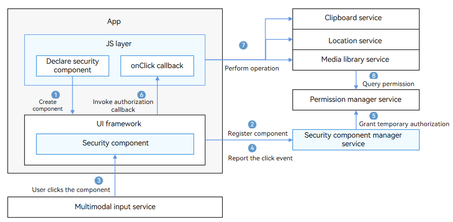

# Security Component Overview

Security components are a set of ArkUI components with certain authorization provided by OpenHarmony. You can integrate security components to your app UI, like using a button. When a security component is tapped, the app is temporarily granted with the related permission.

Currently, the following security components are available:

- <**LocationButton**>: allows an app to obtain the precise location.

- <**PasteButton**>: allows an app to read data from the clipboard.

- <**SaveButton**>: allows an app to write data to the media library.

You can use security components in your app UI to implement authorization upon a click event. Proper use of security components can prevent permission abuse, protect user privacy, and eliminate authorization popups.

You need to register an **OnClick** callback to listen for click events. When a security component is tapped, the underlying layer applies for the permission and returns the result to the app. If the permission is successfully obtained, the app can temporarily call the APIs that require the permission.

> **NOTE** The permission usage and authorization validity period vary with security components. For details, see [Security Component Development](security-component-manager-guidelines.md).

Due to the automatic authorization feature of security components, many restrictions are imposed on security components to prevent user privacy from being obtained by malicious apps. For example, the size of a security component cannot be too small, and the color cannot be transparent. You need to properly configure the component attributes, such as the size and color, to ensure that the security component is visible and can be identified by users. If authorization fails due to invalid component style, check the device error logs.

## Technical Framework

A security component consists of the following:

- Security component implementation
  Integrated in ArkUI, the security component implementation provides ETS interfaces for creating a security component, setting component attributes, laying out and drawing a security component, triggering the **onClick** callback, and destroying a security component.

- Security component manager service
  The security component manager service is an independent service process that manages the registration, temporary authorization, authorization revocation, and unregistration of a security component, and checks the validity of security components.

## Operation Process

1. After a security component is declared in .ets files, the .ets files are parsed by the JS engine and the security component is created in the ArkUI framework.

2. The security component registers with the security component manager service, which checks the validity of the component information.

3. When a user taps the security component, a click event is distributed to the security component.

4. The security component reports the click event to the security component manager service.

5. The security component manager service calls the permission manager service to perform temporary authorization based on the component type.

6. After the authorization is successful, the security component calls **OnClick()** to notify the application layer of the authorization success.

7. The app calls the related API to perform the operation, for example, obtain the location information, read data from the clipboard, or create a file in the media library.

8. The corresponding service calls the permission manager service or security component manager service to obtain the authorization result and return the authentication result.

## Constraints

The security components must be clearly visible on the app UI. Otherwise, the authorization may fail.
