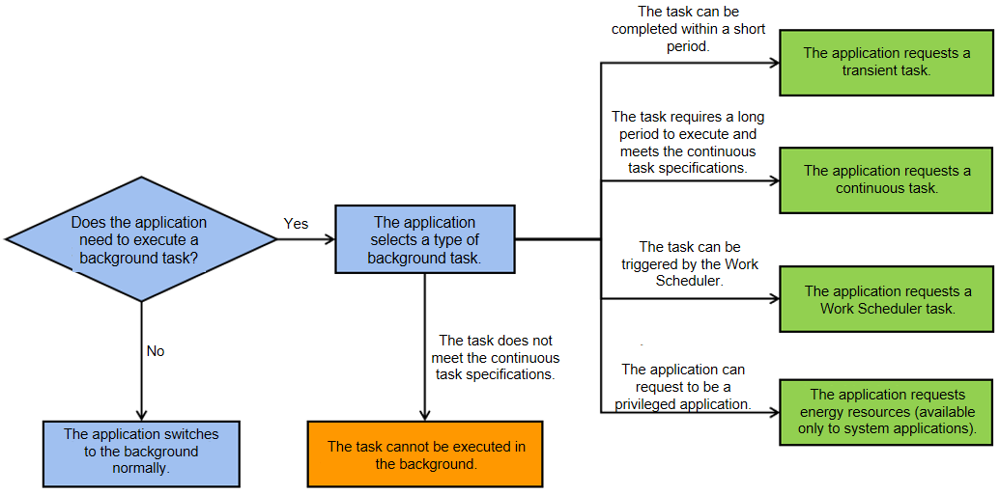

<!--RP1-->
# Background Task Overview<!--RP1End-->

## Introduction

When you return to the home screen, lock the screen, or switch to another application, the current application is switched to the background. If the application continues all the activities when running in the background, the power consumption of the device may be high and the UI may freeze. To reduce the device power consumption and deliver a positive user experience, the system manages the application running in the background, for example, suspending or terminating its process. After being suspended, the application process cannot use software resources (such as common events and timers) or hardware resources (such as CPU, network, GPS, and Bluetooth).<!--RP2--><!--RP2End-->

- After an application is switched to the background for a short period of time (defined by the system), the system suspends the application process.

- After an application running in the background is accessed for a short period of time (defined by the system), the system suspends the application process.

- In case of resource insufficiency, the system terminates some application processes (by reclaiming all resources of these processes).

To ensure the normal use of features such as music playback and calendar reminders in the background, the system provides constrained background tasks to extend the running time of applications in the background.

## Resource Usage Constraints
The system provides resource quotas for running processes, including the memory usage and <!--RP3-->CPU usage<!--RP3End--> in a continuous period of time, and disk write I/O volume in 24 hours. When the quota is reached, the system generates a warning-level log if the process is running in the foreground, and terminates the process if it is running in the background.

## Background Task Types

For standard-system devices, the following types of constrained background tasks are provided: transient tasks, continuous tasks, deferred tasks, agent-powered reminders, and efficiency resources.

You can select a proper background task type to ensure that your application can continue running after switching to the background.

- **Transient tasks**: suitable for tasks that have high requirements on real-time performance and can be completed in a short period of time, for example, status saving.

- **Continuous tasks**: suitable for tasks that need to run in the background for a long time and can be perceived by users, such as music playback in the background, navigation, and device connection. Using continuous tasks to prevent application processes from being suspended.

- **Deferred tasks**: suitable for tasks that do not have high requirements on real-time performance and can be executed at a later time. The system enqueues these tasks and schedules them in a unified manner based on the memory and power consumption.

- **Agent-powered reminders**: After an application is switched to the background or an application process is terminated, the system sends a reminder on behalf of the application. You can create scheduled reminders for countdown timers, calendar events, and alarm clocks.

<!--Del-->
For system applications that provide basic capabilities, the system provides an API for [requesting energy resources](efficiency-resource-request.md). After an application calls the API, the system exempts the application from management.<!--DelEnd-->

**Figure 1** Selecting a type of background task

> **NOTE**
>
> - The system supports only constrained background tasks. If an application does not use a constrained background task or selects an inappropriate type of background task after switching to the background, its process will be suspended or terminated.
> 
> - For an application that requests a constrained background task, only the priority of reclaiming the application process is increased. If system resources are severely insufficient, the application process may still be terminated.

 <!--no_check--> 