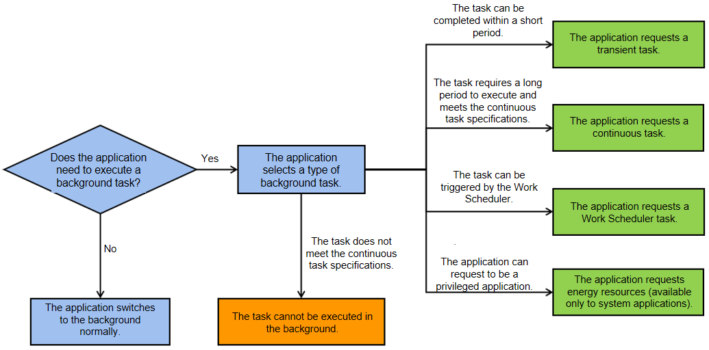

# About This Kit

<!--Kit: Background Tasks Kit-->
<!--Subsystem: ResourceSchedule-->
<!--Owner: @xufu7-->
<!--Designer: @zhouben25-->
<!--Tester: @leetestnady-->
<!--Adviser: @HelloCrease-->

## Introduction

When you return to the home screen, lock the screen, or switch to another application, the current application is switched to the background. If the application continues to run in the background, the power consumption of the device may be high and the UI may freeze. To reduce the power consumption and deliver a positive user experience, the system manages the application running in the background, including suspending and terminating [processes](../application-models/process-model-stage.md). Typically, the application process is suspended after the application runs in the background for a while. If resources are inadequate, some processes will be terminated (that is, recycling all resources of the processes). After being suspended, the application process cannot use software resources (such as common events and timers) or hardware resources (such as CPU, network, GPS, and Bluetooth).<!--RP2--><!--RP2End-->

To ensure that background functionalities such as music playback and calendar reminders can be used properly, Background Tasks Kit provides some background tasks within the specifications, extending the running time of applications in the background. <!--Del-->For system applications, Background Tasks Kit also supports [device usage statistics](../device-usage-statistics/device-usage-statistics-overview-sys.md), including statistics on the application usage duration.<!--DelEnd-->

## Constraints
Resource usage: The system provides resource quotas for running processes, including the memory usage and <!--RP3-->CPU usage<!--RP3End--> in a continuous period of time, and disk write I/O volume in 24 hours. When the quota is reached, the system generates a warning-level log if the process is running in the foreground, and terminates the process if it is running in the background.

## Background Task Types

Background Tasks Kit provides the following types of constrained background tasks: transient tasks, continuous tasks, deferred tasks, agent-powered reminders<!--Del-->, and efficiency resources<!--DelEnd-->.

You can select a proper background task type to ensure that your application can continue running after switching to the background.

- **Transient tasks**: suitable for tasks that require high real‑time performance and are short in duration, for example, quickly saving a note that the user is editing.

- **Continuous task**: suitable for user‑perceivable tasks that need to run for an extended period in the background, such as background music playback, navigation, and device connection. These tasks prevent the application process from being suspended.

- **Deferred tasks**: suitable for tasks that do not have high requirements on real-time performance and can be executed at a later time. The system enqueues these tasks and schedules them in a unified manner based on the memory and power consumption.

- **Agent-powered reminders**: After an application is switched to the background or an application process is terminated, the system sends a reminder on behalf of the application. You can create scheduled reminders for countdown timers, calendar events, and alarm clocks.

<!--Del-->
For system applications that provide basic capabilities, the system provides an API for [energy resource request](efficiency-resource-request-sys.md). After an application calls the API, the system exempts the application from management.<!--DelEnd-->

  **Figure 1** Selecting a type of background task 

> **NOTE**
>
> 1. The system supports only constrained background tasks. If an application does not use a constrained background task or selects an inappropriate type of background task after switching to the background, its process will be suspended or terminated.
> 
> 2. For an application that requests a constrained background task, only the priority of reclaiming the application process is increased. If system resources are severely insufficient, the application process may still be terminated.

<!--RP4--><!--RP4End-->
