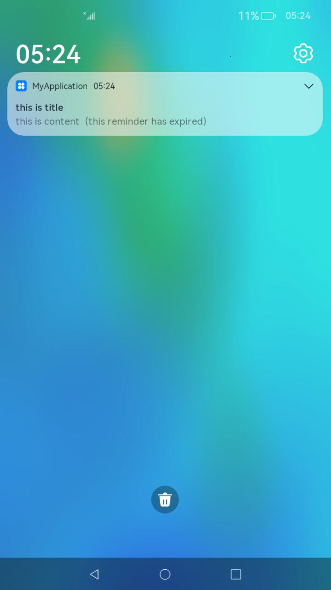

# Agent-Powered Reminder Development


## Available APIs

The agent-powered reminder feature provides APIs for publishing background reminders. You can call these APIs to create scheduled reminders for countdown timers, calendar events, and alarm clocks. The APIs are encapsulated in the [reminderAgentManager](../reference/apis/js-apis-reminderAgentManager.md) class.

**Table 1** Major APIs in reminderAgentManager

| API                                     | Description                                      |
| ---------------------------------------- | ---------------------------------------- |
| publishReminder(reminderReq: ReminderRequest, callback: AsyncCallback&lt;number&gt;): void<br>publishReminder(reminderReq: ReminderRequest): Promise&lt;number&gt; | Publishes a scheduled reminder.<br>The maximum number of valid notifications (excluding expired ones that will not pop up again) is 30 for one application<br>and 2000 for the entire system.|
| cancelReminder(reminderId: number, callback: AsyncCallback&lt;void&gt;): void<br>cancelReminder(reminderId: number): Promise&lt;void&gt; | Cancels a specified reminder. (The value of **reminderId** is obtained from the return value of **publishReminder**.)|
| getValidReminders(callback: AsyncCallback&lt;Array&lt;ReminderRequest&gt;&gt;): void<br>getValidReminders(): Promise&lt;Array&lt;ReminderRequest&gt;&gt; | Obtains all valid reminders set by the current application.                       |
| cancelAllReminders(callback: AsyncCallback&lt;void&gt;): void<br>cancelAllReminders(): Promise&lt;void&gt; | Cancels all reminders set by the current application.                          |
| addNotificationSlot(slot: NotificationSlot, callback: AsyncCallback&lt;void&gt;): void<br>addNotificationSlot(slot: NotificationSlot): Promise&lt;void&gt; | Registers a **NotificationSlot** instance to be used by the reminder.           |
| removeNotificationSlot(slotType: notification.SlotType, callback: AsyncCallback&lt;void&gt;): void<br>removeNotificationSlot(slotType: notification.SlotType): Promise&lt;void&gt; | Removes a **NotificationSlot** instance of a specified type.                |


## How to Develop

1. Request the **ohos.permission.PUBLISH_AGENT_REMINDER** permission. For details, see [Declaring Permissions in the Configuration File](../security/accesstoken-guidelines.md#declaring-permissions-in-the-configuration-file).

2. [Enable the notification feature](../notification/notification-enable.md).

3. Import the modules.

   ```js
   import reminderAgentManager from '@ohos.reminderAgentManager';
   import notificationManager from '@ohos.notificationManager';
   ```

4. Define a reminder agent. You can define the following types of reminder agents based on project requirements.
   - Countdown timer

      ```js
      let targetReminderAgent: reminderAgentManager.ReminderRequestTimer = {
        reminderType: reminderAgentManager.ReminderType.REMINDER_TYPE_TIMER, // The reminder type is countdown timer.
        triggerTimeInSeconds: 10,
        actionButton: [ // Set the button type and title displayed for the reminder in the notification panel.
          {
            title: 'close',
            type: reminderAgentManager.ActionButtonType.ACTION_BUTTON_TYPE_CLOSE
          }
        ],
        wantAgent: {// Information about the target UIAbility that is displayed after the reminder notification is touched.
          pkgName: 'com.example.myapplication',
          abilityName: 'EntryAbility'
        },
        maxScreenWantAgent: {// Information about the target ability that is automatically started when the specified reminder time arrives is displayed in full screen.
          pkgName: 'com.example.myapplication',
          abilityName: 'EntryAbility'
        },
        title: 'this is title', // Reminder title.
        content: 'this is content', // Reminder content.
        expiredContent: 'this reminder has expired', // Content to be displayed after the reminder expires.
        notificationId: 100, // Notification ID used by the reminder. If there are reminders with the same notification ID, the later one will overwrite the earlier one.
        slotType: notificationManager.SlotType.SOCIAL_COMMUNICATION // Type of the slot used by the reminder.
      }
      ```
   - Calendar event

      ```js
      let targetReminderAgent: reminderAgentManager.ReminderRequestCalendar = {
        reminderType: reminderAgentManager.ReminderType.REMINDER_TYPE_CALENDAR, // The reminder type is calendar event.
        dateTime: { // Reminder time.
          year: 2023,
          month: 7,
          day: 30,
          hour: 11,
          minute: 14,
          second: 30
        },
        repeatMonths: [1], // Month in which the reminder repeats.
        repeatDays: [1], // Date on which the reminder repeats.
        actionButton: [ // Set the button type and title displayed for the reminder in the notification panel.
          {
            title: 'close',
            type: reminderAgentManager.ActionButtonType.ACTION_BUTTON_TYPE_CLOSE
          },
          {
            title: 'snooze',
            type: reminderAgentManager.ActionButtonType.ACTION_BUTTON_TYPE_SNOOZE
          },
        ],
        wantAgent: {// Information about the target UIAbility that is displayed after the reminder notification is touched.
          pkgName: 'com.example.myapplication',
          abilityName: 'EntryAbility'
        },
        maxScreenWantAgent: { // Information about the target UIAbility that is displayed after the reminder notification is touched.
          pkgName: 'com.example.myapplication',
          abilityName: 'EntryAbility'
        },
        ringDuration: 5, // Ringing duration, in seconds.
        snoozeTimes: 2, // Number of reminder snooze times.
        timeInterval: 300, // Reminder snooze interval, in seconds.
        title: 'this is title', // Reminder title.
        content: 'this is content', // Reminder content.
        expiredContent: 'this reminder has expired', // Content to be displayed after the reminder expires.
        snoozeContent: 'remind later', // Content to be displayed when the reminder is snoozed.
        notificationId: 100, // Notification ID used by the reminder. If there are reminders with the same notification ID, the later one will overwrite the earlier one.
        slotType: notificationManager.SlotType.SOCIAL_COMMUNICATION // Type of the slot used by the reminder.
      }
      ```
   - Alarm clock

      ```js
      let targetReminderAgent: reminderAgentManager.ReminderRequestAlarm = {
        reminderType: reminderAgentManager.ReminderType.REMINDER_TYPE_ALARM, // The reminder type is alarm clock.
        hour: 23, // Hour portion of the reminder time.
        minute: 9, // Minute portion of the reminder time.
        daysOfWeek: [2], // Days of a week when the reminder repeats..
        actionButton: [ // Set the button type and title displayed for the reminder in the notification panel.
          {
            title: 'close',
            type: reminderAgentManager.ActionButtonType.ACTION_BUTTON_TYPE_CLOSE
          },
          {
            title: 'snooze',
            type: reminderAgentManager.ActionButtonType.ACTION_BUTTON_TYPE_SNOOZE
          },
        ],
        wantAgent: {// Information about the target UIAbility that is displayed after the reminder notification is touched.
          pkgName: 'com.example.myapplication',
          abilityName: 'EntryAbility'
        },
        maxScreenWantAgent: { // Information about the target UIAbility that is displayed after the reminder notification is touched.
          pkgName: 'com.example.myapplication',
          abilityName: 'EntryAbility'
        },
        ringDuration: 5, // Ringing duration, in seconds.
        snoozeTimes: 2, // Number of reminder snooze times.
        timeInterval: 300, // Reminder snooze interval, in seconds.
        title: 'this is title', // Reminder title.
        content: 'this is content', // Reminder content.
        expiredContent: 'this reminder has expired', // Content to be displayed after the reminder expires.
        snoozeContent: 'remind later', // Content to be displayed when the reminder is snoozed.
        notificationId: 99, // Notification ID used by the reminder. If there are reminders with the same notification ID, the later one will overwrite the earlier one.
        slotType: notificationManager.SlotType.SOCIAL_COMMUNICATION // Type of the slot used by the reminder.
      }
      ```

5. Publish the reminder agent. After the agent is published, your application can use the agent-powered reminder feature.

   ```js
   try {
     reminderAgentManager.publishReminder(targetReminderAgent).then(res => {
       console.info('publishReminder promise reminderId: ' + res);
       let reminderId: number = res;
       // ...
     }).catch(err => {
       console.info('publishReminder err code: ' + err.code + ' message:' + err.message);
     })
   } catch (error) {
     console.info('publishReminder code: ' + error.code + ' message:' + error.message);
   }
   ```

   The following figure shows the running effect of an alarm clock.

   

6. To delete a reminder task, call [reminderAgentManager.cancelReminder()](../reference/apis/js-apis-reminderAgentManager.md#reminderagentmanagercancelreminder).

   ```js
   let reminderId = 0; // The reminderId is obtained from the callback after the agent is published.
   
   try {
       reminderAgentManager.cancelReminder(reminderId).then(() => {
           console.log("cancelReminder promise");
       }).catch(err => {
           console.log("promise err code: " + err.code + ", message:" + err.message);
       });
   } catch (error) {
       console.log("cancelReminder code: " + error.code + ", message: " + error.message);
   };
   ```
