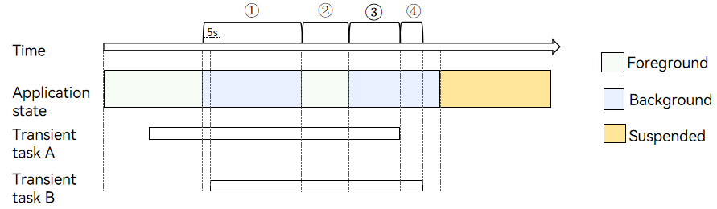

# Transient Task


## Overview

An application is suspended after it runs in the background for a short period of time. If the application needs to execute a short-time task in the background, for example, saving the status, it can request a transient task to extend the running time in the background.


### Constraints

- **When to request**: An application can request a transient task when it is running in the foreground or within 5 seconds after it switches to the background.

- **Quantity limit**: An application can request a maximum of three transient tasks during a time segment. As shown in the figure below, the application requests two transient tasks in the time segments ①, ②, and ③, and one transient task in the time segment ④.

- **Quota mechanism**: An application has a certain quota for transient tasks (adjusted based on the system status and user habits). The default quota for a single day (within 24 hours) is 10 minutes, and the maximum quota for each request is 3 minutes. In case of [low battery](../reference/apis/js-apis-battery-info.md), the default quota for each request is 1 minute. After the quota is used up, the application cannot request transient tasks anymore. The system also provides an API for an application to query the remaining duration of a transient task so as to determine whether to continue running other services.

- **Quota calculation**: Transient tasks are timed only when the application is running in the background. If the application has multiple transient tasks during the same time segment, no repeated timing is performed. As in the figure below, the application has two transient tasks, A and B. Task A is requested when the application is running in the foreground, and the timing starts when the application switches to the background (marked as ①). When the application switches to the foreground, the timing stops (marked as ②). When the application switches to the background again, the timing starts again (marked as ③). When task A is finished, task B still exists, and therefore the timing continues (marked as ④). In this process, the total time consumed by the transient tasks is ①+③+④.
  
  **Figure 1** Quota calculation for transient tasks
  
  
  
  > **NOTE**
  >
> The application shall proactively cancel a transient task when it is finished. Otherwise, the time frame allowed for the application to run in the background will be affected.

- **Timeout**: If a transient task is about to time out, the system notifies the application of the timeout by using a callback. The application needs to cancel the task. Otherwise, the system forcibly terminates the application process.

## Available APIs

The table below lists the main APIs used for transient task development. For details about more APIs and their usage, see [Background Task Management](../reference/apis/js-apis-resourceschedule-backgroundTaskManager.md).

**Table 1** Main APIs for transient tasks

| API| Description|
| -------- | -------- |
| requestSuspendDelay(reason: string, callback: Callback&lt;void&gt;): DelaySuspendInfo | Requests a transient task.|
| getRemainingDelayTime(requestId: number): Promise&lt;number&gt; | Obtains the remaining time of a transient task.|
| cancelSuspendDelay(requestId: number): void | Cancels a transient task.|


## How to Develop

1. Import the module.
   
   ```js
   import backgroundTaskManager from '@ohos.resourceschedule.backgroundTaskManager';
   ```

2. Request a transient task and implement the callback.
   
   ```js
   let id;         // ID of the transient task.
   let delayTime; // Remaining time of the transient task.
   
   // Request a transient task.
   function requestSuspendDelay() {
     let myReason = 'test requestSuspendDelay'; // Reason for the request.
     try {
       let delayInfo = backgroundTaskManager.requestSuspendDelay(myReason, () => {
         // Callback function, which is triggered when the transient task is about to time out. The application can carry out data clear and annotation, and cancel the task in the callback.
         console.info('Succeeded in requesting suspend delay.');
         backgroundTaskManager.cancelSuspendDelay(id);
       })
       id = delayInfo.requestId;
       delayTime = delayInfo.actualDelayTime;
     } catch (err) {
       console.error(`Failed to request suspend delay. Code: ${err.code}, message: ${err.message}`);
     }
   }
   ```

3. Obtain the remaining time of the transient task. Based on the remaining time, the application determines whether to continue to run other services. For example, the application has two small tasks. After the first task is executed, it queries the remaining time of the current transient task to determine whether to execute the second task.
   
   ```js
   async function getRemainingDelayTime() {
     try {
       backgroundTaskManager.getRemainingDelayTime(id).then(res => {
         console.info('Succeeded in getting remaining delay time.');
       }).catch(err => {
         console.error(`Failed to get remaining delay time. Code: ${err.code}, message: ${err.message}`);
       })
     } catch (err) {
       console.error(`Failed to get remaining delay time. Code: ${err.code}, message: ${err.message}`);
     }
   }
   ```

4. Cancel the transient task.
   
   ```js
   function cancelSuspendDelay() {
     backgroundTaskManager.cancelSuspendDelay(id);
   }
   ```

