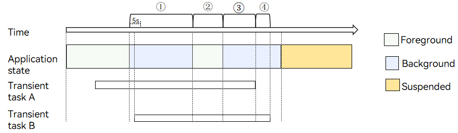

# Transient Task (ArkTS)

<!--Kit: Background Tasks Kit-->
<!--Subsystem: ResourceSchedule-->
<!--Owner: @xufu7-->
<!--Designer: @zhouben25-->
<!--Tester: @leetestnady-->
<!--Adviser: @HelloCrease-->

## Overview

An application is suspended after it runs in the background for a short period of time. If the application needs to execute a short-time task in the background, for example, saving the status or sending messages, it can request a transient task to extend the running time in the background.


## Constraints

- **Request time**: An application can request a transient task only when it runs in the foreground or in the [onBackground](../reference/apis-ability-kit/js-apis-app-ability-uiAbility.md#onbackground) callback. Otherwise, the request will fail.

- **Quantity limit**: An application can request a maximum of three transient tasks running at the same time. As shown in Figure 1, at any given moment within time periods ①, ②, and ③, the application has requested two transient tasks; within time period ④, it has requested one transient task.

- **Quota mechanism**: An application has a certain quota for transient tasks (adjusted based on the system status and user habits). The default quota for a single day (within 24 hours) is 10 minutes, and the maximum quota for each request is 3 minutes. In case of the battery with [BatteryCapacityLevel](../reference/apis-basic-services-kit/js-apis-battery-info.md#batterycapacitylevel9) set to **LEVEL_LOW**, the default quota for each request is 1 minute. After the quota is used up, the application cannot request transient tasks anymore. The system also provides the [backgroundTaskManager.getRemainingDelayTime](../reference/apis-backgroundtasks-kit/js-apis-resourceschedule-backgroundTaskManager.md#backgroundtaskmanagergetremainingdelaytime-1) API for an application to query the remaining duration of a transient task so as to determine whether to continue running other services.

- **Quota calculation**: Transient tasks are timed only when the application is running in the background. If the application has multiple transient tasks during the same time segment, no repeated timing is performed. As in the figure below, the application has two transient tasks, A and B. Task A is requested when the application is running in the foreground, and the timing starts when the application switches to the background (marked as ①). When the application switches to the foreground, the timing stops (marked as ②). When the application switches to the background again, the timing starts again (marked as ③). When task A is finished, task B still exists, and therefore the timing continues (marked as ④). In this process, the total time consumed by the transient tasks is ①+③+④. 
  
  **Figure 1** Quota calculation for transient tasks     
  
    
  > **NOTE**
  >
  > The application shall proactively cancel a transient task when it is finished. Otherwise, the time frame allowed for the application to run in the background will be affected.

- **Timeout**: If a transient task is about to time out, the system notifies the application of the timeout by using a callback (usually 6 seconds before the timeout). The application must cancel the task in the callback. If the task is not cancelled, the system will manage the application, for example, suspending or terminating the process.

## Available APIs

**Table 1** Main APIs for transient tasks

The table below lists the main APIs used for transient task development. For details about more APIs and their usage, see [Background Task Management](../reference/apis-backgroundtasks-kit/js-apis-resourceschedule-backgroundTaskManager.md).

| API| Description|
| -------- | -------- |
| [requestSuspendDelay(reason: string, callback: Callback&lt;void&gt;): DelaySuspendInfo](../reference/apis-backgroundtasks-kit/js-apis-resourceschedule-backgroundTaskManager.md#backgroundtaskmanagerrequestsuspenddelay) | Applies for a transient task. The [DelaySuspendInfo](../reference/apis-backgroundtasks-kit/js-apis-resourceschedule-backgroundTaskManager.md#delaysuspendinfo) returns the values of **requestId** and **actualDelayTime**.|
| [getRemainingDelayTime(requestId: number): Promise&lt;number&gt;](../reference/apis-backgroundtasks-kit/js-apis-resourceschedule-backgroundTaskManager.md#backgroundtaskmanagergetremainingdelaytime-1) | Obtains the remaining time of a transient task.|
| [cancelSuspendDelay(requestId: number): void](../reference/apis-backgroundtasks-kit/js-apis-resourceschedule-backgroundTaskManager.md#backgroundtaskmanagercancelsuspenddelay) | Cancels a transient task.|


## How to Develop

1. Import the module. No permission is required.

   <!-- @[include](https://gitcode.com/openharmony/applications_app_samples/blob/master/code/DocsSample/BackGroundTasksKit/TransientTask/entry/src/main/ets/pages/TransientTaskDialog.ets) -->
   
   ``` TypeScript
   import { backgroundTaskManager } from '@kit.BackgroundTasksKit';
   import { BusinessError } from '@kit.BasicServicesKit';
   ```

2. Request a transient task and implement the callback. The callback is triggered when the transient task is about to end and is independent of the service of the application. After the request for the transient task is successful, the application normally executes its own service logic.
   
   <!-- @[request_suspend_delay](https://gitcode.com/openharmony/applications_app_samples/blob/master/code/DocsSample/BackGroundTasksKit/TransientTask/entry/src/main/ets/pages/TransientTaskDialog.ets) -->  
   
   ``` TypeScript
   let id: number = -1;         // ID of the transient task.
   let delayTime: number;  // Remaining time of the transient task.
   
   // Request a transient task.
   function requestSuspendDelay() {
     let myReason = 'test requestSuspendDelay';   // Reason for the request.
     try {
       let delayInfo = backgroundTaskManager.requestSuspendDelay(myReason, () => {
         // Callback function, which is triggered when the transient task is about to time out. The application can carry out data clear and annotation, and cancel the task in the callback.
         console.info('suspend delay task will timeout');
         try {
           backgroundTaskManager.cancelSuspendDelay(id);
         } catch (error) {
           console.error(`Operation requestSuspendDelay failed. code is ${(error as BusinessError).code} message is ${(error as BusinessError).message}`);
         }
       })
       id = delayInfo.requestId;
       delayTime = delayInfo.actualDelayTime;
       console.info(`Operation requestSuspendDelay success. id is ${id} delayTime is ${delayTime}`);
     } catch (error) {
       console.error(`Operation requestSuspendDelay failed. code is ${(error as BusinessError).code} message is ${(error as BusinessError).message}`);
     }
   }
   ```

3. Obtain the remaining time of the transient task. Based on the remaining time, the application determines whether to continue to run other services. For example, the application has two small tasks. After the first task is executed, it queries the remaining time of the current transient task to determine whether to execute the second task.

   <!-- @[get_time](https://gitcode.com/openharmony/applications_app_samples/blob/master/code/DocsSample/BackGroundTasksKit/TransientTask/entry/src/main/ets/pages/TransientTaskDialog.ets) -->

   ``` TypeScript
   async function getRemainingDelayTime() {
     backgroundTaskManager.getRemainingDelayTime(id).then((res: number) => {
       console.info(`Succeeded in getting remaining delay time. time is ${res}`);
     }).catch((err: BusinessError) => {
       console.error(`Failed to get remaining delay time. Code: ${err.code}, message: ${err.message}`);
     })
   }
   ```

4. Cancels a transient task.
   
   <!-- @[cancel_suspend_delay](https://gitcode.com/openharmony/applications_app_samples/blob/master/code/DocsSample/BackGroundTasksKit/TransientTask/entry/src/main/ets/pages/TransientTaskDialog.ets) -->

   ``` TypeScript
   function cancelSuspendDelay() {
     try {
       backgroundTaskManager.cancelSuspendDelay(id);
       console.info('Operation cancelSuspendDelay Succeeded.');
     } catch (error) {
       console.error(`Operation cancelSuspendDelay failed. code is ${(error as BusinessError).code} message is ${(error as BusinessError).message}`);
     }
   }
   ```

## Samples

The following sample is provided to help you better understand how to develop transient tasks:

- [Transient Task (ArkTS, Full SDK, API version 9)](https://gitcode.com/openharmony/applications_app_samples/tree/master/code/DocsSample/BackGroundTasksKit/TransientTask)
